# Paperlike — Ürün, Mimari ve Geliştirme Rehberi

> Bu belge Paperlike projesinin ürün vizyonu, mevcut yetenekleri, teknik mimarisi,
> veri akışları, bilinen sınırlamaları ve yol haritası için ana başvuru kaynağıdır.
> Hedef kitlesi projeyi sürdürecek geliştiriciler ve yapay zekâ ajanlarıdır.

## Belge durumu

| Alan | Değer |
|---|---|
| Ürün adı | Paperlike |
| Uygulama kimliği | `com.ysferencakir.paperlike` |
| Mevcut ürün aşaması | Prototip |
| Öncelikli platformlar | Android ve web — eşit öncelikli |
| Planlanan ek platform | iOS |
| Dağıtım hedefi | Google Play Store ve web/PWA |
| Desteklenen kitap biçimleri | EPUB ve PDF |
| Ana veri modeli | Yerel ve çevrimdışı öncelikli |
| Web paket sürümü | `0.1.0` |
| Android sürümü | `versionCode 1`, `versionName 0.1.0` (`package.json` kaynaklı) |
| Lisans | MIT |
| Son kapsamlı güncelleme | 31 Temmuz 2026 |
| Belge sürümü | `1.33` |
| Belge durumu | Aktif ana kaynak |
| Belge sahibi | Proje sahibi/aktif maintainer |
| Son doğrulanan branch | `main` |
| Son doğrulanan baz commit | `76eb13c` |
| Doğrulama kapsamı | Baz commit + Drive/Firestore pull-sync, hesap/uzak veri silme, ekran/erişilebilirlik, veri yaşam döngüsü, dependency/risk/threat ve privacy envanteri çalışma ağacı |
| Kod grafiği | Graphify — 28.805 node, 71.681 edge, 799 community; ayrıntı `graphify-out/GRAPH_REPORT.md` |

> **Sürüm notu:** Web ve Android `versionName` için tek kaynak `package.json`
> değeridir. Play yayını öncesinde `versionCode` otomasyonu ayrıca tamamlanmalıdır.

### Belge doğrulama protokolü

Bu belge yalnızca “son güncelleme tarihi” ile güncel kabul edilmez. Teknik bir
değişiklikten sonra doğrulayan kişi veya ajan:

1. `git branch --show-current` ile branch'i doğrular.
2. `git rev-parse HEAD` ile baz commit'i kaydeder.
3. `git status --short` ile commitlenmemiş değişiklikleri kontrol eder.
4. `graphify check-update .` çalıştırır; gerekirse `graphify update . --force`
   ile grafiği yeniler.
5. Etkilenen özellik, veri modeli, test ve yol haritası bölümlerini günceller.
6. Aşağıdaki changelog'a kısa bir kayıt ekler.

Baz commit tek başına yeterli değildir: çalışma ağacı kirliyse belge, committen
sonraki dosya durumuna göre doğrulandığını açıkça söylemelidir.

---

## 0. Tek bakışta proje durumu

### 0.1 Durum özeti

| Alan | Durum | Açıklama |
|---|---|---|
| EPUB okuyucu çekirdeği | Mevcut | Okuma, TOC, arama, CFI, vurgu, not ve ayarlar |
| PDF okuyucu çekirdeği | Mevcut/kısmi | Okuma, arama, zoom ve not var; görsel vurgu overlay'i yok |
| Yerel veri ve backup | Mevcut/iyileştirilmiş | IndexedDB + ZIP; Blob/STORE optimizasyonu, ilerleme, iptal, CRC ve ön doğrulama var; gerçek cihaz tepe belleği ölçülmedi |
| Android sistem entegrasyonu | Mevcut | Intent, widget, shortcut, bildirim, TTS, immersive, Crashlytics |
| Web ürünü | Mevcut PWA prototipi | Statik export, manifest, offline app shell, kullanıcı onaylı cache güncellemesi, install yönlendirmesi ve quota/persistence UX'i var |
| Erişilebilirlik/i18n | Web temeli doğrulanmış | TR/EN, belge dili, Axe WCAG A/AA, klavye/focus ve 320px reflow geçti; TalkBack/font ölçeği/reader matrisi açık |
| Otomatik test | Aktif | `npm run check` geçti: 35 dosyada 106 Vitest + 2 Node; ayrıca 5 core + 5 uyumluluk + 8 responsive + 10 görsel + 4 erişilebilirlik Playwright senaryosu geçti |
| Büyük kitap performansı | Kısmi | PDF lazy page rendering, belge yeniden kullanımı ve EPUB konum yoğunluğu politikası var; gerçek cihaz baseline'ı gerekli |
| Google Play yayını | Planlı | AAB, imzalama, mağaza süreci ve in-app update eksik |
| Bulut senkronizasyonu | İki yönlü/kısmi | Auth, Firestore push/pull, UID-scoped tombstone, bütün temel mutasyonlar için kalıcı/coalesced outbox, bounded exponential backoff, online/startup flush, Drive resumable upload ve hesap ekranında durum/manual retry mevcut; tombstone TTL/ack, dead-letter kararı ve alan bazlı çatışma çözümü eksik |
| Koleksiyonlar/etiketler | Planlı | Bugün yalnızca tek serbest metin kategorisi var |
| iOS | Planlı | `ios/` projesi henüz yok |

### 0.2 Yaklaşık hazır olma görünümü

Bu yüzdeler ölçülmüş KPI değil, planlama amacıyla kullanılan yaklaşık kapsam
tahminidir. Her sürüm planında test kanıtlarıyla yeniden değerlendirilmelidir.

| Alan | Yaklaşık hazır olma | Güven |
|---|---:|---|
| Temel EPUB/PDF okuma deneyimi | %85 | Orta |
| Android uygulama deneyimi | %80 | Orta |
| Yerel veri güvenilirliği | %70 | Orta |
| Bağımsız web ürünü | %55 | Düşük-orta |
| Erişilebilirlik ve cihaz çeşitliliği | %65 | Orta |
| Otomatik kalite güvencesi | %45 | Yüksek |
| Google Play production hazırlığı | %25 | Orta |
| PWA/offline web | %85 | Orta-yüksek |
| Bulut senkronizasyonu | %20 | Orta-yüksek |
| iOS | %0 | Yüksek |

### 0.3 Yayını bugün engelleyen başlıca konular

1. Android native sistem akışlarının gerçek cihaz/otomasyon matrisinin eksikliği.
2. Büyük EPUB/PDF dosyaları için ölçülmüş performans sınırlarının olmaması.
3. Release signing, AAB ve Play Store dağıtım hattının bulunmaması.
4. Gizlilik politikası ve Data Safety doğrulamasının tamamlanmamış olması.
5. Kalan production PostCSS bildirimi ve dev-tool bağımlılık risklerinin upstream
   çözümlerinin beklenmesi.

### 0.4 Sıradaki önerilen üç iş

1. Yeni kalite kapılarını GitHub Actions'ta ilk remote run ile doğrulamak.
2. Release signing, `versionCode` ve AAB politikasını karara bağlamak.
3. Outbox Firestore restart testini emülatörde çalıştırmak; ardından terminal
   hata/dead-letter ve tombstone TTL/ack kararını tamamlamak (`RM-F-01/02`).

---

## İçindekiler

1. [Kısa ürün özeti](#1-kısa-ürün-özeti)
2. [Ürün vizyonu](#2-ürün-vizyonu)
3. [Güncel özellik envanteri](#3-güncel-özellik-envanteri)
4. [Platform yetenek matrisi](#4-platform-yetenek-matrisi)
5. [Teknik yığın](#5-teknik-yığın)
6. [Yüksek seviye mimari](#6-yüksek-seviye-mimari)
7. [Dizin rehberi](#7-dizin-rehberi)
8. [State ve kalıcılık modeli](#8-state-ve-kalıcılık-modeli)
9. [Temel süreç modelleri](#9-temel-süreç-modelleri)
10. [Native plugin kataloğu](#10-native-plugin-kataloğu)
11. [Okuyucu yüzeyi sözleşmesi](#11-okuyucu-yüzeyi-sözleşmesi)
12. [Tasarım sistemi ve etkileşim dili](#12-tasarım-sistemi-ve-etkileşim-dili)
13. [Gizlilik, güvenlik ve veri sahipliği](#13-gizlilik-güvenlik-ve-veri-sahipliği)
14. [Hata yönetimi ve gözlemlenebilirlik](#14-hata-yönetimi-ve-gözlemlenebilirlik)
15. [Performans modeli](#15-performans-modeli)
16. [Geliştirme, build ve CI](#16-geliştirme-build-ve-ci)
17. [Test stratejisi](#17-test-stratejisi)
18. [Bilinen sınırlamalar ve teknik borç](#18-bilinen-sınırlamalar-ve-teknik-borç)
19. [Yol haritası](#19-yol-haritası)
20. [Yayın kapıları](#20-yayın-kapıları)
21. [AI ajanları ve yeni geliştiriciler için çalışma protokolü](#21-ai-ajanları-ve-yeni-geliştiriciler-için-çalışma-protokolü)
22. [Dokümantasyon yönetimi](#22-dokümantasyon-yönetimi)
23. [Önemli mimari karar kayıtları](#23-önemli-mimari-karar-kayıtları)
24. [Terimler](#24-terimler)
25. [Hızlı yönlendirme](#25-hızlı-yönlendirme)
26. [Belge değişiklik geçmişi](#26-belge-değişiklik-geçmişi)

---

## 1. Kısa ürün özeti

Paperlike, e-ink cihazların sakin ve kitap odaklı okuma hissini modern mobil ve web
ortamına taşımayı amaçlayan, kişiselleştirilebilir bir EPUB/PDF okuyucudur. Ürün;
kitap dosyalarını ve kullanıcı verilerini öncelikle cihazda tutar, gereksiz hesap
zorunluluğu oluşturmaz ve okuma deneyimini dikkat dağıtan öğelerden arındırır.

Uygulama tek bir React/Next.js kod tabanından çalışır:

- Web sürümü statik olarak dışa aktarılabilir.
- Aynı web çıktısı Capacitor aracılığıyla Android uygulamasına paketlenir.
- Android tarafındaki özel Java pluginleri, web platformunda bulunmayan sistem
  entegrasyonlarını sağlar.
- EPUB ve PDF motorları ortak bir okuyucu kabuğu altında, biçime özgü yüzeyler
  olarak ayrıştırılmıştır.
- Kitaplar, kapaklar, ilerleme, notlar ve istatistikler IndexedDB'de saklanır.
- Arayüz tercihleri Zustand `persist` middleware'i ile yerel depolamada tutulur.

Ürün özellik açısından prototip tanımından daha olgun görünse de yayın, otomatik
test, performans, PWA ve senkronizasyon katmanları henüz prototip seviyesindedir.

---

## 2. Ürün vizyonu

### 2.1 Ana amaç

Kullanıcının kendi EPUB ve PDF kitaplığını sade, hızlı, özelleştirilebilir ve
mahremiyet odaklı bir ortamda okumasını sağlamak.

### 2.2 Deneyim hedefi

Paperlike aşağıdaki üç yaklaşımı birleştirir:

1. E-ink cihazların sakinliği ve uzun okumaya uygun görsel dili.
2. Kindle benzeri ulaşılabilir okuma araçları ve kişiselleştirme.
3. Apple benzeri tutarlı mikro etkileşimler ve görsel cila.

Bu ifadeler tasarım yönünü açıklar; üçüncü taraf markalarla resmî bir ilişki veya
ürün uyumluluğu iddiası değildir.

### 2.3 Tasarım ilkeleri

- **Okuma önce gelir:** Arayüz, kitabın önüne geçmemelidir.
- **Yerel veri varsayılandır:** Kullanıcı hesabı veya internet bağlantısı temel
  okuma akışının ön koşulu olmamalıdır.
- **Az ama anlamlı seçenek:** Özelleştirme güçlü olmalı, ayar kalabalığına
  dönüşmemelidir.
- **Baskısız motivasyon:** Hedef ve istatistik metinleri suçlayıcı olmamalıdır.
- **Biçimler arası tutarlılık:** EPUB ve PDF mümkün olduğunca aynı okuyucu
  kabuğunu kullanmalıdır.
- **Platforma uyum:** Android ve web eşit ürün önceliğine sahipken, her platformun
  doğal yetenekleri ve sınırlamaları açıkça kabul edilmelidir.
- **Güvenli geri dönüş:** Deneysel bir özellik kullanıcıyı uygulamadan
  kilitleyebiliyorsa özellik devre dışı bırakılmalıdır.
- **Modüler geliştirme:** Yeni yetenekler mevcut okuyucu çekirdeğini gereksiz
  biçimde karmaşıklaştırmadan ayrı modüller halinde eklenmelidir.

### 2.4 Hedef kullanıcılar

- Kendi DRM'siz EPUB/PDF arşivini okumak isteyen kullanıcılar.
- Uzun süreli okumada sade ve gözü yormayan bir arayüz arayanlar.
- Kitapları üzerinde not, vurgu ve yer imi tutan öğrenciler ve araştırmacılar.
- Okuma alışkanlığını baskısız hedeflerle takip etmek isteyenler.
- Dosyalarının öncelikle kendi cihazında kalmasını tercih eden kullanıcılar.

### 2.5 Kapsam dışında olanlar

Mevcut ürün bir kitap mağazası, DRM sistemi, sosyal okuma ağı veya yayıncı
platformu değildir. Bu alanlar ayrı bir ürün kararı verilmedikçe yol haritasının
parçası sayılmaz.

### 2.6 Kullanıcı hikâyeleri ve kabul kriterleri

Bu katalog, ürün beklentilerini uygulanabilir ve test edilebilir gereksinimlere
dönüştürür. “Mevcut” bir hikâye test kanıtı olmadan otomatik olarak “yayına
hazır” sayılmaz.

| ID | Kullanıcı hikâyesi | Temel kabul kriterleri | Durum |
|---|---|---|---|
| PR-001 | Kullanıcı olarak EPUB/PDF dosyamı eklemek istiyorum. | Desteklenen dosya import edilir; metadata fallback'i vardır; hata açıklanır; kayıt kütüphanede görünür. | Mevcut |
| PR-002 | Kitabımı bıraktığım yerden sürdürmek istiyorum. | EPUB CFI/PDF sayfası ve yüzde saklanır; yeniden açılış doğru konuma gider. | Mevcut |
| PR-003 | Okuma görünümünü kişiselleştirmek istiyorum. | Tema, font, boyut, satır, margin, sütun ve filtreler uygulanır ve yeniden açılışta korunur. | Mevcut |
| PR-004 | Kitabın içinde arama yapmak istiyorum. | Sonuçta alıntı ve konum görünür; seçilen sonuç doğru CFI/sayfaya gider; boş sorgu güvenlidir. | Mevcut — debounce, iptal ve ilerleme göstergesi doğrulandı |
| PR-005 | Metni vurgulayıp not almak istiyorum. | Renk/önem/not saklanır; EPUB görsel vurgu gösterir; PDF açık biçimde sayfa+alıntı olarak saklar. | Mevcut/kısmi |
| PR-006 | Yer imi ekleyip geri dönmek istiyorum. | Aynı kitapla ilişkilendirilir; bölüm/sayfa etiketi gösterilir; silinebilir ve konuma gider. | Mevcut |
| PR-007 | Notlarımı dışa aktarmak istiyorum. | Word ve PDF çıktısı doğru kitap/not sırasını taşır; web indirir, Android paylaşır. | Mevcut |
| PR-008 | Kitaplığımı yedekleyip geri yüklemek istiyorum. | Kitap, dosya, kapak, ilerleme, not, yer imi ve istatistik round trip ile korunur; bozuk/yeni format hata verir. | Mevcut; round-trip, doğrulama, iptal ve büyük fixture otomasyonu var |
| PR-009 | Kitaplığımı bulup düzenlemek istiyorum. | Arama, sıralama, biçim filtresi, görünüm ve basit kategori birlikte çalışır. | Mevcut |
| PR-010 | Okuma süremi baskı hissetmeden izlemek istiyorum. | Yerel gün, son yedi gün, streak ve hedef doğru hesaplanır; metinler suçlayıcı değildir. | Mevcut |
| PR-011 | İnternet olmadan okumak istiyorum. | Önceden eklenmiş yerel kitap ağ olmadan açılır; temel okuma/not/ilerleme çalışır. | PWA app shell mevcut; geniş offline matris planlı |
| PR-012 | Başka Android uygulamasından kitap açmak istiyorum. | Cold/warm `ACTION_VIEW` ve `ACTION_SEND` doğru dosyayı import edip okuyucuya götürür. | Mevcut |
| PR-013 | Ana ekrandan son kitabıma dönmek istiyorum. | Kısayol ve widget doğru kitap kimliğini taşır; boş durum güvenlidir. | Mevcut Android |
| PR-014 | Uygulamayı Türkçe veya İngilizce kullanmak istiyorum. | Bütün kullanıcı metinleri seçilen dile geçer; eksik anahtar build/type aşamasında yakalanır. | Mevcut/kısmi doğrulanmış |
| PR-015 | Web uygulamasını cihazıma kurmak istiyorum. | Manifest, service worker, install deneyimi ve cache migration çalışır. | Manifest/service worker mevcut; install ve cache-update UX'i kısmi |
| PR-016 | Kitaplarımı koleksiyon ve etiketlerle düzenlemek istiyorum. | Çoklu üyelik, migration, filtre ve backup uyumu vardır. | Planlı |
| PR-017 | Cihazlarım arasında isteğe bağlı senkron istiyorum. | Misafir modu korunur; metadata Firestore, dosya Drive; offline queue ve çatışma davranışı açıktır. | Temel Firebase/auth kodu kısmi; senkron uygulanmadı |
| PR-018 | Hesabımı ve uzak verilerimi silebilmek istiyorum. | Firestore verisi ve Drive uygulama klasörü silinir; işlem sonucu kullanıcıya açıklanır. | Planlı |
| PR-019 | Büyük kitaplarda bekleme ve çökme yaşamamak istiyorum. | Tanımlı boyut sınıflarında import, first paint, gezinme ve arama bütçeleri ölçülür. | Kısmi — web PDF lazy rendering doğrulandı; cihaz baseline'ı yok |
| PR-020 | Güncellemeleri güvenli biçimde almak istiyorum. | Play in-app update, staged rollout ve rollback akışı doğrulanır. | Planlı |

### 2.7 Gereksinim değişiklik kuralı

- Yeni kullanıcı özelliği önce bir `PR-xxx` kimliği almalıdır.
- Kabul kriteri kullanıcı tarafından gözlenebilir sonuç yazmalıdır.
- Teknik uygulama ayrıntısı kabul kriterinin yerine geçmemelidir.
- Gereksinimin platform farkı açıkça belirtilmelidir.
- Her gereksinim en az bir test kimliğiyle eşleştirilmelidir.
- İptal edilen gereksinim silinmemeli; durum ve gerekçe korunmalıdır.

---

## 3. Güncel özellik envanteri

Bu bölüm yalnızca planları değil, güncel kod tabanında bulunan davranışları
belgeler.

### 3.1 Kütüphane

- EPUB ve PDF dosyası içe aktarma.
- Dosya seçici ve sürükle-bırak yükleme.
- EPUB metadata ve kapak çıkarma.
- PDF metadata/başlık çıkarma ve kapak üretme.
- Kapak bulunmadığında deterministik görsel yedek tasarım.
- Kitap adı, yazar, biçim, dosya boyutu ve eklenme tarihi saklama.
- Kitap başlığı ve yazarını sonradan düzenleme.
- Kitap silme ve ilişkili yerel kayıtları temizleme.
- Arama.
- Son eklenen, başlık ve yazara göre sıralama.
- EPUB/PDF biçim filtresi.
- Izgara, liste ve raf görünümleri.
- Görünüm tercihini kalıcı saklama.
- Basit serbest metin kategorileri.
- Raf görünümünde kategoriye göre gruplama.
- Boş durum ve içe aktarma geri bildirimleri.
- Kitap açılış geçiş animasyonu.

> **Kategori ve koleksiyon ayrımı:** Kod tabanında tek bir `category?: string`
> alanına dayanan basit kategorilendirme vardır. Yol haritasındaki
> “koleksiyonlar/etiketler” hedefi; çoklu etiket, koleksiyon yönetimi, filtreleme,
> renk, sıralama ve muhtemel hiyerarşi gibi daha geniş bir sistemdir.

### 3.2 EPUB okuma

- `epub.js` tabanlı görüntüleme.
- CFI tabanlı hassas konum ve ilerleme kaydı.
- Sayfalanmış ve sürekli kaydırmalı okuma.
- Bölüm/içindekiler paneli.
- İçindekilerden bölüme atlama.
- Kitap genelinde metin arama.
- Metin seçme.
- Kalıcı görsel vurgu.
- Vurgudan not oluşturma ve önem derecesi verme.
- Yer imi.
- Kaydedilmiş CFI konumuna geri dönme.
- Mevcut bölüm/sayfa metnini sesli okuma.
- Dokunma bölgeleri ve kaydırma hareketiyle sayfa çevirme.
- Klavye ile gezinme.
- Yön farkındalıklı sayfa geçiş efektleri.
- Açılmayan/bozuk kitap için zaman aşımı ve hata görünümü.
- EPUB iframe belgesine tema ve font ayarlarını uygulama.

### 3.3 PDF okuma

- `react-pdf`/PDF.js tabanlı görüntüleme.
- Sayfa numarası ve yüzde tabanlı ilerleme.
- Sayfa sayfa mod.
- Sürekli dikey kaydırma modu.
- Yakınlaştırma/uzaklaştırma kontrolleri.
- İki parmakla yakınlaştırma.
- Metin katmanı üzerinden metin seçme ve kopyalama.
- Kitap genelinde sayfa bazlı metin arama.
- Sayfa bazlı not ve alıntı kaydı.
- Yer imi.
- Kaydedilmiş sayfaya dönme.
- Geçerli sayfanın metnini sesli okuma.
- Dokunma, kaydırma ve klavye ile gezinme.
- Sayfa modunda animasyonlu geçiş.

> **PDF vurgu sınırı:** PDF alıntısı ve notu saklanır fakat PDF sayfasının
> üzerinde kalıcı renkli görsel overlay çizilmez. Bunun nedeni kararlı bir metin
> konumu/koordinat modelinin henüz uygulanmamış olmasıdır.

### 3.4 Okuma kişiselleştirmesi

- Açık, krem, sepya, koyu, kahve ve OLED siyah temalar.
- Kullanıcının arka plan/yazı rengi seçebildiği özel tema.
- Literata, Lora, EB Garamond, sans-serif ve disleksi dostu font seçenekleri.
- Yazı boyutu.
- Satır yüksekliği.
- Yatay kenar boşluğu.
- Tek/çift sütun.
- 900 piksel ve üzerindeki genişliklerde otomatik iki sütun.
- Kullanıcının manuel sütun tercihinden sonra otomatik davranışı bırakma.
- Parlaklık, kontrast ve sıcaklık filtreleri.
- Kapalı, yumuşak ve gerçekçi olmak üzere üç sayfa geçiş seviyesi.
- Saat 20.00–07.00 arasında açık temayı otomatik karanlık temaya çeviren gece
  modu.
- Donanım ses tuşlarıyla sayfa çevirme seçeneği.

### 3.5 Notlar ve bilgi yönetimi

- Dört vurgu rengi.
- Normal ile üç yıldız arasında önem derecesi.
- Vurguya serbest metin notu ekleme.
- Notu, rengi ve önem derecesini sonradan düzenleme.
- Vurgu ve notları silme.
- Kitap bazlı not/vurgu paneli.
- Yer imlerini aynı panelde listeleme.
- Not veya yer iminden ilgili konuma gitme.
- Notları Word (`.docx`) olarak dışa aktarma.
- Notları PDF olarak dışa aktarma.
- Android'de dışa aktarılan dosyayı sistem paylaşım menüsüne gönderme.
- Web'de doğrudan dosya indirme.

### 3.6 İlerleme, istatistik ve okuma hedefleri

- EPUB için CFI, PDF için sayfa konumu saklama.
- Yüzde ilerleme saklama.
- Kitabı kaldığı yerden açma.
- Günlük toplam okuma süresi.
- Son yedi gün grafiği.
- Okuma serisi hesaplama.
- Ayarlanabilir günlük dakika hedefi.
- Hedef ilerleme çubuğu.
- Uzun okuma oturumunda tek seferlik mola önerisi.
- Android'de işletim sistemi üzerinden zamanlanan yerel mola bildirimi.
- Arka plana geçerken birikmiş okuma süresini yazma.

### 3.7 Android sistem entegrasyonları

- Android geri tuşu/geri hareketi yönetimi.
- Okuma sırasında immersive tam ekran.
- Okuma sırasında ekranın açık tutulması.
- Aktif temaya göre durum çubuğu rengi.
- Sayfa çevirme ve bilinçli işlemlerde haptic feedback.
- Donanım ses tuşlarıyla sayfa çevirme.
- Native Android TTS; web'de Web Speech API fallback'i.
- Android 13+ bildirim iznini ihtiyaç anında isteme.
- Uygulama kapalıyken de çalışabilen yerel mola bildirimi.
- Dosya yöneticisi/e-posta uygulamasından “Birlikte aç”.
- Başka uygulamanın “Paylaş” menüsünden EPUB/PDF kabul etme.
- Uygulama ikonuna uzun basıldığında “Okumaya devam et” kısayolu.
- Kitap ve ilerleme gösteren ana ekran widget'ı.
- Widget/kısayol üzerinden doğrudan ilgili kitabı açma.
- Firebase Crashlytics ile native ve JavaScript hata raporlama.
- Android Auto Backup/cihaz transferi için WebView verisini kapsama.
- Ham depolama izni istemeden dosya seçici/SAF ve `content://` URI kullanma.
- Firebase Analytics'in transitif olarak eklediği `AD_ID` ve AdServices
  izinlerini manifest merge aşamasında kaldırma.
- `google_analytics_adid_collection_enabled=false` ile reklam kimliği toplamayı
  kapatma.
- Özel ikon, adaptive icon ve açık/koyu-yatay/dikey splash varlıkları.
- Release derlemesinde R8 küçültme ve kaynak daraltma.

### 3.8 Dil, erişilebilirlik ve mobil uyum

- Türkçe ve İngilizce kullanıcı arayüzü.
- Her iki sözlüğün aynı anahtarlara sahip olmasını zorlayan TypeScript yapısı.
- TalkBack için erişilebilir adlar.
- Kütüphane ve depolama dialogu için Axe tabanlı WCAG A/AA otomatik taraması.
- Dialog focus trap/geri dönüş ve klavyeyle dosya seçme regresyonları.
- 320 CSS px genişlikte yatay taşmasız yeniden akış doğrulaması.
- Açık temadaki muted metin tokenı WCAG AA kontrastı için koyulaştırıldı.
- Sistem font ölçeklendirmesini engellemeyen `rem` tabanlı arayüz.
- Çentik ve güvenli alan desteği.
- Mobil overscroll davranışını kapatma.
- Toast konumunu sistem gezinme alanından koruma.
- Android kenar geri hareketi ile okuyucu swipe hareketinin çakışmasını azaltma.
- İlk kitap açılışında bir defalık hareket tanıtımı.

### 3.9 Performans için uygulanmış kararlar

- Next.js statik export.
- PDF okuyucu yüzeyini dinamik import etme.
- `jszip`, `docx`, `jspdf`, `epubjs` ve PDF ile ilgili ağır modülleri mümkün
  olduğunda yalnızca ihtiyaç anında yükleme.
- İlk kütüphane yükündeki JavaScript miktarını yaklaşık %33 azaltan lazy import
  düzenlemeleri.
- Release Android paketinde minification ve resource shrinking.

### 3.10 Bulut ve hesap altyapısının güncel sınırı

30 Temmuz 2026 tarihli çalışma ağacında:

- `firebase` ve `@capacitor-firebase/authentication` bağımlılıkları eklenmiştir.
- `lib/firebase.ts`, `NEXT_PUBLIC_FIREBASE_*` değerleri varsa Firebase ve
  Firestore'u lazy başlatan, yoksa güvenli `undefined` döndüren temel katmandır.
- `useAuthStore`, Google, e-posta/şifre, hesap oluşturma, parola sıfırlama,
  çıkış ve auth-state listener metotlarını tanımlar.
- `AuthHandler`, `app/layout.tsx` içine bağlanmış ve doğrulanmıştır; auth-state
  listener uygulama boyunca tek seferlik olarak kurulur.
- `components/library/AccountDialog.tsx` (Google ile devam et, e-posta/şifre
  formu, parola sıfırlama, giriş/kayıt geçişi, çıkış) ve
  `components/library/AccountButton.tsx` (kütüphane başlığındaki giriş
  noktası) eklenmiştir. Misafir modu bozulmamıştır — giriş tamamen opsiyonel
  bir buton, zorunlu bir login duvarı yoktur.
- Firebase Console tarafı tamamlanmıştır: Google + E-posta/Şifre sağlayıcıları
  etkin, Firestore (`europe-west3`, Standard edition, production mode —
  güvenlik kuralları henüz `allow read, write: if false`), bir Web app kaydı
  ve Android app'e Google Sign-In için debug keystore SHA-1 fingerprint'i
  eklenmiştir.
- `android/variables.gradle` (`rgcfaIncludeGoogle`, `androidxCredentialsVersion`)
  ve `capacitor.config.ts` (`FirebaseAuthentication` plugin config,
  `providers: ["google.com"]`) Google Sign-In için güncellenmiştir.

Henüz doğrulanmış kullanıcı özelliği sayılmayan kısımlar:

- Telefonda gerçek bir Google/e-posta girişinin uçtan uca denenmesi (Android
  Studio'dan Run ile release değil debug build üzerinden).
- Firestore güvenlik kuralları (`users/{uid}` bazlı) ve gerçek veri yazma —
  şu an veritabanı kasıtlı olarak herkese kapalı.
- IndexedDB–Firestore çift yönlü senkron.
- Google Drive OAuth ve dosya senkronu.
- Hesap/veri silme.
- Gizlilik politikası sayfası.

Bu nedenle “auth/sync mevcut” denmemeli; doğru durum “giriş/kayıt UI'ı ve
Firebase Console altyapısı hazır, gerçek senkron veri akışı henüz yok”dur.

---

## 4. Platform yetenek matrisi

| Yetenek | Web | Android | Not |
|---|---:|---:|---|
| EPUB/PDF içe aktarma | ✅ | ✅ | Web dosya seçici; Android seçici, intent ve share |
| Yerel çevrimdışı kitaplık | ✅ | ✅ | IndexedDB/WebView IndexedDB |
| EPUB/PDF okuma | ✅ | ✅ | Ortak React kodu |
| İlerleme/not/yer imi | ✅ | ✅ | Yerel veri |
| Word/PDF not dışa aktarma | ✅ | ✅ | Web download, Android share sheet |
| Native TTS | ❌ | ✅ | Web'de Web Speech fallback |
| Sistem bildirimi | Sınırlı | ✅ | Mevcut gerçek zamanlama Android'de |
| Haptic feedback | ❌ | ✅ | Web wrapper'ı no-op, Android Capacitor Haptics |
| Immersive sistem arayüzü | ❌ | ✅ | Özel Java plugin |
| Ses tuşlarıyla sayfa çevirme | ❌ | ✅ | Özel Java plugin |
| Ana ekran widget'ı | ❌ | ✅ | Android AppWidget |
| Uygulama kısayolu | ❌ | ✅ | Android dynamic shortcut |
| “Birlikte aç/Paylaş” hedefi | Tarayıcıya bağlı | ✅ | Android intent filtreleri |
| Crashlytics | ❌ | ✅ | Web hataları native köprüden gönderilir |
| PWA kurulumu/offline cache | ✅ | — | Manifest + service worker + doğrulanmış staging cache/rollback; kontrollü update, install ve quota/persistence UX'i |
| Bulut senkronizasyonu | Kısmi temel | Kısmi temel | Firebase/auth kod temeli var; gerçek sync ve UI yok |
| iOS native paketi | — | — | Yol haritasında, `ios/` projesi yok |

`✅` mevcut, `⏳` planlı, `❌` platformda uygulanmamış veya anlamlı değil.

### 4.1 Desteklenen ortam hedefi

“Hedef” satırları ürün kararını, “doğrulama” satırları kanıt durumunu ifade eder.

| Ortam | Hedef | Güncel doğrulama durumu |
|---|---|---|
| Android | Android 7.0/API 24 ve üzeri | `minSdk 24`; gerçek cihaz matrisi tamamlanmadı |
| Android target/compile | API 36 | Gradle yapılandırmasında mevcut |
| Chromium web | Güncel ve önceki iki major sürüm | Playwright Chromium 151 masaüstü + mobil temel matris geçti |
| Microsoft Edge | Güncel ve önceki iki major sürüm | Chromium benzerliği dışında kanıt yok |
| Firefox | Güncel ve önceki iki major sürüm | Playwright Firefox 153 masaüstü temel matris geçti |
| Safari macOS | Güncel ve önceki iki major sürüm | Playwright WebKit 26.5 masaüstü temel matris geçti |
| Mobil web | Güncel Android Chrome ve iOS Safari | Pixel 7/Chromium ve iPhone 13/WebKit temel matris geçti |
| Telefon | Portre ve yatay | Pixel portre + 844×390 yatay web regresyonu geçti; gerçek Android yatay açık |
| Tablet | 900px+ otomatik iki sütun | 768×1024 dikey ve 1024×768 yatay web regresyonu geçti; gerçek cihaz açık |
| Foldable | Açık/kapalı ekran değişiminde toparlanma | 717×512 foldable-benzeri viewport/yön değişimi geçti; hinge/posture ve gerçek cihaz açık |
| iOS native | iPhone ve iPad için gelecek Capacitor paketi | Uygulanmadı |

Playwright proje matrisi güncel Chromium, Firefox, WebKit, Pixel 7 ve iPhone 13
profillerine ek olarak telefon yatay, tablet dikey/yatay ve foldable-benzeri
Chromium viewport'larını otomatik enforce eder. Playwright fiziksel menteşe/window
posture emüle etmez; önceki iki major sürüm ve gerçek cihaz garantisi henüz yoktur.

### 4.2 Test veri ve kapasite sınıfları

Bu sınıflar destek garantisi değil; benchmark ve regresyon fixture'larının ortak
dilidir.

| Sınıf | EPUB/PDF dosya boyutu | Kitaplık büyüklüğü | Amaç |
|---|---:|---:|---|
| Küçük | `0–25 MB` | `1–100` kitap | Günlük smoke ve E2E |
| Orta | `25–150 MB` | `101–500` kitap | Standart performans doğrulama |
| Büyük | `150–500 MB` | `501–2.000` kitap | Optimizasyon ve düşük bellek testi |
| Aşırı | `>500 MB` | `>2.000` kitap | Destek garantisi olmayan dayanıklılık araştırması |

“500 MB destekleniyor” gibi bir iddia ancak ilgili fixture bütün yayın kapılarını
geçtikten sonra kullanıcı dokümanına yazılmalıdır.

### 4.3 Fonksiyonel olmayan gereksinimler

Aşağıdaki değerler **önerilen başlangıç hedefleridir**; henüz ölçülmüş sonuç
değildir. İlk benchmark turu hedefleri gerçek cihaz verisine göre onaylamalı veya
revize etmelidir.

| ID | Alan | Önerilen hedef | Ölçüm koşulu | Durum |
|---|---|---|---|---|
| NFR-001 | Kütüphane first usable | Orta sınıf Android'de sıcak açılış `≤1.5s`, cold start `≤3s` | 500 kitap, release build | Ölçülmedi |
| NFR-002 | EPUB first page | Küçük/orta EPUB `≤2.5s` | Yerel dosya, release build | Ölçülmedi |
| NFR-003 | PDF first page | Küçük/orta PDF `≤3s` | Yerel dosya, release build | Ölçülmedi |
| NFR-004 | Etkileşim yanıtı | Kontrol tepkisi çoğu durumda `≤100ms` | Profiling build | Ölçülmedi |
| NFR-005 | Animasyon akıcılığı | Hedef 60 FPS; uzun frame oranı raporlanmalı | Orta sınıf cihaz | Ölçülmedi |
| NFR-006 | İlerleme dayanıklılığı | Arka plan/process kaybında en fazla son flush aralığı kadar süre kaybı; konum kaybı olmamalı | Lifecycle testi | Kısmi |
| NFR-007 | Backup doğruluğu | Desteklenen şemada round trip veri kaybı `0` | Fixture karşılaştırması | Otomatik temel geçti; gerçek cihaz açık |
| NFR-008 | Crash-free kullanım | Beta için `≥99.5%`, stable hedefi `≥99.8%` crash-free session | Crashlytics release verisi | Veri yok |
| NFR-009 | Offline çekirdek | Önceden eklenmiş kitapta okuma/not/ilerleme için ağ isteği zorunlu olmamalı | Ağ kapalı E2E | Kısmi |
| NFR-010 | Erişilebilirlik | Kritik akışlarda klavye, screen reader ve yeniden akış engeli olmamalı; AA seviyesi hedeflenmeli | Manuel + otomasyon | Kısmi |
| NFR-011 | Veri gizliliği | Kitap metni/not içeriği log veya crash metadata'sına gitmemeli | Log denetimi | Politika var, test yok |
| NFR-012 | Senkron gecikmesi | Bağlantı geldikten sonra küçük metadata değişikliği normal koşulda `≤10s` | Gelecek senkron E2E | Planlı |

### 4.4 Kalite hedefi değiştirme kuralı

- Hedef değişikliği benchmark sonucu veya açık ürün kararıyla yapılmalıdır.
- Cihaz, dosya ve build türü yazılmadan süre sonucu raporlanmamalıdır.
- Ortalama tek başına yeterli değildir; p50/p95 ve en kötü gözlem kaydedilmelidir.
- Debug build performansı production kabul kanıtı değildir.
- Hedef karşılanmıyorsa özellik “mevcut” kalabilir fakat “yayına hazır” olamaz.

---

## 5. Teknik yığın

### 5.1 Web ve uygulama katmanı

| Teknoloji | Rol |
|---|---|
| Next.js 16 | App Router, statik export ve uygulama kabuğu |
| React 19 | Kullanıcı arayüzü |
| TypeScript | Tip güvenliği |
| Tailwind CSS 4 | Stil sistemi |
| Base UI / yerel UI bileşenleri | Dialog, sheet, select, switch vb. |
| Framer Motion | Kitap ve sayfa geçiş animasyonları |
| Zustand | Uygulama ve tercih state'i |
| `idb` | Typed IndexedDB erişimi |
| `epub.js` | EPUB ayrıştırma ve rendering |
| `react-pdf` / PDF.js | PDF rendering ve metin katmanı |
| JSZip | Yedekleme ve EPUB ile ilgili ZIP işlemleri |
| docx / jsPDF | Not dışa aktarma |
| Lucide React | İkonlar |
| Firebase Web SDK | Gelecek Firestore istemcisi; çalışma ağacında temel lazy init |
| Capacitor Firebase Authentication | Gelecek Google/e-posta auth köprüsü; store temeli mevcut |

### 5.2 Test ve kalite katmanı

| Teknoloji | Rol |
|---|---|
| Vitest | Unit ve modül entegrasyon test koşucusu |
| jsdom | React hook/bileşen testleri için tarayıcı benzetimi |
| React Testing Library | Kullanıcı davranışına yakın React test yardımcıları |
| fake-indexeddb | IndexedDB entegrasyon test ortamı |
| Playwright | Chromium web/PWA uçtan uca testi |
| ESLint | Statik kod kalite kapısı |
| GitHub Actions | Lint, type-check, test ve production build otomasyonu |

### 5.3 Native katman

| Teknoloji | Rol |
|---|---|
| Capacitor 8 | Web uygulaması ile Android köprüsü |
| Java | Özel Android pluginleri ve Activity davranışı |
| Android AppWidget | Ana ekran “okumaya devam et” widget'ı |
| Firebase Crashlytics | Çökme ve JS hata raporlama |
| AndroidX | Activity, AppCompat, shortcut ve widget altyapısı |
| Gradle/R8 | Derleme, küçültme ve paketleme |

### 5.4 Desteklenen Android düzeyi

- Minimum SDK: 24
- Target SDK: 36
- Compile SDK: 36
- Java: CI üzerinde Temurin 21

### 5.5 Bağımlılık, lisans ve güncelleme politikası

Bu envanter `RM-A-09`un kabul kaynağıdır. Sürüm ve lisanslar 31 Temmuz 2026'da
kurulu doğrudan paketlerin `package.json` metadata'sından doğrulanmıştır. Transitif
bağımlılıklar kilit dosyası ve `npm audit` ile ayrıca izlenir; aşağıdaki alternatif
bir otomatik geçiş kararı değil, paket sürdürülemez olduğunda ilk değerlendirme
noktasıdır.

#### Production bağımlılık envanteri

| Paket / aile | Kurulu | Amaç ve sahip | Lisans | İlk alternatif | Güncelleme ritmi |
|---|---:|---|---|---|---|
| `next` | `16.2.11` exact | Statik App Router/build; web-platform | MIT | Vite + React Router (mimari göç) | Aylık patch inceleme; major ayrı proje |
| `react`, `react-dom` | `19.2.4` exact | UI runtime; frontend | MIT | Preact uyumluluk katmanı (yüksek risk) | Next ile birlikte aylık |
| `typescript` | `5.9.3` | Tip sistemi; maintainer | Apache-2.0 | Yok; JS'e dönüş kabul edilmez | Aylık minor, major/strict değişimi ayrı |
| `tailwindcss`, `@tailwindcss/postcss`, `tailwind-merge`, `tw-animate-css` | `4.3.3`, `4.3.3`, `3.6.0`, `1.4.0` | Token/utility CSS; design-system | MIT | CSS Modules + token CSS | Aylık; görsel kapıyla |
| `@base-ui/react` | `1.6.0` | Erişilebilir dialog/sheet/select primitifi; UI/a11y | MIT | Radix UI veya yerel ARIA primitive | Aylık; klavye/a11y kapısıyla |
| `framer-motion` | `12.42.2` | Animasyon ve geçiş; UI | MIT | Web Animations/CSS | Aylık; reduced-motion ve visual kapıyla |
| `zustand` | `5.0.14` | UI state ve localStorage tercihleri; state/data | MIT | React context + reducer | Aylık; persist migration testiyle |
| `idb` | `8.0.3` | Typed IndexedDB erişimi; data | ISC | Ham IndexedDB veya Dexie | Üç aylık; DB migration/backup kapısıyla |
| `epubjs` | `0.3.93` | EPUB parse/render/CFI; reader | BSD-2-Clause | Readium Web / ayrı EPUB motoru | Güvenlik aylık; davranış değişimi kontrollü |
| `react-pdf` | `10.4.1` | PDF.js React rendering; reader | MIT | Doğrudan PDF.js veya MuPDF tabanlı çözüm | Aylık; PDF fixture/worker kapısıyla |
| `jszip` | `3.10.1` | EPUB ZIP okuma ve kitaplık backup; data | MIT veya GPL-3.0+; proje MIT seçeneğini kullanır | `fflate` veya streaming ZIP | Güvenlik aylık; backup round-trip kapısıyla |
| `docx`, `jspdf` | `9.7.1`, `4.2.1` | Notları DOCX/PDF dışa aktarma; export | MIT | HTML/Markdown export + platform yazdırma | Üç aylık; export fixture ile |
| `firebase` | `12.16.0` | Auth/Firestore istemcisi; sync/security | Apache-2.0 | Supabase veya özel API (ürün göçü) | Aylık; güvenlik bulgusu SLA'ya tabi |
| `@capacitor-firebase/authentication` | `8.3.0` | Native Firebase auth köprüsü; auth/Android | Apache-2.0 | Firebase Web Auth veya özel native plugin | Capacitor ailesiyle birlikte |
| `@capacitor/core`, `@capacitor/android` | `8.4.2` | Web-native runtime/kabuk; Android-platform | MIT | Tauri Mobile/React Native (mimari göç) | Aylık patch; major ayrı release treni |
| `@capacitor/app`, `filesystem`, `haptics`, `local-notifications`, `share`, `status-bar` | `8.x` | Lifecycle ve native cihaz yetenekleri; Android-platform | MIT | İhtiyaç başına özel native plugin | Core ile aynı minor/major hizası |
| `@capacitor-community/text-to-speech` | `8.0.2` | Native TTS; reader/Android | MIT | Özel Android TTS plugin'i / Web Speech | Üç aylık ve Capacitor majorunda |
| `lucide-react` | `1.26.0` | UI ikonları; design-system | ISC | Yerel SVG ikon seti | Üç aylık; görsel kontrol |
| `class-variance-authority`, `clsx` | `0.7.1`, `2.1.1` | Varyant/class birleştirme; design-system | Apache-2.0, MIT | Yerel küçük helper | Düşük risk; üç aylık |

#### Test ve geliştirme aracı envanteri

| Paket / aile | Kurulu | Amaç / sahip | Lisans | Güncelleme ve kabul |
|---|---:|---|---|---|
| `vitest`, `jsdom`, Testing Library, `fake-indexeddb` | `4.1.10`, `30.0.1`, `16.3.2`/`7.0.0`, `6.2.5` | Unit/integration; QA | MIT; fake-indexeddb Apache-2.0 | Aylık; bütün Vitest ve fake DB migration testleri |
| `@playwright/test` | `1.62.0` | Core/compat/visual/a11y/benchmark E2E; QA | Apache-2.0 | Aylık; üç browser kurulumu ve tüm Playwright katmanları |
| `@axe-core/playwright` | `4.12.1` | WCAG otomasyonu; accessibility | MPL-2.0 | Aylık; kural değişimleri baseline gevşetmeden incelenir |
| `@firebase/rules-unit-testing`, `firebase-tools` | `5.0.1`, `15.25.1` | Firestore rule/account-deletion emülatörü; security-QA | Apache-2.0, MIT | Her rule değişiminde CI; CLI transitif audit bulguları yalnız güvenilir proje girdileriyle sınırlandırılır ve upstream aylık izlenir |
| `eslint`, `eslint-config-next` | `9.39.5`, `16.2.11` | Statik analiz; maintainer | MIT | Next ile hizalı; sıfır yeni error |
| `@capacitor/cli`, `@capacitor/assets` | `8.4.2`, `3.0.5` | Native sync ve ikon üretimi; Android/release | MIT | Runtime Capacitor ile hizalı; Gradle assemble/sync |
| `shadcn` | `4.14.1` | Kaynak UI bileşeni üretimi; design-system | MIT | Yalnız ihtiyaç halinde; üretilen diff manuel incelenir |
| `cross-env` | `10.1.0` | Platformlar arası script env'i; tooling | MIT | Düşük risk; üç aylık |
| `@types/*` | Node 20, React 19 | Derleme tipleri; maintainer | MIT | Runtime/CI sürümleriyle aylık hizalama |

#### Android/Gradle ana zinciri

| Aile | Güncel kaynak | Lisans / sahip | Güncelleme kuralı |
|---|---|---|---|
| Android Gradle Plugin / Kotlin plugin | `8.13.0` / `2.2.20` | Apache-2.0 / Android-platform | Android Studio, Gradle ve Java uyumluluk matrisiyle birlikte |
| AndroidX AppCompat/Core/Coordinator/Fragment/WebKit | `android/variables.gradle` | Apache-2.0 / Android-platform | Aylık kontrol; min/target SDK ve native smoke test |
| Firebase Android BoM + Crashlytics/Analytics | BoM `34.5.0` | Apache-2.0; Google hizmet koşulları / observability | Aylık güvenlik ve Data Safety incelemesi |
| Google Services / Crashlytics Gradle plugin | `4.4.4` / `3.0.6` | Apache-2.0 / release | Firebase BoM/AGP ile uyumlu yükseltme |
| Macrobenchmark/UIAutomator/Test | `1.4.1` / `2.3.0` / AndroidX test sürümleri | Apache-2.0 / performance-QA | Benchmark modülü assemble ve ayrılmış cihaz koşusu |

Google/Firebase SDK kod lisansı ile hizmet şartları, OAuth doğrulaması, privacy ve
Data Safety yükümlülükleri aynı şey değildir; release incelemesi ikisini ayrı
kontrol eder.

#### Sürüm sabitleme ve kilit dosyası kuralları

- `package-lock.json` zorunludur; CI ve temiz kurulum `npm ci` kullanır.
- Next/React ve `eslint-config-next` bilinçli olarak exact sürümde tutulur.
  Framework üçlüsü uyumluluk testi olmadan ayrı ayrı yükseltilmez.
- Diğer doğrudan paketlerde caret kullanılabilir; production'a giren gerçek sürüm
  kilit dosyasıdır. “Caret var, kendiliğinden güvenle güncellenir” denmez.
- Capacitor core, Android, CLI ve resmi pluginler aynı major üzerinde tutulur;
  mümkünse aynı release treninde güncellenir.
- `overrides`, süreli risk azaltımıdır. Güncel `xmldom 0.8.13` ve `sharp 0.35.3`
  override'larının nedeni `ISS-017`dir; upstream zincir güvenli sürümü taşıdığında
  ayrı PR ile kaldırılır.
- Yeni production paketi amaç, paket boyutu, lisans, veri/izin etkisi, bakım
  etkinliği, alternatif ve kaldırma maliyeti yazılmadan eklenmez.
- GPL/AGPL, kaynak açma veya ağ-copyleft yükümlülüğü doğurabilecek lisanslar
  maintainer onayı olmadan seçilmez. Dual-license pakette kullanılan seçenek
  belgelenir.

#### Güncelleme takvimi

| Sıklık | İş |
|---|---|
| Her PR | Kilit dosyası diff'i, yeni script/lifecycle hook'u, lisans ve izin etkisi incelenir |
| Haftalık | `npm audit --omit=dev` ve GitHub/Dependabot güvenlik bildirimleri triage edilir |
| Aylık | Production ve test paketlerinin patch/minor adayları toplu, küçük yükseltmeler halinde denenir |
| Üç aylık | Major sürümler, alternatiflerin sağlığı, kullanılmayan paketler ve Android zinciri gözden geçirilir |
| Release öncesi | Temiz `npm ci`, production audit, lisans envanteri, full kalite kapıları ve Android release assemble çalıştırılır |
| Yıllık | Lisans/notice, Firebase/Google şartları, Data Safety ve ana alternatifler baştan doğrulanır |

#### Güvenlik müdahale SLA'sı

Süre, güvenilir bildirimin alınmasıyla başlar. “Fix yok” SLA'yı kaldırmaz; özellik
kapatma, sürüm pinleme, input sınırı veya release bloklama gibi azaltım gerekir.

| Önem | Triage | Fix/azaltım hedefi | Yayın davranışı |
|---|---:|---:|---|
| Kritik; uzaktan kod çalıştırma, auth bypass, kullanıcı verisi sızıntısı/kaybı | 24 saat | 72 saat | Etkilenen release ve dağıtım durur |
| Yüksek; kötü amaçlı EPUB/PDF veya normal akışta ciddi DoS | 2 iş günü | 7 gün | Exploit edilebilir production yolu varsa release durur |
| Orta | 7 gün | 30 gün | Açık risk/azaltım ve sahip olmadan release edilmez |
| Düşük / yalnız dev-tool | 14 gün | 90 gün veya planlı major | Production etkisi ayrıca kanıtlanır |

#### Major upgrade kabul kapıları

| Değişen aile | Zorunlu kanıt |
|---|---|
| Next/React/TypeScript | Önce yerel Next 16 dokümanı; lint, type-check, build, core/compat/visual/a11y E2E ve Android Capacitor sync |
| EPUB/PDF motoru | Gerçek ve sentetik import; ilk render, sayfa/CFI ilerleme, arama, not/yer imi, offline worker ve büyük kitap bütçeleri |
| IndexedDB/Zustand | En az önceki DB sürümünden migration, backup round-trip, cascade delete ve persisted ayar testi |
| Firebase/Auth/Drive | İki kullanıcı izolasyonu, giriş/çıkış, offline/hata, push/pull, lazy download, silme ve yetki iptali senaryoları |
| Capacitor/AndroidX/AGP | `cap sync`, debug/release assemble, cold start, back/intent/share, TTS, bildirim, widget, Crashlytics ve ayrılmış cihaz smoke |
| ZIP/DOCX/PDF export | Bozuk/yeni/eski backup, büyük arşiv, iptal, restore preflight ve açılabilir DOCX/PDF fixture |
| UI/CSS/animasyon | 10 referans görsel, 320 px reflow, klavye/focus, WCAG A/AA ve reduced-motion kontrolü |
| Test araçları | Test sayısını azaltmadan full CI; snapshot/baseline değişimi ayrı gerekçeli diff |

---

## 6. Yüksek seviye mimari

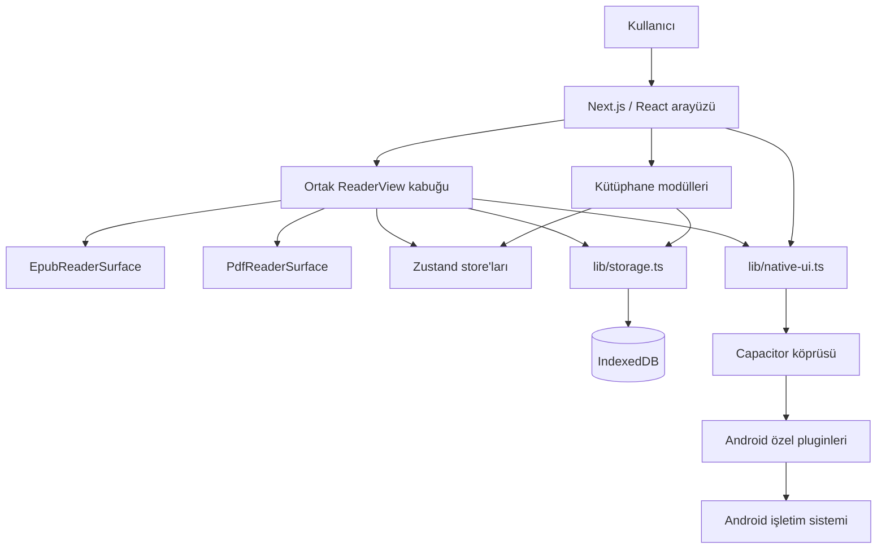

### 6.1 Katmanların sorumlulukları

#### Sayfa ve uygulama kabuğu

- `app/page.tsx`: Kütüphane giriş noktası.
- `app/reader/page.tsx`: URL'deki kitap kimliğiyle okuyucu giriş noktası.
- `app/layout.tsx`: Global fontlar, toast ve Android/global handler'lar.
- `app/globals.css`: Tema tokenları, safe-area ve global davranışlar.

#### Kütüphane katmanı

- `LibraryView`: Arama, sıralama, filtre, görünüm ve panel state'lerinin
  orkestrasyonu.
- `UploadDropzone`: Dosya kabulü ve içe aktarma.
- `BookCard`, `BookListRow`, `ShelfView`: Üç farklı sunum.
- `BookActionsMenu`: Yeniden adlandırma, bilgi ve silme işlemleri.
- `CategoryDialog`: Basit kategori atama.
- `BackupMenu`: Yedekleme, geri yükleme ve dil seçimi.
- `PwaStorageButton`: Web kurulumu, kota/doluluk ve kalıcı depolama yönetimi.
- `ReadingStatsPanel`: Günlük hedef, seri ve son yedi gün.

#### Okuyucu katmanı

- `ReaderView`: Biçimden bağımsız toolbar, paneller, state, süre takibi,
  kısayollar ve native entegrasyon.
- `ReaderSurfaceHandle`: EPUB ve PDF yüzeylerinin uyması gereken ortak komut
  sözleşmesi.
- `EpubReaderSurface`: EPUB motoru, CFI, tema, TOC ve kalıcı vurgu.
- `PdfReaderSurface`: PDF motoru, sayfa, zoom, continuous scroll ve metin katmanı.
- `ReaderSettingsPanel`: Okuma görünümü tercihleri.
- `NotesPanel`: Vurgu, not, yer imi ve dışa aktarma.
- `SearchPanel`: Ortak arama sonuç görünümü.
- `TocPanel`: EPUB içindekiler görünümü.
- `SelectionBar`: Seçili metinden vurgu/not oluşturma.
- `BreakSuggestion`: Baskısız mola önerisi.

#### Veri ve servis katmanı

- `lib/storage.ts`: IndexedDB şeması ve tüm kalıcı kitap verileri.
- `lib/import-book.ts`: Dosya biçimi tespiti ve import orkestrasyonu.
- `lib/epub-loader.ts`, `lib/pdf-loader.ts`: Biçime özgü metadata/kapak çıkarma.
- `lib/backup.ts`: Tam kitaplık ZIP yedeği.
- `lib/export-notes.ts`: Word/PDF not çıktısı.
- `lib/native-ui.ts`: Platform kontrolünü çağıranlardan saklayan native wrapper'lar.
- `lib/pwa-storage.ts`: StorageManager kota/persistence okuması ve import öncesi alan politikası.
- `lib/reader-theme.ts`: Gece modu ve renk çözümleme.
- `lib/i18n/*`: Türkçe/İngilizce çeviri sistemi.

---

## 7. Dizin rehberi

| Yol | Sorumluluk |
|---|---|
| `app/` | Next.js route'ları, root layout ve global CSS |
| `components/library/` | Kütüphane ekranı ve kitap yönetimi |
| `components/reader/` | Ortak okuyucu ve biçime özgü yüzeyler |
| `components/ui/` | Yeniden kullanılabilir temel UI bileşenleri |
| `components/*.tsx` | Uygulama çapındaki Android/global handler'lar |
| `lib/` | Veri, dosya, tema, i18n, backup ve native servisleri |
| `store/` | Zustand state ve kalıcı tercihler |
| `android/` | Capacitor Android projesi ve özel native pluginler |
| `assets/` | Kaynak uygulama ikonu |
| `public/` | Statik web varlıkları ve PDF worker |
| `.github/workflows/` | CI derleme iş akışları |
| `graphify-out/` | Yerel kod grafiği; git tarafından izlenmez |

---

## 8. State ve kalıcılık modeli

Paperlike iki farklı kalıcılık mekanizması kullanır:

1. Kitap ve okuma verileri için IndexedDB.
2. Hafif kullanıcı tercihleri için Zustand `persist` üzerinden localStorage.

### 8.1 Zustand store'ları

| Store | Kalıcı mı? | Sorumluluk |
|---|---:|---|
| `useLibraryStore` | Hayır | IndexedDB'den yüklenen kitap listesinin UI kopyası |
| `useSettingsStore` | Evet | Tema, font, düzen, animasyon ve okuyucu tercihleri |
| `useLibraryViewStore` | Evet | Grid/list/shelf görünümü |
| `useReadingGoalStore` | Evet | Günlük hedef ve mola ayarları |
| `useLocaleStore` | Evet | `tr`/`en` dil tercihi |
| `useOnboardingStore` | Evet | Okuyucu tanıtımının görülüp görülmediği |
| `useAuthStore` | Hayır | Kısmi Firebase auth kullanıcı/başlatılma state'i ve auth komutları |
| `usePwaInstallStore` | Hayır | Tarayıcının tek kullanımlık install prompt'u ve kurulu PWA durumu |
| `useToastStore` | Hayır | Geçici toast kuyruğu |
| `useBackHandlerStore` | Hayır | Android geri tuşu handler yığını |

### 8.2 IndexedDB şeması

Veritabanı adı `epub-reader`, güncel şema sürümü `6` değeridir.

| Object store | Anahtar | İçerik | İndeks |
|---|---|---|---|
| `books` | `id` | Kitap metadata'sı | `by-addedAt` |
| `files` | `bookId` | EPUB/PDF `Blob` | — |
| `covers` | `bookId` | Kapak `Blob` | — |
| `progress` | `bookId` | Konum, yüzde ve zaman | — |
| `highlights` | `id` | Alıntı, renk, önem ve not | `by-book` |
| `bookmarks` | `id` | Konum ve etiket | `by-book` |
| `readingStats` | `date` | Yerel gün ve dakika | — |
| `driveUploadSessions` | `bookId` | Devam ettirilebilir Drive yükleme oturumu | — |
| `syncTombstones` | birleşik tombstone `id` | UID-scoped kitap/vurgu/yer imi silme işareti ve Drive retry kimliği | `by-uid` |
| `syncOutbox` | UID + tür + hedef birleşik `id` | En güncel yerel kayda işaret eden coalesced mutation, deneme sayısı, güvenli hata kodu ve sonraki deneme zamanı | `by-uid`, `by-next-at` |

### 8.3 Ana veri tipleri

#### Book

- `id`: Uygulama tarafından üretilen benzersiz kimlik.
- `title`, `author`: Metadata veya fallback dosya adı.
- `format`: `epub` ya da `pdf`.
- `addedAt`: Unix timestamp.
- `fileSize`: Bayt.
- `category`: Opsiyonel tek kategori.

#### ReadingProgress

- `bookId`
- `location`: EPUB CFI veya PDF sayfasını temsil eden string.
- `percentage`: `0–100`.
- `updatedAt`

#### Highlight

- Kitap kimliği.
- EPUB CFI aralığı veya `page:<n>` konumu.
- Seçilen metin.
- Renk.
- `0–3` önem derecesi.
- Opsiyonel not.
- Oluşturulma zamanı.

#### Bookmark

- Kitap kimliği.
- EPUB CFI veya `page:<n>`.
- Oluşturma anındaki bölüm/sayfa etiketi.
- Oluşturulma zamanı.

### 8.4 Veri değişmezleri

Yeni kod aşağıdaki kuralları bozmamalıdır:

- Bir kitap kaydı kullanılabilir sayılabilmek için `books` ve `files` kayıtlarının
  ikisine de sahip olmalıdır.
- `progress` store'unda kitap başına en fazla bir güncel kayıt vardır.
- EPUB konumları CFI, PDF konumları `page:<n>` veya ilerleme katmanında sayfa
  string'i olarak ele alınır; dönüştürme noktaları açık tutulmalıdır.
- Kitap silindiğinde dosya, kapak, ilerleme, vurgu ve yer imleri de silinmelidir.
- Günlük istatistik anahtarı cihazın yerel saat diliminde `YYYY-MM-DD` biçimidir.
- Kullanıcı tercihleri kitap yedeğinin parçası değildir. Mevcut ZIP yedeği kitap,
  içerik, kapak, ilerleme, vurgu, yer imi ve istatistikleri kapsar.
- Yedek format sürümü geriye dönük okunabilir olmalı; daha yeni bir format eski
  uygulamaya sessizce aktarılmamalıdır.

### 8.5 IndexedDB ve backup migration rehberi

#### Şema değişikliği öncesi

1. Değişen veri tipi `lib/types.ts` içinde tanımlanır.
2. Mevcut `DB_VERSION` ve bütün önceki upgrade blokları incelenir.
3. Yeni sürüm numarası yalnızca gerçek şema değişikliği varsa artırılır.
4. Eski veriden yeni veriye dönüşüm ve eksik alan fallback'i yazılır.
5. Kitap silme cascade'i, backup ve restore etkileri çıkarılır.
6. En az bir önceki production/dağıtılmış şemadan migration fixture'ı hazırlanır.

#### IndexedDB migration kuralları

- Eski upgrade blokları silinmemelidir; sıfırdan kurulum bütün sürümleri sırayla
  geçebilmelidir.
- Aynı transaction içinde uzun CPU/ZIP işleri yapılmamalıdır.
- Yeni zorunlu alan için eski kayıtlara deterministik varsayılan verilmelidir.
- Migration yarıda kalırsa veritabanı sessizce temizlenmemelidir.
- Kullanıcı verisini silmek “kolay düzeltme” olarak kabul edilmez.
- Büyük veri dönüşümü gerekiyorsa şema upgrade'i ile içerik backfill'i ayrı,
  yeniden başlatılabilir aşamalar olmalıdır.

#### Backup formatı kuralları

- IndexedDB sürümü ile backup `formatVersion` aynı kavram değildir.
- ZIP içeriğinin yapısı veya anlamı değişirse `BACKUP_FORMAT_VERSION` artırılır.
- Yeni uygulama mümkünse eski backup'ı okuyabilmelidir.
- Eski uygulama daha yeni backup'ı açık hata ile reddetmelidir.
- Import sırasında doğrulama tamamlanmadan mevcut veriler geri döndürülemez
  biçimde değiştirilmemelidir.
- V1 restore, ZIP CRC kontrolünü, manifest şemasını, benzersiz/güvenli kitap
  kimliklerini ve bütün zorunlu kitap dosyalarını ilk IndexedDB yazımından önce
  doğrular.
- EPUB/PDF girdileri zaten sıkıştırılmış oldukları için backup içinde `STORE`
  kullanır; manifest `DEFLATE` edilebilir.
- Tarayıcı export'u kitap Blob'unu eager ArrayBuffer kopyasına çevirmeden JSZip'e
  verir; JSZip'in nihai ZIP Blob'u yine işlem belleğinde üretilir.
- Koleksiyon/senkron gibi yeni veri alanları eklenirken eski `category` ve
  metadata kayıtları için dönüşüm yazılmalıdır.

#### Önerilen test matrisi

| Kaynak | Hedef | Beklenti |
|---|---|---|
| Boş DB | Güncel DB | Bütün store/index'ler oluşur |
| DB v1 | Güncel DB | Kitap/dosya/kapak/ilerleme korunur |
| DB v2 | Güncel DB | Vurgu ve yer imleri korunur |
| DB v3 | Güncel DB | İstatistikler korunur; Drive oturum store'u oluşur |
| DB v4 | Güncel DB | Bütün kullanıcı verisi ve yükleme oturumları korunur; `syncTombstones` store'u oluşur |
| DB v5 | Güncel DB | Bütün kullanıcı verisi, yükleme oturumları ve tombstone'lar korunur; `syncOutbox` store'u oluşur |
| DB v6 | Sonraki sürüm | Bütün kullanıcı verisi, yükleme oturumları, tombstone ve outbox kayıtları korunur |
| Backup v1 | Güncel uygulama | Eksiksiz round trip |
| Daha yeni backup | Eski uygulama | Açık ve çevrilmiş hata, veri değişikliği yok |
| Bozuk ZIP/manifest | Güncel uygulama | Kontrollü hata, mevcut kitaplık korunur |

#### Rollback yaklaşımı

IndexedDB migration'ı production'a çıktıktan sonra uygulama binary'sini geri
almak her zaman güvenli değildir; eski binary yeni şemayı anlamayabilir. Bu
nedenle:

- Migration ileri uyumlu tasarlanmalıdır.
- Destructive store/alan kaldırma en az bir geçiş sürümü beklemelidir.
- Rollback planı, uygulama sürümü ile veri şeması uyumluluk tablosunu içermelidir.
- Kritik migration öncesinde kullanıcıya manuel ZIP yedeği önerilebilir.

### 8.6 Veri yaşam döngüsü matrisi

Bu bölüm `RM-A-04` için yerel, kullanıcı tarafından yönetilen yedek ve mevcut
Firestore/Drive davranışını tek sözleşmede toplar. “Kalıcı depolama” tarayıcının
veriyi tahliye etme olasılığını azaltır; başka cihaza kopya üretmediği için yedek
veya senkron değildir.

| Veri sınıfı | Ana kaynak / saklama yeri | ZIP export/restore | Mevcut bulut davranışı | Silme ve retention | Açık boşluk |
|---|---|---|---|---|---|
| Kitap metadata'sı | IndexedDB `books` | Dahil / aynı kimlikle overwrite | Firestore push/pull; `updatedAt` LWW ve UID-scoped tombstone önce uygulanır | Yerelden hemen silinir; tombstone uzak eski ağacı prune eder ve sonraki girişte yeniden denenir | Tombstone ack/TTL ve saat sapması politikası açık |
| Orijinal EPUB/PDF | IndexedDB `files` | Dahil / zorunlu dosya doğrulaması sonrası restore | Drive'a yüklenir; yerelde yoksa okuyucu açılışında tembel indirilir | Kitap silmede yerel Blob gider; Drive file ID tombstone'da retry için korunur | Genel backoff/outbox ve gerçek kötü ağ kanıtı yok |
| Kapak | IndexedDB `covers`, bellek/object URL cache | Dahil / restore | Firestore'a Blob gönderilmez; dosya indirilince yeniden çıkarılabilir | Kitap silmede yerel kayıt ve cache temizlenir | Cihazlar arası birebir kapak eşitliği garanti değil |
| Okuma ilerlemesi | IndexedDB `progress` | Dahil / overwrite | Firestore snapshot push/pull; `updatedAt` karşılaştırması | Kitap silmede yerel ve mevcut uzak belge temizliği | Saat sapması LWW sonucunu bozabilir |
| Vurgu ve not | IndexedDB `highlights` | Dahil / overwrite | Firestore push/pull; `updatedAt` + kitap/tekil tombstone uzlaşması | Kitap silmede cascade; tekil silme yerel ve uzak tombstone ile taşınır | Alan bazlı conflict merge ve tombstone TTL yok |
| Yer imi | IndexedDB `bookmarks` | Dahil / overwrite | Firestore push/pull; artık `updatedAt` + kitap/tekil tombstone uzlaşması | Kitap/tekil silme yerel; tombstone eski cihaz kopyasını bastırır | Tombstone TTL/ack ve gerçek iki fiziksel cihaz kanıtı yok |
| Sync tombstone'u | IndexedDB `syncTombstones`, Firestore `users/{uid}/tombstones` | Dahil değil | Push/pull'da canlı kayıttan önce birleşir; eski kayıt ve alt koleksiyonları prune eder | Hesap silmede temizlenir; ürün içi TTL henüz yok | Süresiz büyümeyi önleyecek ack/TTL/Cloud TTL kararı gerekli |
| Sync outbox işi | IndexedDB `syncOutbox` | Dahil değil | Kitap/progress/vurgu/yer imi/ayar/Drive upload için en güncel yerel kaydı yeniden okur; UID-scoped, coalesced ve transaction-safe tamamlanır | Başarıda silinir; hatada 2 sn tabanlı jitter'lı exponential backoff ile en fazla 5 dk gecikir; online/startup/manual retry'da zorlanır; hesap silmede temizlenir | Hesap ekranı pending/syncing/retrying/attention gösterir; dead-letter/kalıcı hata kararı ve yeni emülatör restart koşusu açık |
| Okuma istatistiği | IndexedDB `readingStats` | Dahil / overwrite | Güncel snapshot sözleşmesinde uzak eşleme yok | Kullanıcı site verisini temizleyene veya uygulamayı kaldırana kadar | Bulut kurtarma ve ayrı export yok |
| Reader ayarları | Zustand `persist` / localStorage | Dahil değil | Ayar snapshot'ı Firestore'a push/pull | Site verisi temizleme/uygulama kaldırma ile gider | ZIP cihaz geçişinde ayarları geri getirmez (`ISS-009`) |
| Kütüphane görünümü, dil, onboarding, hedef/mola | Ayrı Zustand `persist` anahtarları / localStorage | Dahil değil | Tamamı için sürümlü uzak sözleşme yok | Site verisi temizleme/uygulama kaldırma ile gider | Export ve toplu “ayarları sıfırla” sözleşmesi yok |
| Drive resumable oturumu | IndexedDB `driveUploadSessions` | Dahil değil | Drive session URL/offset bilgisinin yerel çalışma kaydı | Tamamlanma, kesin hata veya kitap silmede temizlenir | Cihaz kaybında oturum gider; içerik tekrar yüklenmelidir |
| Kimlik oturumu | Firebase Auth tarafından yönetilen istemci kalıcılığı | Dahil değil | Firebase Auth | Uygulama içi silme kimliği yeniden doğrular; Firestore + Drive temizliğinden sonra Auth'u siler | Public web talep yolu, gerçek servis E2E kanıtı ve provider/retention matrisi açık |
| Crash/diagnostik olay | Android Firebase Crashlytics; varsayılan collection kapalı | Dahil değil | Yalnız cihazdaki açık opt-in sonrası Firebase/Crashlytics projesine gönderilir | Opt-out JS iletimini hemen keser; native override sonraki açılışta tam uygulanır ve gönderilmemiş raporlar silinir; Firebase trace/ilişkili ID retention'ı 90 gün | Release cihazında ağ/console davranışı doğrulanmalı; Analytics collection ayrı karardır |
| Kullanıcının indirdiği ZIP | Uygulama dışı, seçilen dosya konumu | Kendisi taşınabilir yedektir | Otomatik upload yok | Kullanıcı/işletim sistemi yönetir | Şifreleme, otomatik planlama ve uygulama içi retention yok |

#### Yaşam döngüsü olayları

| Olay | Garantili davranış | Asenkron / garanti edilmeyen davranış |
|---|---|---|
| Kitap import | Metadata, dosya ve varsa kapak tek yerel transaction ile yazılır | Giriş varsa Firestore metadata ve Drive dosya yüklemesi başlatılır |
| Okuma/değişiklik | Yerel ilerleme, vurgu, yer imi ve istatistik önce IndexedDB'ye yazılır | Uzak push ağ, yetki ve servis durumuna bağlıdır |
| Manuel ZIP yedeği | Manifest ve kullanıcı veri sınıfları tek ZIP'te üretilir | Dosyanın güvenli yere taşınması ve eski kopyaların silinmesi kullanıcıya aittir |
| ZIP restore | CRC, manifest, kimlikler ve zorunlu dosyalar ilk mutation'dan önce doğrulanır | Aynı kimlikli mevcut kayıtlar overwrite edilir; tam “önceki hale dön” snapshot'ı yoktur |
| Kitap silme | İlişkili yerel store kayıtları aynı transaction içinde silinir | Firestore/Drive silmesi best-effort'tur; diğer cihazlar silmeyi pull etmez |
| Giriş / açılış pull | Uzak metadata yerelle karşılaştırılır; eksik dosya açılışta Drive'dan alınabilir | Silme uzlaşması, deterministik saat uzlaşması ve bütün alanlar için merge yoktur |
| Çıkış | Auth oturumu kapanır | Yerel kitaplık otomatik silinmez; paylaşılan cihaz politikası tanımlı değildir |
| Site verisini temizleme / uninstall | IndexedDB, localStorage ve cache cihazdan kaldırılabilir | Yalnız başarılı ZIP/bulut kopyası varsa kurtarma mümkündür |
| Hesap kapatma | Yeniden doğrulama → sync bariyeri → Firestore → Drive → Auth sırası uygulanır; yerel silme ayrı seçimdir | Crashlytics sunucu retention'ı ve public web talep yolu bu istemci zincirinin dışındadır |

#### Silme, export ve retention ilkeleri

- Kitap silme, yerel tarafta geri alınamaz bir eylemdir; UI onayı veya mevcut bir
  ZIP/bulut kopyası tek kurtarma yoludur.
- Çıkış yapmak “bu cihazdaki veriyi sil” anlamına gelmez. Paylaşılan cihazlarda
  ayrıca açık bir yerel veri temizleme seçeneği tasarlanmalıdır.
- Kullanıcı hesabı kapatılırken önce uzak silme işi güvenilir biçimde
  tamamlanmalı, sonra Auth hesabı silinmelidir; yarıda kalmış tasfiye için tekrar
  çalıştırılabilir bir sunucu/operasyon yolu gerekir.
- Firestore ve Drive için ürün retention süresi henüz belirlenmemiştir.
  Production öncesi privacy policy ile aynı, doğrulanabilir süreler yazılmalıdır.
- Crashlytics varsayılan kapalıdır; cihazdaki açık opt-in, 90 günlük Firebase
  retention açıklaması ve opt-out/unsent-report silme davranışı hesap panelinde
  gösterilir. Release cihazında gerçek ağ davranışı ayrıca kanıtlanmalıdır.
- ZIP yedeği uygulama tarafından şifrelenmez. Hassas not içeren arşiv kullanıcıya
  açık uyarı verilmeden üçüncü taraf hedefe yüklenmemelidir.

### 8.7 RPO/RTO hedefleri ve kurtarma modeli

`RPO` kabul edilen en fazla veri kaybı penceresidir; `RTO` işlevin tekrar
kullanılabilir hale gelmesi için hedef süredir. Aşağıdakiler prototip için
**geçici kabul hedefleridir**. Ölçüm kanıtı olmayan satırlar production garantisi
değildir.

| Arıza / veri sınıfı | Geçici RPO hedefi | Geçici RTO hedefi | Mevcut durum / gereken kanıt |
|---|---:|---:|---|
| Sekme/process kapanması sonrası yerel ilerleme/not | Son başarıyla tamamlanan IndexedDB transaction; hedef `0` ek kayıp | Uygulama yeniden açıldıktan sonra `< 10 sn` | Lifecycle flush ve yerel yazım mevcut; gerçek Android process-death testi gerekli |
| Tekil yerel dosyanın eksik olması, `driveFileId` mevcut | Son başarılı Drive yüklemesi | Ağ ve dosya boyutuna bağlı; orta kitap için `< 2 dk` | Lazy download uygulanmış; uçtan uca hata/ağ ölçümü gerekli |
| IndexedDB/site verisinin tümden kaybı | Son manuel ZIP veya son başarılı bulut push | Orta kitaplık için `< 10 dk` | ZIP restore mevcut; bulut restore dosyaları tembel indirir; boyut profilli ölçüm gerekli |
| Bozuk/uyumsuz ZIP | Mevcut kitaplıkta `0` mutation | Hatanın `< 10 sn` içinde görünmesi | Mutation öncesi preflight/CRC mevcut; büyük arşiv süresi ayrıca ölçülmeli |
| Geçici ağ/Firestore/Drive kesintisi | Hedef: metadata `≤ 5 dk`, dosya `≤ 15 dk` | Bağlantı döndükten sonra hedef `< 10 dk` | IndexedDB v6 outbox, 2 sn→5 dk bounded exponential backoff, online/startup/manual force-flush, resumable upload ve kullanıcı durum UI'ı uygulandı; kötü ağ/gerçek restart süre kanıtı açık |
| İki cihazda eşzamanlı değişiklik | Son başarılı değişikliklerden birini koruma | Sonraki başarılı pull içinde | `updatedAt` LWW mevcut; saat sapması ve alan bazlı merge kanıtı yok |
| Bir cihazda kitap/not/yer imi silme | Hedef: silmeyi `≤ 5 dk` içinde tüm cihazlara taşımak | Sonraki başarılı sync | Tombstone/pull-delete ve eski ikinci cihaz emülatör regresyonu geçti; gerçek kötü ağ ve iki fiziksel cihaz süre ölçümü açık (`ISS-019`) |
| Hesap kapatma | Auth + Firestore + Drive kullanıcı verisinde `0` artık | İstemci akışında anlık; operasyonel retention hedefi ayrıca onaylanmalı | Sıralı ve tekrar çalıştırılabilir istemci akışı + kısmi hata bildirimi uygulandı; gerçek Firebase/Drive E2E, public web talep yolu ve retention politikası açık (`ISS-020`) |

#### Kurtarma runbook'ları

1. **Metadata var, yerel dosya yok:** Kitabı aç; `driveFileId` varsa okuyucu Drive
   indirmesini dener, Blob'u `files` store'una kaydeder ve kapağı yeniden
   çıkarabilir. Başarısızsa kullanıcı kitaplığına güvenli biçimde döner.
2. **Yerel veritabanı silinmiş/boş:** Önce doğru hesapla giriş yapıp pull'u
   tamamla. Uzak kopya eksikse güvenilir son ZIP'i restore et. Restore öncesi
   mevcut kitaplığın overwrite edilebileceğini kullanıcıya göster.
3. **ZIP bozuk veya daha yeni formatta:** Import'u zorlamadan durdur; mevcut
   kitaplığı değiştirme. Arşivin başka kopyasını veya daha yeni uygulamayı kullan.
4. **Uzak ve yerel kopya çatışıyor:** `updatedAt` LWW sonucunu gözlemle; cihaz
   saatlerini doğrula. Kritik not için ZIP/export kopyasını koru; otomatik alan
   birleştirme varmış gibi davranma.
5. **Uzak silme başarısız:** Yerel silme ve hesap-scoped tombstone kalıcıdır.
   Aynı hesapla sonraki başarılı sync tombstone'u yeniden gönderir, eski
   Firestore kayıtlarını prune eder ve saklanan `driveFileId` ile Drive silmeyi
   tekrar dener. Online olayı tombstone ve genel outbox'ı zorla flush eder;
   yine başarısızsa yeniden giriş tetikle, ardından yetkili konsol tasfiyesi uygula.
6. **Hesap silme talebi:** Uygulama içindeki iki aşamalı akışla yeniden doğrula;
   senkron bariyerini kur; Firestore ağacı ve Drive klasöründen sonra Auth'u sil.
   Bir adım hata verirse UI'ın bildirdiği kalan kapsamı koruyup aynı hesapla
   yeniden dene. “Hesap silindi” yalnız Auth dahil uzak zincir tamamlanınca
   gösterilir; seçilen yerel temizlik ayrı bir kısmi sonuçtur. Production
   yayınından önce gerçek Firebase/Drive hesabıyla E2E kanıtı alınmalıdır.

#### Veri dayanıklılığı değişmezleri

- Kullanıcı işleminin başarılı sayılması için ilgili yerel transaction bitmiş
  olmalıdır; bulut başarısı yerel yazının ön koşulu değildir.
- Sync hatası yerel veriyi sessizce geri almamalı veya silmemelidir.
- Restore doğrulaması ilk kalıcı mutation'dan önce tamamlanmalıdır.
- Uzak silme için tombstone/ack gelmeden “bütün cihazlardan silindi” mesajı
  verilmemelidir.
- LocalStorage/IndexedDB, PWA persistent storage ve service worker cache'i
  birbirinden farklı yaşam döngüleridir; biri diğerinin yedeği değildir.
- RPO/RTO hedefleri gerçek cihaz, kitaplık boyutu ve kötü ağ profiliyle ölçülüp
  test panosuna kanıt eklenmeden production SLO'su olarak sunulmamalıdır.

---

## 9. Temel süreç modelleri

### 9.1 Kitap içe aktarma

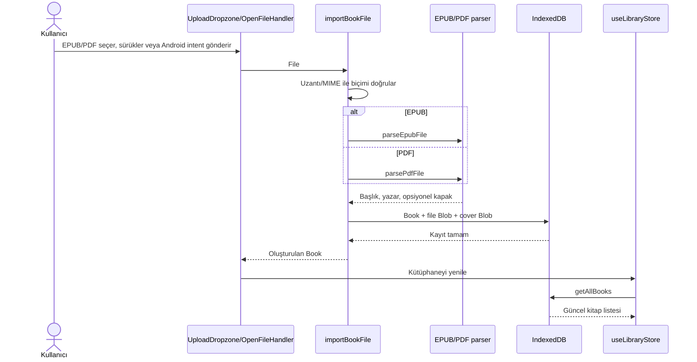

Hata durumları:

- Desteklenmeyen biçim kullanıcıya çevrilmiş hata verir.
- EPUB açma/ayrıştırma zaman aşımına uğrayabilir.
- Eksik metadata dosya adı ve “bilinmeyen yazar” fallback'ine düşer.
- Android `content://` verisi Java katmanından web katmanına güvenli biçimde
  aktarılmalıdır.

### 9.2 Kitap açma ve okuyucu seçimi

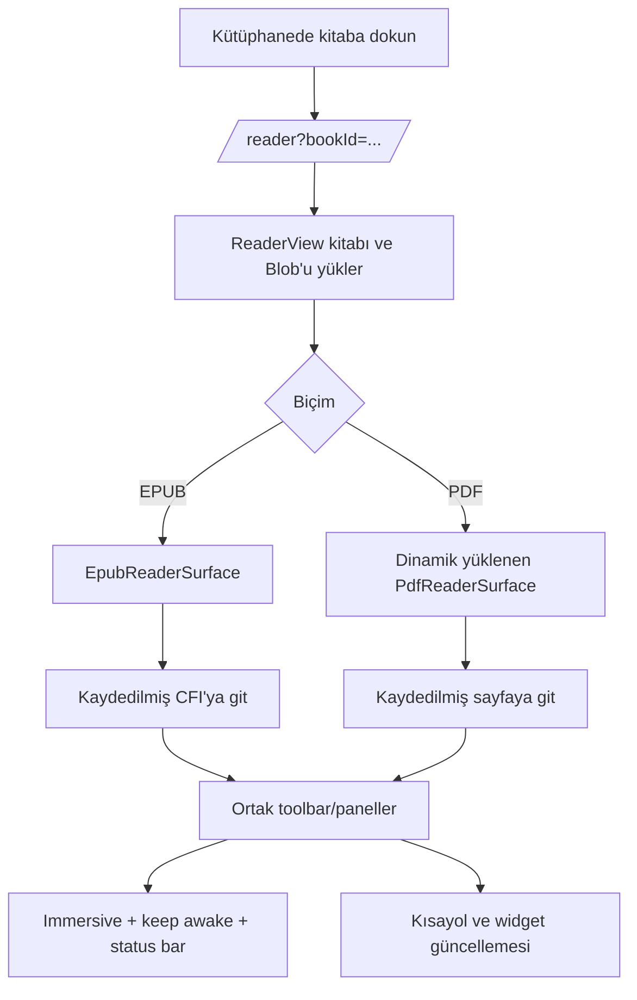

### 9.3 İlerleme ve okuma süresi

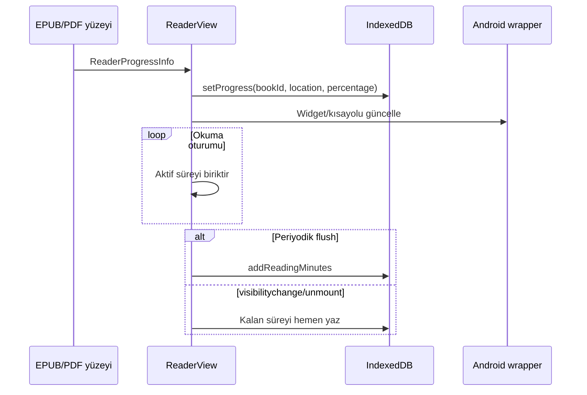

### 9.4 Vurgu, not ve yer imi

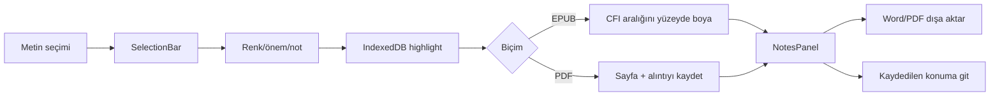

### 9.5 Tam kitaplık yedekleme

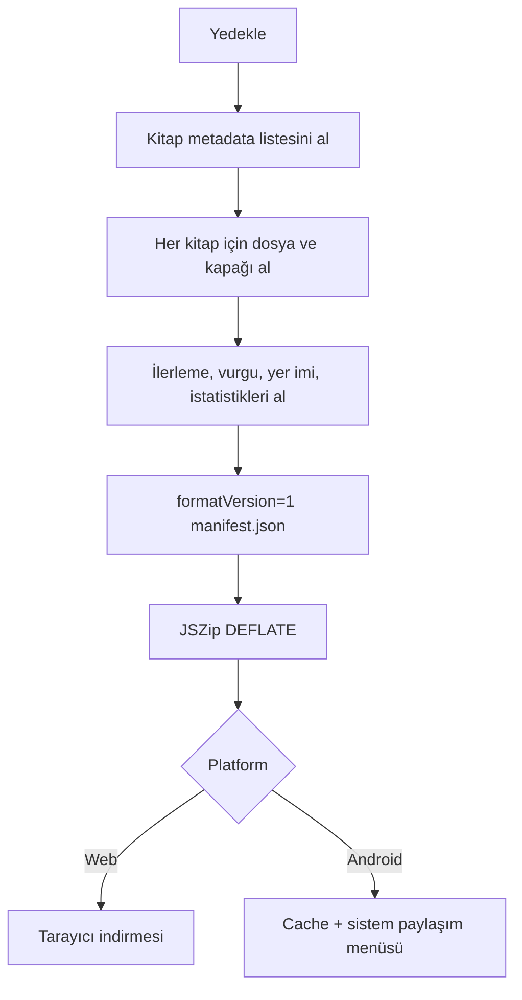

Geri yükleme:

1. ZIP okunur.
2. `manifest.json` varlığı ve format sürümü doğrulanır.
3. Dosyası bulunmayan kitap kaydı atlanır.
4. Aynı kimliğe sahip mevcut kitaplar üzerine yazılır.
5. Metadata store'ları import edilir.
6. Kütüphane state'i yenilenir.

> Yedek şifreli değildir. Kullanıcıya yedek dosyasının kitap içeriği ve kişisel
> notlar barındırdığı açıkça anlatılmalıdır.

### 9.6 Android “Birlikte aç/Paylaş” akışı

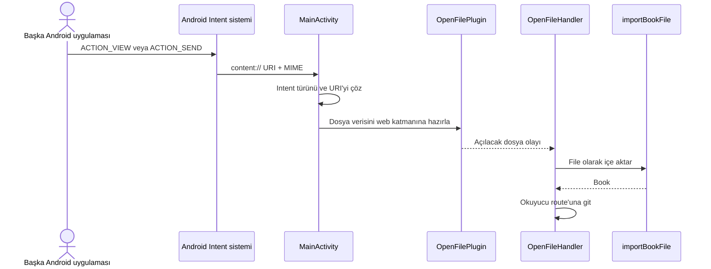

### 9.7 Widget ve kısayol akışı

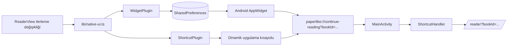

### 9.8 Web/Android build akışı

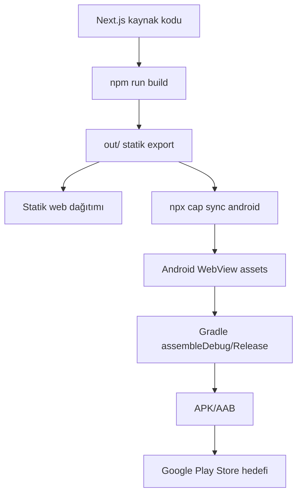

### 9.9 Reader yaşam döngüsü state machine

Bu model `ReaderView` içindeki güncel davranışı açıklar. Veri yükleme, intro,
onboarding, okuma, panel, arka plan, hata ve cleanup yan etkilerini tek yerde
görünür kılar.

#### Ana durumlar

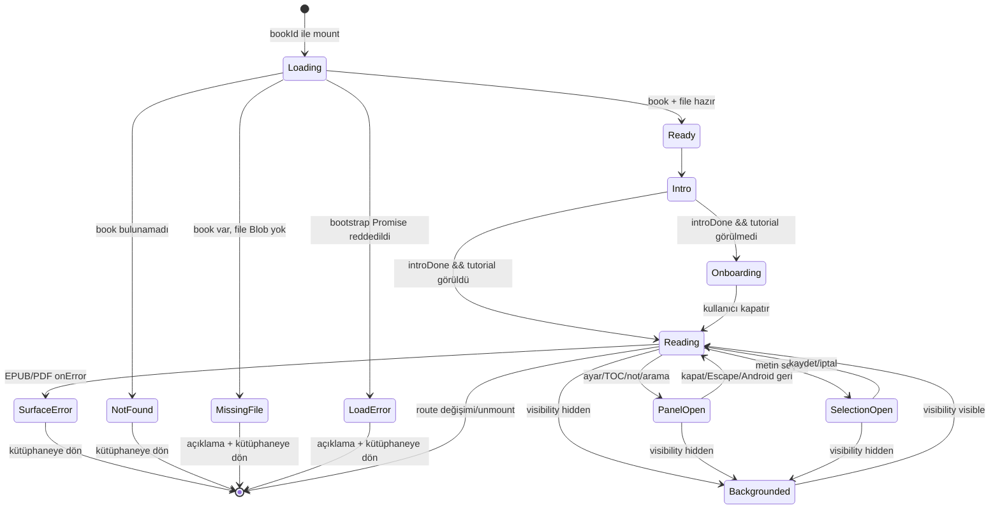

`ReaderView` bootstrap sonucu `loading`, `ready`, `notFound`, `missingFile` ve
`loadError` durumlarıyla açıkça temsil edilir. `bookId` değiştiğinde önceki kitap,
Blob, konum, vurgu ve yer imi state'i temizlenir; geç tamamlanan eski istek
`cancelled` guard ile arayüzü değiştiremez. Eksik Blob ve storage rejection
durumları sonsuz spinner yerine açıklayıcı, yerelleştirilmiş hata ve güvenli
kütüphaneye dönüş sunar.

#### UI alt durumları

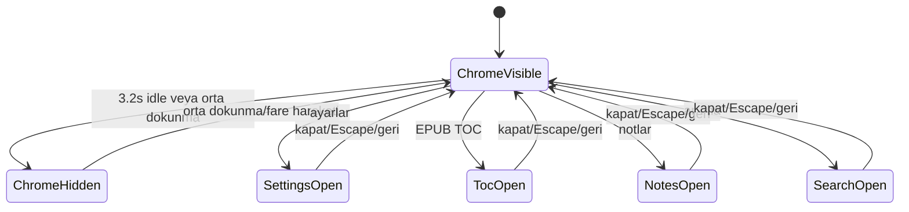

Kod birden fazla boolean panel state'i taşır; kullanıcı akışında aynı anda tek
üst panel açık olması beklenir. Escape ve Android geri önceliği:

1. Ayarlar.
2. İçindekiler.
3. Notlar.
4. Arama.
5. Bekleyen metin seçimi.
6. Hiçbiri yoksa kütüphaneye dönme fallback'i.

#### TTS alt durumu

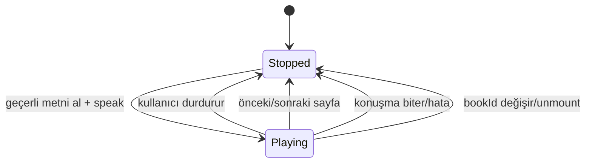

#### Durum yan etkileri ve cleanup

| Olay/durum | Başlatılan yan etki | Zorunlu cleanup/sonuç |
|---|---|---|
| `bookId` mount/değişim | Eski reader verisini temizle; kitap, Blob, progress, vurgu ve yer imini paralel yükle | Sonucu beş yükleme durumundan birine geçir; eski async sonucu `cancelled` guard ile yoksay |
| Reader mount | Immersive ve keep-awake aç | Unmount'ta ikisini kapat |
| Görünür okuma | Süreyi biriktir | 30 saniye, visibilitychange ve unmount'ta flush |
| Mola hatırlatıcı aktif | JS timer + native notification | Unmount/ayar değişiminde timer ve notification iptal |
| Mola önerisi görünür | Native bildirimi iptal et | 12 saniye sonra veya kullanıcıyla kapat |
| Volume-key ayarı aktif | Native listener kaydet | Ayar kapanınca/unmount'ta listener ve yakalama kapat |
| Progress olayı | UI state + IndexedDB progress yaz | Konum boşsa kalıcı yazma yapma |
| Progress/kitap değişimi | Widget ve shortcut güncelle | En son kitap/yüzde kazanır |
| Tema değişimi | Status bar rengini eşleştir | Sonraki ekran kendi rengini uygulamalı |
| Surface error | Genel reader hata görünümü | Kullanıcı kütüphaneye dönebilir |
| Sayfa değişimi | Haptic + surface next/prev | Çalışan TTS durur |

#### Reader değişmezleri

- İlerleme yalnız `location` doluysa kalıcı yazılır.
- EPUB CFI ve PDF `page:<n>` sözleşmesi yüzey sınırında korunur.
- Okuma süresine yalnız belge görünürken geçen süre eklenir.
- Native listener/flag'ler reader dışına sızmamalıdır.
- TTS kitap veya sayfa değişiminden sonra eski metni okumaya devam etmemelidir.
- Panel açıkken sayfa klavye kısayolları input/panel etkileşimini çalmamalıdır.
- Surface error kitaplık verisini silmemelidir.
- Intro ve onboarding gerçek reader verisinin yüklenmesini engellememelidir.
- Spinner yalnız `loading` durumunda görünmeli; bütün başarı ve hata yolları
  `loading` durumundan çıkmalıdır.
- `ready` durumunda hem kitap metadata'sı hem dosya Blob'u bulunmalıdır.

#### Modelin ortaya çıkardığı takip işi

- `ISS-016` / `RM-A-11` uygulama düzeyinde çözüldü: eksik file Blob ve reader
  bootstrap reddi ayrı `missingFile`/`loadError` durumlarına geçer.
- `IT-READER-LOAD-001`: Kitap + dosya, kitap yok, dosya yok, storage rejection,
  yükleme bekleme ve stale request senaryolarını kapsayan 6 otomatik test
  eklendi ve yerelde geçti.
- `E2E-W-READER-ERROR-001`: Kullanıcı sonsuz spinner yerine açıklayıcı hata ve
  kütüphaneye dönüş görmelidir; otomatik test hâlâ takip işidir.

### 9.10 PWA güncelleme ve rollback state machine

`PwaRegistrar` yaşam döngüsünü `lib/pwa-lifecycle.ts` içindeki saf reducer ile
modeller. Yeni service worker kullanıcı onayı olmadan aktif edilmez.

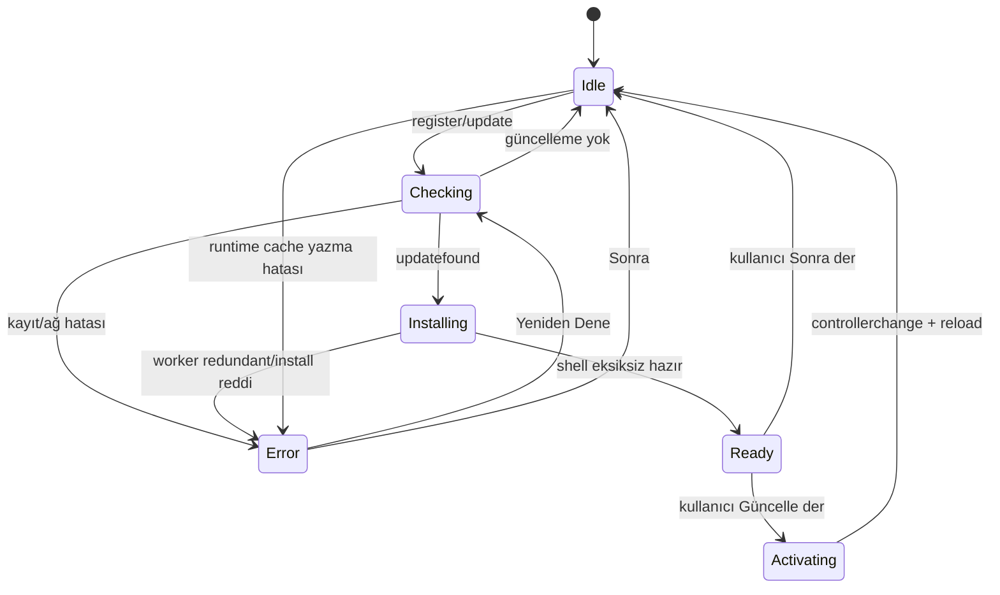

Cache güncellemesi iki aşamalıdır:

1. App shell `paperlike-shell-v3-staging` içine indirilir.
2. Zorunlu rotaların tamamı staging cache'te doğrulanır.
3. İçerik aktif sürüm cache'ine kopyalanır ve yeniden doğrulanır.
4. Yalnız başarılı aktivasyondan sonra eski `paperlike-shell-*` cache'leri silinir.
5. Herhangi bir hazırlama/kopyalama hatasında yalnız yeni staging/aktif aday
   temizlenir; önceki çalışan cache korunur.

Runtime `cache.put` hatası başarılı ağ yanıtını geçersiz kılmaz. Service worker
istemciye `PWA_CACHE_ERROR` bildirir; arayüz mevcut verilerin korunduğunu açıklar.

### 9.11 Ekran ve navigasyon haritası

Paperlike iki route ve route üstünde açılan panel/dialog katmanlarından oluşur.
Yeni bir ekran eklenirken aşağıdaki harita ve geri dönüş önceliği korunmalıdır.

```mermaid
flowchart TD
    Launch[Uygulama/web açılışı] --> Library[/ Kütüphane]
    OpenWith[Android Birlikte aç/Paylaş] --> Import[Dosyayı içe aktar]
    Import --> Reader[/reader?bookId]
    Shortcut[Shortcut/widget: bookId] --> Reader

    Library --> Upload[Kitap ekle dialogu]
    Library --> Account[Hesap dialogu]
    Library --> Backup[Yedek/dil menüsü]
    Library --> Pwa[PWA + depolama dialogu]
    Library --> Stats[İstatistik sheet]
    Library --> Category[Kategori dialogu]
    Library --> Actions[Kitap işlem menüsü]
    Actions --> Rename[Yeniden adlandır]
    Actions --> Info[Kitap bilgisi]
    Actions --> Delete[Silme onayı]
    Library -->|kitap seç| Reader

    Reader --> Bootstrap{Bootstrap sonucu}
    Bootstrap -->|ready| Reading[Okuma yüzeyi]
    Bootstrap -->|loading/download| Loading[Sonlu yükleme]
    Bootstrap -->|notFound/missingFile/loadError| ReaderError[Hata + kütüphaneye dön]
    Loading --> Bootstrap
    ReaderError --> Library

    Reading --> Settings[Ayarlar sheet]
    Reading --> Toc[EPUB içindekiler sheet]
    Reading --> Notes[Not/vurgu/yer imi sheet]
    Notes --> NoteEdit[Not düzenleme dialogu]
    Reading --> Search[Arama sheet]
    Reading --> Selection[Metin seçim çubuğu]
    Settings --> Reading
    Toc --> Reading
    Notes --> Reading
    Search --> Reading
    Selection --> Reading
    Reading -->|toolbar/geri fallback| Library

    Global[PWA update/cache bildirimi + toast] -. route üstü .-> Library
    Global -. route üstü .-> Reading
```

#### Ekran ve katman envanteri

| Kimlik | Route/katman | Açılış | Ana çıkış/geri dönüş |
|---|---|---|---|
| `SCR-LIBRARY` | `/` | Uygulama açılışı veya reader geri dönüşü | Kitap seçimi → reader |
| `DLG-UPLOAD` | Kütüphane dialogu | Kitap Ekle veya boş durum dropzone | Başarılı import/kapat → kütüphane |
| `DLG-ACCOUNT` | Kütüphane dialogu | Hesap ikonu | Kapat/Escape → kütüphane |
| `MENU-BACKUP` | Kütüphane menüsü | Yedek ikonu | Seçim veya dışarı tıklama → kütüphane |
| `DLG-PWA-STORAGE` | Web kütüphane dialogu | Depolama ikonu | Kapat/Escape → tetikleyici |
| `SHEET-STATS` | Kütüphane sheet | İstatistik ikonu | Kapat/Escape/geri → kütüphane |
| `DLG-CATEGORY` | Kütüphane dialogu | Kategori ekle | Kaydet/kapat → kütüphane |
| `MENU-BOOK-ACTIONS` | Kitap menüsü + alt dialoglar | Kitap üç nokta menüsü | İşlem/kapat → aynı görünüm |
| `SCR-READER` | `/reader?bookId=<id>` | Kitap, intent, shortcut veya widget | Toolbar/geri fallback → kütüphane |
| `SHEET-SETTINGS` | Reader sheet | Ayarlar | Kapat/Escape/geri → reader |
| `SHEET-TOC` | EPUB reader sheet | İçindekiler | Konuma git/kapat → reader |
| `SHEET-NOTES` | Reader sheet | Notlar | Konuma git/kapat → reader |
| `DLG-NOTE-EDIT` | Notes üstü dialog | Vurgu notunu düzenle | Kaydet/vazgeç → notes |
| `SHEET-SEARCH` | Reader sheet | Ara | Sonuca git/kapat → reader |
| `BAR-SELECTION` | Reader overlay | Metin seçimi | Vurgula/iptal/geri → reader |
| `STATE-READER-ERROR` | Reader tam ekran durumu | Bootstrap sonlu hata | Kütüphaneye dön |
| `GLOBAL-PWA` | Route üstü banner | Update ready/cache error | Güncelle/yeniden dene/sonra |
| `GLOBAL-TOAST` | Route üstü bildirim | İşlem sonucu | Süre veya kullanıcı kapatma |

#### Geri dönüş önceliği

Reader'da Escape ve Android geri hareketi üstteki geçici katmanı şu sırayla
kapatır: ayarlar → içindekiler → notlar → arama → metin seçimi. Hiçbiri açık
değilse `BackButtonHandler` `/` kütüphane route'una gider. Dialog/sheet focus'u
tetikleyiciye dönmeli; veri hatası hiçbir zaman örtük olarak kitap kaydını
silmemelidir.

#### Navigasyon değişmezleri

- Her reader girişi tek kaynak kimliği olarak `bookId` query parametresini kullanır.
- Dışarıdan gelen desteklenen dosya önce içe aktarılır, sonra oluşan kitapla reader açılır.
- Reader hata durumlarının tümü kullanıcıya görünür bir kütüphaneye dönüş eylemi sunar.
- Geçici panel/dialog kapanışı route ve okuma konumunu değiştirmez.
- Android geri hareketi önce üst katmanı kapatır; uygulamadan çıkış ancak
  kütüphanede işlenmemiş geri hareketinden sonra değerlendirilir.
- Web-only PWA/depolama katmanı native Android'de görünmez.

---

## 10. Native plugin kataloğu

| Plugin/sınıf | Web wrapper/kullanıcı | Sorumluluk |
|---|---|---|
| `ImmersivePlugin` | `setImmersive`, `setKeepAwake` | Sistem barlarını yönetme ve ekranı açık tutma |
| `VolumeKeyPlugin` | `enableVolumeKeyPageTurn` | Ses tuşu olaylarını sayfa komutuna çevirme |
| `OpenFilePlugin` | `OpenFileHandler` | Dış intent ile gelen dosyayı web katmanına aktarma |
| `ShortcutPlugin` | `setContinueReadingShortcut` | Dinamik “okumaya devam et” kısayolu |
| `WidgetPlugin` | `updateContinueReadingWidget` | SharedPreferences ve widget güncellemesi |
| `ContinueReadingWidgetProvider` | Android OS | AppWidget rendering ve tıklama |
| `CrashReportingPlugin` | `recordException` | JS hatasını Firebase Crashlytics'e iletme |
| `MainActivity` | Tüm intent handler'ları | Plugin kaydı, cold/warm intent yönlendirmesi |

### 10.1 Native wrapper kuralı

React bileşenleri mümkün olduğunca doğrudan `registerPlugin` çağırmamalıdır.
Platform ayrımı `lib/native-ui.ts` içindeki küçük fonksiyonlarda tutulmalıdır.
Böylece web çağrıları güvenli no-op veya anlamlı fallback olarak kalır.

### 10.2 Capacitor proxy tuzağı

Capacitor plugin proxy'leri `.then` erişimine de cevap verdiği için yanlışlıkla
Promise tarafından “thenable” kabul edilebilir. `ImmersivePlugin` başlatma kodunda
plugin nesnesi doğrudan `return` veya `await` edilmemeli; yalnızca plugin
metotlarının gerçek Promise'leri beklenmelidir.

---

## 11. Okuyucu yüzeyi sözleşmesi

`ReaderSurfaceHandle`, ortak `ReaderView` ile EPUB/PDF motorları arasındaki ana
soyutlamadır. Yeni bir biçim eklenirse aşağıdaki işlemler uygulanmalıdır:

- Sonraki/önceki konuma gitme.
- Başa/sona gitme.
- TOC hedefi; desteklenmiyorsa güvenli no-op.
- Kalıcı konuma gitme.
- Vurgu uygulama/kaldırma; desteklenmiyorsa güvenli no-op.
- Tam metin arama.
- Geçerli görünüm metnini TTS için döndürme.

Yüzeyler `ReaderProgressInfo` üretirken şu alanları sağlamalıdır:

- İnsan tarafından okunabilir bölüm/sayfa etiketi.
- `0–100` yüzde.
- Kalıcı biçime özgü konum.
- Varsa sayfa ve toplam sayfa.

Bu sözleşme sayesinde toolbar, not paneli, arama, TTS ve ilerleme kaydı biçimden
bağımsız kalır.

---

## 12. Tasarım sistemi ve etkileşim dili

### 12.1 Görsel yön

- Sakin nötr tonlar.
- Krem ve sepya gibi kâğıt çağrışımlı arka planlar.
- Okuma yüzeyinde içeriği geri plana itmeyen kontroller.
- Küçük, ölçülü ve kapatılabilir animasyonlar.
- Gerçek kitap hissini destekleyen kapak açılışı, sayfa kıvrımı ve sayfa kalınlığı.

### 12.2 Hareket ilkeleri

- Animasyon okuma komutunun sonucunu geciktirmemelidir.
- Kullanıcı animasyonu tamamen kapatabilmelidir.
- Sayfa yönü ileri/geri hareketine uygun olmalıdır.
- Sürekli kaydırma modunda sayfa kıvrımı gibi sayfalanmış metaforlar
  uygulanmamalıdır.
- Haptic feedback hafif ve seyrek olmalıdır.

### 12.3 Dil ve ton

- Hedefler “zorunluluk” olarak sunulmamalıdır.
- Okumadığı gün için kullanıcı suçlanmamalıdır.
- Mola bildirimi tek seferlik, kolay kapatılır ve nazik olmalıdır.
- Hata metni ne olduğunu ve mümkünse kullanıcının ne yapabileceğini açıklamalıdır.
- Yeni kullanıcıya görünen tüm metinler hem Türkçe hem İngilizce sözlükte
  bulunmalıdır.

### 12.4 Animasyon mimarisi ve araştırma kaydı

Raf görünümü, kitap açılışı ve sayfa kıvrımı Paperlike'ın “kitap hissi” iddiasının
ana parçalarıdır. Bu efektlerde tek amaç görsel gerçekçilik değildir; EPUB/PDF
tutarlılığı, metin seçilebilirliği, performans ve bakım maliyeti birlikte
değerlendirilir.

#### Temel kısıtlar

- EPUB içeriği `epub.js` tarafından yönetilen bir iframe içindedir. Her geçişte
  iframe'i `html2canvas` benzeri bir araçla görüntüye çevirip kıvırmak pahalı ve
  içerik karmaşıklığına bağlı olarak kararsızdır.
- PDF sayfası canvas olduğu için piksel warping teorik olarak mümkündür; ancak
  EPUB için DOM/CSS, PDF için WebGL/canvas olmak üzere iki ayrı motor bakım
  maliyetini ikiye katlar.
- Bu nedenle her iki biçimde de içerik yüzeyini değiştirmeyen DOM/CSS overlay ve
  3D transform yaklaşımı seçilmiştir.

#### Değerlendirilip reddedilen kütüphaneler

- `turn.js`: jQuery bağımlılığı, ticari kullanımı sınırlayan lisans yapısı ve
  bakımsız proje durumu nedeniyle uygun değildir.
- `react-pageflip`/StPageFlip: MIT lisanslı ve daha güncel olsa da sabit, ayrı
  sayfa elemanları bekler. `epub.js` reflowable pagination modeliyle doğrudan
  uyumlu değildir; kullanmak EPUB sayfalamasını yeniden yazmayı gerektirir.
- Canvas/WebGL pixel warping: Görsel olarak güçlü fakat biçimler arası ortak
  mimariyi ve metin etkileşimini gereksiz yere karmaşıklaştırır.

Karar: Harici page-flip motoru yerine küçük, proje içinde kontrol edilen
Framer Motion + CSS 3D çözümü kullanılır. `@react-three/fiber` veya GSAP eklenmesi
planlanmamaktadır.

#### Raf görünümü

`ShelfView` içindeki her kitap iki yüzlü 3D bir kutudur:

- Cilt genişliği `34px`, satır yüksekliği `184px`, raf kalınlığı `10px`.
- Dinlenmede cilt görünür; kapak `rotateY(90deg)` ile katlıdır.
- Hover hareketi iki aşamalıdır: kitap önce öne gelir, ardından yaklaşık
  `-102deg` döner.
- Geçiş yaklaşık `0.55s`, zaman noktaları `[0, 0.38, 1]` ve easing
  `[0.33, 1, 0.4, 1]` kullanır.
- Diğer kitaplar JS state yerine CSS `:has()` ile bulanıklaştırılır.
- İmleç kutu hareket ederken yüzeyi kaybetmesin diye hover çıkışında yaklaşık
  `150ms` gecikme vardır.
- Bilgi kartı dönen 3D kutunun çocuğu değil kardeşidir; böylece yazı
  `preserve-3d` dönüşünden etkilenmez.
- Kapak varsa kapak kenarından renk çıkarılır; yoksa kitap kimliğinden
  deterministik cilt rengi üretilir.

#### Kitap açılış animasyonu

`BookOpenTransition` yaklaşık `850ms` tutma ve `0.85s` açılma ritmi kullanır:

- Dönüş keyframe'leri `[0, 0, -128, -122]` ile overshoot ve yerleşme hissi verir.
- Ölçek keyframe'leri `[1, 1.05, 0.96, 0.96]` ile kitabın önce ele alınması
  metaforunu oluşturur.
- Menteşe yönünden yayılan gradient gölge vardır.
- Düz arka yüz rengi `#f9f6ee` değeridir.

Bilinen tek eksik görsel araştırma maddesi “sayfa yığını fanı”dır. Mevcut
animasyonda tek düz arka sayfa bloğu vardır. İleride uygulanırsa:

- Üç ince sayfa katmanı kullanılmalı.
- Tonlar açık renkten `#efe9da` ve `#e5ddc9` benzeri daha koyu tonlara gitmeli.
- Katmanlar `2–4px` yatay, `1–2px` dikey kaydırılmalı.
- Aynı timeline üzerinde `5–8deg` veya küçük gecikmelerle birbirini takip etmeli.
- Bu iş görsel cila olarak değerlendirilmelidir; çekirdek özellik değildir.

#### Çok şeritli sayfa kıvrımı

`PageCurlOverlay` gerçek içeriği kopyalamadan geçici on şeritli bir görsel kılıf
oluşturur:

- `STRIP_COUNT = 10`
- Şerit başına gecikme `0.02s`
- Şerit süresi `0.38s`
- Toplam perspektif `1400`
- Dönüş ileri yönde yaklaşık `-150deg`, geri yönde `150deg`
- Easing `[0.45, 0, 0.2, 1]`

İleri ve geri geçişlerde transform origin ve dalga sırası ters çevrilir. EPUB'da
animasyon `relocated` event'inden değil imperative `next`/`prev` komutundan
tetiklenir; çünkü `relocated` tek gezinmede birden fazla kez ateşlenip çift
animasyon oluşturabilir.

Animasyon seviyesi davranışı:

- Seviye `0`: Kapalı.
- Seviye `1`: Yaklaşık `320ms` süren hafif CSS/Framer Motion rotate/slide.
- Seviye `2`: Çok şeritli kıvrım overlay'i; alttaki içeriğe ek rotate uygulanmaz.

Sürekli kaydırma modunda bu sayfalanmış geçiş metaforları devre dışı kalmalıdır.

---

## 13. Gizlilik, güvenlik ve veri sahipliği

### 13.1 Mevcut model

- Kitaplar ve okuma verileri varsayılan olarak cihazdaki IndexedDB'de saklanır.
- Uygulamanın temel okuma akışı için kullanıcı hesabı yoktur.
- Uygulama kitap içeriğini bir Paperlike sunucusuna yüklemez.
- Kullanıcı tam kitaplık yedeğini kendisi dışa aktarabilir.
- Android Auto Backup, WebView verisini cihaz transferi/bulut yedeği kapsamında
  taşıyabilir.
- Native çökmeler ve köprüden iletilen JavaScript hataları Firebase Crashlytics'e
  gönderilebilir.

### 13.2 Kullanıcıya açıkça bildirilmesi gerekenler

- Crashlytics çevrimdışı/yalnızca yerel veri vaadinin istisnasıdır.
- ZIP yedeği şifreli değildir.
- Android Auto Backup etkin olduğu için yerel uygulama verisi kullanıcının Google
  yedekleme hesabına taşınabilir.
- EPUB iframe'ine eklenen Google Fonts stylesheet'i ağ isteği oluşturabilir.
  Tam çevrimdışı PWA hedefinde fontların yerel paketlenmesi değerlendirilmelidir.

### 13.3 Yayından önce güvenlik işleri

- Gizlilik politikası.
- Google Play Data Safety formuyla gerçek veri davranışının eşleştirilmesi.
- Crashlytics veri toplama/açıklama politikası.
- Production manifestte `usesCleartextTraffic="true"` gereksinimini kaldırma veya
  yalnızca dev konfigürasyonuna sınırlama.
- Yedek formatı için opsiyonel şifreleme kararı.
- Bulut senkronizasyonu eklenirse kimlik doğrulama, uçtan uca şifreleme,
  silme/ihracat ve çatışma politikaları.
- Firebase yapılandırma ve release signing sürecinin güvenli secret yönetimi.

### 13.4 Biyometrik kilit kararı

Biyometrik kilit denenmiş; cihaz güvenliği fallback'i ve kaçış yoluna rağmen
gerçek cihazda kullanıcıyı uygulamadan kilitleme riski devam etmiştir.

Güncel karar:

- Özellik arayüzden kaldırılmıştır.
- `BiometricLockGate`, `useSecurityStore`, çeviri anahtarları ve
  `@aparajita/capacitor-biometric-auth` bağımlılığı kaldırılmıştır.
- Güvenilirlik gerekçesiyle özellik tekrar denenmeyecektir.

Bu karar, kullanıcı verisine erişimi tamamen engelleyebilecek bir güvenlik
özelliğinin “çalışıyor gibi” sunulmaması ilkesinin örneğidir.

### 13.5 Yerel uygulama güvenlik tehdit modeli

Bu model `RM-A-03` kapsamındadır ve web/PWA ile Android kabuğunun yerel saldırı
yüzeyini inceler. Firestore rule, OAuth hesap ayrımı ve uzak hesap tasfiyesinin
derin modeli `RM-F-04` altında sürer. Yöntem STRIDE kategorileri, veri akışı güven
sınırları ve `18.4`teki olasılık/etki kayıtlarını birlikte kullanır.

#### Korunan varlıklar

1. EPUB/PDF dosyaları, kapaklar ve kitap metadata'sının gizliliği/bütünlüğü.
2. İlerleme, vurgu, not, yer imi, okuma istatistiği ve tercihlerin bütünlüğü.
3. Firebase kimliği, OAuth tokenları ve bearer yetkisi taşıyabilen Drive resumable
   session URL'leri.
4. Kullanıcının dışa aktardığı şifrelenmemiş ZIP ve not DOCX/PDF dosyaları.
5. Uygulama kullanılabilirliği: açılış, reader, backup/restore ve offline shell.
6. Release keystore, CI secretları, Firebase/Drive proje konfigürasyonu ve dağıtım
   artifact'lerinin bütünlüğü.
7. Crash/diagnostik olaylarda kullanıcının kitap adı, dosya yolu, notu ve hesap
   bağlamının gizliliği.

#### Aktörler ve varsayımlar

| Aktör | Yetenek / amaç |
|---|---|
| Kötü amaçlı belge üreticisi | Kullanıcının açacağı EPUB/PDF/kapak/ZIP içine parser, ağ, bellek veya HTML payload'ı koyar |
| Başka bir Android uygulaması | Exported activity'ye VIEW/SEND intent'i, URI, MIME ve grant gönderir |
| Aynı cihazı kullanan kişi / cihazı ele geçiren kişi | Kilidi açılmış cihazda uygulama, export ve Auto Backup verisine erişmeye çalışır |
| Web originini veya dependency zincirini ele geçiren saldırgan | JS çalıştırarak IndexedDB/localStorage/token/session erişimi hedefler |
| Hatalı yapılandırma veya yetkili operatör | Firebase/Drive/Crashlytics verisini yanlış rule, retention veya proje erişimiyle açığa çıkarır |
| İyi niyetli kullanıcı hatası | Yanlış ZIP restore eder, kitabı siler, site verisini temizler veya hassas export'u paylaşır |

Uygulama, root/jailbreak uygulanmış cihazı veya işletim sistemi yöneticisine karşı
güçlü yerel gizlilik garantisi vermez. Firebase web config'i public istemci
kimliğidir; gizli anahtar sayılmaz ve güvenlik kuralının yerini tutmaz.

#### Güven sınırları ve veri akışı

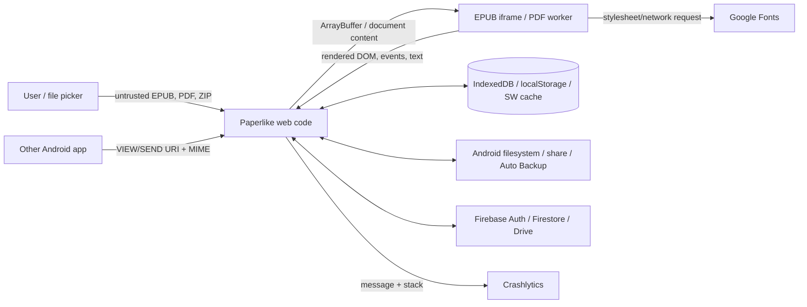

Her ok, doğrulama gerektiren bir güven sınırıdır. Aynı origin içindeki IndexedDB
ve OAuth/session verisi, başarılı XSS veya kötü amaçlı dependency karşısında
ayrı güvenlik alanı değildir.

#### Mevcut saldırı yüzeyi ve kontroller

| Yüzey | Mevcut kontrol | Sınır / eksik |
|---|---|---|
| Web file picker import | PDF `%PDF-`, EPUB `PK` + zorunlu `mimetype`, 1 GiB hard ceiling ve iç ZIP bütçeleri parser öncesi doğrulanır | Signature geçerli olsa da parser açığına karşı fuzz/worker izolasyonu ayrıca gerekir |
| Android VIEW/SEND | Bilinen MIME/uzantı filtreleri; yalnız `paperlike` scheme shortcut sayılır; FileProvider `exported=false`; provider boyutu base64 read'den önce 1 GiB ceiling'e tabi | MainActivity exported; URI/MIME güvenilmez, `file://` kabul edilir ve kötü amaçlı provider boyut metadata'sını yanlış bildirebilir |
| EPUB | `allowScriptedContent: false`; ZIP signature + `mimetype`; 1 GiB arşiv, 10.000 entry, 512 MiB entry, 4 GiB açılmış toplam ve 500:1 oran; timeout/error fallback | HTML/CSS parser açıkları, uzak kaynak isteği ve JSZip+epub.js çift parse maliyeti hâlâ mümkün |
| PDF | PDF.js worker/runtime, reader error fallback, lazy sayfa rendering | Magic header/byte bütçesi yok; parse/search yine CPU/bellek tüketebilir |
| Kapak/görsel | En fazla 384×576 thumbnail, bounded cache | Decode öncesi piksel/byte bombası için açık preflight yok |
| Backup import | CRC32, manifest şeması, safe/benzersiz ID, referans/zorunlu dosya ve gerçek entry boyutu preflight'ı; 4 GiB arşiv, 10.000 entry, 1 GiB/entry, 8 GiB açılmış toplam, 32 MiB manifest, 500:1 oran bütçesi | CRC authenticity imzası değildir; JSZip central directory parse maliyeti ve gömülü EPUB iç arşivi ayrı sınır ister |
| Backup/export paylaşımı | Kullanıcı başlatır, uygulama cache dosyasını FileProvider/Share ile verir | ZIP/DOCX/PDF şifreli değildir; cache retention ve yanlış hedefe paylaşım riski |
| IndexedDB/localStorage | Origin/app sandbox, local-first; transaction/cascade kuralları | Uygulama içi şifreleme yok; XSS, açık cihaz, WebView/backup erişimi veriyi okuyabilir |
| Android Auto Backup | Yalnız `app_webview/` açıkça dahil; OS/Google hesabı yönetir | Kitap ve notlar kullanıcının Google backup hesabına taşınabilir; uygulama içi opt-out/açıklama tamamlanmadı |
| PWA/service worker | HTTPS hosting varsayımı, staging cache doğrulama ve rollback; production Android cleartext kapalı | Hosting CSP/security header sözleşmesi yok; origin ele geçirilirse cache ve yerel veri etkilenir |
| Firebase/Drive | Firebase lazy init; Drive `drive.file`; uid-scoped yollar; deny-by-default rule CI; hesap tasfiyesi; UID-scoped tombstone/pull-delete; bütün temel mutasyonlarda kalıcı/coalesced outbox + bounded backoff + online/startup/manual flush + kullanıcı durum UI'ı | Dead-letter kararı, tombstone TTL/ack, gerçek token iptali ve fiziksel iki cihaz kanıtı yok |
| Drive resumable session | Yalnız yerel IndexedDB çalışma kaydı, tamamlanma/hata/silmede temizleme | Session URL bearer-benzeri hassas veridir; XSS/log/export'a sızmamalı, TTL yok |
| Crashlytics | Yalnız native; manifestte collection varsayılan kapalı, cihaz-yerel açık opt-in mevcut; opt-out JS iletimini keser ve unsent report silme ister; message/stack merkezi redactor ve boyut limitinden geçer; web'de no-op | Native override kapatması sonraki launch'ta tam uygulanır; gerçek release ağ/console kanıtı ve serbest metin için mutlak içerik tanıma garantisi yok |
| Dependency/build | Lockfile, audit, exact framework sürümleri, overrides, CI kalite kapıları | Production transitif PostCSS bulguları açık; SBOM/license artifact ve secret scan release kapısı değil |

#### STRIDE tehdit kataloğu

| ID / sınıf | Tehdit senaryosu | Etki | Mevcut azaltım | Gerekli sonraki kontrol |
|---|---|---|---|---|
| THR-S-01 / Spoofing | Dış uygulama sahte MIME/uzantıyla başka içeriği kitap gibi gönderir | Parser saldırısı, DoS | PDF/ZIP signature, EPUB `mimetype`, 1 GiB ceiling, native pre-read stat ve parser fallback'i | İzinli URI scheme/grant; provider boyutuna güvenmeyen stream hard stop |
| THR-S-02 / Spoofing | Manipüle `paperlike://continue-reading?bookId=` başka kitabı/boş state'i açmayı dener | Yetkisiz navigasyon veya crash | Yalnız yerel lookup; bulunamazsa reader hatası | `bookId` safe-ID doğrulaması ve bilinmeyen deep-link testi |
| THR-T-01 / Tampering | Backup manifest/file değiştirilip meşru yedek gibi restore edilir | Yanlış metadata, zararlı belge, overwrite | CRC, şema ve referans preflight | Opsiyonel imza/şifreleme kararı; içerik format doğrulaması |
| THR-T-02 / Tampering | Service worker veya static artifact origin/CDN'de değiştirilir | Kalıcı kötü amaçlı JS, bütün yerel/bulut veriye erişim | HTTPS ve atomik cache rollback | CSP/security headers, kontrollü deploy, artifact provenance/SRI uygulanabilirliği |
| THR-T-03 / Tampering | Cihaz saati değiştirilerek `updatedAt` LWW sonucu yönlendirilir | Yeni not/ilerleme ezilir | Yerel/uzak timestamp karşılaştırması | Server timestamp, monotonic/version vector veya açık çatışma |
| THR-R-01 / Repudiation | Kullanıcı/cihaz silme, restore veya remote sync işlemini kimin yaptığını kanıtlayamaz | Destek ve tasfiye uyuşmazlığı | Yerel UI sonucu/toast | İçerik taşımayan privacy-safe operasyon ID/durum kaydı |
| THR-I-01 / Disclosure | Şifrelenmemiş ZIP/not export'u yanlış uygulama/klasörle paylaşılır | Kitap/not içeriği açığa çıkar | Kullanıcı başlatmalı share | Açık hassasiyet uyarısı, opsiyonel şifreli backup, cache cleanup |
| THR-I-02 / Disclosure | Crashlytics message/stack dosya URI'si, kitap adı veya not parçası taşır | Uzak telemetriye kullanıcı içeriği | Varsayılan kapalı açık opt-in + opt-out/unsent silme; URL/path/e-posta/token/quoted text redaction + 512/4096 karakter limiti; web'de no-op | Release cihazında ağ/console doğrulaması ve mümkünse allowlist olay kodu |
| THR-I-03 / Disclosure | EPUB içinden uzak font/kaynak isteği okuma anını/IP'yi üçüncü tarafa bildirir | Metadata/privacy sızıntısı, offline kırılması | Script kapalı | Fontları yerel paketle, uzak resource/network politikasını sınırla |
| THR-I-04 / Disclosure | XSS/dependency compromise IndexedDB, localStorage ve Drive session URL'sini okur | Tam kitaplık, token/session açığı | Scripted EPUB kapalı, lockfile | CSP, dependency SLA, session minimizasyonu/TTL, hassas log yasağı |
| THR-I-05 / Disclosure | Android Auto Backup beklenmeyen Google hesabına yerel kitaplığı taşır | Kitap/not gizliliği | OS hesabı/sandbox | Privacy/Data Safety açıklaması ve yedek kapsamı/opt-out kararı |
| THR-D-01 / DoS | ZIP bomb veya çok girişli EPUB/backup aşırı genişler | OOM, UI donması, process death | Backup dış ZIP ve EPUB iç ZIP kaynak bütçeleri; timeout/iptal | Worker/streaming ve gerçek cihaz tepe bellek kanıtı |
| THR-D-02 / DoS | Çok büyük Android intent dosyası base64 + Blob ile bellekte katlanır | Cold-start OOM | Provider stat ile pre-read 1 GiB limit + Blob sonrası tekrar doğrulama | Base64 yerine native stream/copy ve okunan byte hard stop |
| THR-D-03 / DoS | Patolojik PDF/EPUB parse/search CPU'yu tüketir | Reader kullanılamaz | Search abort/yield/limit; open timeout | Parser worker izolasyonu, süre/bellek bütçesi ve kötü fixture corpus |
| THR-D-04 / DoS | Büyük görsel decode bombası kapak çıkarmada belleği tüketir | Import crash | Thumbnail/cache limiti | Decode öncesi boyut/piksel bütçesi ve güvenli fallback |
| THR-E-01 / Elevation | EPUB script/aktif içerik üst uygulama bağlamına erişmeye çalışır | XSS/token/local data erişimi | `allowScriptedContent: false`, iframe sınırı | Regresyon testi; link/navigation ve remote resource policy |
| THR-E-02 / Elevation | Yanlış Firestore rule veya hesap eşleme başka UID verisine erişir | Hesaplar arası veri sızıntısı | UID path tasarımı, Auth | Emulator rule CI, iki kullanıcı negatif test ve least privilege |
| THR-E-03 / Elevation | Debug live-reload/cleartext yapılandırması release'e sızar | Ağ MITM, dev origin erişimi | Ayrı debug manifest; main/release cleartext false | Release manifest assertion ve signed AAB inspection |

#### Zorunlu güvenlik test/backlog kimlikleri

| Kimlik | Kabul kanıtı | Öncelik / bağ |
|---|---|---|
| SEC-FILE-001 | **Geçti:** EPUB `PK` + `mimetype`, PDF `%PDF-`, sahte uzantı reddi, 1 GiB ceiling ve Android stat-before-read doğrulandı | Kritik / `ISS-021` |
| SEC-ZIP-001 | **Geçti:** Backup dış ZIP ve EPUB iç ZIP entry/tekil/toplam/manifest/oran bütçeleri; backup gerçek boyut eşleşmesi; toplam 10 kaynak senaryosu | Kritik / `ISS-021`, `RSK-012` |
| SEC-INTENT-001 | `content://` grant, reddedilen scheme/MIME, safe `bookId`, büyük intent dosyası ve process restart testleri | Yüksek / `RSK-002` |
| SEC-EPUB-001 | Scriptli EPUB kod çalıştıramaz; dış navigation/resource davranışı fixture ile doğrulanır | Yüksek / `RSK-002` |
| SEC-LOG-001 | **Temel geçti — 7/7:** redaction/limit 2/2; default-off ve opt-in handler 2/2; native UI 1/1; manifest/plugin contract 2/2. Gerçek Android ağ/console doğrulaması açık | Kritik / `ISS-023` |
| SEC-WEB-001 | Production host için CSP, `frame-ancestors`, nosniff, referrer ve permissions policy doğrulaması | Yüksek / `ISS-022` |
| SEC-LOCAL-001 | Uninstall/site clear/Auto Backup/paylaşılan cihaz senaryosu ve kullanıcı açıklaması | Yüksek / `RSK-001` |
| SEC-BACKUP-001 | Şifreli backup ürün kararı; seçilirse yanlış parola/tamper/restore round-trip testi | Orta / roadmap |
| SEC-RELEASE-001 | Secret scan, dependency/SBOM-license artifact, release manifest ve imzalı AAB inspection | Kritik / Faz D |
| SEC-CLOUD-001 | **Temel geçti — 5/5:** anonim erişim reddi, UID/path izolasyonu, desteklenen sahip erişimi, production hesap-tasfiye helper'ı ve tombstone'un eski ikinci-cihaz kaydını bastırması Firestore emulatorunda doğrulandı; gerçek token/yetki iptali açık | Kritik / `RM-F-04` |

#### Olay müdahale ve güvenli hata ilkeleri

1. Şüpheli belge çökmesinde dosya veya metin Crashlytics'e eklenmez; yalnız
   redakte olay kodu, app sürümü, format ve güvenli boyut sınıfı kullanılabilir.
2. Parser/auth/veri sızıntısı advisory'si bağımlılık SLA'sına göre triage edilir;
   güvenli fix yoksa ilgili import/sync yolu feature flag veya release blokuyla
   kapatılır.
3. Restore/import validation hatası mevcut veriyi değiştirmemeli ve başarısız
   girdiyi otomatik yeniden açmamalıdır.
4. Token/session sızıntısında oturum iptali, OAuth grant revoke, Firebase kullanıcı
   oturumu kapatma, uzak oturum temizliği ve secret rotasyonu ayrı ayrı
   değerlendirilir.
5. Veri olayı sonrası kapsam, etkilenen sürüm/cihaz/veri sınıfı, zaman çizelgesi,
   kullanıcı bildirimi ve tekrar önleme kontrolü kaydedilir; hassas içerik olay
   kaydına kopyalanmaz.

### 13.6 Gizlilik politikası ve Google Play Data Safety çalışma taslağı

> **Yayın durumu:** Bu bölüm mühendislik/veri envanteridir; hukuki danışmanlık
> değildir ve bugün mağazaya verilecek nihai politika değildir. Köşeli
> placeholder'lar, gerçek Firebase/Play Console ayarları ve kullanıcı akışları
> tamamlanmadan yayınlanmamalıdır.

Google Play, veri toplamayan uygulamalar dahil bütün yayınlanan uygulamalardan
Data Safety formu ve privacy policy ister; uygulama içi hesap oluşturma varsa
uygulama içi ve dış web hesap silme yolu da gerekir. Privacy policy uygulama
içinden ve Play Console'dan erişilen, aktif, herkese açık, coğrafi olarak
kısıtlanmamış, PDF olmayan ve kullanıcı tarafından düzenlenemeyen bir URL'de
olmalıdır. Kaynaklar:

- [Google Play Data Safety form rehberi](https://support.google.com/googleplay/android-developer/answer/10787469)
- [Google Play User Data, privacy policy ve account deletion politikası](https://support.google.com/googleplay/android-developer/answer/17190352)
- [Google Play hesap silme gereksinimi](https://support.google.com/googleplay/android-developer/answer/13327111)
- [Firebase Privacy and Security veri/retention tablosu](https://firebase.google.com/support/privacy/)
- [Firebase kullanıcı verisi export/clear rehberi](https://firebase.google.com/support/privacy/clear-export-data)
- [Google Drive `drive.file` scope rehberi](https://developers.google.com/workspace/drive/api/guides/api-specific-auth)

#### Veri işleme envanteri

| Veri / Play adayı | Kaynak ve hedef | Amaç | Zorunlu mu? | Retention / silme | Data Safety çalışma kararı |
|---|---|---|---|---|---|
| EPUB/PDF dosyası ve kapak — “Files and docs” | Kullanıcı → yerel IndexedDB; Google hesapla sync seçilirse kullanıcının Drive'ı | Okuma, backup ve cihazlar arası dosya kurtarma | Temel yerel okuma için dosya gerekli; bulut opsiyonel | Yerelde kitap silme/uninstall/site clear; Drive'da bilinen dosyaya best-effort silme | Yalnız cihazda kalırsa Play “collected” değil; Drive upload aktif artifact'te varsa off-device collection olarak muhafazakâr biçimde incele |
| Kitap başlığı/yazar/kategori | Dosya metadata'sı/kullanıcı → yerel; girişte Firestore | Kütüphane ve sync | Yerel işlev için gerekli; cloud opsiyonel | Kitap silmede yerel kayıt gider; UID-scoped uzak tombstone eski cihaz kopyasını bastırır; TTL kararı açık | Firestore açıksa “App activity/Other user-generated content” sınıflandırmasını Play formunda doğrula |
| İlerleme, yer imi, okuma istatistiği ve ayarlar | Kullanıcı etkileşimi → yerel; ilerleme/yer imi/ayarın bir bölümü Firestore | Okuma devamlılığı ve kişiselleştirme | Yerel üretim gerekli; cloud opsiyonel | Kitap/site silme; istatistik cloud sözleşmesinde yok | Uzağa giden alanlar için “App interactions/Other actions”, amaç app functionality |
| Vurgu ve not metni | Kullanıcı → IndexedDB; girişte Firestore | Not alma ve cihazlar arası devam | Opsiyonel | Tekil/kitap silme UID-scoped tombstone ile sonraki sync'e taşınır; gerçek iki cihaz kanıtı açık | “Other user-generated content”, app functionality; hassas serbest metin olarak ele al |
| E-posta, parola ve Firebase UID | Kullanıcı → Firebase Authentication; parola uygulama DB'sine yazılmaz | Hesap oluşturma/giriş/reset ve veri ayrımı | Sync hesabı için gerekli, yerel okuma için opsiyonel | Firebase'e silme başlatılana kadar; Firebase Auth IP'leri birkaç hafta, diğer auth verisini silme başlatıldıktan sonra live/backup'tan 180 gün içinde kaldırır | “Personal info: Email address” ve “User IDs”; account management/app functionality |
| Google profil adı/e-posta/UID ve OAuth tokenı | Google Sign-In/Firebase Auth; token bellek cache'i | Google giriş ve Drive yetkisi | Google/Drive sync seçilirse gerekli | Çıkışta uygulama token cache'i temizlenir; provider retention ayrıca geçerli | Name/email/user ID erişimini kullanılan provider alanlarıyla doğrula; parola/tokenı loglama |
| Crash trace, redakte JS error message/stack | Android uygulaması → Firebase Crashlytics | Crash teşhisi ve güvenilirlik | Varsayılan kapalı; cihaz-yerel açık opt-in gerekir; payload merkezi redactor/limite tabidir | Opt-out JS iletimini hemen keser, native kapatma sonraki launch'ta tam uygulanır ve unsent report silinir; Firebase trace/ilişkili ID'leri 90 gün tutar | “App info and performance: Crash logs/Diagnostics”; kullanıcı kontrolü mevcut, release runtime kanıtı gerekli |
| Crashlytics/Firebase installation, session ve cihaz bilgisi | SDK → Firebase | Crash dedupe, etkilenen kurulum sayısı ve teşhis | Crashlytics collection manifestte kapalı; runtime opt-in override cihazda persist edilir | Crashlytics ilişkili ID'ler için 90 günlük politika | “Device or other IDs” ve diagnostics; SDK Index/gerçek runtime doğrulaması gerekli |
| Firebase Analytics otomatik olay/cihaz bilgisi | Android Firebase Analytics dependency → Google/Firebase | Crashlytics breadcrumb ve olası kullanım analizi | Mevcut Gradle build'inde SDK var; runtime collection doğrulanmalı | Firebase/Analytics ayar ve sözleşmesine bağlı | App interactions, device IDs, diagnostics ve olası approximate location/IP için Play SDK Index + DebugView doğrulaması şart |
| IP adresi ve user-agent | Firebase Auth/Google servislerine ağ isteği | Güvenlik, kötüye kullanım önleme ve servis sunumu | Bulut özelliği kullanılırsa teknik olarak gerekli | Firebase Auth IP logları birkaç hafta | IP'den konum çıkarımı nedeniyle “Approximate location” yorumunu Play formunda/SDK rehberinde doğrula |
| Google Fonts ağ isteği | EPUB iframe → `fonts.googleapis.com`/font hostu | Kitap fontu | Hayır; sistem fallback'i var | Google servis politikası | Üçüncü taraf ağ erişimi; production öncesi fontu yerelleştir (`ISS-022`) |
| ZIP/DOCX/PDF export | Yerel app cache → kullanıcının seçtiği share hedefi | Veri taşınabilirliği ve not paylaşımı | Hayır | Hedef uygulama/OS ve kullanıcı yönetir; şifreli değil | Kullanıcı tarafından başlatılan transfer; yanlış hedef ve üçüncü taraf politikası açıkça anlatılmalı |
| Android Auto Backup içindeki WebView verisi | `app_webview/` → kullanıcının Android/Google backup alanı | Cihaz transferi/kurtarma | OS hesabı/ayarına bağlı | Android/Google backup retention'ı | Kullanıcıya açıklanmalı; Play “collection/share” istisnası gerçek politika davranışıyla doğrulanmalı |

Uygulama bugün konum, kişi listesi, kamera, mikrofon, sağlık, finans, ödeme veya
reklam amacıyla Android izni istemez. Manifest, Analytics tarafından transitif
eklenebilen Advertising ID ve AdServices izinlerini açıkça kaldırır. Bu negatif
envanter her SDK/manifest merge değişiminde yeniden doğrulanmalıdır.

#### Data Safety formu için muhafazakâr aday cevaplar

Bu tablo Play Console'a körlemesine kopyalanmaz; yayınlanan AAB, merged manifest,
Firebase Console ve SDK Index ile aynı release üzerinde doğrulanır.

| Soru | Aday cevap | Yayın öncesi kanıt |
|---|---|---|
| Uygulama veri topluyor veya paylaşıyor mu? | **Evet** — Auth, Firestore/Drive sync ve Crashlytics/Analytics off-device davranışı nedeniyle | Release AAB SDK listesi + runtime network/DebugView |
| Bütün toplanan veri aktarımda şifreli mi? | **Hedef evet** — Firebase/Google HTTPS ve production cleartext kapalı | Network Security Config/merged manifest + endpoint incelemesi |
| Kullanıcı veri silme talebi verebilir mi? | **Uygulama içinde evet; public web yolu henüz yok / yayın engeli** | In-app iki aşamalı silme mevcut; public deletion URL + gerçek servis tasfiye kaydı gerekli |
| Veri paylaşımı var mı? | Google hizmetleri yalnız hizmet sağlayıcı rolündeyse çoğu işleme “sharing” sayılmayabilir; Analytics, Fonts ve kullanıcı yönlendirmeli Drive/share transferi sözleşme bazında incelenmeli | Google Play tanımı, SDK Index, Firebase/Google sözleşmesi ve gerçek amaç |
| Toplama opsiyonel mi? | Crashlytics cihaz bazında varsayılan kapalı ve açık opt-in kontrollüdür; Firebase Analytics için collection kararı hâlâ ayrı ve açık | Crashlytics release runtime testi + Analytics consent/DebugView kararı |
| Hesap verisi siliniyor mu? | **Auth + Firestore + Drive istemci akışı uygulandı; release doğrulaması kısmi** (`ISS-020`) | Gerçek servis E2E, public URL, retention ve ilişkili telemetry tasfiye kanıtı |

#### Privacy policy yayın taslağı

**Başlık:** Paperlike Gizlilik Politikası

**Yürürlük tarihi:** `[YYYY-MM-DD]`

**Veri sorumlusu/geliştirici:** `[PLAY_CONSOLE_DEVELOPER_OR_LEGAL_NAME]`

**Gizlilik iletişimi:** `[PRIVACY_EMAIL_OR_REQUEST_URL]`

**Kapsam.** Bu politika Paperlike Android uygulaması ve web/PWA sürümünün hangi
verilere eriştiğini, verileri neden işlediğini, nereye aktardığını, ne kadar
sakladığını ve kullanıcı seçeneklerini açıklar.

**Yerel kullanım.** Kullanıcı hesap açmadan EPUB/PDF okuyabilir. Kitap dosyaları,
kapaklar, okuma ilerlemesi, vurgular, notlar, yer imleri, istatistikler ve
tercihler öncelikle cihazdaki IndexedDB/localStorage içinde tutulur. Kullanıcı
kitabı silebilir, site verisini temizleyebilir veya uygulamayı kaldırabilir.
Android Auto Backup açıksa WebView verisi kullanıcının Android/Google yedekleme
alanına cihaz transferi/kurtarma amacıyla taşınabilir.

**Hesap ve bulut senkronizasyonu.** Kullanıcı Google veya e-posta/parola ile
hesap/sync seçerse Firebase Authentication kimlik doğrulama verisini işler.
Kitap metadata'sı, ilerleme, vurgu/not, yer imi ve desteklenen ayarlar Firestore'a;
orijinal kitap dosyası kullanıcının Google Drive alanına aktarılabilir. Paperlike
`drive.file` scope'u ile uygulamanın oluşturduğu veya kullanıcı tarafından
uygulamayla açılan dosyalarla sınırlı erişim hedefler. Bulut verisi uçtan uca
şifreli değildir; hizmet sağlayıcıların sunucu tarafı işleme koşulları geçerlidir.

**Crash ve analytics.** Android build'inde Crashlytics otomatik collection
manifest düzeyinde kapalıdır. Kullanıcı hesap panelindeki cihaz-yerel kontrolü
açarsa crash trace, uygulama/OS/cihaz bilgisi, kurulum/session kimlikleri ve
redakte edilmiş JavaScript error message/stack gönderilebilir. Opt-out JS
iletimini hemen keser; Firebase'in native override'ı sonraki uygulama açılışında
tam uygulanır ve uygulama gönderilmemiş raporların silinmesini ister. Firebase'in
yayımladığı mevcut retention'a göre Crashlytics trace ve ilişkili kimlikleri 90
gün tutar, ardından live/backup sistemlerinden kaldırma sürecini başlatır.
Firebase Analytics'in etkin olduğu release'lerde app interaction, cihaz/kurulum
ve teknik tanılama verisi ayrıca işlenebilir; Analytics collection kararı
Crashlytics opt-in kontrolünden ayrıdır.

**Üçüncü taraflar.** Google/Firebase; Authentication, Firestore, Crashlytics ve
Analytics hizmetlerini, Google Drive ise kullanıcı tarafından seçilen
senkronizasyonu sağlar. EPUB reader bugün Google Fonts'a font stylesheet isteği
gönderebilir; production hedefi fontları yerel paketlemektir. Kullanıcının
başlattığı ZIP/DOCX/PDF paylaşımında seçilen hedef uygulamanın politikası geçerli
olur.

**Saklama ve silme.** Yerel veri kullanıcı silene, site verisini temizleyene veya
uygulamayı kaldırana kadar kalır. Kullanıcının dışa aktardığı dosyaları kullanıcı
yönetir. Uygulama içi hesap silme aktif Firestore ağacını ve erişilebilir Drive
`Paperlike` klasörlerini Auth'tan önce siler; ancak production retention süresi,
public web talep yolu ve ilişkili diagnostik verinin tasfiye sözleşmesi henüz
tamamlanmamıştır. Hedef, hesap silme isteğinde aktif Firestore/Drive verisini en
geç `[TARGET_ACTIVE_DELETE_DAYS]` gün içinde tasfiye etmek; yasal veya güvenlik
gerekçesiyle tutulan istisnaları tür ve süreyle açıklamaktır. Firebase Auth kendi
belgelenmiş backup temizleme süresini uygulayabilir. Bu hedef gerçek servis
kanıtıyla doğrulanmadan hesaplı sürüm Play Store'a gönderilmemelidir.

**Güvenlik.** Production Android cleartext trafiği kapalıdır ve Google/Firebase
aktarımı HTTPS kullanır. Yerel veri işletim sistemi/origin sandbox'ıyla korunur;
ancak uygulama içi şifreleme ve uçtan uca cloud şifrelemesi yoktur. ZIP backup ve
not export'ları şifrelenmez; kullanıcı güvenli hedef seçmelidir. Hiçbir yöntem
mutlak güvenlik garanti etmez.

**Kullanıcı seçenekleri.** Kullanıcı local-only kullanabilir, tekil kitap ve
notları silebilir, kitaplığını ZIP olarak dışa aktarabilir ve hesabından çıkabilir.
Hesap oluşturma sunulduğu için release öncesi hem uygulama içinde hem
`[PUBLIC_ACCOUNT_DELETION_URL]` adresinde hesap ve ilişkili veri silme talebi
sağlanacaktır. Çıkış yapmak yerel cihaz verisini otomatik silmez.

**Çocuklar ve bölgesel haklar.** Hedef yaş grubu ve çocuklara yönelik ürün kararı
`[TARGET_AUDIENCE_DECISION]` olarak doldurulmalıdır. Erişim, düzeltme, export,
silme veya itiraz talepleri `[PRIVACY_EMAIL_OR_REQUEST_URL]` üzerinden alınır;
kimlik doğrulama ve geçerli hukuk kapsamı uygulanır.

**Değişiklikler ve iletişim.** Politika değişiklikleri yürürlük tarihiyle bu
sayfada yayınlanır; önemli veri amacı değişiklikleri gerektiğinde uygulama içinde
bildirilir. Sorular için `[PRIVACY_EMAIL_OR_REQUEST_URL]` kullanılmalıdır.

#### Yayınlanabilir hale getirme kontrol listesi

- [ ] Play Console'daki geliştirici adı/legal entity ve çalışan privacy iletişimi
  placeholder'lara yazıldı.
- [ ] Politika statik, herkese açık, non-geofenced, HTML URL'ye dağıtıldı; link
  hem uygulama ayar/hesap ekranında hem Play Console'da mevcut.
- [ ] Release AAB'nin merged manifest, SDK Index ve runtime ağ davranışıyla veri
  envanteri karşılaştırıldı.
- [ ] Firebase Analytics'in gerçekten gerekli olup olmadığı kararlaştırıldı;
  collection default/consent ve Data Safety cevabı test edildi.
- [x] Crashlytics JS error payload redaction ve boyut limitleri test edildi.
- [x] Crashlytics varsayılan-kapalı açık opt-in/opt-out kontrolü, unsent-report
  silme isteği ve 90 günlük retention metni uygulandı; kaynak/JS testleri geçti.
- [ ] Crashlytics opt-in/opt-out gerçek release cihazında Firebase Console ve
  ağ davranışıyla doğrulandı.
- [ ] EPUB Google Fonts isteği kaldırıldı veya üçüncü taraf işleme olarak nihai
  politikada tutuldu.
- [x] Uygulama içi hesap silme Auth, Firestore ve Drive aktif verisini sıralı,
  tekrar çalıştırılabilir ve kısmi hata görünür biçimde tasfiye ediyor.
- [ ] Public web hesap silme talep URL'si ve gerçek servis E2E tasfiye kaydı.
- [ ] Firestore/Drive aktif ve backup retention süreleri onaylanıp gerçek
  operasyon alarmı/runbook'uyla bağlandı.
- [ ] Data Safety CSV/formu aynı sürümün davranışıyla dolduruldu ve ikinci kişi
  tarafından gözden geçirildi.
- [ ] Hedef kitle/çocuklar, ülke/bölge ve privacy hakları için hukuki ürün kararı
  kaydedildi.

---

## 14. Hata yönetimi ve gözlemlenebilirlik

### 14.1 Mevcut mekanizmalar

- İçe aktarma ve kullanıcı işlemleri için toast geri bildirimi.
- EPUB açılışı için zaman aşımı ve fallback ekranı.
- Global `error` ve `unhandledrejection` yakalama.
- Native Android çökmeleri için Firebase Crashlytics.
- JavaScript hatalarını özel native plugin ile Crashlytics'e iletme.

### 14.2 Eksikler

- React error boundary kapsamı açıkça standartlaştırılmamış.
- Web dağıtımı için merkezi hata izleme yok.
- Yapısal log seviyesi ve olay isimlendirme standardı yok.
- Sentetik web benchmarkı vardır; gerçek kullanıcı metrikleri ve Android cihaz
  telemetrisi henüz yoktur.
- Kullanıcı gizliliğini koruyan tanılama paketi/destek dışa aktarma akışı yok.

Hata raporlarına kitap metni, not içeriği veya dosya yolu gibi hassas veriler
eklenmemelidir.

---

## 15. Performans modeli

### 15.1 Mevcut güçlü yönler

- Statik export sunucu runtime ihtiyacını azaltır.
- Ağır kütüphaneler ihtiyaç anında yüklenir.
- PDF yüzeyi kütüphane açılış paketinden ayrılır.
- Sürekli PDF modunda bütün sayfaların canvas/text layer'ları aynı anda
  oluşturulmaz; IntersectionObserver ile ekrana yakın sayfalar lazy render edilir.
- PDF araması ve geçerli sayfa metin erişimi, React-PDF'in açık
  `PDFDocumentProxy` nesnesini yeniden kullanır.
- EPUB konum üretimi ilk sayfa etkileşimli olduktan 500 ms sonraya ertelenir ve
  sıkıştırılmış dosya boyutuna göre uyarlanan bir konum aralığı kullanır.
- Android release kaynakları küçültülür.
- Görünüm state'i ve veri erişimi basit tutulmuştur.

### 15.2 Büyük kitap riski

Yol haritasındaki “büyük dosyalarda performans” hedefi aşağıdaki ayrı sorunları
kapsar:

- Büyük EPUB ZIP'inin açılma süresi ve bellek kullanımı.
- Çok bölümlü EPUB tam metin aramasının maliyeti.
- Çok sayfalı PDF'te sayfa wrapper sayısı toplam sayfayla büyümeye devam eder;
  pahalı canvas/text katmanları lazy olsa da tam DOM windowing henüz yoktur.
- PDF metin çıkarma ve arama maliyeti.
- Büyük Blob'ların IndexedDB, backup ve restore sırasında çoğaltılması.
- Tam kitaplık ZIP üretirken tepe bellek kullanımı.
- Düşük bellekli Android cihazlarda WebView process ölümü.
- Çok sayıda kitap kapağının kütüphane görünümünde decode edilmesi.

### 15.3 Uygulanan performans politikaları

1. `shouldRenderPdfPage`, gözlenen sayfalarla geçerli sayfanın ±1 güvenlik
   penceresini render eder.
2. Tek bir IntersectionObserver yaklaşık 1,5 viewport önceden PDF sayfasını
   hazırlar ve uzaktaki canvas/text layer'ını kaldırır.
3. Scroll konumu hesabı bütün sayfaları taramak yerine yalnız gözlenen yakın
   sayfaların geometri bilgisini, `requestAnimationFrame` ile en fazla frame
   başına bir kez okur.
4. `getEpubLocationBreak`, normal kitaplarda `1600` karakter aralığını korur;
   büyük dosyalarda tahmini en fazla 4.000 konum hedefiyle aralığı büyütür.
5. `E2E-W-PERF-001`, production Chromium çıktısında 120 sayfalık sentetik PDF
   için 120 page slot'a karşı en fazla 10 aktif React-PDF sayfasını ve uzak
   100. sayfadaki metnin tam kitap aramasından bulunmasını doğrular.
6. Arama paneli 250 ms debounce uygular; yeni sorgu ve panel kapanışı aktif
   `AbortController` sinyalini iptal eder.
7. EPUB/PDF motorları her bölüm/sayfadan sonra ilerleme bildirir, en fazla 50
   sonuç üretir ve dört tarama biriminde bir ana iş parçacığına kontrol verir.
8. EPUB araması iptal veya hata sırasında yüklenmiş bölümü `finally` ile unload
   eder; PDF araması açık `PDFDocumentProxy` nesnesini yeniden kullanır.
9. Backup export'u büyük EPUB/PDF ve kapak girdilerini `STORE` ile ekler;
   tarayıcıda Blob girdisini eager ArrayBuffer kopyasına dönüştürmez.
10. Backup/restore `collecting`, `compressing`, `validating`, `restoring` ve
    `metadata` aşamalarını yüzdeyle bildirir ve kullanıcı iptalini kabul eder.
11. Restore CRC, manifest ve bütün zorunlu dosyaları ilk IndexedDB mutasyonundan
    önce doğrular; eksik dosyalı arşiv kısmi restore başlatmaz.
12. `IT-BACKUP-LARGE-001`, altı adet 512 KiB ikili kitapla 3 MiB çok-kitaplı
    round-trip ve aşama sırasını doğrular.
13. Kapaklar IntersectionObserver ile viewport'a 300 px yaklaşınca yüklenir;
    uzaklaştığında aktif cache lease'i bırakılır.
14. `CoverCache`, eşzamanlı IndexedDB isteklerini ve object URL üretimini tek
    promise/kayıtta birleştirir; 96 kayıt ve 32 MiB ile sınırlı LRU uygular.
15. Aktif URL cache invalidation sırasında hemen revoke edilmez; son lease
    bırakıldığında temizlenerek ekrandaki görselin kırılması önlenir.
16. Büyük kaynak kapaklar bir kez en fazla 384×576 WebP thumbnail'e çevrilir;
    bitmap/canvas desteği yoksa kaynak Blob güvenli fallback olarak kullanılır.
17. Raf cilt rengi aynı cached thumbnail Blob'undan bir kez çıkarılır; raf
    görünümü artık kapak görselinden ayrı ikinci IndexedDB okuması yapmaz.
18. Kitap silme tekil cache invalidation, restore ise toplu cache clear uygular.
19. 200 kitaplık fixture cache'in 24 kayıtlık test bütçesini aşmadığını ve
    tahliye edilen bütün object URL'lerin revoke edildiğini doğrular.
20. `PERF-W-001`; seçilen küçük/orta/büyük profilde gerçek UI üzerinden PDF ve
    EPUB import, PDF ilk sayfa, sayfa geçişi, arama, backup export/restore,
    kapak cache hit ve thumbnail sınırlarını ölçer.
21. Benchmark her iterasyonu temiz bir browser context ve IndexedDB ile çalıştırır;
    yerelde varsayılan üç örneğin p50/p95 değerlerini, CI'da tek örnekli smoke
    sonucunu `benchmark-results/latest.json` ve `latest.md` olarak üretir.
22. JSON `schemaVersion: 1`, ortak `platform`, fixture, environment ve metric
    alanlarıyla Android ölçümlerinin de aynı rapor sözleşmesine eklenmesine
    uygundur. Yapısal bütçeler her ortamda kapıdır; gürültülü paylaşımlı CI'da
    süre aşımları uyarıdır. Kalibre runner'da `BENCHMARK_ENFORCE_TIMINGS=1`
    süre bütçelerini de kapı yapar.
23. Ayrı Android `:benchmark` modülü release build'den türetilmiş, debug key ile
    imzalanmış ve yalnız benchmark varyantında `profileable` hedef üretir.
24. `coldStartup`, AndroidX `StartupTimingMetric` ile soğuk açılışı ölçer.
    `mediumPdfReaderFramesAndMemory`, Android `PdfDocument` ile deterministik
    120 sayfalık fixture üretir; FileProvider ve gerçek `ACTION_VIEW` intent'i
    üzerinden native import akışını çalıştırdıktan sonra okuyucu swipe'larında
    `FrameTimingMetric` ve maksimum `MemoryUsageMetric` toplar.
25. AndroidX'in ham `benchmarkData.json` ve Perfetto trace'leri korunur.
    `scripts/android-benchmark-report.mjs` desteklenen süre, frame ve bellek
    metriklerini web ile aynı `schemaVersion: 1` JSON/Markdown sözleşmesine
    dönüştürür.

### 15.4 Kalan yaklaşım

1. Sentetik süre bütçeleri farklı CI koşularından baseline biriktirildikten sonra
   kalibre edilmeli ve süre kapısı için sabit runner seçilmelidir.
2. Hazır Macrobenchmark paketi yalnız ayrılmış/silinebilir bir fiziksel test
   cihazı edinildiğinde çalıştırılıp ilk kabul edilmiş baseline yayınlanmalıdır.
3. EPUB ilk sayfa ve tam metin arama metrikleri web benchmarkına eklenmelidir.
4. Kalıcı/tembel arama indeksleri değerlendirilmelidir.
5. Import gibi kalan uzun işlemler ilerleme ve iptal desteği vermelidir.
6. JSZip'in nihai arşivi bellekte üretme sınırı için streaming veya worker
   seçenekleri araştırılmalıdır.
7. Thumbnail üretiminin gerçek Android cihazdaki decode süresi ve tepe belleği
   ölçülmeli; gerekirse Web Worker/OffscreenCanvas değerlendirilmelidir.

---

## 16. Geliştirme, build ve CI

### 16.1 Gereksinimler

- Node.js 20 veya uyumlu sürüm.
- npm.
- Android geliştirme için Android Studio, uygun SDK ve Java 21.
- Native Crashlytics build'i için geçerli Firebase yapılandırması.

### 16.2 Komutlar

| Komut | Amaç |
|---|---|
| `npm ci` | Kilit dosyasına göre temiz bağımlılık kurulumu |
| `npm run dev` | Web geliştirme sunucusu |
| `npm run build` | Statik Next.js üretim çıktısı |
| `npm run lint` | ESLint |
| `npm run type-check` | Emit üretmeden TypeScript kontrolü |
| `npm test` | Vitest testlerini tek sefer çalıştırma |
| `npm run test:watch` | Vitest'i geliştirme sırasında izleme modunda çalıştırma |
| `npm run test:e2e` | Production build + Playwright Chromium E2E |
| `npm run test:e2e:ui` | Playwright görsel test arayüzü |
| `npm run test:e2e:compat` | Production build + beş tarayıcı/cihaz profilli temel uyumluluk matrisi |
| `npm run test:responsive` | Production build + telefon yatay, tablet dikey/yatay ve foldable-benzeri viewport/yön değişimi matrisi |
| `npm run test:a11y` | Production build + Axe WCAG A/AA, klavye/focus ve 320px reflow matrisi |
| `npm run test:visual` | Production build + 10 masaüstü/mobil PWA görünüm ve viewport regresyonu |
| `npm run test:visual:update` | Aynı görsel senaryoları çalıştırıp `docs/visual-references/` PNG'lerini bilinçli olarak yenileme |
| `npm run benchmark:web` | Mevcut `out/` üzerinde orta profil, yerelde 3 iterasyon benchmark |
| `npm run benchmark:web:build` | Production build + web benchmark |
| `npm run benchmark:android:assemble` | Web sync + release-derived benchmark APK derlemesi |
| `npm run benchmark:android` | Varsayılan olarak bloklu; yalnız ayrılmış cihazda `PAPERLIKE_ALLOW_DEVICE_BENCHMARK=dedicated-test-device` ile Macrobenchmark |
| `npm run benchmark:android:report` | Son AndroidX ham sonucunu ortak JSON/Markdown rapora dönüştürme |
| `npm run check` | Lint + type-check + bütün otomatik testler |
| `npm run cap:sync` | Web build + Android Capacitor sync |
| `npm run android:open` | Android Studio'da projeyi açma |
| `npm run android:dev` | LAN üzerinden Android WebView geliştirme |
| `npm run android:dev:sync` | Dev server konfigürasyonuyla Capacitor sync |

### 16.3 Web geliştirme

```text
npm ci
npm run dev
```

Web sürümü temel işlevlerin hızlı geliştirme ve test ortamıdır. Native-only
özelliklerin web'de no-op veya fallback olması beklenir.

### 16.4 Android geliştirme

Statik paket:

```text
npm run cap:sync
npm run android:open
```

Canlı geliştirme:

```text
npm run android:dev
npm run android:dev:sync
```

`CAP_DEV_IP` verilmezse Capacitor yapılandırması ilk uygun yerel IPv4 adresini
bulmaya çalışır. Geliştirme cihazı ve bilgisayar aynı ağda olmalıdır.

### 16.5 CI

`.github/workflows/android-build.yml`:

- `main` dalına push ve manuel tetikleme ile çalışır.
- Node 20 kurar.
- `npm ci` çalıştırır.
- Statik export üretip Android projesini sync eder.
- Java 21 kurar.
- Debug APK üretir.
- APK'yı workflow artifact'i olarak yükler.

`.github/workflows/web-quality.yml`:

- Pull request, `main` push ve manuel tetikleme ile çalışır.
- Node 20 ve `npm ci` kullanır.
- `npm run check` ile lint, type-check ve Vitest testlerini kapı yapar.
- Ardından statik production build üretir.
- Chromium, Firefox ve WebKit'i kurar; core E2E, beş profilli uyumluluk,
  dört profilli responsive/yön değişimi ve masaüstü/mobil PWA görsel
  senaryolarını çalıştırır.
- Axe tabanlı web erişilebilirlik matrisini ayrı kalite kapısı olarak çalıştırır.
- Orta profil tek iterasyonlu performans smoke benchmarkını çalıştırır; yapısal
  bütçeleri kapı yapar.
- Ayrı core/compat/visual Playwright HTML raporlarını ve üretilen PWA ekranlarını
  başarı veya hata halinde artifact olarak yükler.
- JSON ve Markdown benchmark raporunu `benchmark-report` artifact'i olarak yükler.
- Aynı ref için eski çalışmayı iptal eden concurrency ayarı ve salt-okunur
  `contents` izni kullanır.

`.github/workflows/android-benchmark.yml`:

- Yalnız manuel tetiklenir ve `[self-hosted, android-benchmark]` etiketli,
  maintainer kontrollü fiziksel cihaz runner'ı gerektirir.
- İterasyon sayısını girdi olarak alır; süre/bellek bütçeleri kalibre edilene
  kadar isteğe bağlı enforcement uygular.
- Ortak JSON/Markdown raporunu ayrı, AndroidX ham JSON ve Perfetto trace'lerini
  ayrı artifact olarak saklar.
- Emülatör sonucunu release baseline'ı gibi göstermemek için standart GitHub
  runner'ında çalışmaz.

### 16.6 CI kapsam boşlukları

- Reader surface çeşitliliği, arama/not ve geniş PWA güncelleme matrisi eksik.
- Android cihaz/emülatör test adımı yok.
- Fiziksel benchmark runner'ı henüz projeye bağlanmadığı için gerçek Android
  baseline raporu üretilmedi.
- Yeni web workflow'u remote GitHub Actions üzerinde ilk push/PR sonrasında
  ayrıca doğrulanmalıdır.
- CI henüz production bağımlılık audit'ini kapı yapmıyor; `ISS-017`
  değerlendirilmeden otomatik `audit fix --force` uygulanmamalıdır.
- Release AAB ve imzalama yok.
- Play Store internal testing dağıtımı yok.
- Web/PWA production deploy işi yok.
- Dependency/security taraması yok.

### 16.7 Ortam değişkenleri ve secret yönetimi

#### Bugün kullanılan yapılandırmalar

| Ad/dosya | Gizli mi? | Kullanım | Durum |
|---|---:|---|---|
| `CAP_DEV` | Hayır | Capacitor'ı yerel dev server'a yönlendirir | Mevcut |
| `CAP_DEV_IP` | Hayır | Dev server IP'si ve Next allowed origin | Opsiyonel; otomatik IP fallback'i var |
| `android/app/google-services.json` | Tek başına secret sayılmaz, ortam özeldir | Firebase Android/Crashlytics yapılandırması | Mevcut |
| Release keystore | Evet/kritik | Play Store imzası | Henüz oluşturulmadı |
| Keystore parolaları | Evet/kritik | Release signing | Henüz tanımlanmadı |
| `NEXT_PUBLIC_FIREBASE_*` | İstemci config'i; güvenlik kuralı yerine geçmez | Lazy Firebase/Firestore init | Kod desteği mevcut, gerçek ortam değeri dışarıdan sağlanır |
| Google OAuth client ID'leri | Ortam config'i | Google Sign-In ve Drive consent | Henüz yok |

`.env*`, `*.keystore` ve `*.jks` git tarafından ignore edilir. Bununla birlikte
“ignore ediliyor” güvenli saklama anlamına gelmez.

#### Önerilen gelecek değişken adları

Bu isimler sözleşme önerisidir; kod uygulanırken tek bir örnek `.env.example`
dosyasında kesinleştirilmelidir.

| Değişken | İstemciye açık mı? | Ortam |
|---|---:|---|
| `NEXT_PUBLIC_FIREBASE_API_KEY` | Evet | Web/Android WebView |
| `NEXT_PUBLIC_FIREBASE_AUTH_DOMAIN` | Evet | Web |
| `NEXT_PUBLIC_FIREBASE_PROJECT_ID` | Evet | Tümü |
| `NEXT_PUBLIC_FIREBASE_STORAGE_BUCKET` | Evet | Firebase proje tanımı |
| `NEXT_PUBLIC_FIREBASE_MESSAGING_SENDER_ID` | Evet | Firebase proje tanımı |
| `NEXT_PUBLIC_FIREBASE_APP_ID` | Evet | Tümü |
| `NEXT_PUBLIC_GOOGLE_WEB_CLIENT_ID` | Evet | Web OAuth |
| `NEXT_PUBLIC_GOOGLE_DRIVE_SCOPE` | Evet | `drive.file` |
| `PAPERLIKE_KEYSTORE_PATH` | Hayır | CI/release |
| `PAPERLIKE_KEYSTORE_PASSWORD` | Hayır | CI/release |
| `PAPERLIKE_KEY_ALIAS` | Hayır | CI/release |
| `PAPERLIKE_KEY_PASSWORD` | Hayır | CI/release |

Firebase Web config değerlerinin görünür olması tek başına güvenlik açığı değildir;
asıl yetkilendirme Firestore güvenlik kuralları, OAuth redirect sınırları ve API
kısıtlarıyla sağlanır. Buna rağmen ortamlar karıştırılmamalı ve yetkisiz domainler
izin listesine alınmamalıdır.

#### Saklama politikası

- Yerel geliştirme: Git dışındaki `.env.local` ve geliştiricinin güvenli parola
  yöneticisi.
- GitHub Actions: GitHub Encrypted Secrets/Environment Secrets.
- Vercel: Project Environment Variables; preview ve production ayrılmalı.
- Release keystore: En az iki güvenli, erişimi kontrollü yedek; repoya veya
  artifact'e düz metin koyulmamalı.
- Secret rotation: Sorumlu, tarih ve etkilenen ortam kaydedilmeli.
- Log: Değerler hiçbir build çıktısında veya hata mesajında basılmamalı.
- Dokümantasyon: Yalnızca değişken adı ve edinme prosedürü yazılmalı; gerçek
  değer yazılmamalı.

#### Yeni geliştirici kurulum kontrolü

1. `.env.example` dosyasını kopyala; yalnızca gerekli yerel değerleri gir.
2. Firebase/Google Console erişimini proje sahibinden al.
3. Android debug için doğru `google-services.json` dosyasını kullan.
4. Release keystore erişimi olmadan release imzalama deneme.
5. `git status` ile config/secret dosyasının yanlışlıkla stage edilmediğini kontrol
   et.

### 16.8 Sürümleme ve branch politikası

#### Önerilen tek sürüm kaynağı

- Ürün sürümünün insan tarafından okunan ana kaynağı `package.json` içindeki
  SemVer değeri olmalıdır.
- Android `versionName` bu değerle aynı olmalıdır.
- Android `versionCode` Play Store için her upload'da monoton artan pozitif
  tamsayı olmalıdır; geri alınmamalı ve tekrar kullanılmamalıdır.
- PWA cache sürümü ve backup format sürümü ürün sürümünden bağımsızdır.
- IndexedDB `DB_VERSION` yalnızca şema değişikliğinde artar.

#### Aşama anlamları

| Kanal | Sürüm örneği | Anlam |
|---|---|---|
| Prototip | `0.x.y` | Hızlı değişim, migration/release garantisi sınırlı |
| Alpha | `0.x.y-alpha.n` | İç test, veri kaybı/özellik değişimi riski açık |
| Beta | `0.x.y-beta.n` | Temel akışlar donmuş, geniş cihaz testi |
| Stable | `1.x.y` ve sonrası | Yayın kapıları geçmiş, migration ve rollback planlı |

#### SemVer artırma

- Patch: Kullanıcı sözleşmesini değiştirmeyen hata düzeltmesi.
- Minor: Geriye uyumlu özellik veya genişletme.
- Major: Veri/ürün sözleşmesinde geriye uyumsuz değişim.
- Pre-release etiketi: Alpha/beta dağıtımı.

#### Git yaklaşımı

- `main`: Her zaman build edilebilir ana dal.
- Kısa ömürlü feature/fix branch'leri.
- Conventional Commits benzeri `feat:`, `fix:`, `docs:`, `refactor:`, `test:`
  önekleri.
- Stable/release adayı için `vX.Y.Z` annotated tag.
- Commitlenmemiş kullanıcı değişiklikleri ajanlar tarafından ezilmez.

#### Release akışı

1. Sürüm kapsamını ve ilgili `PR/NFR` kimliklerini dondur.
2. `package.json`, Android `versionName` ve monoton `versionCode` değerini
   güncelle.
3. Migration ve backup uyumluluk testlerini çalıştır.
4. Lint, type-check, unit, integration, web E2E ve Android smoke kapılarını geç.
5. İmzalı AAB üret ve checksum/provenance kaydet.
6. Internal testing → closed/open testing → staged production sırasını kullan.
7. Crash/ANR ve kritik kullanıcı geri bildirimini izle.
8. Changelog ve bu belgenin doğrulanan commit bilgisini güncelle.

#### Rollback

- Aynı `versionCode` ile eski AAB tekrar yüklenemez; düzeltme daha yüksek
  `versionCode` ile yayınlanır.
- Veri migration'ı geri alınamıyorsa eski uygulamaya dönmek güvenli olmayabilir.
- Remote config/feature flag yoksa riskli özellikler küçük staged rollout ile
  sınırlandırılmalıdır.
- Web rollback'i önceki doğrulanmış statik artifact'e dönmelidir.
- Rollback sonrasında veri şeması, service worker cache'i ve senkron protokolü
  uyumluluğu kontrol edilmelidir.

---

## 17. Test stratejisi

### 17.1 Güncel durum

Vitest/jsdom/fake-indexeddb katmanı reader bootstrap, IndexedDB CRUD, backup
round-trip, import yönlendirme, EPUB ayrıştırma, i18n, PWA manifest/install/storage, büyük
kitap render politikaları ve iptal edilebilir aramayı kapsar.
Playwright katmanı production statik export üzerinde kütüphane → reader →
ilerleme, offline PWA app-shell, depolama paneli ve 120 sayfalık PDF lazy-render
akışlarını gerçek Chromium'da doğrular. Ayrı uyumluluk matrisi Chromium,
Firefox, WebKit, Pixel 7 ve iPhone 13 profillerini; görsel katman ise masaüstü
ve mobilde boş/kurulu/offline/update/cache-error durumlarını kapsar.
Responsive katman telefon yatay, tablet dikey/yatay ve foldable-benzeri
viewport'ta kritik kontrolleri, taşmayı, dialog'u ve çalışma anındaki yön
değişimini doğrular; fiziksel hinge/posture testi yerine geçmez.
Erişilebilirlik katmanı Axe ile WCAG A/AA ihlallerini, keyboard file chooser,
dialog focus yaşam döngüsünü ve 320px yeniden akışı ayrı production kapısında
doğrular; otomasyon manuel screen reader testinin yerine geçmez.
Android klasöründeki örnek JUnit/Espresso dosyaları hâlâ gerçek ürün
senaryolarını temsil etmez.

#### Test sonuç panosu

| Test/kapı | Kanıt | Son sonuç | Ortam | Baz | Tarih |
|---|---|---|---|---|---|
| Vitest toplamı | 35 test dosyası | **Geçti — 106/106** | Windows, Node `24.15.0`, jsdom/node/fake-indexeddb | `76eb13c` + çalışma ağacı | 2026-07-31 |
| `SEC-ACCOUNT-DELETE-001` | `lib/account-deletion.test.ts` | **Geçti — 5/5; sıra, Auth-last, retry/kısmi sonuç, provider seçimi ve Firestore descendant-before-parent tasfiyesi** | Windows, Node | `5279ac3` + çalışma ağacı | 2026-07-31 |
| `SEC-SYNC-PAUSE-001` | `lib/sync-lifecycle.test.ts` | **Geçti — 1/1; başlamış işi drain, yeni işi bloklama ve retry resume** | Windows, Node | `5279ac3` + çalışma ağacı | 2026-07-31 |
| `SEC-LOG-001` | `lib/error-redaction.test.ts`, `components/CrashReportingHandler.test.tsx`, `components/library/CrashReportingConsent.test.tsx`, `lib/crash-reporting-native-contract.test.ts` | **Temel geçti — 7/7; redaction/limit, default-off, explicit opt-in, handler gate, manifest ve native opt-out contract** | Windows, Node/jsdom + Android kaynak sözleşmesi | `5279ac3` + çalışma ağacı | 2026-07-31 |
| `SEC-CLOUD-001` | `firebase-tests/firestore.rules.test.ts` | **Temel geçti — 5/5; anonim ret, iki UID izolasyonu, deny-by-default, gerçek hesap-tasfiye helper'ı ve ikinci-cihaz tombstone uzlaşması** | Firestore Emulator `1.22.0`, Java 21, Node `24.15.0` | `76eb13c` | 2026-07-31 |
| `SYNC-TOMBSTONE-001` | `lib/sync-tombstones.test.ts`, `lib/storage.test.ts` | **Geçti — 4/4; güvenli/stabil kimlik, en yeni marker, eski kaydı bastırma ve UID-scoped IndexedDB kalıcılığı** | Windows, Node/jsdom + fake-indexeddb | `76eb13c` | 2026-07-31 |
| `SYNC-OUTBOX-001` | `lib/sync-outbox.test.ts` | **Geçti — 4/4; UID-scoped stabil kimlik, 2 sn→5 dk jitter/backoff sınırı, coarse hata kodu ve yeni mutasyonu koruyan transaction-safe completion** | Windows, Node/jsdom + fake-indexeddb | `76eb13c` + çalışma ağacı | 2026-07-31 |
| `SYNC-STATUS-001` | `components/library/SyncStatusCard.test.tsx` | **Geçti — 2/2; pending/retry sayısı + manual retry ve permission attention ayrımı** | Windows, jsdom | `76eb13c` + çalışma ağacı | 2026-07-31 |
| `SYNC-OUTBOX-EMULATOR-001` | `firebase-tests/firestore.rules.test.ts` | **Kodlandı, koşu bekliyor — persist edilmiş kitap mutasyonu force-drain sonrası Firestore'a gider ve yalnız başarıdan sonra outbox'tan kalkar** | Firestore Emulator | Çalışma ağacı | 2026-07-31; yerel araç kullanım limiti koşuyu engelledi |
| `UT-DOCUMENT-LOCALE-001` | `components/DocumentLocaleSync.test.tsx` | **Geçti — 1/1** | Windows, jsdom | `797a2e5` + çalışma ağacı | 2026-07-31 |
| `UT-PWA-UPDATE-001` | `components/PwaRegistrar.test.tsx` | **Geçti — 5/5; update onayla/ertele, install prompt, hata/retry ve cache uyarısı** | Windows, jsdom + fake service worker | `797a2e5` + çalışma ağacı | 2026-07-31 |
| `UT-PWA-LIFECYCLE-001` | `lib/pwa-lifecycle.test.ts` | **Geçti — 3/3; başarı, retry ve cache hata geçişleri** | Windows, jsdom | `797a2e5` + çalışma ağacı | 2026-07-31 |
| `UT-PWA-CACHE-001` | `public/sw.test.ts` | **Geçti — 3/3; staging doğrulama, rollback ve güvenli runtime yazma sözleşmesi** | Windows, jsdom + kaynak sözleşmesi | `797a2e5` + çalışma ağacı | 2026-07-31 |
| `UT-PWA-STORAGE-001` | `lib/pwa-storage.test.ts` | **Geçti — 3/3; kota/persistence/alan politikası** | Windows, jsdom + fake StorageManager | `797a2e5` + çalışma ağacı | 2026-07-31 |
| `IT-PWA-IMPORT-GUARD-001` | `components/library/UploadDropzone.test.tsx` | **Geçti — 1/1; yetersiz alanda import başlamıyor** | Windows, jsdom | `797a2e5` + çalışma ağacı | 2026-07-31 |
| `UT-ANDROID-REPORT-001` | `scripts/android-benchmark-report.node-test.mjs` | **Geçti — 2/2** | Windows, Node `24.15.0` | `797a2e5` + çalışma ağacı | 2026-07-31 |
| Android manifest ayrımı | Gradle `processReleaseMainManifest` + `processDebugMainManifest` | **Geçti — release cleartext false, debug true; versionName 0.1.0** | Android Gradle Plugin 8.13, Gradle 8.14.3 | `797a2e5` + çalışma ağacı | 2026-07-31 |
| `IT-READER-LOAD-001` | `components/reader/useReaderBootstrap.test.ts` | **Geçti — 6/6** | Windows, jsdom | `05cda45` + çalışma ağacı | 2026-07-30 |
| `IT-STORAGE-001` | `lib/storage.test.ts` | **Geçti — 1/1** | Windows, fake-indexeddb | `05cda45` + çalışma ağacı | 2026-07-30 |
| `IT-BACKUP-*` | `lib/backup.test.ts` | **Geçti — 8/8; gerçek ZIP entry/manifest boyutu uyuşmazlığı pre-mutation reddediliyor** | Windows, fake-indexeddb + 3 MiB binary fixture | `797a2e5` + çalışma ağacı | 2026-07-31 |
| `IT-BACKUP-UI-001` | `components/library/BackupMenu.test.tsx` | **Geçti — 1/1** | Windows, jsdom | `05cda45` + çalışma ağacı | 2026-07-30 |
| `IT-COVER-CACHE-001` | `lib/cover-cache.test.ts` | **Geçti — 7/7** | Windows, Node; 200 kitaplık LRU fixture | `05cda45` + çalışma ağacı | 2026-07-30 |
| `IT-COVER-VIEWPORT-001` | `components/library/BookCover.test.tsx` | **Geçti — 1/1** | Windows, jsdom + IntersectionObserver | `05cda45` + çalışma ağacı | 2026-07-30 |
| `IT-IMPORT-001` | `lib/import-book.test.ts` | **Geçti — 5/5; sahte PDF parser/storage öncesi reddediliyor** | Windows, jsdom | `797a2e5` + çalışma ağacı | 2026-07-31 |
| `SEC-FILE-001` | `lib/file-validation.test.ts` + import/EPUB testleri | **Geçti — PDF/ZIP signature, EPUB mimetype, boş/sahte/aşırı büyük dosya ve parser öncesi ret** | Windows, jsdom + JSZip | `797a2e5` + çalışma ağacı | 2026-07-31 |
| `SEC-ZIP-001` | `lib/zip-budget.test.ts` + backup/EPUB testleri | **Geçti — backup dış + EPUB iç ZIP için 10 kaynak bütçesi/entry eşleşme senaryosu** | Windows, Node/jsdom + JSZip | `797a2e5` + çalışma ağacı | 2026-07-31 |
| `IT-EPUB-PARSE-001` | `lib/epub-loader.test.ts` | **Geçti — 3/3; gerçek EPUB + eksik mimetype + yüksek oranlı entry** | Windows, jsdom + JSZip | `797a2e5` + çalışma ağacı | 2026-07-31 |
| `UT-I18N-KEYS-001` | `lib/i18n/dictionaries.test.ts` | **Geçti — 1/1** | Windows, jsdom | `05cda45` + çalışma ağacı | 2026-07-30 |
| `UT-PWA-MANIFEST-001` | `app/manifest.test.ts` | **Geçti — 1/1** | Windows, jsdom | `05cda45` + çalışma ağacı | 2026-07-30 |
| `UT-PERF-POLICY-001` | `lib/reader-performance.test.ts` | **Geçti — 3/3** | Windows, Node | `05cda45` + çalışma ağacı | 2026-07-30 |
| `IT-PDF-VIRTUAL-001` | `components/reader/PdfReaderSurface.test.tsx` | **Geçti — 3/3** | Windows, jsdom | `05cda45` + çalışma ağacı | 2026-07-30 |
| `UT-SEARCH-CONTROL-001` | `lib/search-control.test.ts` | **Geçti — 3/3** | Windows, Node | `05cda45` + çalışma ağacı | 2026-07-30 |
| `IT-EPUB-SEARCH-001` | `lib/epub-search.test.ts` | **Geçti — 2/2** | Windows, jsdom | `05cda45` + çalışma ağacı | 2026-07-30 |
| `IT-SEARCH-PANEL-001` | `components/reader/SearchPanel.test.tsx` | **Geçti — 2/2** | Windows, jsdom | `05cda45` + çalışma ağacı | 2026-07-30 |
| `E2E-W-READER-001` | `e2e/library-reader-progress.spec.ts` | **Geçti — 1/1** | Chromium, production statik export | `797a2e5` + çalışma ağacı | 2026-07-31 |
| `E2E-W-PWA-001` | `e2e/pwa-offline.spec.ts` | **Geçti — 1/1** | Chromium offline, production statik export | `797a2e5` + çalışma ağacı | 2026-07-31 |
| `E2E-W-PWA-002` | `e2e/pwa-offline.spec.ts` | **Geçti — 1/1; install yönlendirmesi + kota/persistence paneli** | Chromium, production statik export | `797a2e5` + çalışma ağacı | 2026-07-31 |
| `E2E-W-PWA-003` | `e2e/pwa-offline.spec.ts` | **Geçti — 1/1; staging temiz, v3 app shell eksiksiz ve UI kullanılabilir** | Chromium, production statik export | `797a2e5` + çalışma ağacı | 2026-07-31 |
| `E2E-W-COMPAT-001` | `e2e/browser-compat.spec.ts` | **Geçti — 5/5; yatay taşma yok, kütüphane/dialog kullanılabilir** | Chromium 151, Firefox 153, WebKit 26.5, Pixel 7, iPhone 13 | `797a2e5` + çalışma ağacı | 2026-07-31 |
| `E2E-W-RESP-001..002` | `e2e/responsive-layout.spec.ts` | **Geçti — 8/8; kritik kontroller, taşma, dialog ve runtime yön değişimi** | Chromium 151; 844×390, 768×1024, 1024×768, 717×512 | `797a2e5` + çalışma ağacı | 2026-07-31 |
| `VIS-PWA-001..005` | `e2e/pwa-visual.spec.ts` + `docs/visual-references/` | **Geçti — 10/10; 5 durum × masaüstü/mobil** | Chromium 151, 1440×900 + Pixel 7 | `797a2e5` + çalışma ağacı | 2026-07-31 |
| `E2E-W-A11Y-001..004` | `e2e/accessibility.spec.ts` | **Geçti — 4/4; WCAG A/AA, focus, klavye ve 320px reflow** | Chromium 151, Axe 4.12.1 | `797a2e5` + çalışma ağacı | 2026-07-31 |
| `E2E-W-PERF-001` | `e2e/large-pdf-performance.spec.ts` | **Geçti — 1/1; 120 slot, ≤10 aktif sayfa, uzak sayfa araması** | Chromium, production statik export | `797a2e5` + çalışma ağacı | 2026-07-31 |
| `PERF-W-001` | `benchmarks/web-performance.spec.ts` + `benchmark-results/latest.*` | **Geçti — orta profil, 3/3; UI import/reader/search/backup/cache bütçeleri** | Windows x64, Chromium 151, production statik export | `78d2e68` + çalışma ağacı | 2026-07-30 |
| Type-check | `npm run type-check` | **Geçti** | Windows, TypeScript 5 | çalışma ağacı | 2026-07-31 |
| ESLint | `npm run lint` | **Geçti — 0 hata, 2 Firebase uyarısı** | Windows, ESLint 9 | `797a2e5` + çalışma ağacı | 2026-07-31 |
| Production build | `npm run build` | **Geçti — 4 statik route/6 statik sayfa** | Windows, Next.js 16.2.11 | `797a2e5` + çalışma ağacı | 2026-07-31 |
| Production audit | `npm audit --omit=dev` | **2 açık — 1 high PostCSS, 1 moderate Next** | npm dependency tree | `797a2e5` + çalışma ağacı | 2026-07-31 |
| Tam dependency audit | `npm audit` | **35 açık — 1 critical, 29 high, 5 moderate; 33'ü geliştirme/CLI zincirinde, production 2 bulgu ayrı izleniyor** | npm dependency tree | `5279ac3` + çalışma ağacı | 2026-07-31 |
| Web Quality CI | `.github/workflows/web-quality.yml` | Workflow eklendi; ilk remote çalışma bekleniyor | GitHub Actions, Node 20 | Çalışma ağacı | 2026-07-30 |

Bu pano yalnız doğrulanmış sonuçları gösterir. Yerel sonuç, GitHub Actions
sonucu yerine geçmez; workflow ilk kez çalıştığında run bağlantısı ve commit
değeriyle güncellenmelidir.

### 17.2 Mevcut manuel test alanları

- Widget.
- Bildirim izin akışı.
- Cold start.
- EPUB/PDF sayfa geçişi.
- Android geri tuşu.
- Immersive mod.
- Ses tuşları.
- Shortcut.
- Birlikte aç/paylaş intent'i.
- Dil geçişi.
- Tema ve status bar.
- Tablet iki sütun.
- Landscape, foldable, metin seçimi ve büyük sistem fontu.

Eski manuel test listesindeki biyometrik maddeler, güncel iptal kararı nedeniyle
birleştirilmiş katalogdan çıkarılmıştır.

### 17.3 Önerilen otomasyon piramidi

#### Unit test

- `reader-theme` saat ve tema çözümleme.
- `computeStreak`.
- Tarih anahtarı ve sıfır doldurulan istatistik.
- Dosya biçimi tespiti.
- Yedek manifest sürüm doğrulama.
- Kitap rengi ve yardımcı fonksiyonlar.

#### Integration test

- Fake IndexedDB ile kitap ekleme/silme.
- Silmede ilişkili kayıtların temizlenmesi.
- Backup → temiz veritabanı → restore round trip.
- EPUB/PDF progress formatı.
- Store persistence ve migration.
- i18n anahtar eşitliği.

#### Web E2E

- Kitap import.
- Kütüphane arama/filtre/görünüm.
- EPUB/PDF açma ve ilerleme.
- Ayarların kalıcılığı.
- Vurgu/not/yer imi.
- Backup/restore.
- PWA app-shell ağsız açılışı (`E2E-W-PWA-001` geçti).

#### Android cihaz testi

- Intent.
- Widget.
- Shortcut.
- Bildirim.
- TTS.
- Ses tuşları.
- Geri gesture.
- Activity lifecycle ve process death.
- Düşük bellek/büyük dosya.

### 17.4 Definition of Done

Bir özellik tamamlandı sayılmadan önce:

- Android ve web etkisi değerlendirilmiş olmalıdır.
- Uygun unit/integration testi veya gerekçeli manuel test maddesi bulunmalıdır.
- Türkçe ve İngilizce metinler eklenmelidir.
- Erişilebilir adlar ve klavye davranışı kontrol edilmelidir.
- Yerel veri şeması değişiyorsa migration eklenmelidir.
- Backup uyumluluğu değerlendirilmelidir.
- Hata ve boş durumları tasarlanmalıdır.
- Bu belge ve ilgili checklist güncellenmelidir.
- Graphify grafiği güncel olmalıdır.

### 17.5 Birleştirilmiş manuel test kataloğu

Bu liste eski ayrı manuel test ve mobil UX belgelerinin güncel, tekilleştirilmiş
karşılığıdır.

#### Kurulum ve smoke test

- [ ] `npm ci`, lint ve production build tamamlanıyor.
- [ ] Android'e web çıktısı sync ediliyor.
- [ ] Güncel APK gerçek cihaza kuruluyor.
- [ ] Cold start sonunda kütüphane açılıyor ve belirgin donma yaşanmıyor.
- [ ] İlk kez EPUB/PDF import edildiğinde ağır modüller yüklenirken uygulama
  çökmüyor.

#### Kitap içe aktarma ve kütüphane

- [ ] Dosya seçiciden EPUB ekleniyor; metadata ve kapak çıkarılıyor.
- [ ] Dosya seçiciden PDF ekleniyor.
- [ ] Sürükle-bırak web'de çalışıyor.
- [ ] Desteklenmeyen dosya anlaşılır toast veriyor.
- [ ] Arama, sıralama ve biçim filtresi birlikte çalışıyor.
- [ ] Grid, list ve shelf görünümü değişiyor; tercih yeniden açılışta korunuyor.
- [ ] Kategori ekleme/değiştirme raf gruplamasına yansıyor.
- [ ] Yeniden adlandırma başlık/yazarı güncelliyor.
- [ ] Kitap bilgi görünümü biçim, boyut ve tarihi doğru gösteriyor.
- [ ] Silme onayı sonrasında kitap, dosya, kapak, ilerleme, not ve yer imleri
  temizleniyor.

#### EPUB

- [ ] İlk açılış tanıtımı yalnızca bir kez görünüyor.
- [ ] Kaydırma ve sol/sağ dokunma bölgeleri sayfa çeviriyor.
- [ ] Orta dokunma okuyucu kontrollerini açıp kapatıyor.
- [ ] Ekran kenarından başlayan Android geri hareketi sayfa çevirmiyor.
- [ ] İçindekiler bölümleri doğru konuma götürüyor.
- [ ] Tam metin arama sonucu doğru CFI konumuna götürüyor.
- [ ] Metin seçimi, renkli vurgu, önem ve not oluşturuyor.
- [ ] EPUB vurgusu yeniden açılışta yüzeyde görünüyor.
- [ ] Yer imi oluşturulup geri açılabiliyor.
- [ ] CFI ilerlemesi yeniden açılışta korunuyor.
- [ ] Sürekli kaydırma ve sayfalanmış mod arasında geçiş çalışıyor.
- [ ] Bozuk EPUB/time-out kullanıcıyı çalışmayan sonsuz yüklemede bırakmıyor.

#### PDF

- [ ] Sayfa ileri/geri, sayfa sayacı ve yüzde doğru.
- [ ] Yakınlaştırma düğmeleri ve yüzde göstergesi çalışıyor.
- [ ] İki parmakla zoom sırasında swipe/tap yanlışlıkla tetiklenmiyor.
- [ ] Sayfa modu ve continuous scroll arasında geçiş çalışıyor.
- [ ] Metin seçimi ve kopyalama mümkün.
- [ ] Arama sonuçları doğru sayfaya götürüyor.
- [ ] Alıntı/not sayfa numarasıyla kaydediliyor.
- [ ] PDF notunun görsel overlay göstermediği davranış açık ve kararlı.
- [ ] Çok sayfalı belgede lazy/continuous render bellek sorunu oluşturmuyor.

#### Okuyucu ayarları ve animasyon

- [ ] Tüm temalar okunabilir kontrasta sahip.
- [ ] Özel arka plan/yazı rengi uygulanıyor.
- [ ] Font, boyut, satır yüksekliği ve margin EPUB'a uygulanıyor.
- [ ] Otomatik gece modu uygun saatte devreye giriyor.
- [ ] 900px ve üzeri genişlikte otomatik iki sütun çalışıyor.
- [ ] Kullanıcı sütunu elle seçtikten sonra otomatik yönetim bırakılıyor.
- [ ] Seviye 0, 1 ve 2 sayfa animasyonları EPUB/PDF'te doğru ayrışıyor.
- [ ] İleri ve geri kıvrım yönleri doğru.
- [ ] Animasyon sırasında çift geçiş veya input kilitlenmesi oluşmuyor.
- [ ] Raf hover davranışı klavye/dokunmatik kullanımı bozmuyor.

#### Notlar, dışa aktarma ve yedek

- [ ] Not düzenleme ve silme çalışıyor.
- [ ] Word dışa aktarma doğru kitap ve sıralı notları içeriyor.
- [ ] PDF dışa aktarma Türkçe/İngilizce metni taşıyor.
- [ ] Web dışa aktarmada dosya indiriliyor.
- [ ] Android dışa aktarmada sistem paylaşım menüsü açılıyor.
- [ ] Tam ZIP yedeği oluşturuluyor.
- [ ] Temiz kurulum/veritabanına geri yükleme kitap, kapak, ilerleme, vurgu, yer
  imi ve istatistikleri geri getiriyor.
- [ ] Daha yeni backup formatı açık hata veriyor.
- [ ] Bozuk/eksik manifest güvenli hata veriyor.

#### İstatistik, hedef ve bildirim

- [ ] Okuma süresi bugünün yerel tarihine ekleniyor.
- [ ] Uygulama arka plana geçince birikmiş süre kaybolmuyor.
- [ ] Son yedi gün eksik günleri sıfırla gösteriyor.
- [ ] Streak doğru hesaplanıyor.
- [ ] Günlük hedef artırılıp azaltılabiliyor.
- [ ] Bildirim özelliğini ilk açışta Android 13+ izni isteniyor.
- [ ] İzin reddedilirse switch kapalı kalıyor ve toast görünüyor.
- [ ] İzin verilirse mola bildirimi uygulama arka planda/kapalıyken gelebiliyor.
- [ ] Mola önerisi aynı oturumda rahatsız edici biçimde tekrarlanmıyor.

#### Android yaşam döngüsü ve sistem entegrasyonu

- [ ] Panel açıkken geri tuşu önce paneli kapatıyor.
- [ ] Okuyucuda geri tuşu kütüphaneye dönüyor.
- [ ] Kütüphanede geri tuşu uygulamadan çıkıyor.
- [ ] Okuma sırasında navigation bar gizleniyor; sistem gesture ile geçici geliyor.
- [ ] Okuyucu kapanınca sistem barları normal duruma dönüyor.
- [ ] Okuma sırasında ekran açık kalıyor; okuyucudan çıkınca flag temizleniyor.
- [ ] Haptic feedback sayfa ve bilinçli aksiyonlarda uygun şiddette.
- [ ] Ses tuşu ayarı açıkken sayfa çeviriyor; kapalıyken medya sesini kontrol ediyor.
- [ ] Reader unmount sonrasında ses tuşları uygulama genelinde yutulmuyor.
- [ ] Native TTS başlatma/durdurma ve sayfa değişiminde cleanup çalışıyor.
- [ ] Başka uygulamadan “Birlikte aç” ile EPUB/PDF import edilip doğrudan açılıyor.
- [ ] “Paylaş” hedefi üzerinden gelen dosya aynı akışı kullanıyor.
- [ ] Cold start ve çalışan uygulamaya gelen yeni intent ayrı ayrı çalışıyor.
- [ ] Uygulama ikonu uzun basma kısayolu son okunan kitabı açıyor.

#### Ana ekran widget'ı

- [ ] Widget eklenebiliyor.
- [ ] Hiç kitap okunmamışsa “Henüz açık bir kitap yok” durumu görünüyor.
- [ ] Kitap açıp ilerleyince başlık ve yüzde güncelleniyor.
- [ ] İkinci kitap açıldığında widget eski kitapta kalmıyor.
- [ ] Widget'a dokunmak doğru kitabı doğru ilerlemeyle açıyor.
- [ ] Widget farklı boyutlara getirildiğinde bozulmuyor.

#### Dil, erişilebilirlik ve cihaz çeşitliliği

- [ ] Türkçe/İngilizce geçişinde kullanıcıya görünen bütün metinler değişiyor.
- [ ] TalkBack kontrolleri anlamlı adlarla okuyor.
- [x] Kütüphane ve depolama dialogunda otomatik WCAG A/AA ihlali yok.
- [x] Depolama dialogu focus'u hapseder, Escape ile kapanır ve tetikleyiciye döner.
- [x] Kitap yükleme alanı klavyeden dosya seçiciyi açar.
- [x] Kütüphane 320 CSS px genişlikte yatay taşma olmadan yeniden akar.
- [ ] Klavye Space/Shift+Space, Home/End ve Escape davranışları çalışıyor.
- [ ] Sistem font boyutu büyüdüğünde menü ve paneller taşmıyor.
- [ ] Status bar açık/koyu temayla senkron.
- [ ] Safe-area içerikleri notch/navigation alanından koruyor.
- [ ] Portre/yatay geçişte okuyucu layout'u kırılmıyor.
- [ ] Varsa katlanabilir cihaz açılıp kapanınca layout toparlanıyor.
- [ ] Tablet/geniş web ekranında iki sütun ve paneller kullanılabilir.
- [ ] Native metin seçimi/büyüteç uzun basmada normal çalışıyor.

#### Hata ve gözlemlenebilirlik

- [ ] Yakalanmayan JavaScript hatası native build'de Crashlytics'e ulaşıyor.
- [ ] Native test çökmesi okunabilir stack trace/mapping ile raporlanıyor.
- [ ] Kullanıcı hatalarında hassas kitap/not metni loglanmıyor.
- [ ] Ağ gerektiren opsiyonel servis başarısızken yerel okuma devam ediyor.

### 17.6 Gereksinim-test izlenebilirlik matrisi

Test kimliği sınıfları:

- `UT`: Saf fonksiyon/unit.
- `IT`: Veri veya modül entegrasyonu.
- `E2E-W`: Web uçtan uca.
- `E2E-A`: Android cihaz/emülatör uçtan uca.
- `PERF`: Benchmark/performance.
- `SEC`: Güvenlik/gizlilik.
- `MAN`: Birleştirilmiş manuel katalog.

| Gereksinim | Ana test kanıtı | İkincil kanıt | Güncel durum |
|---|---|---|---|
| PR-001 Import | `IT-IMPORT-001`, `E2E-W-IMPORT-001` | `E2E-A-INTENT-001`, `MAN-IMPORT` | Planlı + manuel |
| PR-002 Devam et | `IT-PROGRESS-001`, `IT-READER-LOAD-001` | `E2E-W-READER-001`, `MAN-EPUB/PDF` | Reader yükleme otomatik; progress planlı + manuel |
| PR-003 Ayarlar | `UT-THEME-001`, `IT-SETTINGS-001` | `E2E-W-SETTINGS-001` | Planlı |
| PR-004 Arama | `IT-SEARCH-EPUB-001`, `IT-SEARCH-PDF-001` | `MAN-EPUB/PDF` | Planlı + manuel |
| PR-005 Vurgu/not | `IT-HIGHLIGHT-001` | `E2E-W-NOTES-001`, `MAN-NOTES` | Planlı + manuel |
| PR-006 Yer imi | `IT-BOOKMARK-001` | `E2E-W-NOTES-001` | Planlı |
| PR-007 Dışa aktarma | `IT-EXPORT-001` | `MAN-EXPORT` | Planlı + manuel |
| PR-008 Backup | `IT-BACKUP-ROUNDTRIP-001`, `IT-BACKUP-VALIDATION-001`, `IT-BACKUP-CONTROL-001`, `IT-BACKUP-LARGE-001`, `IT-BACKUP-UI-001` | Gerçek cihaz tepe bellek ve process-death testi | Round-trip, eksik arşiv, iptal, ilerleme ve 3 MiB fixture geçti |
| PR-009 Kütüphane | `IT-STORAGE-001` | `E2E-W-READER-001` | Otomatik temel geçti |
| PR-010 İstatistik | `UT-STREAK-001`, `IT-STATS-001` | `MAN-STATS` | Planlı + manuel |
| PR-011 Offline | `E2E-W-PWA-001` | `E2E-A-OFFLINE-001` | Web app-shell offline testi geçti |
| PR-012 Android intent | `E2E-A-INTENT-001` | `MAN-ANDROID-INTENT` | Manuel |
| PR-013 Widget/kısayol | `E2E-A-WIDGET-001` | `MAN-WIDGET` | Manuel |
| PR-014 i18n | `UT-I18N-KEYS-001` | `E2E-W-I18N-001`, `MAN-A11Y-I18N` | Type + runtime anahtar testi geçti |
| PR-015 PWA | `UT-PWA-MANIFEST-001`, `UT-PWA-LIFECYCLE-001`, `UT-PWA-CACHE-001`, `E2E-W-PWA-001/002/003`, `E2E-W-COMPAT-001`, `E2E-W-RESP-001/002`, `VIS-PWA-001..005` | Önceki major/gerçek cihaz matrisi | Manifest, offline, install/storage, atomik cache, uyumluluk + responsive profiller ve 10 görsel durum geçti |
| PR-016 Koleksiyon | `IT-COLLECTION-MIGRATION-001` | `E2E-W-COLLECTION-001` | Planlı |
| PR-017 Senkron | `IT-SYNC-CONFLICT-001` | `E2E-W-SYNC-001`, `E2E-A-SYNC-001` | Planlı |
| PR-018 Hesap silme | `SEC-ACCOUNT-DELETE-001`, `SEC-SYNC-PAUSE-001`, `UT-I18N-KEYS-001` | `E2E-W-ACCOUNT-001`, gerçek Firebase/Drive hesabı | Birim/entegrasyon temeli geçti; gerçek servis E2E açık |
| PR-019 Büyük kitap | `UT-PERF-POLICY-001`, `IT-PDF-VIRTUAL-001`, `UT-SEARCH-CONTROL-001`, `IT-EPUB-SEARCH-001`, `IT-SEARCH-PANEL-001` | `E2E-W-PERF-001`, gerçek cihaz baseline'ı, `PERF-BACKUP-001` | Web PDF ve iptal edilebilir arama temeli geçti; gerçek cihaz ölçümü planlı |
| PR-020 Güncelleme | `E2E-A-UPDATE-001` | `MAN-PLAY-ROLLOUT` | Planlı |

NFR izlenebilirliği:

| NFR | Ölçüm/test | Yayın kanıtı |
|---|---|---|
| NFR-001–005 | `PERF-STARTUP-001`, `PERF-READER-001`, frame profiling | Cihaz/build/fixture içeren benchmark raporu |
| NFR-006 | `E2E-A-LIFECYCLE-001` | Background/process death sonucu |
| NFR-007 | `IT-BACKUP-ROUNDTRIP-001`, `IT-BACKUP-LARGE-001` | Alan alan ve çok-kitaplı fixture karşılaştırması |
| NFR-008 | Crashlytics release metriği | Kanal ve sürüm bazlı crash-free session |
| NFR-009 | `E2E-W-OFFLINE-001`, `E2E-A-OFFLINE-001` | Ağ kapalı test sonucu |
| NFR-010 | `E2E-W-A11Y-001..004`, `MAN-A11Y-I18N` | Web WCAG/klavye/focus/reflow geçti; TalkBack manuel açık |
| NFR-011 | `SEC-LOG-PRIVACY-001` | Log/crash payload denetimi |
| NFR-012 | `E2E-SYNC-LATENCY-001` | p50/p95 senkron gecikmesi |

Bir test gerçekten eklenmeden “geçti” sayılmaz. Gelecekte test dosyası oluştuğunda
bu tabloda test kimliği dosya yoluna bağlanmalıdır.

---

## 18. Bilinen sınırlamalar ve teknik borç

### 18.1 Ürün sınırlamaları

- PDF vurgu overlay'i yoktur.
- Bulut senkronizasyonu bugün yalnız cihazdan buluta push ve Drive upload/silme
  yönündedir; buluttan cihaza pull/download yoktur.
- PWA install prompt yalnız tarayıcı uygulamayı kurulabilir bulduğunda üretilebilir;
  iOS Safari'de kullanıcı Paylaş → Ana Ekrana Ekle adımlarını izlemelidir.
- StorageManager kota ve persistence değerleri tarayıcının tahmin/kararlarıdır;
  kalıcı depolama isteği reddedilebilir ve hiçbir durumda yedek yerine geçmez.
- iOS projesi yoktur.
- Koleksiyon/çoklu etiket sistemi yoktur.
- Play Store in-app update yoktur.
- Büyük dosyalar için doğrulanmış performans bütçeleri yoktur.
- Landscape ve foldable davranışı kapsamlı doğrulanmamıştır.
- Web uygulaması işletim sisteminin gerçek ekran parlaklığını değiştiremez;
  yalnızca kendi içeriğine CSS filtre uygular.
- Web uygulaması cihazın diğer bildirimlerini susturamaz veya sistem odak modunu
  yönetemez.
- Basılı kitabı kamerayla tarama/OCR mevcut değildir; kamera izni ve ayrı OCR
  motoru gerektiren bağımsız bir modüldür.
- Titreşim web tarayıcısına göre değişir; güncel uygulama web'de haptic wrapper'ı
  no-op bırakır.

### 18.2 Teknik borç

- Otomatik test kapsamı reader bootstrap ile başlamıştır; storage, backup,
  import, reader yüzeyleri ve E2E kapsamı hâlâ eksiktir.
- Web hata izleme katmanı yoktur.
- Android `versionName` paket sürümünden gelir; Play `versionCode` otomasyonu ve
  web/Android release orkestrasyonu henüz yoktur.
- Backup nihai ZIP Blob'unu JSZip nedeniyle bellekte üretmeye devam eder; eager
  kitap ArrayBuffer kopyası ve EPUB/PDF yeniden sıkıştırması kaldırılmıştır.
- Kullanıcı tercihleri backup'a dahil değildir; bunun ürün kararı mı eksik mi olduğu
  netleştirilmelidir.

### 18.3 Dış bağımlılık riskleri

- EPUB içeriği iframe içinde yaşar; uygulama CSS'i doğrudan erişemez.
- `epub.js` ve PDF.js sürüm yükseltmeleri rendering davranışını değiştirebilir.
- Capacitor major sürümleri native plugin API'lerini etkileyebilir.
- Firebase/Google Play gereksinimleri zaman içinde değişir.
- `next/font` ve statik export davranışı Next.js sürümüne bağlıdır.

> Projedeki Next.js sürümü eğitim verilerindeki klasik Next.js davranışıyla aynı
> kabul edilmemelidir. Kod değişikliğinden önce
> `node_modules/next/dist/docs/` içindeki ilgili sürüm dokümanı okunmalıdır.

---

### 18.4 Olasılık ve etki risk kayıt defteri

Bu kayıt `RM-A-02` için gelecekte gerçekleşebilecek belirsiz olayları izler.
“Bilinen sorun” bugün gözlenen kusurdur; “risk” ise tetiklenirse hedefleri
etkileyecek olasılıktır. Aynı konu hem issue hem risk olabilir, ancak kapanma
kanıtları ayrıdır.

#### Puanlama

- **Olasılık (O):** `1` nadir/özel koşul, `2` düşük, `3` mümkün, `4` olası,
  `5` sık/kaçınılmaz.
- **Etki (E):** `1` ihmal edilebilir, `2` küçük, `3` orta, `4` ciddi,
  `5` veri/güvenlik/yayın açısından kritik.
- **Skor:** `O × E`; `1–4 düşük`, `5–9 orta`, `10–15 yüksek`, `16–25 kritik`.
- **Artık hedef:** Kontroller uygulandıktan sonra kabul edilmek istenen en yüksek
  skor. Hedefe inmek riskin yok olduğu anlamına gelmez.

| ID | Risk olayı / ilişkili kayıt | Tetikleyici veya erken sinyal | O | E | Skor | Mevcut kontrol / sonraki azaltım | Artık hedef | Sahip | Durum / gözden geçirme |
|---|---|---|---:|---:|---:|---|---:|---|---|
| RSK-001 | Cihaz/site verisi kaybı sonrası kitaplık kurtarılamaz (`RM-A-10`) | Uninstall, browser storage clear/eviction, WebView reset; güncel ZIP/bulut kopyası yok | 3 | 5 | 15 yüksek | Kalıcı storage, ZIP preflight/restore, bulut kopyası; backup yaşı görünümü ve recovery drill ekle | 6 | Data/operations | Açık; storage/sync değişiminde |
| RSK-002 | Kötü amaçlı EPUB/PDF parser veya renderer açığını tetikler (`ISS-017`, `RM-A-03`) | Parser advisory, beklenmeyen ağ/file erişimi, render crash/uzun blok | 2 | 5 | 10 yüksek | Signature/mimetype, kitap + EPUB/backup bütçeleri, native pre-read ve dependency override var; stream hard stop/fuzz corpus ekle | 8 | Reader/security | Azaltılıyor; her parser upgrade/advisory |
| RSK-003 | Büyük kitap Android WebView'i OOM/process death'e sürükler (`ISS-008`, `ISS-014`) | Uzun first-render, artan RSS, frame jank, düşük bellek kill | 4 | 4 | 16 kritik | PDF lazy render, EPUB yoğunluğu, bounded cover cache, backup optimizasyonu; ayrılmış cihaz baseline/worker gerekir | 8 | Performance | Azaltılıyor; benchmark cihazı geldiğinde |
| RSK-004 | Cihazlar arası LWW/silme eksikliği veriyi geri getirir veya ezer (`ISS-019`) | Aynı kitabı iki cihazda değiştir/sil; saat sapması; tekrarlanan kayıt | 2 | 4 | 8 orta | `updatedAt` LWW + UID-scoped tombstone + bütün temel mutasyonlarda coalesced outbox/backoff + ikinci-cihaz testi var; ack/TTL, saat sapması, outbox emulator restart ve fiziksel cihaz testi ekle | 6 | Sync/data | Azaltılıyor; sync şema değişiminde |
| RSK-005 | Hatalı Firestore rule/OAuth ayrımı başka hesaba veri erişimi verir (`RM-F-04`) | Emulator rule testi başarısız, UID/path uyuşmazlığı, geniş Drive scope | 2 | 5 | 10 yüksek | UID-scoped path, `drive.file`; deny-by-default rules ile anonim/çapraz UID/hesap tasfiye emülatör testi CI'a eklendi; gerçek token iptali ve OAuth scope kanıtı gerekir | 5 | Security/sync | Azaltılıyor; her rule/auth değişiminde |
| RSK-006 | Release keystore veya servis secret'ı sızar (`ISS-013`) | Secret commit'i, CI logunda değer, paylaşılan keystore/parola | 2 | 5 | 10 yüksek | Env/secret politikası; managed signing, secret scan, rotasyon ve en az ayrıcalık ekle | 4 | Release/security | Açık; signing hattı kurulurken |
| RSK-007 | Play Store gizlilik/Data Safety/AAB eksikleri yayını reddettirir | Pre-launch report/Play form uyuşmazlığı, hesap silme şartı, imzasız AAB | 4 | 4 | 16 kritik | Yayın kapıları; privacy policy, Data Safety, hesap tasfiyesi ve internal track dry-run tamamla | 6 | Release/privacy | Açık; her release adayı |
| RSK-008 | Kritik/yüksek dependency açığı güvenli fix olmadan production'a taşınır | `npm audit`, GitHub advisory veya Android SDK bülteni | 4 | 4 | 16 kritik | Haftalık triage, önem SLA'sı, lock/override ve major kapıları; audit CI release kapısı ekle | 6 | Maintainer/security | Azaltılıyor; haftalık |
| RSK-009 | PWA güncellemesi bozuk shell cache'leyip çevrimdışı açılışı kırar | Install/cache fetch hatası, yeni worker sonrası blank/error | 2 | 4 | 8 orta | Staging cache doğrulama, eski cache'i aktivasyona kadar koruma, retry UI ve 10 visual durum | 4 | Web/PWA | Kontrol altında; service worker değişiminde |
| RSK-010 | Tek telefon/tarayıcı matrisi platform regresyonunu kaçırır (`ISS-011`, `ISS-015`) | Foldable/landscape/WebView bug raporu, CI-browser farkı | 3 | 4 | 12 yüksek | 5 browser/device + 4 responsive profil var; Android API/OEM/tablet/foldable cloud-device veya ayrılmış cihaz matrisi ekle | 8 | QA/platform | Azaltılıyor; platform/SDK yükseltmesinde |
| RSK-011 | TalkBack/font ölçeği/reader erişilebilirlik kusuru temel okumayı engeller | Axe dışı manuel hata, focus kaybı, 200% font taşması | 3 | 4 | 12 yüksek | Web Axe/klavye/320px temeli; reader, TalkBack, font scaling ve reduced-motion matrisi tamamla | 6 | Accessibility/QA | Azaltılıyor; UI değişiminde |
| RSK-012 | Büyük veya bozuk ZIP restore sırasında belleği tüketir ya da kısmi veri yazar (`ISS-014`) | Yüksek heap, iptal sonrası yarım kayıt, CRC/manifest hatası | 2 | 5 | 10 yüksek | CRC, preflight ve altı kaynak bütçesi var; streaming/worker ve gerçek cihaz drill ekle | 6 | Data/performance | Azaltılıyor; backup formatında |
| RSK-013 | Firebase/Drive kesintisi, kota veya maliyet artışı sync'i durdurur (`RM-F-03`) | 429/5xx, quota dashboard uyarısı, geciken yükleme, maliyet sıçraması | 2 | 4 | 8 orta | Local-first + resumable upload + kalıcı/coalesced outbox + bounded backoff + online/startup/manual flush + pending/retry/attention UI var; kota bütçesi, alarm ve gerçek kötü ağ kanıtı ekle | 6 | Sync/operations | Azaltılıyor; aylık maliyet/kota |
| RSK-014 | Hesap kapatma uzak kullanıcı verisini bırakır (`ISS-020`) | Auth hesabı silinmiş ama Firestore/Drive kaydı var; silme talebi | 2 | 5 | 10 yüksek | Yeniden doğrulama → sync bariyeri → Firestore alt koleksiyonları → Drive klasörü → Auth sırası, idempotent silme ve kısmi hata UI'ı uygulandı; gerçek servis E2E, public URL, retention SLA ve audit kanıtı yayın öncesi zorunlu | 5 | Privacy/security | Azaltılıyor; yayın engeli sürüyor |
| RSK-015 | Web production hataları merkezi gözlem olmadığı için geç bulunur (`ISS-010`) | Kullanıcı raporu var fakat correlation/log yok; E2E yeşil | 4 | 3 | 12 yüksek | Android Crashlytics mevcut; privacy-safe web error/health telemetry ve tanılama export'u ekle | 6 | Web/operations | Açık; web production öncesi |
| RSK-016 | Tek maintainer/ajan bağlam kaybı kritik süreçleri sürdürülemez yapar | Belgelenmemiş manuel release, sahip olmayan risk, eski ana doküman | 3 | 4 | 12 yüksek | Ana belge, runbook, roadmap ID, Graphify ve CI; release/checklist dry-run ve ikincil reviewer ekle | 6 | Maintainer | Azaltılıyor; aylık belge review |
| RSK-017 | Android/web/iOS kapsamı ayrışır ve ortak çekirdek parçalanır | Platforma özel fork, yalnız bir platformda veri/reader davranışı | 3 | 3 | 9 orta | Capability matrisi ve wrapper sınırı; platform farkını açık sözleşme/testle ekle | 4 | Architecture/product | İzleniyor; yeni native özellikte |

#### Risk yönetim kuralları

- Kritik skor proje sahibi ve ilgili alan sahibi olmadan “kabul edildi” durumuna
  alınamaz. Veri sızıntısı, geri döndürülemez veri kaybı ve mağaza yayın engeli
  riskleri yazılı ürün kararı olmadan kabul edilemez.
- Skoru düşürmek için olasılık veya etki gerekçesi ve kanıt değişmelidir; yalnız
  tablo hücresini değiştirmek azaltım değildir.
- Tetikleyici gerçekleşirse risk kaydı güncellenir, gerekiyorsa yeni `ISS-*`
  açılır ve release kapısı etkisi belirlenir.
- Her aktif riskin sahibi kişi adı değil sorumluluk alanıdır. Sahipsiz kritik/yüksek
  risk yayın engelidir.
- Aylık bakımda kritik/yüksek riskler; release adayında bütün açık riskler; auth,
  storage, parser, backup, sync ve SDK major değişiminde ilgili satırlar yeniden
  puanlanır.
- Kapanış kanıtı test, benchmark, drill, rule testi, yayın kaydı veya onaylı ADR
  olmalıdır. Bir feature'ın uygulanmış olması tek başına riski kapatmaz.

### 18.5 Bilinen sorun kayıt defteri

Önem seviyeleri:

- **Kritik:** Veri kaybı, kullanıcı kilitlenmesi, güvenlik veya yayın engeli.
- **Yüksek:** Temel akışı/yayın güvenini ciddi etkiler.
- **Orta:** Kısıtlı işlev, platform farkı veya sürdürülebilirlik sorunu.
- **Düşük:** Cila, temizlik veya düşük etkili borç.

| ID | Sorun | Etki | Önem | Geçici çözüm | Durum/sahip | Hedef |
|---|---|---|---|---|---|---|
| ISS-001 | Gerçek otomatik ürün testleri yoktu | Regresyon ve veri kaybı geç fark edilirdi | Kritik | 96 Vitest + 2 Node ve 32 core/compat/responsive/visual/a11y Playwright senaryosu ile CI kapıları eklendi | Temel çözüldü / maintainer; kapsam sürekli genişletilmeli | Faz A |
| ISS-002 | Web ve Android sürüm adı ayrışıktı | Yayın ve migration takibi belirsizdi | Yüksek | Android `versionName` artık `package.json` değerini okuyor | Çözüldü / maintainer; `versionCode` otomasyonu Faz D'de | Faz A |
| ISS-003 | Production manifest cleartext trafiğe izin veriyordu | Güvenlik yüzeyi genişti | Yüksek | Main/release `false`, yalnız debug live-reload manifesti `true` | Çözüldü / Android | Faz A |
| ISS-004 | PDF görsel vurgu overlay'i yok | Kullanıcı alıntıyı sayfada renkli göremez | Orta | NotesPanel'den sayfaya git | Kabul edilmiş / reader | Gelecek değerlendirme |
| ISS-005 | Biyometrik pasif kod/bağımlılık kalıntıları | Bakım ve yanlış etkinleştirme riski vardı | Orta | Bileşen, store, çeviri ve plugin kaldırıldı | Çözüldü / cleanup | Faz A |
| ISS-006 | `<html lang>` aktif locale ile senkron değildi | Screen reader/SEO dili yanlış olabilirdi | Orta | Statik varsayılan `tr`; `DocumentLocaleSync` seçimi köke yansıtıyor | Çözüldü / web; unit test geçti | Faz A |
| ISS-007 | PWA manifest/service worker yok | Web kurulumu ve offline app shell yok | Yüksek | Manifest, sürümlü service worker ve app-shell eklendi | Çözüldü / web; `E2E-W-PWA-001` geçti | Faz C |
| ISS-008 | Büyük dosya bütçeleri gerçek cihazda ölçülmedi | OOM, uzun bekleme, process death riski | Yüksek | PDF canvas lazy rendering, belge yeniden kullanımı, EPUB yoğunluk politikası, kontrollü arama, bounded kapak LRU/thumbnail ve 120 sayfalık web regresyonu | Kısmi / performance; Android baseline'ı açık | Faz B |
| ISS-009 | Kullanıcı tercihleri ZIP backup'a dahil değil | Cihaz geçişinde ayarlar kaybolur | Orta | Tercihleri yeniden ayarla | Karar gerekli / data | Faz A |
| ISS-010 | Web için merkezi hata izleme yok | Web production sorunları görünmez | Orta | Tarayıcı console ve kullanıcı raporu | Açık / web | Faz A/C |
| ISS-011 | Landscape/foldable gerçek cihaz matrisi eksik | Hinge/posture, OEM WebView veya native pencere değişiminde layout kırılabilir | Orta | 4 profilli web viewport/yön değişimi matrisi 8/8 geçti | Kısmi / QA; fiziksel tablet/foldable açık | Faz A |
| ISS-012 | EPUB iframe Google Fonts isteği yapabilir | Tam offline font deneyimi garanti değil | Orta | Sistem/fallback font | Açık / PWA | Faz C |
| ISS-013 | Release keystore/AAB hattı yok | Play Store production yayını yapılamaz | Kritik | Debug/internal artifact | Açık / release | Faz D |
| ISS-014 | Backup nihai ZIP üretimi JSZip ile bellekte çalışır | Büyük kitaplıkta OOM/uzun bloklama | Yüksek | Blob girdisi, EPUB/PDF `STORE`, aşama ilerlemesi/iptal, CRC ve eksik arşiv ön doğrulaması eklendi | Kısmi / performance; gerçek streaming/worker ve cihaz baseline'ı açık | Faz B |
| ISS-015 | Tarayıcı destek matrisi otomatik değildi | Web regresyonu geç fark edilirdi | Orta | Beş Playwright profili + 10 masaüstü/mobil görsel durum CI'a eklendi | Temel çözüldü / QA; önceki major ve gerçek cihazlar açık | Faz A/C |
| ISS-016 | Kitap metadata'sı var fakat file Blob yoksa veya bootstrap reddedilirse reader sonsuz spinner'da kalabilir | Kullanıcı kitabı açamaz ve nedenini göremez | Yüksek | `ReaderView` artık ayrı hata gösterip kütüphaneye dönüş sunuyor | Çözüldü / reader; `IT-READER-LOAD-001` geçti | Faz A |
| ISS-017 | Production audit başlangıçta `epubjs`/`xmldom` ve Next.js PostCSS/Sharp zincirlerinde 5 bulgu veriyordu | Kötü amaçlı belge veya build girdisi güvenlik/DoS riski oluşturabilir | Yüksek | `xmldom 0.8.13` ve `sharp 0.35.3` override; gerçek EPUB/build testleri; untrusted CSS build'e alınmıyor | Kısmi azaltıldı / production 2 bulgu; Next PostCSS upstream bekliyor, dev araç zinciri ayrı izleniyor | Faz A |
| ISS-018 | Sync şema/dependency değişikliği backup fixture sözleşmesiyle ayrışmıştı | Backup testleri geçici olarak 65/67'de kalmıştı | Yüksek | Güncel fixture/sözleşme hizalandı; tam `npm run check` 81/81 Vitest + 2/2 Node ile geçti | Çözüldü / sync-data | Faz F |
| ISS-019 | Uzak silme tombstone'u ve pull-delete uzlaşması yoktu | Bir cihazda silinen kitap/not/yer imi başka cihazda kalabilir veya yeniden görünebilirdi | Yüksek | IndexedDB v5 UID-scoped tombstone, Firestore `serverDeletedAt`, live-record öncesi pull uzlaşması, descendant prune, Drive file ID retry ve eski ikinci-cihaz emülatör regresyonu eklendi | Temel çözüldü / sync-data; genel outbox, tombstone ack/TTL, saat sapması ve iki fiziksel cihaz ölçümü açık | Faz F |
| ISS-020 | Hesap kapatma, uzak veri tasfiyesi ve retention sözleşmesi eksikti | Kullanıcı hesabı silinse bile Firestore/Drive/diagnostik verisi kalabilir; privacy taahhüdü verilemez | Kritik | Uygulama içi Auth + Firestore + Drive tasfiyesi, sync bariyeri, ayrı yerel seçim ve kısmi hata mesajı uygulandı; public URL, retention/telemetry ve gerçek servis E2E açık | Kısmi / security-privacy; istemci akışı tamamlandı, yayın kapısı sürüyor | Faz F / yayın kapısı |
| ISS-021 | EPUB/PDF/ZIP import kaynak bütçeleri eksikti | Sahte veya sıkıştırma bombası girdisi OOM/process death ve parser saldırısı üretebilir | Kritik | PDF/ZIP signature, EPUB mimetype/iç bütçe, 1 GiB kitap ceiling, Android pre-read stat ve backup bütçeleri eklendi | Temel çözüldü / reader-data-security; native streaming/fuzz Faz B'de | Faz A/B |
| ISS-022 | Production web hostu için CSP ve security header sözleşmesi yok; EPUB iframe'i Google Fonts'a çıkabilir | Origin/dependency compromise etkisi büyür ve okuma anı üçüncü tarafa sızabilir | Yüksek | HTTPS hosting; scripted EPUB kapalı; font fallback'i var | Açık / web-security | Faz C / yayın kapısı |
| ISS-023 | Crashlytics JS error payload'ında hassas veri ve collection kontrolü riski | URI, kitap adı, not/token/session bağlamı telemetriye sızabilir; kullanıcı collection seçemiyordu | Kritik | Redaction/limit + manifest default-off + cihaz-yerel açık opt-in/opt-out + unsent silme + 90 gün UX toplam 7/7 geçti; web no-op | Temel çözüldü / observability-privacy; gerçek Android ağ/Console kanıtı açık | Faz A / yayın kapısı |

Yeni sorun eklerken kimlik, önem, kullanıcı etkisi, geçici çözüm, sahip ve hedef faz
boş bırakılmamalıdır. “Sahip” kişi adı yerine sorumlu alan olabilir.

### 18.6 Uygulama gelişim özeti

Bu özet eski faz belgelerindeki tamamlanma tarihçesini korur:

- **Temel:** IndexedDB kitaplığı, Zustand state'i, EPUB/PDF ortak okuyucu kabuğu,
  tema/font/düzen ayarları, ilerleme ve hata fallback'leri.
- **Faz 0 — Temel tamamlama:** TOC, PDF zoom/text layer/continuous scroll,
  klavye kısayolları, toast ve kitap işlemleri tamamlandı.
- **Faz 1 — Kişiselleştirme:** Vurgu/not/önem, Word/PDF dışa aktarma, yer imi,
  tam metin arama, otomatik gece ve özel tema tamamlandı.
- **Faz 2 — Cila:** Grid/list, arama/sıralama/filtre, onboarding ve giriş
  animasyonları tamamlandı. Başlangıçta kapsam dışı bırakılan kategori daha sonra
  basit tek alan olarak eklendi.
- **Faz 3 — Kitap hissi:** Kitap açılışı, kitap fontları, krem/kahve/OLED temalar,
  sayfa kıvrımı, sayfa kalınlığı, raf görünümü, TTS, istatistik, hedef ve mola
  sistemi tamamlandı.
- **Mobil sağlamlaştırma:** Geri gesture, immersive mod, wake lock, haptic,
  ses tuşu, native TTS, lifecycle flush, backup, shortcut, native bildirim,
  Crashlytics, widget, safe-area, çoklu dil ve cold-start lazy import çalışmaları
  eklendi.
- **Güncel aşama:** Özellikli fakat yayın altyapısı tamamlanmamış prototip.

---

## 19. Yol haritası

Yol haritası kesin takvim değil, bağımlılık sırasına göre önerilen ürün planıdır.

### Yol haritası yönetim biçimi

Yeni veya aktif bir iş şu alanları taşımalıdır:

| Alan | Açıklama |
|---|---|
| Kimlik | `RM-<faz>-<sıra>` biçiminde kararlı yol haritası kimliği |
| Sahip | Kişi yerine sorumlu alan da olabilir: QA, data, reader, release vb. |
| Efor | `XS` birkaç saat, `S` 1–2 gün, `M` 3–5 gün, `L` 1–2 hafta, `XL` bölünmesi gereken iş |
| Bağımlılık | Önce tamamlanması gereken karar veya iş |
| Kanıt | Test, benchmark, ekran görüntüsü, ADR veya yayın kaydı |
| Durum | Planlı, hazır, devam ediyor, bloklu, tamamlandı, iptal |

Yeni önerilerin roadmap dağılımı:

| Kimlik | İş | Faz | Sahip | İlk efor | Durum |
|---|---|---|---|---:|---|
| RM-A-01 | Test sonuç panosu | A | QA/CI | M | Tamamlandı |
| RM-A-02 | Olasılık × etki risk kayıt defteri | A | Maintainer | S | Tamamlandı |
| RM-A-03 | Yerel uygulama güvenlik tehdit modeli | A | Security/data | M | Tamamlandı |
| RM-A-04 | Veri yaşam döngüsü matrisi | A | Data/privacy | S | Tamamlandı |
| RM-A-05 | Reader state machine | A | Reader | S | Tamamlandı |
| RM-A-06 | Ekran ve navigasyon haritası | A | Product/UI | S | Tamamlandı |
| RM-A-07 | Ekran görüntüsü/wireframe referans seti | A | Product/UI | M | Devam ediyor — PWA alt kümesi tamamlandı |
| RM-A-08 | Erişilebilirlik uyumluluk matrisi | A | Accessibility/QA | M | Devam ediyor — web temeli tamamlandı |
| RM-A-09 | Bağımlılık, lisans ve güncelleme politikası | A | Maintainer/security | M | Tamamlandı |
| RM-A-10 | Yerel veri RPO/RTO hedefleri | A | Data/operations | S | Devam ediyor — geçici hedefler tanımlandı, ölçüm açık |
| RM-A-11 | Reader eksik dosya/bootstrap hata durumunu sonlandırma | A | Reader/QA | S | Tamamlandı |
| RM-B-01 | Gerçek performans baseline raporu | B | Performance | L | Ertelendi / ayrı test cihazı bekliyor |
| RM-F-01 | Senkronizasyon state machine | F | Sync/data | M | Devam ediyor — temel mutation outbox/coalescing/backoff/online-startup/manual flush ve durum UI'ı tamamlandı; dead-letter ve emulator restart koşusu açık |
| RM-F-02 | Firestore ve Drive veri sözleşmesi | F | Sync/security | L | Devam ediyor — tombstone yolu/alanları ve pull-delete uygulandı; tam şema sürümleme/ack/TTL açık |
| RM-F-03 | Firebase/Drive maliyet ve kota modeli | F | Product/operations | M | Planlı |
| RM-F-04 | Bulut tehdit modeli ve uzak veri yaşam döngüsü | F | Security/privacy | L | Devam ediyor — hesap tasfiye istemcisi ve Firestore UID/rule emülatör kapısı hazır; gerçek servis/token iptali, public URL ve retention açık |
| RM-F-05 | Senkron RPO/RTO ve kurtarma hedefleri | F | Sync/operations | M | Devam ediyor — geçici hedef/runbook hazır, kanıt açık |

### Faz A — Prototip sağlamlaştırma

Amaç: Mevcut özellikleri güvenilir ve belgelenmiş bir tabana oturtmak.

- [x] README'yi gerçek ürün giriş sayfasına dönüştürmek.
- [x] Web ve Android `versionName` kaynağını `package.json` üzerinde birleştirmek.
- [x] Lint, type-check ve ilk reader regresyon testlerini CI kapısı yapmak.
- [x] IndexedDB ve backup round-trip integration testleri.
- [x] Web E2E temel akışı.
- [x] Biyometrik kalıntıları ve native plugin bağımlılığını temizlemek.
- [x] `html lang` değerini aktif locale ile uyumlu yapmak.
- [x] Production cleartext ayarını kapatıp debug live-reload istisnasını ayırmak.
- [x] Gizlilik politikası ve Data Safety mühendislik/veri envanteri taslağını
  resmi Google/Firebase kaynaklarıyla hazırlamak.
- [ ] Privacy geliştirici kimliği/iletişim/hedef kitle/retention kararlarını
  doldurmak; public HTML URL, uygulama içi link ve Play formunu yayınlamak.
- [x] Web'de telefon yatay, tablet dikey/yatay ve foldable-benzeri viewport/yön
  değişimi regresyon matrisi.
- [ ] Android'de gerçek tablet/foldable hinge/posture ve OEM WebView regresyonu.
- [x] **RM-A-01:** Test sonuç panosu test kimliği, kanıt dosyası, sonuç, commit,
  platform ve tarihle oluşturuldu; her yeni test/CI run ile güncel tutulmalı.
- [x] **RM-A-02:** Teknik issue listesinden ayrı; olasılık, etki, azaltma,
  tetikleyici ve sahip içeren risk kayıt defteri hazırlamak.
- [x] **RM-A-03:** Kötü amaçlı EPUB/PDF, ZIP bomb, log sızıntısı, intent girdisi,
  yerel veri ve backup risklerini kapsayan tehdit modeli hazırlamak.
- [x] **RM-A-04:** Kitap, kapak, ilerleme, not, ayar, istatistik, crash verisi ve
  yedek için saklama yeri, retention, export, backup ve silme davranışını gösteren
  veri yaşam döngüsü matrisi oluşturmak.
- [x] **RM-A-05:** `loading → ready → reading → panelOpen → backgrounded → error
  → closed` durumlarını ve geçiş yan etkilerini tanımlayan reader state machine
  hazırlamak.
- [x] **RM-A-06:** Kütüphane, okuyucu, ayarlar, notlar, istatistikler, backup,
  hesap/PWA katmanları, Android dış girişleri ve geri dönüş önceliğini kapsayan
  navigasyon diyagramı ve ekran envanteri eklendi.
- [ ] **RM-A-07:** Kritik ekranlar, boş/hata durumları, telefon/tablet/web ve
  açık/koyu tema için sürümlü ekran görüntüsü veya wireframe referans seti
  oluşturmak.
- [x] **RM-A-08 web temeli:** Kütüphane/depolama için WCAG A/AA, klavye,
  focus trap/geri dönüş ve 320px reflow otomasyonu eklendi.
- [ ] **RM-A-08 kalan:** Reader ekranları, TalkBack, font ölçekleme ve gerçek
  azaltılmış hareket davranışını genişletmek.
- [x] **RM-A-09:** Her ana bağımlılığın amacı, sahibi, lisansı, alternatifi,
  güncelleme sıklığı, major upgrade testi ve güvenlik müdahale süresini tanımlamak.
- [x] **RM-A-10 hedef tanımı:** Yerel ilerleme/not/backup için geçici veri kaybı
  (RPO), kurtarma süresi (RTO), dayanıklılık değişmezleri ve runbook'lar yazıldı.
- [ ] **RM-A-10 ölçüm/onay:** Process death, eksik dosya, DB kaybı ve boyut
  profilli ZIP restore sürelerini gerçek Android/web ortamında ölçüp hedefleri
  onaylamak.
- [x] **RM-A-11:** `ISS-016` için reader bootstrap sonucunu `ready`, `notFound`,
  `missingFile` ve `loadError` olarak ayırmak; sonsuz spinner yerine açıklayıcı
  hata ve kütüphaneye dönüş sağlamak.
- [ ] Bütün aktif roadmap işlerine sahip, efor, bağımlılık, kabul kanıtı ve hedef
  sürüm atamak.

### Faz B — Büyük kitap performansı

Amaç: Düşük ve orta seviye cihazlarda büyük EPUB/PDF dosyalarını güvenilir açmak.

- [x] Küçük/orta/büyük sentetik EPUB ve PDF performans fixture profilleri.
- [x] PDF/EPUB import, PDF first-render, sayfa geçişi, arama, backup/restore ve
  kapak cache/thumbnail ölçümleri.
- [x] PDF sayfa canvas/text layer virtualization/lazy rendering.
- [x] PDF açık belge nesnesini arama ve metin erişiminde yeniden kullanma.
- [x] EPUB konum üretimini erteleme ve dosya boyutuna uyarlama.
- [x] 120 sayfalık sentetik PDF için Chromium lazy-render regresyon testi.
- [x] İptal edilebilir, debounce ve ilerleme gösteren EPUB/PDF araması.
- [ ] Worker/streaming tabanlı ağır işlemler.
- [x] Backup/restore Blob kopyası, yeniden sıkıştırma, doğrulama, ilerleme ve iptal optimizasyonu.
- [ ] Nihai ZIP üretimi için gerçek streaming/worker alternatifi.
- [x] Kapak lazy loading, thumbnail, bounded LRU, URL yaşam döngüsü ve invalidation optimizasyonu.
- [ ] WebView process death sonrası güvenli geri dönüş.
- [ ] **RM-B-01:** Küçük/orta/büyük fixture sınıflarında cold/warm start, import,
  EPUB/PDF first page, arama, backup, p50/p95, tepe bellek ve frame sürelerini
  ölçen gerçek baseline raporu yayınlamak.
- [x] Release-derived Android Macrobenchmark modülü, soğuk startup ve orta PDF
  reader frame/maksimum bellek senaryosu.
- [x] AndroidX ham raporunu ortak web/Android şemasına dönüştürme ve fiziksel
  self-hosted runner için manuel artifact workflow'u.
- [x] Web benchmark raporunu commit, OS, mimari, browser ve production build
  bilgisiyle CI artifact'ine bağlamak.
- [ ] Ölçüm sonucuna göre NFR hedeflerini kabul etmek veya gerekçeli biçimde
  revize etmek.

### Faz C — PWA ve çevrimdışı web

Amaç: Web sürümünü kurulabilir ve gerçek anlamda ağsız kullanılabilir yapmak.

- [x] Web app manifest.
- [x] Service worker ve kontrollü cache stratejisi.
- [x] App shell offline açılışı production Chromium E2E ile doğrulandı.
- [x] PDF worker ve Next/font statik parçalarının offline cache kapsamı.
- [x] Cache sürümleme ve kullanıcı onaylı güncelleme bildirimi.
- [x] Storage quota/doluluk, düşük alan uyarısı, kalıcı depolama isteği ve import ön kontrolü.
- [x] PWA install prompt; iOS ve prompt sunmayan tarayıcılar için manuel yönlendirme.
- [x] Temel offline/online Chromium E2E ve beş profilli tarayıcı/cihaz uyumluluk matrisi eklendi.
- [x] Service worker/cache lifecycle durumları ve hata/retry/rollback geçişleri
  state machine olarak modellendi; staging cache doğrulanmadan eski cache silinmiyor.
- [x] Web ekran referans seti masaüstü/mobil boş kitaplık, kurulu PWA,
  offline, güncelleme ve cache-hata durumlarıyla oluşturuldu.

### Faz D — Google Play Store ve uygulama içi güncelleme

Amaç: Android prototipini sürdürülebilir mağaza dağıtımına taşımak.

- [ ] Release signing ve güvenli keystore yönetimi.
- [ ] AAB üretimi.
- [ ] Sürüm kodu otomasyonu.
- [ ] Play Console internal testing hattı.
- [ ] Store listing, ekran görüntüleri ve içerik derecelendirmesi.
- [ ] Data Safety ve gizlilik politikası.
- [ ] Play In-App Updates API entegrasyonu.
- [ ] Flexible/immediate update stratejisi ve kullanıcı deneyimi.
- [ ] Crash-free ve ANR yayın eşikleri.
- [ ] Staged rollout ve rollback planı.
- [ ] Her release adayı için test sonuç panosu ve operasyon kanıt şablonunu
  doldurmak.
- [ ] Store listing ekran görüntülerini sürümlü görsel referans setiyle
  ilişkilendirmek.

### Faz E — Koleksiyonlar ve etiketler

Amaç: Tek kategori alanını esnek kitap düzenleme sistemine dönüştürmek.

- [ ] `Collection` ve `Tag` veri modeli.
- [ ] Bir kitabın birden çok koleksiyon/etikete ait olabilmesi.
- [ ] IndexedDB şema migration'ı.
- [ ] Arama ve filtre entegrasyonu.
- [ ] Sıralama, renk ve isteğe bağlı hiyerarşi.
- [ ] Backup format sürümü yükseltmesi.
- [ ] Eski `category` verisini yeni modele taşıma.
- [ ] Büyük kitaplıklarda kullanılabilir yönetim UX'i.

### Faz F — Bulut senkronizasyonu

Amaç: Yerel öncelikli modeli bozmadan cihazlar arası isteğe bağlı senkronizasyon.

Bu hedef için kabul edilmiş temel mimari:

- Kimlik: Firebase Authentication; Google Sign-In ve e-posta/şifre.
- Küçük senkron verisi: Firestore.
- EPUB/PDF dosyaları: Kullanıcının kendi Google Drive alanında, uygulamaya özel
  klasör.
- Drive yetkisi: Yalnızca uygulamanın oluşturduğu/açtığı dosyaları kapsayan
  `drive.file` scope.
- İstemci: Android WebView ve gerçek web sitesinde ortak Firebase Web SDK.
- Yerel katman: IndexedDB ana çalışma/cache katmanı olmaya devam eder.
- Misafir modu: Hesap açmadan bugünkü yerel kullanım eksiksiz devam eder.
- Manuel ZIP yedeği: Hesaplı ve hesapsız kullanıcılar için korunur.
- Çatışma başlangıç politikası: `updatedAt` üzerinden son yazan kazanır.

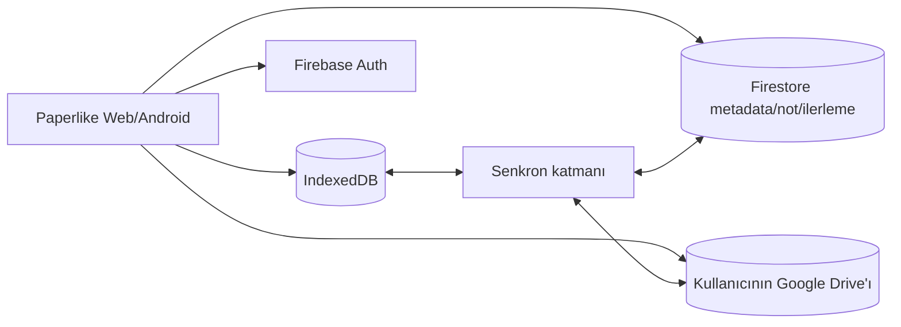

Plan:

- [x] Firebase Console'da Google ve e-posta/şifre Authentication sağlayıcıları.
- [x] Firebase Web SDK ve Capacitor Firebase Authentication bağımlılıklarını ekleme.
- [x] Ortam değişkeni yokken güvenli çalışan lazy Firebase/Firestore temelini
  oluşturma.
- [x] Google/e-posta auth komutları ve auth-state listener içeren `useAuthStore`
  temelini oluşturma.
- [x] Auth listener cleanup'ını yöneten `AuthHandler` bileşenini oluşturma.
- [x] `AuthHandler` bileşenini root layout'a bağlama.
- [x] Firestore'u başlangıçtan itibaren production mode ile açma (`europe-west3`,
  Standard edition); herkese açık test kuralları kullanılmadı.
- [x] Firestore güvenlik kuralı **yazıldı** (`firestore.rules` — kullanıcı
  yalnızca kendi `users/{uid}` ağacını okuyup yazabiliyor), ama henüz
  **deploy edilmedi**: repodaki dosya, Firebase Console'un "Rules" sekmesine
  elle yapıştırılmadan ya da `firebase deploy --only firestore:rules` ile
  gönderilmeden veritabanı hâlâ tamamen kapalı kalır (`if false`).
- [ ] OAuth consent screen'in `drive.file` izni için tamamlanması ve gizlilik
  politikası (public-facing proje adı ve destek e-postası ayarlandı, Drive
  scope'u Faz F'in Drive adımına ertelendi).
- [x] Ortak giriş/kayıt/parola sıfırlama ekranı, hata durumları ve misafir
  devam akışı (`AccountDialog`/`AccountButton`) — telefonda uçtan uca test
  edilmedi.
- [x] Misafir modundan opsiyonel hesaba geçiş (kütüphane başlığındaki hesap
  butonu, zorunlu login duvarı yok).
- [x] Uygulama içi hesap silme: Google/e-posta yeniden doğrulaması; başlamış
  senkronu drain edip yenisini engelleyen bariyer; kitapların
  `highlights`/`bookmarks` alt koleksiyonları, `settings` ve kullanıcı kökü;
  erişilebilir tüm Drive `Paperlike` klasörleri; en son Firebase Auth silme.
  Yerel IndexedDB ayrı opt-in seçimidir ve kısmi başarısızlık ayrı bildirilir.
- [ ] Play hesap silme yayın kapısı: gerçek Firebase/Drive hesabıyla Android ve
  web E2E, public deletion URL, retention/telemetry kapsamı ve operasyon kanıtı.
- [x] Firestore şeması ve **tek yönlü (cihaz → bulut) push** uygulandı ve
  **uçtan uca doğrulandı**: `lib/cloud-sync.ts` → `pushLibrarySnapshot(uid)`,
  `users/{uid}/books/{bookId}` (metadata + progress birleşik),
  `.../books/{bookId}/highlights/{id}`, `.../books/{bookId}/bookmarks/{id}`,
  `users/{uid}/settings/reader`. `firestore.rules` yayınlandı (Console →
  Rules). Google hesabıyla gerçek cihazda giriş yapılıp Firestore Data
  sekmesinde veri geldiği doğrulandı.
  - Yol boyunca iki ayrı kök neden bulunup düzeltildi: (1)
    `@capacitor-firebase/authentication` Android'de kullanıcıyı yalnızca
    **native** tarafta oturum açıyor — Firestore'un kullandığı JS SDK'nın
    Auth'u bundan habersiz kalıyordu (`request.auth` boş → kurallar
    reddediyordu). Çözüm: native girişten sonra JS SDK'yı da aynı kimlik
    bilgisiyle (`signInWithCredential`, Google için idToken/e-posta-şifre
    için `EmailAuthProvider.credential`) senkron imzalamak
    (`lib/firebase.ts#getFirebaseAuth`, native'de `indexedDBLocalPersistence`
    ile). (2) İlk push denemesi `authStateChange` listener'ından
    tetikleniyordu — bu, native oturum açılır açılmaz ateşlenip JS köprüleme
    bitmeden Firestore'a yazmaya çalışıyordu (yarış durumu). Çözüm: push'u
    listener'dan kaldırıp doğrudan `signInWithGoogle`/`signInWithEmail`/
    `createAccountWithEmail` içine, JS köprüleme kesin bittikten *sonra*
    taşımak.
- [x] Bunun **karşı yönü** (Firestore → cihaz **pull**) uygulandı:
  `lib/cloud-sync.ts#pullLibrarySnapshot(uid)`, `pushLibrarySnapshot`'tan hemen
  sonra (`store/useAuthStore.ts#syncLibrary`) her giriş/sign-up/oturum
  restore'unda tetikleniyor. Kitap/ilerleme/highlight için `updatedAt` bazlı
  son-yazan-kazanır (yerelde bu alan bugüne kadar yoktu — `Book`/`Highlight`
  tiplerine eklendi, her yazımda damgalanıyor); bookmark'lar değişmez
  olduğundan sadece "yerelde yoksa ekle" ile taşınıyor. Ayarlar koşulsuz
  üzerine yazılıyor (push zaten aynı şekilde tam-anlık-görüntü). Pull
  metadata-only — kitabın dosyası Drive'dan **yalnızca okuyucu ilk açıldığında**
  indiriliyor (bkz. aşağıdaki "Yerelde olmayan kitabı indirme" maddesi).
  Silme uzlaşması ayrıca uygulandı: `users/{uid}/tombstones/{id}` canlı
  kayıtlardan önce çekiliyor; daha yeni kitap/vurgu/yer imi tombstone'u eski
  yerel kaydı sessiz yerel helper'larla kaldırıyor, Firestore alt ağacını
  prune ediyor ve kitap tombstone'u başarısız Drive silmesi için `driveFileId`
  taşıyor. İkinci cihazın eski üç kayıt türünü geri getiremediği emülatörde
  doğrulandı. Ack/TTL, genel outbox ve saat sapması hâlâ RM-F kapsamındadır.
- [x] **Her mutasyon noktasına bağlandı**: `lib/storage.ts`'teki
  `addBook`/`updateBook`/`deleteBook`/`setProgress`/`addHighlight`/
  `updateHighlight`/`deleteHighlight`/`addBookmark`/`deleteBookmark`
  fonksiyonlarının hepsi, yerel IndexedDB yazması bittikten sonra
  `lib/cloud-sync.ts`'teki ilgili `push*`/`delete*Remote` fonksiyonunu arka
  planda (`void import("./cloud-sync").then(...).catch(console.error)`)
  çağırıyor — dairesel import'tan kaçınmak için dinamik import kullanıldı.
  Ayarlar için `AuthHandler.tsx`, `useSettingsStore`'u 800ms debounce ile
  dinleyip `pushSettingsSnapshot()` çağırıyor (slider sürüklerken her tik'te
  yazma olmasın diye). Hepsi `currentUid()` üzerinden signed-out durumda
  sessizce no-op oluyor — misafir modu ve offline kullanım hiç etkilenmiyor.
  **Gerçek cihazda uçtan uca doğrulandı** (statik/temiz bir debug build ile —
  kitap ekleme, ilerleme, highlight ve ayar değişikliklerinin hepsi Firestore
  Console'da göründü). Doğrulama sırasında canlı-yeniden-yükleme (live-reload)
  dev sunucusuna özgü iki ayrı gürültü kaynağı da not edildi: (1) sık
  yeniden yüklemeler `useAuthStore`'un henüz `getCurrentUser()`'ı
  bitirmeden bir mutasyonun tetiklenmesine (push'un sessizce no-op olmasına)
  yol açabiliyor; (2) Fast Refresh, `lib/firebase.ts`'in modül state'ini
  sıfırlarken alttaki `FirebaseApp` hayatta kalabiliyor, bu da
  `initializeAuth()`'un ikinci kez çağrılıp hata fırlatmasına yol açabiliyordu
  — `getFirebaseAuth()`'a bu durumda `getAuth()`'a düşen bir fallback eklendi.
  İkisi de yalnızca dev/live-reload ortamına özgü; gerçek/statik build'de
  gözlemlenmedi.
- [ ] Firestore offline persistence ile yerel yazma kuyruğunun birlikte çalışma
  modelini doğrulama.
- [x] **Drive uygulama klasörü ve dosya yükleme — uçtan uca doğrulandı**:
  `lib/drive-sync.ts`. İlk tasarımda `appDataFolder` (gizli alan) kullanılmıştı
  ama bu, `drive.file` scope'unun kapsamadığı ayrı bir izin (`drive.appdata`)
  gerektiriyordu — `403 insufficientScopes` ile ortaya çıktı (gerçek cihazda,
  DevTools Network sekmesinden görüldü). Düzeltme: dosyalar artık kullanıcının
  normal Drive'ında görünür bir **"Paperlike"** klasörüne yükleniyor
  (`getOrCreateAppFolder` — ilk kullanımda arayıp bulamazsa oluşturuyor, id'yi
  oturum boyunca önbelleğe alıyor), sadece `drive.file` scope'uyla çalışıyor.
  Google hesabıyla giriş sırasında `DRIVE_SIGNIN_SCOPES` isteniyor,
  `accessToken` `useAuthStore`'da önbelleğe alınıp süresi dolunca (~55dk)
  sessizce yenileniyor.
- [x] Hesaplı kullanıcı kitap eklediğinde upload arka planda yapılıyor
  (`lib/storage.ts#addBook` → dinamik import ile `syncBookFileToDrive`);
  misafir akışına dokunmuyor (Google access token yoksa no-op).
- [x] Firestore kitap kaydında Drive dosya kimliği (`driveFileId`) saklanıyor
  — gerçek cihazda Firestore Console'da doğrulandı. Kitap silindiğinde Drive
  dosyası da siliniyor (`deleteBookRemote` → `deleteBookFileFromDrive`).
- [x] Yerelde olmayan kitabı ihtiyaç anında Drive'dan indirme/cache'leme:
  `components/reader/useReaderBootstrap.ts`, okuyucu bir kitabı açtığında
  yerel dosya yoksa ve `book.driveFileId` varsa `downloadBookFileFromDrive`
  ile indirip `saveBookFile`'la önbelleğe alıyor (arada `downloadingFile`
  durumu/spinner'ı gösteriliyor); indirilen dosyadan kapak da best-effort
  yeniden çıkarılıp önbelleğe alınıyor.
- [x] Kota, izin iptali, eksik dosya ve yarım upload hata akışları:
  `lib/drive-sync.ts`'te `DriveSyncError` (quota/permission/not_found/network
  sınıflandırması, Google'ın hata gövdesinden okunuyor) ve geçici hatalarda
  tek seferlik retry içeren `driveRequest` sarmalayıcısı; `lib/cloud-sync.ts`
  bunu yakalayıp kullanıcıya toast gösteriyor (`drive.error*` i18n key'leri).
- [x] Kısmi/başarısız upload resume: `lib/drive-sync.ts#uploadBookFileToDrive`
  artık Drive'ın resumable-upload protokolünü kullanıyor; yarım kalan
  yükleme, IndexedDB'deki `driveUploadSessions` store'unda tutulan session
  bilgisiyle kaldığı yerden devam ediyor.
- [ ] Statik export mimarisinin Firebase/Drive istemci SDK'larıyla web üzerinde
  küçük bir PoC ile doğrulanması.
- [ ] Vercel veya eşdeğer statik hosting ve özel domain.
- [ ] Masaüstü ekran/mouse davranışları için web UX doğrulaması.
- [ ] Web, Android ve gelecekte iOS uyumu.
- [ ] **RM-F-01:** Silme tombstone'u ve kitap/progress/vurgu/yer imi/ayar/Drive
  upload için IndexedDB v6 coalesced outbox; transaction-safe completion,
  coarse hata kodu, bounded exponential backoff ve online/startup flush
  uygulandı. Hesap ekranı `idle/syncing/retrying/attention`, pending sayısı,
  coarse hata açıklaması ve manual retry gösterir. Terminal/dead-letter kararı,
  emulator restart koşusu ve gerçek kötü ağ kanıtını tamamlamak.
- [ ] **RM-F-02:** Firestore tombstone yolu, client/server delete zamanı ve
  Drive retry kimliği uygulandı; collection/document alan tipleri, conflict,
  ack/TTL, security rule beklentisi, Drive klasör/dosya adı ve dosya kimliği
  sözleşmesini bütünüyle sürümlemek.
- [ ] **RM-F-03:** Kullanıcı/kitap/değişiklik senaryolarına göre Firestore
  read-write, OAuth, Drive API kota ve beklenen operasyon maliyet modelini
  oluşturmak.
- [x] **RM-F-04 yaşam döngüsü:** Firestore/Drive saklama, export, silme,
  retention ve hesap kapatma açıkları veri yaşam döngüsü matrisine eklendi.
- [ ] **RM-F-04 tehdit/uygulama:** Hesap tasfiye istemcisi ile anonim/iki UID,
  deny-by-default ve tasfiye emülatör kanıtı tamamlandı; token sızıntısı/iptali,
  tombstone TTL/ack, public deletion yolu, retention ve gerçek servis kanıtlarını
  tamamlamak.
- [x] **RM-F-05 hedef/runbook:** Senkron kesintisi, çatışma, cihaz kaybı, eksik
  dosya ve uzak silme için geçici RPO/RTO hedefleri ve kurtarma yolları yazıldı.
- [ ] **RM-F-05 kanıt:** Kötü ağ, kuyruk kaybı, saat sapması, iki cihaz ve hesap
  kaybı senaryolarında hedefleri ölçmek; test panosuna kanıt bağlamak.

> **Açık kimlik sorusu:** E-posta/şifreyle giriş yapan kullanıcının Drive'a erişimi
> için ayrıca bir Google hesabı bağlama ve OAuth onayı gerekir. Hesap kimliği ile
> dosya deposu kimliğinin ayrıştığı bu senaryo, Drive fazının ana UX kararıdır.

Önceki ayrı bulut senkron yol haritasının bütün karar ve fazları bu bölüme
birleştirilmiştir.

### Faz G — iOS

Amaç: Ortak web kodunu koruyarak gerçek iOS uygulaması sunmak.

- [ ] Capacitor iOS projesi.
- [ ] Dosya import ve share extension/UTType davranışı.
- [ ] Safe-area ve gesture testleri.
- [ ] iOS TTS ve haptic uyarlaması.
- [ ] Bildirim izinleri ve background sınırlamaları.
- [ ] Android widget/shortcut özelliklerinin iOS karşılığı veya kontrollü farkı.
- [ ] App Store privacy manifest ve dağıtım süreci.
- [ ] iPhone/iPad test matrisi.

### Yol haritası bağımlılıkları

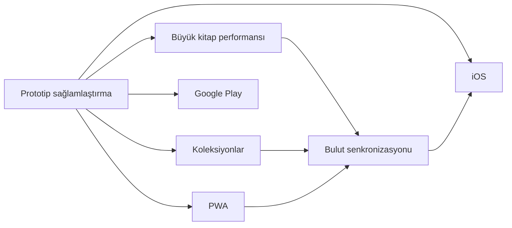

Bulut senkronizasyonundan önce veri modeli ve migration yaklaşımı
sağlamlaştırılmalıdır. Aksi hâlde sunucu modeli hızla yerel modelden ayrışır.

---

## 20. Yayın kapıları

Paperlike “Google Play'e hazır” sayılmadan önce en az:

- Sürümleme ve release signing çözülmüş olmalı.
- Gerçek release AAB CI üzerinden üretilebilmeli.
- Gizlilik politikası ve Data Safety beyanı tamamlanmalı.
- Kritik import/read/progress/backup akışları otomatik test edilmeli.
- Büyük dosya ve düşük bellek senaryoları için kabul kriterleri karşılanmalı.
- Biyometrik kod/bağımlılık kalıntılarının kaldırıldığı doğrulanmalı.
- Cleartext yalnız debug live-reload varyantında açık olmalı.
- Crashlytics release build'inde doğrulanmalı.
- Manuel cihaz matrisi tamamlanmalı.
- Backup/restore gerçek cihazda doğrulanmalı.
- Store update/rollback süreci yazılı olmalı.

Web/PWA “yayına hazır” sayılmadan önce:

- Kurulabilir manifest ve service worker olmalı.
- Ağ kesildiğinde app shell ve daha önce eklenmiş kitaplar açılmalı.
- Cache migration güvenli olmalı.
- Storage quota hatası kullanıcıya açıklanmalı.
- Web hata gözlemlenebilirliği olmalı.
- En az bir Chromium, Firefox ve Safari uyumluluk matrisi bulunmalı.

### 20.1 Operasyonel olay sınıfları

| Seviye | Örnek | İlk hedef |
|---|---|---|
| SEV-1 | Yaygın veri kaybı, kullanıcıların kitaplığa erişememesi, kritik güvenlik açığı | Dağıtımı durdur, kapsamı belirle, güvenli sürüm/özellik kapatma |
| SEV-2 | Çökme artışı, import/reader'ın önemli cihazlarda çalışmaması | Staged rollout'u durdur, tanıla, hotfix kararı |
| SEV-3 | Kısmi platform/özellik hatası, geçici servis kesintisi | Workaround yayınla, normal düzeltme planla |
| SEV-4 | Cila, düşük etkili UI veya dokümantasyon problemi | Backlog |

Her olayda zaman, sürüm, platform, dosya/cihaz sınıfı, yeniden üretme adımları ve
kullanıcı verisi riski kaydedilmelidir.

### 20.2 Hatalı Android sürümü runbook'u

1. Play Console rollout yüzdesini artırmayı durdur.
2. Crashlytics'te hatayı sürüm, Android API ve cihaz modeline göre ayır.
3. Veri migration'ı çalıştı mı ve geri uyumluluk var mı kontrol et.
4. Güvenli önceki binary'ye dönüş mümkün değilse daha yüksek `versionCode` ile
   hotfix hazırla.
5. Minimum kritik smoke: import, reader, progress, backup restore, cold/warm
   intent.
6. Internal/closed track üzerinde doğrula.
7. Küçük staged rollout ile yeniden başlat.
8. Olay ve alınan kararı changelog/issue kaydına ekle.

### 20.3 Hatalı web/PWA sürümü runbook'u

1. Yeni deploy'u durdur veya önceki doğrulanmış artifact'i yeniden production yap.
2. Service worker varsa eski/yeni cache uyumluluğunu incele.
3. IndexedDB migration'ın geri döndürülemez etkisini kontrol et.
4. Gerekirse yeni bir cache sürümüyle düzeltici deploy yap; kullanıcının yerel
   kitaplığını temizlemeyi varsayılan çözüm yapma.
5. Chromium, Firefox ve Safari smoke koş.
6. Offline app shell ve mevcut kitap açılışını ağ kapalı doğrula.

### 20.4 Crashlytics triage runbook'u

1. Crash-free session değişimini sürüm bazında kontrol et.
2. En sık stack trace'i cihaz/API/uygulama durumu ile grupla.
3. JS köprüsü hatası mı native crash mi ayır.
4. Mapping dosyasının yüklenmiş ve stack'in okunabilir olduğunu doğrula.
5. Raporda kitap metni/not gibi hassas payload olup olmadığını kontrol et.
6. Yeniden üretilebiliyorsa issue kimliği ve test fixture'ı oluştur.
7. Kritikse rollout'u durdur; değilse hedef sürüm ata.

### 20.5 Bozuk veri veya yedek runbook'u

1. Kullanıcıya mevcut uygulama verisini silmemesini söyle.
2. Orijinal ZIP'i değiştirmeden kopyasını al; mümkünse checksum kaydet.
3. Manifest varlığı, JSON geçerliliği, `formatVersion`, kitap dosyaları ve metadata
   ilişkilerini salt-okunur incele.
4. Import'u temiz test profili/veritabanında yeniden üret.
5. Kısmi kurtarma gerekiyorsa yeni bir araç/işlemle çıktı üret; orijinali
   overwrite etme.
6. Sorunun export mu import mu migration mı olduğunu ayır.
7. Hassas içerikli yedeği issue tracker veya log sistemine yükleme.
8. Düzeltmeden sonra alan alan round-trip karşılaştırması yap.

### 20.6 Firebase/Drive kesintisi runbook'u

Bu akış senkronizasyon özelliği uygulanınca geçerli olacaktır:

1. Yerel IndexedDB okuma/yazmayı açık tut.
2. Kullanıcıya kitaplarının yerelde güvende olduğunu ve senkronun beklediğini
   bildir.
3. Başarısız işlemleri idempotent kuyruğa al; sonsuz hızlı retry yapma.
4. Auth, Firestore ve Drive durumlarını ayrı teşhis et.
5. OAuth izni iptal edilmişse genel ağ hatası yerine yeniden bağlama akışı sun.
6. Çatışma çözmeden önce iki kopyayı da koru.
7. Servis döndüğünde backlog, gecikme ve başarısız kalıcı işlemleri ölç.

### 20.7 Keystore güvenliği ve kayıp runbook'u

- Keystore oluşturulduğunda dosya, alias, oluşturma tarihi ve erişim sahipleri
  ayrı güvenli kayıtta tutulmalıdır.
- En az iki şifreli yedek farklı güvenli konumda olmalıdır.
- Parolalar keystore dosyasıyla aynı yerde düz metin saklanmamalıdır.
- CI erişimi minimum yetkiyle ve production environment approval ile
  sınırlandırılmalıdır.
- Şüpheli erişimde Play App Signing/anahtar yükseltme seçenekleri değerlendirilir.
- Keystore kaybı veya parola kaybında rastgele yeni anahtarla production güncelleme
  denenmemelidir; önce Play Console anahtar kurtarma/yükseltme süreci izlenmelidir.

### 20.8 Hesap ve veri silme runbook'u

Uygulanan istemci akışı `lib/account-deletion.ts` tarafından şu sırayla yürütülür:

1. UI iki aşamalı geri döndürülemez işlem onayı alır. Yerel IndexedDB temizliği
   uzak veri silmeden ayrı, varsayılanı kapalı bir seçimdir.
2. Google kullanıcı tekrar hesap seçerek ve alınan ID token ile
   `reauthenticateWithCredential`; e-posta kullanıcısı mevcut parola ile
   `EmailAuthProvider.credential` üzerinden yeniden doğrulanır. Dönen UID aktif
   UID ile eşleşmezse veri silinmez.
3. `pauseSyncForAccountDeletion(uid)` yeni sync işini reddeder ve başlamış
   işlemleri settle olana kadar bekler. Auth silinmeden hata olursa bariyer
   kaldırılır ve aynı hesapla retry mümkündür.
4. `users/{uid}/books` listelenir; her kitap için `highlights` ve `bookmarks`
   alt koleksiyonları batch'lerle silinir. Ardından kitaplar, bütün `settings`
   ve `tombstones` belgeleri ile varsa `users/{uid}` kök belgesi silinir.
   Olmayan belge başarıdır; adım tekrar çalıştırılabilir.
5. Google hesapta `drive.file` ile erişilebilen bütün görünür `Paperlike`
   klasörleri silinir; klasör silme içeriğini de kaldırır. 404 başarı, diğer
   hatalar mevcut `DriveSyncError` sınıflandırmasıyla korunur. E-posta-only
   hesapta Drive adımı uygulanamaz ve no-op'tur.
6. Önceki uzak adımlar tamamlanmadan Auth silinmez. Firebase JS
   `deleteUser(currentUser)` başarılı olduktan sonra native/JS oturumları
   best-effort temizlenir; UI ancak bu noktadan sonra uzak hesabı silinmiş sayar.
7. Kullanıcı ayrıca seçtiyse sekiz IndexedDB store'u temizlenir, kapak cache'i
   sıfırlanır ve kitaplık misafir durumunda yenilenir. Bu adım Auth'tan sonra
   başarısız olursa sonuç “uzak silindi, yerel kaldı” olarak gösterilir.
8. `AccountDeletionError.stage` yeniden doğrulama, Firestore, Drive veya Auth
   kırılmasını ayırır. UI kalan kapsamı açıkça söyler; uçtan uca uzak zincir
   tamamlanmadan genel “hesap silindi” mesajı göstermez.

Production yayın kapısı için ayrıca gerçek Google ve e-posta hesaplarında web +
Android E2E kaydı, public hesap silme URL'si, aktif/backup retention onayı ve
diagnostik veri tasfiye sözleşmesi gerekir. Operasyon kaydı kitap/not içeriği,
token, e-posta veya dosya adı taşımamalıdır.

### 20.9 Operasyon kanıtı şablonu

Her olay veya yayın doğrulamasında:

```text
Olay/Yayın ID:
Tarih-saat ve saat dilimi:
Uygulama sürümü / versionCode:
Commit:
Platform / OS / cihaz:
Dosya ve kitaplık sınıfı:
Etkilenen PR/NFR/ISS kimlikleri:
Yeniden üretme:
Kullanıcı verisi etkisi:
Alınan aksiyon:
Doğrulanan testler:
Sonuç ve takip işi:
```

---

## 21. AI ajanları ve yeni geliştiriciler için çalışma protokolü

### 21.1 İşe başlamadan önce

1. Kök `AGENTS.md` dosyasını oku.
2. Bu belgeyi oku.
3. Görevle ilgili mevcut checklist ve yol haritasını kontrol et.
4. `git status --short` ile kullanıcıya ait devam eden değişiklikleri belirle.
5. Next.js kodu değişecekse bu projede kurulu sürümün
   `node_modules/next/dist/docs/` dokümanını oku.
6. Graphify grafiğinin güncelliğini kontrol et:

```text
graphify check-update .
```

7. Tüm repoyu okumak yerine önce Graphify ile ilgili alt grafiği sorgula:

```text
graphify query "<soru>" --budget 2000
graphify explain "<sembol>"
graphify path "<kaynak>" "<hedef>"
```

Graphify sorgusu Windows konsol encoding sorunu verirse UTF-8 Python çıktısı
etkinleştirilmelidir.

### 21.2 Graphify güncelliği

Depoda şu hook'lar kuruludur:

- `post-commit`
- `post-checkout`

Manuel güncelleme:

```text
graphify update .
```

Grafik 5.000 node sınırını geçtiği için `graph.html` üretilmeyebilir. Kaynak
gerçekliği `graphify-out/graph.json`, `GRAPH_REPORT.md` ve `manifest.json`
üzerinden değerlendirilmelidir. `graphify-out/` git tarafından izlenmez.

### 21.3 Kaynak gerçekliği sırası

Çelişki halinde:

1. Çalışan kod ve test.
2. Güncel kullanıcı kararı.
3. Bu belge.
4. `README.md`, `AGENTS.md` ve alanı yöneten güncel yapılandırma.
5. Eski Git geçmişi veya güncelliği doğrulanmamış kod yorumları.

Belge-kod çelişkisi bulunduğunda sessizce varsayım yapılmamalı; karar önemliyse
kullanıcıya sorulmalı, kesin teknik durumsa belge düzeltilmelidir.

### 21.4 Değişiklik yaparken korunacak sınırlar

- Kullanıcıya ait dirty worktree değişiklikleri korunmalıdır.
- EPUB ve PDF davranışı ortak `ReaderSurfaceHandle` sözleşmesi üzerinden
  geliştirilmelidir.
- Native-only davranış için web fallback/no-op tanımlanmalıdır.
- Kullanıcı metni iki i18n sözlüğüne de eklenmelidir.
- IndexedDB şema değişikliği migration olmadan yapılmamalıdır.
- Veri modeli değişirse backup formatı değerlendirilmelidir.
- Kitap silme cascade davranışı korunmalıdır.
- Hassas kitap/not içeriği loglanmamalıdır.
- Ağ gerektiren bir özellik offline-first varsayımını sessizce bozmamalıdır.
- Mobil dokunma davranışı klavye ve erişilebilirlik davranışını bozmamalıdır.

### 21.5 Görev sonrası kontrol

- Lint/type-check/build riskle orantılı çalıştırıldı mı?
- Web ve Android farkları değerlendirildi mi?
- Yeni kullanıcı metinleri çevrildi mi?
- Manuel test listesine madde gerekiyor mu?
- Veri migration'ı ve backup uyumu kontrol edildi mi?
- Bu belge/yol haritası güncellenmeli mi?
- Graphify grafiği güncellendi mi?
- Kullanıcıya hangi dosyaların değiştiği ve neyin doğrulandığı açıklandı mı?

---

## 22. Dokümantasyon yönetimi

### 22.1 Ana belgeler

| Belge | Amaç | Güncellik durumu |
|---|---|---|
| `PROJECT_DOCUMENTATION.md` | Ana ürün ve teknik kaynak | Ana kaynak |
| `README.md` | Kısa proje vitrini ve ana belgeye yönlendirme | Güncel |
| `AGENTS.md` | Ajan çalışma kuralları | Bağlayıcı |
| `CLAUDE.md` | Claude araçlarının `AGENTS.md` kurallarını yüklemesi | Bağlayıcı yönlendirme |

Önceden ayrı tutulan `TODO`, mobil UX, manuel test, animasyon ve bulut
senkronizasyonu belgeleri bu dosyaya birleştirilmiş ve yinelenen kaynak
oluşturmamaları için kaldırılmıştır. Tarihsel tracked sürümleri Git geçmişinden
incelenebilir.

### 22.2 Güncelleme kuralı

Şu değişikliklerde bu belge güncellenmelidir:

- Yeni kullanıcı özelliği.
- Yeni route, store, IndexedDB store veya native plugin.
- Platform desteği değişikliği.
- Veri saklama veya gizlilik davranışı değişikliği.
- Backup format sürümü değişikliği.
- Bir roadmap maddesinin başlaması/tamamlanması/iptali.
- Build, test veya dağıtım süreci değişikliği.
- Bilinen sınırlamanın giderilmesi veya yeni sınırlama.

### 22.3 Durum dili

- **Mevcut:** Kodda ve mümkünse testte var.
- **Kısmi:** Bazı platform/biçimlerde var.
- **Deneysel:** Çalışıyor fakat güvenilirlik taahhüdü yok.
- **Planlı:** Onaylı yol haritasında.
- **Değerlendirilecek:** Karar verilmemiş.
- **İptal:** Bilinçli olarak yapılmayacak veya geri alındı.

Planlı bir özellik mevcutmuş gibi yazılmamalıdır.

### 22.4 Sahiplik ve gözden geçirme sıklığı

- Ana sorumlu: Proje sahibi veya açıkça atanmış aktif maintainer.
- AI ajanları belgeyi değiştirebilir fakat ürün kararını kendi başına “kabul
  edildi” durumuna getiremez.
- Her feature/fix sonunda etkilenen bölüm kontrol edilir.
- Her release adayında belgenin tamamı branch/commit ve yayın kapıları açısından
  gözden geçirilir.
- En az ayda bir aktif geliştirme döneminde issue register, yol haritası ve hazır
  olma tahminleri yeniden değerlendirilmelidir.
- Üç ay geliştirme yapılmadıysa tarih otomatik olarak “güncel” anlamına gelmez;
  bir sonraki çalışmada yeniden doğrulama gerekir.

### 22.5 Kimlik ve izlenebilirlik kuralları

| Kimlik | Amaç | Örnek |
|---|---|---|
| `PR-xxx` | Kullanıcı/ürün gereksinimi | `PR-008` backup |
| `NFR-xxx` | Ölçülebilir kalite gereksinimi | `NFR-007` backup doğruluğu |
| `ISS-xxx` | Bilinen sorun/teknik borç | `ISS-014` backup belleği |
| `ADR-xxx` | Mimari karar | `ADR-001` local-first |
| `UT/IT/E2E/PERF/SEC/MAN-*` | Test kanıtı | `IT-BACKUP-ROUNDTRIP-001` |

- Kimlikler yeniden kullanılmaz.
- Kaldırılan kayıt silinmez; `İptal`, `Çözüldü` veya `Yerine geçti` yapılır.
- Commit/PR açıklaması mümkünse ilgili kimlikleri taşır.
- Bir issue çözüldüğünde test kanıtı ve çözüm sürümü eklenir.
- Aynı karar farklı tablolarda tekrarlanıyorsa ana kimliğe referans verilir.

---

## 23. Önemli mimari karar kayıtları

### 23.1 ADR dizini

Buradaki tarih, kararın bu ana belgede kayıt altına alındığı tarihtir; özgün
kararın daha eski olabileceği durumlarda Git geçmişi ayrıca incelenmelidir.

| ADR | Durum | Kayıt tarihi | Yerine geçtiği karar | Yeniden değerlendirme tetikleyicisi |
|---|---|---|---|---|
| ADR-001 | Kabul edildi | 2026-07-30 | İlk yerel veri yaklaşımı | Senkron veya farklı storage motoru |
| ADR-002 | Kabul edildi | 2026-07-30 | Biçime özel bağımsız okuyucu ihtimali | Yeni kitap biçimi/reader motoru |
| ADR-003 | Kabul edildi | 2026-07-30 | Server runtime yaklaşımı yok | SSR/server özelliği zorunluluğu |
| ADR-004 | Kabul edildi | 2026-07-30 | Dağınık native çağrılar | iOS veya plugin mimarisi değişimi |
| ADR-005 | Kabul edildi — özellik iptal | 2026-07-30 | Aktif biyometrik kilit deneyi | Yeniden açılmayacak; yalnız kod temizliği |
| ADR-006 | Kabul edildi | 2026-07-30 | Android-first varsayımı | Ürün platform stratejisi değişirse |
| ADR-007 | Kabul edildi — temel kısmi | 2026-07-30 | Backend kararsızlığı | Senkron PoC/güvenlik incelemesi |

Durum değerleri: `Önerildi`, `Kabul edildi`, `Kabul edildi — uygulanmadı`,
`Yerine geçti`, `İptal`.

### 23.2 ADR kayıtları

#### ADR-001 — Yerel öncelikli veri

**Durum:** Kabul edildi.

**Kayıt tarihi:** 30 Temmuz 2026.

**Yerine geçtiği karar:** Yok; ilk kalıcılık kararı.

**Karar:** Kitap ve okuma verileri IndexedDB'de tutulur.

**Gerekçe:** Hesapsız kullanım, çevrimdışı okuma, gizlilik ve basit prototip
mimarisi.

**Sonuç:** Cihazlar arası senkronizasyon daha sonra ayrıca tasarlanmalıdır.

#### ADR-002 — Ortak okuyucu, ayrı yüzeyler

**Durum:** Kabul edildi.

**Kayıt tarihi:** 30 Temmuz 2026.

**Yerine geçtiği karar:** Biçimlerin tamamen bağımsız ekranlarda yönetilmesi
yaklaşımı kullanılmadı.

**Karar:** `ReaderView` ortak kabuk; EPUB ve PDF ayrı yüzeylerdir.

**Gerekçe:** Ortak toolbar/panel deneyimi korunurken biçime özgü motor
karmaşıklığı ayrıştırılır.

**Sonuç:** Yeni özellikler mümkün olduğunca `ReaderSurfaceHandle` üzerinden
eklenmelidir.

#### ADR-003 — Statik Next.js export + Capacitor

**Durum:** Kabul edildi.

**Kayıt tarihi:** 30 Temmuz 2026.

**Yerine geçtiği karar:** Çalışma zamanında zorunlu Next.js sunucusu yoktur.

**Karar:** Next.js sunucu runtime'ı yerine statik `out/` çıktısı Android'e
paketlenir.

**Gerekçe:** Tek web kod tabanı ve yerel veri modeli.

**Sonuç:** Server Actions ve çalışma zamanında Node sunucusu gerektiren özellikler
doğrudan kullanılamaz; backend ayrı servis olmalıdır.

#### ADR-004 — Native farkları ince wrapper'larda toplama

**Durum:** Kabul edildi.

**Kayıt tarihi:** 30 Temmuz 2026.

**Yerine geçtiği karar:** Bileşenlere dağılmış doğrudan plugin çağrıları tercih
edilmez.

**Karar:** Native çağrılar `lib/native-ui.ts` üzerinden yapılır.

**Gerekçe:** Web'in güvenli çalışmasını ve React katmanının sade kalmasını
sağlamak.

#### ADR-005 — Biyometrik kilidi iptal etme

**Durum:** Kabul edildi; özellik iptal.

**Kayıt tarihi:** 30 Temmuz 2026.

**Yerine geçtiği karar:** Aktif biyometrik kilit ve kaçış yolu deneyi.

**Karar:** Güvenilir olmayan biyometrik kapı kullanıcı arayüzünden kaldırıldı.

**Gerekçe:** Kullanıcıyı kendi kitaplığına erişemeyecek şekilde kilitleme riski.

**Sonuç:** Özellik yeniden planlanmamıştır.

#### ADR-006 — Android ve web eşit ürün önceliği

**Durum:** Kabul edildi.

**Kayıt tarihi:** 30 Temmuz 2026.

**Yerine geçtiği karar:** Web'in yalnız Android geliştirme kabuğu olduğu varsayımı.

**Karar:** Yeni özellikler iki platformda birlikte değerlendirilir.

**Gerekçe:** Web yalnızca Android geliştirme kabuğu değildir; bağımsız ürün
hedefidir.

**Sonuç:** Native'e özgü özelliklerin web karşılığı, fallback'i veya açık
platform farkı belgelenmelidir.

#### ADR-007 — Opsiyonel Firebase + Google Drive senkronu

**Durum:** Kabul edildi; Firebase/Firestore ve auth store temeli kısmi,
kullanıcıya açık senkron henüz uygulanmadı.

**Kayıt tarihi:** 30 Temmuz 2026.

**Yerine geçtiği karar:** Belirsiz backend ve uygulama tarafından barındırılan
kitap dosyası seçenekleri.

**Karar:** Hesap ve küçük veriler Firebase Auth/Firestore, kullanıcıya ait kitap
dosyaları kullanıcının Google Drive alanı üzerinden senkronlanacaktır.

**Gerekçe:** Ortak web istemcisini korumak, uygulamanın dosya depolama maliyetini
ve telif riskini azaltmak, kitapların kullanıcı kontrolündeki depoda kalmasını
sağlamak.

**Sonuç:** Misafir modu ve IndexedDB yerel katmanı korunur. E-posta/şifre
kullanıcısı Drive için ayrıca Google hesabı bağlamak zorunda kalabilir. Güvenlik
kuralları, OAuth izinleri, hesap silme ve çatışma çözümü ürünün temel parçaları
olur.

### 23.3 Yeni ADR oluşturma ve değiştirme

- Yeni mimari karar bir sonraki monoton `ADR-xxx` kimliğini alır.
- Karar, gerekçe, sonuç, durum, kayıt tarihi, alternatifler ve yeniden
  değerlendirme tetikleyicisi yazılır.
- Kabul edilmiş ADR sessizce yeniden yazılmaz. Karar değişirse yeni ADR eskisini
  “Yerine geçti” durumuna getirir.
- Uygulanmamış karar ile çalışan mimari açıkça ayrılır.
- İptal kararları geçmiş bağlam kaybolmasın diye silinmez.

---

## 24. Terimler

| Terim | Açıklama |
|---|---|
| CFI | EPUB içindeki kararlı konumu temsil eden Canonical Fragment Identifier |
| Reader surface | EPUB/PDF rendering motorunu ortak okuyucuya bağlayan bileşen |
| App shell | İçerikten bağımsız temel web uygulaması arayüzü |
| Static export | Next.js çıktısının sunucusuz statik dosyalar olarak üretilmesi |
| Capacitor | Web uygulamasını native kabuk ve pluginlerle paketleyen köprü |
| IndexedDB | Tarayıcı/WebView içinde Blob ve yapısal veri saklayabilen yerel DB |
| PWA | Kurulabilir, service worker destekli web uygulaması |
| Lazy import | Ağır kodu yalnızca ihtiyaç anında yükleme |
| Intent | Android uygulamaları arası eylem/veri iletişimi |
| AppWidget | Android ana ekran widget altyapısı |
| Streak | Ardışık okuma günlerinin sayısı |
| Local-first | Ana verinin önce cihazda çalıştığı ürün yaklaşımı |

---

## 25. Hızlı yönlendirme

Bir geliştirici veya ajan:

- Kütüphane davranışı için `components/library/LibraryView.tsx` ile başlamalıdır.
- Okuyucu orkestrasyonu için `components/reader/ReaderView.tsx` okumalıdır.
- EPUB/PDF farkları için ilgili `*ReaderSurface.tsx` dosyasına gitmelidir.
- Veri için önce `lib/types.ts`, sonra `lib/storage.ts` okumalıdır.
- Import için `lib/import-book.ts` ve biçim loader'larını izlemelidir.
- Native davranış için önce `lib/native-ui.ts`, sonra eşleşen Java pluginini
  okumalıdır.
- Persist edilen tercih için ilgili `store/` dosyasını bulmalıdır.
- Çeviri için `lib/i18n/tr.ts` ve `en.ts` dosyalarını birlikte değiştirmelidir.
- Yayın riski için bu belgenin “Yayın kapıları” bölümünü kontrol etmelidir.

Bu belgenin amacı bütün kodun yerine geçmek değil; doğru kod alanına hızlı ve
güvenli biçimde ulaşmayı sağlamaktır.

---

## 26. Belge değişiklik geçmişi

| Belge sürümü | Tarih | Baz commit/çalışma ağacı | Değişiklik |
|---|---|---|---|
| `1.0` | 2026-07-30 | `2a8a188` + çalışma ağacı | Ürün, mimari, veri, süreç, yol haritası ve eski Markdown belgeleri tek ana kaynakta birleştirildi; README sadeleştirildi. |
| `1.1` | 2026-07-30 | `2a8a188` + çalışma ağacı | İçindekiler, durum paneli, doğrulama metadata'sı, PR/NFR katalogları, destek/kapasite matrisi, issue register, env-secret politikası, sürümleme, migration, test izlenebilirliği, operasyon runbook'ları ve ADR metadata'sı eklendi; çalışma ağacındaki kısmi Firebase/auth temeli kaydedildi. |
| `1.2` | 2026-07-30 | `2a8a188` + çalışma ağacı | Benchmark sonuçları, test panosu, risk/threat/data-lifecycle kayıtları, reader/sync state machine'leri, Firestore/Drive sözleşmesi, ekran haritası, görsel referanslar, erişilebilirlik, bağımlılık politikası, maliyet/kota ve RPO/RTO işleri sahip/efor bilgileriyle roadmap fazlarına eklendi. |
| `1.3` | 2026-07-30 | `2a8a188` + çalışma ağacı | README ana belgeye göre genişletildi; RM-A-05 reader yaşam döngüsü, UI/TTS alt durumları, yan etkiler ve değişmezlerle modellendi; sonsuz loading boşluğu ISS-016/RM-A-11 olarak kaydedildi. |
| `1.4` | 2026-07-30 | `2a8a188` + çalışma ağacı | RM-A-11 tamamlandı: reader bootstrap beş açık duruma ayrıldı; eksik dosya ve storage hataları için yerelleştirilmiş sonlu hata ekranları eklendi; ISS-016 çözüldü olarak güncellendi. |
| `1.5` | 2026-07-30 | `05cda45` + çalışma ağacı | Vitest/jsdom test altyapısı, 6 senaryolu IT-READER-LOAD-001, `npm run check`, Web Quality CI ve ilk doğrulanmış test sonuç panosu eklendi; RM-A-01 devam ediyor durumuna alındı; production audit bulguları ISS-017 olarak kaydedildi. |
| `1.6` | 2026-07-30 | `05cda45` + çalışma ağacı | IndexedDB, backup, import, EPUB ve i18n testleri; Playwright reader E2E; PWA manifest/service worker/offline testi; Web Quality E2E kapısı ve bağımlılık güvenlik azaltımları eklendi. RM-A-01 tamamlandı, ISS-007 uygulandı, ISS-017 kısmen azaltıldı. |
| `1.7` | 2026-07-30 | `05cda45` + çalışma ağacı | Büyük kitap performansı ilk dilimi tamamlandı: sürekli PDF canvas/text layer lazy rendering, yakın sayfalarla sınırlı scroll ölçümü, açık PDF belgesini yeniden kullanma, EPUB konum üretimini erteleme/seyrekleştirme ve 120 sayfalık Chromium regresyonu eklendi. Test panosu 21 Vitest + 3 Playwright olarak güncellendi; gerçek cihaz benchmark'ı açık bırakıldı. |
| `1.8` | 2026-07-30 | `05cda45` + çalışma ağacı | Büyük kitap araması 250 ms debounce, yeni sorgu/panel kapanışında iptal, bölüm/sayfa ilerlemesi, dört birimde bir event-loop yield ve 50 sonuç sınırıyla yenilendi. EPUB unload ve PDF belge yeniden kullanımı regresyonları ile 120 sayfalık gerçek Chromium araması doğrulandı; pano 29 Vitest + 3 Playwright oldu. |
| `1.9` | 2026-07-30 | `05cda45` + çalışma ağacı | Backup/restore performans ve güvenlik dilimi tamamlandı: tarayıcı Blob girdisi, EPUB/PDF `STORE`, streamFiles, aşama ilerlemesi, UI iptali, CRC/manifest/metadata/zorunlu dosya ön doğrulaması ve kısmi arşiv koruması eklendi. 3 MiB çok-kitaplı round-trip dahil pano 35 Vitest + 3 Playwright oldu; JSZip nihai çıktı belleği ve gerçek cihaz baseline'ı açık bırakıldı. |
| `1.10` | 2026-07-30 | `05cda45` + çalışma ağacı | Kapak performans dilimi tamamlandı: 300 px viewport lazy loading, 384×576 thumbnail, 96 kayıt/32 MiB bounded LRU, eşzamanlı IndexedDB/URL dedupe, lease tabanlı revoke, raf rengi reuse ve silme/restore invalidation eklendi. 200 kitaplık fixture ve viewport testiyle pano 43 Vitest + 3 Playwright oldu. |
| `1.11` | 2026-07-30 | `78d2e68` + çalışma ağacı | Küçük/orta/büyük deterministik EPUB/PDF profilleri, temiz context üzerinde UI tabanlı import/ilk sayfa/sayfa geçişi/arama/backup/restore/kapak ölçümleri, ortak web-Android JSON şeması, Markdown özet, yapısal ve süre bütçeleri ile CI artifact'i eklendi. Faz B fixture, web ölçüm ve CI kanıt işleri tamamlandı; Android cihaz belleği/frame baseline'ı açık bırakıldı. Graphify 26.223 node/63.160 edge/639 community ile yenilendi. |
| `1.12` | 2026-07-31 | `797a2e5` + çalışma ağacı | Release-derived ve profileable Android Macrobenchmark modülü; soğuk startup ile ACTION_VIEW üzerinden 120 sayfalık PDF reader frame/maksimum bellek senaryoları; AndroidX ham sonucu ortak şemaya dönüştüren testli raporlayıcı; tek komutlu çalıştırıcı ve fiziksel self-hosted cihaz workflow'u eklendi. Modül APK derlemesi doğrulandı; kabul edilmiş Android baseline'ı açık bırakıldı. |
| `1.13` | 2026-07-31 | `797a2e5` + çalışma ağacı | Fiziksel benchmark kişisel uygulama/veri kaybını önlemek için açık dedicated-device iznine bağlandı ve baseline ayrı cihaz bulunana kadar ertelendi. Production cleartext kapatıldı; debug live-reload istisnası ayrıldı. Android `versionName` paket sürümüne bağlandı. Pasif biyometrik bileşen/store/plugin kaldırıldı. Belge dili TR/EN seçimiyle senkronlandı. PWA cache v2, waiting worker bildirimi ve kullanıcı onaylı güncelleme akışı eklendi. |
| `1.14` | 2026-07-31 | `797a2e5` + çalışma ağacı | PWA install prompt ve iOS/tarayıcı kurulum yönlendirmesi; kota/doluluk paneli; kalıcı depolama isteği; düşük alan uyarısı ve kitap içe aktarma öncesi güvenli alan kontrolü eklendi. 53 Vitest ve 4 Chromium E2E senaryosu geçti; Faz C install/storage maddeleri tamamlandı. Graphify 28.510 node/71.056 edge/771 community ile yenilendi. |
| `1.15` | 2026-07-31 | `797a2e5` + çalışma ağacı | PWA lifecycle saf state machine'e taşındı; staging cache iki aşamalı doğrulama, başarısız aday temizliği, eski cache'i aktivasyona kadar koruma, runtime cache hatasında ağ yanıtını koruma ve hata/retry UI'ı eklendi. 61 Vitest ve 5 Chromium E2E senaryosu geçti; şema sürümüne sabitlenmiş E2E fixture'ları güncel veritabanını açacak şekilde dayanıklılaştırıldı. Graphify 28.530 node/71.096 edge/790 community ile yenilendi. |
| `1.16` | 2026-07-31 | `797a2e5` + çalışma ağacı | Chromium/Firefox/WebKit/Pixel/iPhone beşli temel uyumluluk matrisi, 5 PWA durumunun masaüstü/mobil 10 görsel regresyonu, sürümlü PNG referansları ve ayrı CI rapor/artifact akışları eklendi. Core 5/5, compat 5/5 ve visual 10/10 geçti. Eşzamanlı sync değişikliklerinin bıraktığı 2 backup testi ve reader dependency type hatası ayrıca açık olarak kaydedildi. Graphify 28.569 node/71.173 edge/784 community ile yenilendi. |
| `1.17` | 2026-07-31 | `797a2e5` + çalışma ağacı | `@axe-core/playwright` ile WCAG A/AA taraması, dialog focus trap/geri dönüş, klavyeyle upload ve 320px reflow kapıları eklendi; muted açık tema rengi AA kontrastı için koyulaştırıldı. A11y 4/4 ve yenilenen visual 10/10 geçti. Type-check yeniden geçti; eşzamanlı sync değişikliğine ait 2 backup testi ISS-018 olarak açık kaldı. Graphify 28.579 node/71.182 edge/778 community ile yenilendi. |
| `1.18` | 2026-07-31 | `797a2e5` + çalışma ağacı | İki route, 18 ekran/katman, Android intent/shortcut girişleri, reader bootstrap hata yolları, panel kapanış önceliği ve navigasyon değişmezleri Mermaid akışı ve tabloyla modellendi; RM-A-06 tamamlandı. |
| `1.19` | 2026-07-31 | `797a2e5` + çalışma ağacı | Faz F Drive/Firestore dilimi tamamlandı: Firestore → cihaz pull-sync (`pullLibrarySnapshot`, `updatedAt` bazlı son-yazan-kazanır, ayarlar koşulsuz üzerine yazma; silme senkronu bilinçli olarak v1 dışı bırakıldı), okuyucuda kitap açılışında Drive'dan tembel dosya indirme + kapak yeniden çıkarma, Drive yükleme hatalarının `DriveSyncError` ile sınıflandırılıp toast'a bağlanması ve yarım kalan yüklemelerin resumable-upload protokolüyle devam ettirilmesi eklendi. |
| `1.20` | 2026-07-31 | `797a2e5` + çalışma ağacı | IndexedDB v4 ve resumable oturum store'u belgelendi; yerel/ZIP/Firestore/Drive/Crashlytics için veri yaşam döngüsü, silme-export-retention davranışı, geçici RPO/RTO hedefleri ve altı kurtarma runbook'u eklendi. RM-A-04 tamamlandı; RM-A-10, RM-F-04 ve RM-F-05 ölçüm/uygulama işleriyle ayrıştırıldı; tombstone ve hesap tasfiyesi ISS-019/ISS-020 olarak kaydedildi. Graphify 28.590 node/71.201 edge/776 community ile yenilendi. |
| `1.21` | 2026-07-31 | `797a2e5` + çalışma ağacı | Doğrudan production ve geliştirme paketleri ile Android/Gradle zinciri için amaç, sahip, kurulu sürüm, lisans, alternatif ve güncelleme ritmi envanteri eklendi. Kilit/pin/override kuralları, periyodik bakım, önem bazlı güvenlik SLA'sı ve sekiz major-upgrade kabul kapısıyla RM-A-09 tamamlandı. |
| `1.22` | 2026-07-31 | `797a2e5` + çalışma ağacı | Issue listesinden ayrı O×E risk yöntemi, artık risk hedefleri, sahip/tetikleyici/kontrol alanları ve 17 ürün-teknik-operasyon riski eklendi. Kritik/yüksek risk kabulü, yeniden puanlama, escalation ve kanıt kuralları tanımlanarak RM-A-02 tamamlandı. |
| `1.23` | 2026-07-31 | `797a2e5` + çalışma ağacı | Yerel/PWA/Android güven sınırları, yedi korunan varlık, altı aktör, 13 saldırı yüzeyi ve 18 STRIDE senaryosuyla tehdit modeli eklendi. Magic-byte/ZIP bütçesi, intent, EPUB, log redaction, web header, local data, backup, release ve cloud için 10 güvenlik kabul kimliği tanımlandı; ISS-021/022/023 açılıp RM-A-03 tamamlandı. |
| `1.24` | 2026-07-31 | `797a2e5` + çalışma ağacı | Güncel resmi Google Play/Firebase/Drive kaynaklarına bağlı veri işleme envanteri, muhafazakâr Data Safety aday cevapları, yayın politikası taslağı ve 10 maddelik yayın checklist'i eklendi. Hesap silme, Crashlytics/Analytics, Google Fonts, Auto Backup ve şifrelenmemiş export davranışı açıkça modellendi; kimlik/iletişim/hedef kitle/retention placeholder'ları yayın engeli bırakıldı. |
| `1.25` | 2026-07-31 | `797a2e5` + çalışma ağacı | Telefon yatay, tablet dikey/yatay ve foldable-benzeri dört Chromium profilinde kritik kütüphane kontrolleri, yatay taşma, dialog ve çalışma anı yön değişimi CI katmanı eklendi; production statik export üzerinde 8/8 geçti. ISS-011 ve RSK-010 web kanıtıyla azaltıldı; fiziksel hinge/posture/OEM doğrulaması açık bırakıldı. Graphify 28.625 node/71.242 edge/799 community ile yenilendi. |
| `1.26` | 2026-07-31 | `797a2e5` + çalışma ağacı | Parser öncesi PDF/ZIP signature ve 1 GiB kitap ceiling; backup restore için 4 GiB arşiv, 10.000 entry, 1 GiB entry, 8 GiB açılmış toplam, 32 MiB manifest, 500:1 oran ve manifest-gerçek entry boyutu preflight'ı eklendi. Güvenlik hedefli 23/23 ve tam `npm run check` 79/79 Vitest + 2/2 Node ile geçti; ISS-018 çözüldü, ISS-021 EPUB iç ZIP/Android pre-read için kısmi kaldı. |
| `1.27` | 2026-07-31 | `797a2e5` + çalışma ağacı | EPUB parser öncesine zorunlu `mimetype`, 10.000 entry, 512 MiB entry, 4 GiB açılmış toplam ve 500:1 oran bütçesi; Android VIEW/SEND akışına provider stat tabanlı base64 read-öncesi 1 GiB kontrol eklendi. Eksik mimetype ve sıkıştırma bombası testleriyle tam `npm run check` 81/81 + 2/2, production build ve core E2E 5/5 geçti; ISS-021 temel kapsamda çözüldü. |
| `1.28` | 2026-07-31 | `5279ac3` + çalışma ağacı | Crashlytics'e iletilen JS message/stack için URL, dosya/content URI, e-posta, bearer/JWT/Google tokenı, query secret, uzun secret ve tırnak içi kullanıcı metni redaction'ı; 512/4096 karakter limitleri eklendi. SEC-LOG-001 redaction 2/2 ve tam `npm run check` 83/83 + 2/2 geçti; consent/retention UX'i ISS-023 altında açık kaldı. Graphify 28.652 node/71.296 edge/804 community ile yenilendi. |
| `1.29` | 2026-07-31 | `5279ac3` + çalışma ağacı | ISS-020/RSK-014 istemci azaltımı uygulandı: iki aşamalı ve yerel veriden ayrı onay, Google/e-posta yeniden doğrulama, sync drain/blok bariyeri, Firestore alt koleksiyonlarını batch tasfiye, bütün erişilebilir Drive `Paperlike` klasörlerini silme, Auth-last sırası ve aşama bazlı kısmi sonuç eklendi. `SEC-ACCOUNT-DELETE-001` 5/5, `SEC-SYNC-PAUSE-001` 1/1 ve tam `npm run check` 91/91 Vitest + 2/2 Node geçti; gerçek servis E2E, public URL, retention/telemetry yayın kapısı açık kaldı. Graphify 28.702 node/71.402 edge/801 community ile yenilendi. |
| `1.30` | 2026-07-31 | `5279ac3` + çalışma ağacı | ISS-023 temel azaltımı tamamlandı: Crashlytics manifest default-off, cihaz-yerel açık opt-in/opt-out, JS handler gate, native collection override, opt-out'ta unsent-report silme ve 90 günlük retention/restart açıklaması eklendi. `SEC-LOG-001` toplam 7/7, tam `npm run check` 96/96 Vitest + 2/2 Node ve `:app:compileDebugJavaWithJavac` geçti; Firebase Analytics consent'i ve gerçek release cihazı ağ/Console kanıtı ayrı açık bırakıldı. Graphify 28.717 node/71.438 edge/788 community ile yenilendi. |
| `1.31` | 2026-07-31 | `5279ac3` + çalışma ağacı | Firestore Rules Unit Testing ve emülatör CI kapısı eklendi; anonim erişim reddi, sahip erişimi, iki UID izolasyonu, bilinmeyen üst koleksiyon reddi ve production hesap-tasfiye helper'ı 4/4 geçti. Tam kalite paketi 96/96 Vitest + 2/2 Node geçti; `RSK-005` 15'ten 10'a düşürüldü, gerçek token iptali/servis kanıtı açık bırakıldı. Dependency taraması production'da 2, geliştirme zinciri dahil 35 bulguyu kaydetti. Graphify 28.738 node/71.459 edge/805 community ile yenilendi. |
| `1.32` | 2026-07-31 | `76eb13c` + çalışma ağacı | ISS-019 temel azaltımı tamamlandı: IndexedDB v5 UID-scoped kitap/vurgu/yer imi tombstone'u, Firestore client/server silme zamanı, canlı kayıttan önce pull uzlaşması, alt koleksiyon prune'u ve Drive file ID retry eklendi. Eski ikinci-cihaz verisinin geri gelmediği Firestore emulatorunda 1/1, tombstone birim/kalıcılık sözleşmesi 4/4 ve tam kalite paketi 100/100 Vitest + 2/2 Node geçti; RSK-004 16'dan 8'e düşürüldü. Genel outbox/backoff, tombstone ack/TTL, saat sapması ve fiziksel iki-cihaz kanıtı açık bırakıldı. Graphify 28.768 node/71.551 edge/793 community ile yenilendi. |
| `1.33` | 2026-07-31 | `76eb13c` + çalışma ağacı | RM-F-01 dayanıklılık çekirdeği uygulandı: IndexedDB v6 UID-scoped/coalesced mutation outbox, en güncel yerel kaydı yeniden okuyan idempotent executor, eski isteğin yeni mutasyonu silemediği transaction-safe completion, coarse hata sınıfı, 2 sn→5 dk jitter'lı exponential backoff, online/startup force-flush ve hesap silmede sync-state temizliği eklendi. Hesap ekranına idle/syncing/retrying/attention, pending sayısı, güvenli hata açıklaması ve manual retry eklendi. `SYNC-OUTBOX-001` 4/4, `SYNC-STATUS-001` 2/2 ve tam kalite paketi 106/106 Vitest + 2/2 Node geçti; yeni Firestore restart emülatör testi araç kullanım limiti nedeniyle koşu bekliyor. RSK-013 12'den 8'e düşürüldü; dead-letter ve gerçek kötü ağ kanıtı açık. Graphify 28.805 node/71.681 edge/799 community ile yenilendi. |

### Changelog kuralı

- Yalnız yazım düzeltmesi olmayan her anlamlı belge değişikliği kayıt alır.
- Tarih ISO `YYYY-MM-DD` biçiminde yazılır.
- Commitlenmemiş çalışma ağacı kullanıldıysa açıkça belirtilir.
- Ürün kararının değişmesi ilgili `PR`, `NFR`, `ISS` veya `ADR` kimliğiyle
  ilişkilendirilir.
- Belge sürümü ürün sürümünden bağımsızdır.
- Eski kayıtlar yeniden yazılmaz; düzeltme yeni satır olarak eklenir.

Yeni kayıt şablonu:

```text
| `x.y` | YYYY-MM-DD | commit + çalışma ağacı durumu | Değişiklik özeti ve ilişkili kimlikler |
```
