# Paperlike — Ürün, Mimari ve Geliştirme Rehberi

> Bu belge Paperlike projesinin ürün vizyonu, mevcut yetenekleri, teknik mimarisi,
> veri akışları, bilinen sınırlamaları ve yol haritası için ana başvuru kaynağıdır.
> Hedef kitlesi projeyi sürdürecek geliştiriciler ve yapay zekâ ajanlarıdır.

## Belge durumu

| Alan | Değer |
|---|---|
| Ürün adı | Paperlike |
| Uygulama kimliği | `com.ysferencakir.paperlike` |
| Mevcut ürün aşaması | Prototip |
| Öncelikli platformlar | Android ve web — eşit öncelikli |
| Planlanan ek platform | iOS |
| Dağıtım hedefi | Google Play Store ve web/PWA |
| Desteklenen kitap biçimleri | EPUB ve PDF |
| Ana veri modeli | Yerel ve çevrimdışı öncelikli |
| Web paket sürümü | `0.1.0` |
| Android sürümü | `versionCode 1`, `versionName 1.0` |
| Lisans | MIT |
| Son kapsamlı güncelleme | 30 Temmuz 2026 |
| Belge sürümü | `1.10` |
| Belge durumu | Aktif ana kaynak |
| Belge sahibi | Proje sahibi/aktif maintainer |
| Son doğrulanan branch | `main` |
| Son doğrulanan baz commit | `05cda45460bc67e06dd5f8abb9e724ae3c1680bc` |
| Doğrulama kapsamı | Baz commit + 30 Temmuz 2026 tarihli commitlenmemiş çalışma ağacı |
| Kod grafiği | Graphify — güncel sayılar `graphify-out/GRAPH_REPORT.md` içinde |

> **Sürüm uyarısı:** `package.json` ile Android sürüm değerleri birbiriyle uyumlu
> değildir. İlk gerçek dağıtımdan önce tek bir sürümleme politikası belirlenmelidir.

### Belge doğrulama protokolü

Bu belge yalnızca “son güncelleme tarihi” ile güncel kabul edilmez. Teknik bir
değişiklikten sonra doğrulayan kişi veya ajan:

1. `git branch --show-current` ile branch'i doğrular.
2. `git rev-parse HEAD` ile baz commit'i kaydeder.
3. `git status --short` ile commitlenmemiş değişiklikleri kontrol eder.
4. `graphify check-update .` çalıştırır; gerekirse `graphify update . --force`
   ile grafiği yeniler.
5. Etkilenen özellik, veri modeli, test ve yol haritası bölümlerini günceller.
6. Aşağıdaki changelog'a kısa bir kayıt ekler.

Baz commit tek başına yeterli değildir: çalışma ağacı kirliyse belge, committen
sonraki dosya durumuna göre doğrulandığını açıkça söylemelidir.

---

## 0. Tek bakışta proje durumu

### 0.1 Durum özeti

| Alan | Durum | Açıklama |
|---|---|---|
| EPUB okuyucu çekirdeği | Mevcut | Okuma, TOC, arama, CFI, vurgu, not ve ayarlar |
| PDF okuyucu çekirdeği | Mevcut/kısmi | Okuma, arama, zoom ve not var; görsel vurgu overlay'i yok |
| Yerel veri ve backup | Mevcut/iyileştirilmiş | IndexedDB + ZIP; Blob/STORE optimizasyonu, ilerleme, iptal, CRC ve ön doğrulama var; gerçek cihaz tepe belleği ölçülmedi |
| Android sistem entegrasyonu | Mevcut | Intent, widget, shortcut, bildirim, TTS, immersive, Crashlytics |
| Web ürünü | Mevcut PWA prototipi | Statik export, manifest, service worker ve offline app shell var; web deploy/güncelleme UX'i eksik |
| Erişilebilirlik/i18n | Kısmi doğrulanmış | TR/EN ve TalkBack temeli var; tam otomasyon/matris yok |
| Otomatik test | Aktif temel | 43 Vitest testi, 3 Playwright E2E senaryosu ve web CI kalite kapısı var; kapsam genişletilmeli |
| Büyük kitap performansı | Kısmi | PDF lazy page rendering, belge yeniden kullanımı ve EPUB konum yoğunluğu politikası var; gerçek cihaz baseline'ı gerekli |
| Google Play yayını | Planlı | AAB, imzalama, mağaza süreci ve in-app update eksik |
| Bulut senkronizasyonu | Auth UI hazır, senkron yok | Firebase Console + giriş/kayıt ekranı tamam; Firestore kuralları, gerçek veri senkronu ve Drive yok |
| Koleksiyonlar/etiketler | Planlı | Bugün yalnızca tek serbest metin kategorisi var |
| iOS | Planlı | `ios/` projesi henüz yok |

### 0.2 Yaklaşık hazır olma görünümü

Bu yüzdeler ölçülmüş KPI değil, planlama amacıyla kullanılan yaklaşık kapsam
tahminidir. Her sürüm planında test kanıtlarıyla yeniden değerlendirilmelidir.

| Alan | Yaklaşık hazır olma | Güven |
|---|---:|---|
| Temel EPUB/PDF okuma deneyimi | %85 | Orta |
| Android uygulama deneyimi | %80 | Orta |
| Yerel veri güvenilirliği | %70 | Orta |
| Bağımsız web ürünü | %55 | Düşük-orta |
| Erişilebilirlik ve cihaz çeşitliliği | %55 | Düşük |
| Otomatik kalite güvencesi | %45 | Yüksek |
| Google Play production hazırlığı | %25 | Orta |
| PWA/offline web | %65 | Orta-yüksek |
| Bulut senkronizasyonu | %20 | Orta-yüksek |
| iOS | %0 | Yüksek |

### 0.3 Yayını bugün engelleyen başlıca konular

1. Android native sistem akışlarının gerçek cihaz/otomasyon matrisinin eksikliği.
2. Büyük EPUB/PDF dosyaları için ölçülmüş performans sınırlarının olmaması.
3. Web `0.1.0` ile Android `1.0` sürüm bilgilerinin ayrışması.
4. Release signing, AAB ve Play Store dağıtım hattının bulunmaması.
5. Gizlilik politikası ve Data Safety doğrulamasının tamamlanmamış olması.
6. Production manifestte cleartext trafiğin açık olması.
7. Kalan production PostCSS bildirimi ve dev-tool bağımlılık risklerinin upstream
   çözümlerinin beklenmesi.

### 0.4 Sıradaki önerilen üç iş

1. Yeni kalite kapılarını GitHub Actions'ta ilk remote run ile doğrulamak.
2. Sürümleme + release signing politikasını karara bağlamak.
3. Büyük dosya optimizasyonlarını gerçek Android cihazda p50/p95 ve tepe bellek
   ölçümleriyle doğrulamak.

---

## İçindekiler

1. [Kısa ürün özeti](#1-kısa-ürün-özeti)
2. [Ürün vizyonu](#2-ürün-vizyonu)
3. [Güncel özellik envanteri](#3-güncel-özellik-envanteri)
4. [Platform yetenek matrisi](#4-platform-yetenek-matrisi)
5. [Teknik yığın](#5-teknik-yığın)
6. [Yüksek seviye mimari](#6-yüksek-seviye-mimari)
7. [Dizin rehberi](#7-dizin-rehberi)
8. [State ve kalıcılık modeli](#8-state-ve-kalıcılık-modeli)
9. [Temel süreç modelleri](#9-temel-süreç-modelleri)
10. [Native plugin kataloğu](#10-native-plugin-kataloğu)
11. [Okuyucu yüzeyi sözleşmesi](#11-okuyucu-yüzeyi-sözleşmesi)
12. [Tasarım sistemi ve etkileşim dili](#12-tasarım-sistemi-ve-etkileşim-dili)
13. [Gizlilik, güvenlik ve veri sahipliği](#13-gizlilik-güvenlik-ve-veri-sahipliği)
14. [Hata yönetimi ve gözlemlenebilirlik](#14-hata-yönetimi-ve-gözlemlenebilirlik)
15. [Performans modeli](#15-performans-modeli)
16. [Geliştirme, build ve CI](#16-geliştirme-build-ve-ci)
17. [Test stratejisi](#17-test-stratejisi)
18. [Bilinen sınırlamalar ve teknik borç](#18-bilinen-sınırlamalar-ve-teknik-borç)
19. [Yol haritası](#19-yol-haritası)
20. [Yayın kapıları](#20-yayın-kapıları)
21. [AI ajanları ve yeni geliştiriciler için çalışma protokolü](#21-ai-ajanları-ve-yeni-geliştiriciler-için-çalışma-protokolü)
22. [Dokümantasyon yönetimi](#22-dokümantasyon-yönetimi)
23. [Önemli mimari karar kayıtları](#23-önemli-mimari-karar-kayıtları)
24. [Terimler](#24-terimler)
25. [Hızlı yönlendirme](#25-hızlı-yönlendirme)
26. [Belge değişiklik geçmişi](#26-belge-değişiklik-geçmişi)

---

## 1. Kısa ürün özeti

Paperlike, e-ink cihazların sakin ve kitap odaklı okuma hissini modern mobil ve web
ortamına taşımayı amaçlayan, kişiselleştirilebilir bir EPUB/PDF okuyucudur. Ürün;
kitap dosyalarını ve kullanıcı verilerini öncelikle cihazda tutar, gereksiz hesap
zorunluluğu oluşturmaz ve okuma deneyimini dikkat dağıtan öğelerden arındırır.

Uygulama tek bir React/Next.js kod tabanından çalışır:

- Web sürümü statik olarak dışa aktarılabilir.
- Aynı web çıktısı Capacitor aracılığıyla Android uygulamasına paketlenir.
- Android tarafındaki özel Java pluginleri, web platformunda bulunmayan sistem
  entegrasyonlarını sağlar.
- EPUB ve PDF motorları ortak bir okuyucu kabuğu altında, biçime özgü yüzeyler
  olarak ayrıştırılmıştır.
- Kitaplar, kapaklar, ilerleme, notlar ve istatistikler IndexedDB'de saklanır.
- Arayüz tercihleri Zustand `persist` middleware'i ile yerel depolamada tutulur.

Ürün özellik açısından prototip tanımından daha olgun görünse de yayın, otomatik
test, performans, PWA ve senkronizasyon katmanları henüz prototip seviyesindedir.

---

## 2. Ürün vizyonu

### 2.1 Ana amaç

Kullanıcının kendi EPUB ve PDF kitaplığını sade, hızlı, özelleştirilebilir ve
mahremiyet odaklı bir ortamda okumasını sağlamak.

### 2.2 Deneyim hedefi

Paperlike aşağıdaki üç yaklaşımı birleştirir:

1. E-ink cihazların sakinliği ve uzun okumaya uygun görsel dili.
2. Kindle benzeri ulaşılabilir okuma araçları ve kişiselleştirme.
3. Apple benzeri tutarlı mikro etkileşimler ve görsel cila.

Bu ifadeler tasarım yönünü açıklar; üçüncü taraf markalarla resmî bir ilişki veya
ürün uyumluluğu iddiası değildir.

### 2.3 Tasarım ilkeleri

- **Okuma önce gelir:** Arayüz, kitabın önüne geçmemelidir.
- **Yerel veri varsayılandır:** Kullanıcı hesabı veya internet bağlantısı temel
  okuma akışının ön koşulu olmamalıdır.
- **Az ama anlamlı seçenek:** Özelleştirme güçlü olmalı, ayar kalabalığına
  dönüşmemelidir.
- **Baskısız motivasyon:** Hedef ve istatistik metinleri suçlayıcı olmamalıdır.
- **Biçimler arası tutarlılık:** EPUB ve PDF mümkün olduğunca aynı okuyucu
  kabuğunu kullanmalıdır.
- **Platforma uyum:** Android ve web eşit ürün önceliğine sahipken, her platformun
  doğal yetenekleri ve sınırlamaları açıkça kabul edilmelidir.
- **Güvenli geri dönüş:** Deneysel bir özellik kullanıcıyı uygulamadan
  kilitleyebiliyorsa özellik devre dışı bırakılmalıdır.
- **Modüler geliştirme:** Yeni yetenekler mevcut okuyucu çekirdeğini gereksiz
  biçimde karmaşıklaştırmadan ayrı modüller halinde eklenmelidir.

### 2.4 Hedef kullanıcılar

- Kendi DRM'siz EPUB/PDF arşivini okumak isteyen kullanıcılar.
- Uzun süreli okumada sade ve gözü yormayan bir arayüz arayanlar.
- Kitapları üzerinde not, vurgu ve yer imi tutan öğrenciler ve araştırmacılar.
- Okuma alışkanlığını baskısız hedeflerle takip etmek isteyenler.
- Dosyalarının öncelikle kendi cihazında kalmasını tercih eden kullanıcılar.

### 2.5 Kapsam dışında olanlar

Mevcut ürün bir kitap mağazası, DRM sistemi, sosyal okuma ağı veya yayıncı
platformu değildir. Bu alanlar ayrı bir ürün kararı verilmedikçe yol haritasının
parçası sayılmaz.

### 2.6 Kullanıcı hikâyeleri ve kabul kriterleri

Bu katalog, ürün beklentilerini uygulanabilir ve test edilebilir gereksinimlere
dönüştürür. “Mevcut” bir hikâye test kanıtı olmadan otomatik olarak “yayına
hazır” sayılmaz.

| ID | Kullanıcı hikâyesi | Temel kabul kriterleri | Durum |
|---|---|---|---|
| PR-001 | Kullanıcı olarak EPUB/PDF dosyamı eklemek istiyorum. | Desteklenen dosya import edilir; metadata fallback'i vardır; hata açıklanır; kayıt kütüphanede görünür. | Mevcut |
| PR-002 | Kitabımı bıraktığım yerden sürdürmek istiyorum. | EPUB CFI/PDF sayfası ve yüzde saklanır; yeniden açılış doğru konuma gider. | Mevcut |
| PR-003 | Okuma görünümünü kişiselleştirmek istiyorum. | Tema, font, boyut, satır, margin, sütun ve filtreler uygulanır ve yeniden açılışta korunur. | Mevcut |
| PR-004 | Kitabın içinde arama yapmak istiyorum. | Sonuçta alıntı ve konum görünür; seçilen sonuç doğru CFI/sayfaya gider; boş sorgu güvenlidir. | Mevcut — debounce, iptal ve ilerleme göstergesi doğrulandı |
| PR-005 | Metni vurgulayıp not almak istiyorum. | Renk/önem/not saklanır; EPUB görsel vurgu gösterir; PDF açık biçimde sayfa+alıntı olarak saklar. | Mevcut/kısmi |
| PR-006 | Yer imi ekleyip geri dönmek istiyorum. | Aynı kitapla ilişkilendirilir; bölüm/sayfa etiketi gösterilir; silinebilir ve konuma gider. | Mevcut |
| PR-007 | Notlarımı dışa aktarmak istiyorum. | Word ve PDF çıktısı doğru kitap/not sırasını taşır; web indirir, Android paylaşır. | Mevcut |
| PR-008 | Kitaplığımı yedekleyip geri yüklemek istiyorum. | Kitap, dosya, kapak, ilerleme, not, yer imi ve istatistik round trip ile korunur; bozuk/yeni format hata verir. | Mevcut; round-trip, doğrulama, iptal ve büyük fixture otomasyonu var |
| PR-009 | Kitaplığımı bulup düzenlemek istiyorum. | Arama, sıralama, biçim filtresi, görünüm ve basit kategori birlikte çalışır. | Mevcut |
| PR-010 | Okuma süremi baskı hissetmeden izlemek istiyorum. | Yerel gün, son yedi gün, streak ve hedef doğru hesaplanır; metinler suçlayıcı değildir. | Mevcut |
| PR-011 | İnternet olmadan okumak istiyorum. | Önceden eklenmiş yerel kitap ağ olmadan açılır; temel okuma/not/ilerleme çalışır. | PWA app shell mevcut; geniş offline matris planlı |
| PR-012 | Başka Android uygulamasından kitap açmak istiyorum. | Cold/warm `ACTION_VIEW` ve `ACTION_SEND` doğru dosyayı import edip okuyucuya götürür. | Mevcut |
| PR-013 | Ana ekrandan son kitabıma dönmek istiyorum. | Kısayol ve widget doğru kitap kimliğini taşır; boş durum güvenlidir. | Mevcut Android |
| PR-014 | Uygulamayı Türkçe veya İngilizce kullanmak istiyorum. | Bütün kullanıcı metinleri seçilen dile geçer; eksik anahtar build/type aşamasında yakalanır. | Mevcut/kısmi doğrulanmış |
| PR-015 | Web uygulamasını cihazıma kurmak istiyorum. | Manifest, service worker, install deneyimi ve cache migration çalışır. | Manifest/service worker mevcut; install ve cache-update UX'i kısmi |
| PR-016 | Kitaplarımı koleksiyon ve etiketlerle düzenlemek istiyorum. | Çoklu üyelik, migration, filtre ve backup uyumu vardır. | Planlı |
| PR-017 | Cihazlarım arasında isteğe bağlı senkron istiyorum. | Misafir modu korunur; metadata Firestore, dosya Drive; offline queue ve çatışma davranışı açıktır. | Temel Firebase/auth kodu kısmi; senkron uygulanmadı |
| PR-018 | Hesabımı ve uzak verilerimi silebilmek istiyorum. | Firestore verisi ve Drive uygulama klasörü silinir; işlem sonucu kullanıcıya açıklanır. | Planlı |
| PR-019 | Büyük kitaplarda bekleme ve çökme yaşamamak istiyorum. | Tanımlı boyut sınıflarında import, first paint, gezinme ve arama bütçeleri ölçülür. | Kısmi — web PDF lazy rendering doğrulandı; cihaz baseline'ı yok |
| PR-020 | Güncellemeleri güvenli biçimde almak istiyorum. | Play in-app update, staged rollout ve rollback akışı doğrulanır. | Planlı |

### 2.7 Gereksinim değişiklik kuralı

- Yeni kullanıcı özelliği önce bir `PR-xxx` kimliği almalıdır.
- Kabul kriteri kullanıcı tarafından gözlenebilir sonuç yazmalıdır.
- Teknik uygulama ayrıntısı kabul kriterinin yerine geçmemelidir.
- Gereksinimin platform farkı açıkça belirtilmelidir.
- Her gereksinim en az bir test kimliğiyle eşleştirilmelidir.
- İptal edilen gereksinim silinmemeli; durum ve gerekçe korunmalıdır.

---

## 3. Güncel özellik envanteri

Bu bölüm yalnızca planları değil, güncel kod tabanında bulunan davranışları
belgeler.

### 3.1 Kütüphane

- EPUB ve PDF dosyası içe aktarma.
- Dosya seçici ve sürükle-bırak yükleme.
- EPUB metadata ve kapak çıkarma.
- PDF metadata/başlık çıkarma ve kapak üretme.
- Kapak bulunmadığında deterministik görsel yedek tasarım.
- Kitap adı, yazar, biçim, dosya boyutu ve eklenme tarihi saklama.
- Kitap başlığı ve yazarını sonradan düzenleme.
- Kitap silme ve ilişkili yerel kayıtları temizleme.
- Arama.
- Son eklenen, başlık ve yazara göre sıralama.
- EPUB/PDF biçim filtresi.
- Izgara, liste ve raf görünümleri.
- Görünüm tercihini kalıcı saklama.
- Basit serbest metin kategorileri.
- Raf görünümünde kategoriye göre gruplama.
- Boş durum ve içe aktarma geri bildirimleri.
- Kitap açılış geçiş animasyonu.

> **Kategori ve koleksiyon ayrımı:** Kod tabanında tek bir `category?: string`
> alanına dayanan basit kategorilendirme vardır. Yol haritasındaki
> “koleksiyonlar/etiketler” hedefi; çoklu etiket, koleksiyon yönetimi, filtreleme,
> renk, sıralama ve muhtemel hiyerarşi gibi daha geniş bir sistemdir.

### 3.2 EPUB okuma

- `epub.js` tabanlı görüntüleme.
- CFI tabanlı hassas konum ve ilerleme kaydı.
- Sayfalanmış ve sürekli kaydırmalı okuma.
- Bölüm/içindekiler paneli.
- İçindekilerden bölüme atlama.
- Kitap genelinde metin arama.
- Metin seçme.
- Kalıcı görsel vurgu.
- Vurgudan not oluşturma ve önem derecesi verme.
- Yer imi.
- Kaydedilmiş CFI konumuna geri dönme.
- Mevcut bölüm/sayfa metnini sesli okuma.
- Dokunma bölgeleri ve kaydırma hareketiyle sayfa çevirme.
- Klavye ile gezinme.
- Yön farkındalıklı sayfa geçiş efektleri.
- Açılmayan/bozuk kitap için zaman aşımı ve hata görünümü.
- EPUB iframe belgesine tema ve font ayarlarını uygulama.

### 3.3 PDF okuma

- `react-pdf`/PDF.js tabanlı görüntüleme.
- Sayfa numarası ve yüzde tabanlı ilerleme.
- Sayfa sayfa mod.
- Sürekli dikey kaydırma modu.
- Yakınlaştırma/uzaklaştırma kontrolleri.
- İki parmakla yakınlaştırma.
- Metin katmanı üzerinden metin seçme ve kopyalama.
- Kitap genelinde sayfa bazlı metin arama.
- Sayfa bazlı not ve alıntı kaydı.
- Yer imi.
- Kaydedilmiş sayfaya dönme.
- Geçerli sayfanın metnini sesli okuma.
- Dokunma, kaydırma ve klavye ile gezinme.
- Sayfa modunda animasyonlu geçiş.

> **PDF vurgu sınırı:** PDF alıntısı ve notu saklanır fakat PDF sayfasının
> üzerinde kalıcı renkli görsel overlay çizilmez. Bunun nedeni kararlı bir metin
> konumu/koordinat modelinin henüz uygulanmamış olmasıdır.

### 3.4 Okuma kişiselleştirmesi

- Açık, krem, sepya, koyu, kahve ve OLED siyah temalar.
- Kullanıcının arka plan/yazı rengi seçebildiği özel tema.
- Literata, Lora, EB Garamond, sans-serif ve disleksi dostu font seçenekleri.
- Yazı boyutu.
- Satır yüksekliği.
- Yatay kenar boşluğu.
- Tek/çift sütun.
- 900 piksel ve üzerindeki genişliklerde otomatik iki sütun.
- Kullanıcının manuel sütun tercihinden sonra otomatik davranışı bırakma.
- Parlaklık, kontrast ve sıcaklık filtreleri.
- Kapalı, yumuşak ve gerçekçi olmak üzere üç sayfa geçiş seviyesi.
- Saat 20.00–07.00 arasında açık temayı otomatik karanlık temaya çeviren gece
  modu.
- Donanım ses tuşlarıyla sayfa çevirme seçeneği.

### 3.5 Notlar ve bilgi yönetimi

- Dört vurgu rengi.
- Normal ile üç yıldız arasında önem derecesi.
- Vurguya serbest metin notu ekleme.
- Notu, rengi ve önem derecesini sonradan düzenleme.
- Vurgu ve notları silme.
- Kitap bazlı not/vurgu paneli.
- Yer imlerini aynı panelde listeleme.
- Not veya yer iminden ilgili konuma gitme.
- Notları Word (`.docx`) olarak dışa aktarma.
- Notları PDF olarak dışa aktarma.
- Android'de dışa aktarılan dosyayı sistem paylaşım menüsüne gönderme.
- Web'de doğrudan dosya indirme.

### 3.6 İlerleme, istatistik ve okuma hedefleri

- EPUB için CFI, PDF için sayfa konumu saklama.
- Yüzde ilerleme saklama.
- Kitabı kaldığı yerden açma.
- Günlük toplam okuma süresi.
- Son yedi gün grafiği.
- Okuma serisi hesaplama.
- Ayarlanabilir günlük dakika hedefi.
- Hedef ilerleme çubuğu.
- Uzun okuma oturumunda tek seferlik mola önerisi.
- Android'de işletim sistemi üzerinden zamanlanan yerel mola bildirimi.
- Arka plana geçerken birikmiş okuma süresini yazma.

### 3.7 Android sistem entegrasyonları

- Android geri tuşu/geri hareketi yönetimi.
- Okuma sırasında immersive tam ekran.
- Okuma sırasında ekranın açık tutulması.
- Aktif temaya göre durum çubuğu rengi.
- Sayfa çevirme ve bilinçli işlemlerde haptic feedback.
- Donanım ses tuşlarıyla sayfa çevirme.
- Native Android TTS; web'de Web Speech API fallback'i.
- Android 13+ bildirim iznini ihtiyaç anında isteme.
- Uygulama kapalıyken de çalışabilen yerel mola bildirimi.
- Dosya yöneticisi/e-posta uygulamasından “Birlikte aç”.
- Başka uygulamanın “Paylaş” menüsünden EPUB/PDF kabul etme.
- Uygulama ikonuna uzun basıldığında “Okumaya devam et” kısayolu.
- Kitap ve ilerleme gösteren ana ekran widget'ı.
- Widget/kısayol üzerinden doğrudan ilgili kitabı açma.
- Firebase Crashlytics ile native ve JavaScript hata raporlama.
- Android Auto Backup/cihaz transferi için WebView verisini kapsama.
- Ham depolama izni istemeden dosya seçici/SAF ve `content://` URI kullanma.
- Firebase Analytics'in transitif olarak eklediği `AD_ID` ve AdServices
  izinlerini manifest merge aşamasında kaldırma.
- `google_analytics_adid_collection_enabled=false` ile reklam kimliği toplamayı
  kapatma.
- Özel ikon, adaptive icon ve açık/koyu-yatay/dikey splash varlıkları.
- Release derlemesinde R8 küçültme ve kaynak daraltma.

### 3.8 Dil, erişilebilirlik ve mobil uyum

- Türkçe ve İngilizce kullanıcı arayüzü.
- Her iki sözlüğün aynı anahtarlara sahip olmasını zorlayan TypeScript yapısı.
- TalkBack için erişilebilir adlar.
- Sistem font ölçeklendirmesini engellemeyen `rem` tabanlı arayüz.
- Çentik ve güvenli alan desteği.
- Mobil overscroll davranışını kapatma.
- Toast konumunu sistem gezinme alanından koruma.
- Android kenar geri hareketi ile okuyucu swipe hareketinin çakışmasını azaltma.
- İlk kitap açılışında bir defalık hareket tanıtımı.

### 3.9 Performans için uygulanmış kararlar

- Next.js statik export.
- PDF okuyucu yüzeyini dinamik import etme.
- `jszip`, `docx`, `jspdf`, `epubjs` ve PDF ile ilgili ağır modülleri mümkün
  olduğunda yalnızca ihtiyaç anında yükleme.
- İlk kütüphane yükündeki JavaScript miktarını yaklaşık %33 azaltan lazy import
  düzenlemeleri.
- Release Android paketinde minification ve resource shrinking.

### 3.10 Bulut ve hesap altyapısının güncel sınırı

30 Temmuz 2026 tarihli çalışma ağacında:

- `firebase` ve `@capacitor-firebase/authentication` bağımlılıkları eklenmiştir.
- `lib/firebase.ts`, `NEXT_PUBLIC_FIREBASE_*` değerleri varsa Firebase ve
  Firestore'u lazy başlatan, yoksa güvenli `undefined` döndüren temel katmandır.
- `useAuthStore`, Google, e-posta/şifre, hesap oluşturma, parola sıfırlama,
  çıkış ve auth-state listener metotlarını tanımlar.
- `AuthHandler`, `app/layout.tsx` içine bağlanmış ve doğrulanmıştır; auth-state
  listener uygulama boyunca tek seferlik olarak kurulur.
- `components/library/AccountDialog.tsx` (Google ile devam et, e-posta/şifre
  formu, parola sıfırlama, giriş/kayıt geçişi, çıkış) ve
  `components/library/AccountButton.tsx` (kütüphane başlığındaki giriş
  noktası) eklenmiştir. Misafir modu bozulmamıştır — giriş tamamen opsiyonel
  bir buton, zorunlu bir login duvarı yoktur.
- Firebase Console tarafı tamamlanmıştır: Google + E-posta/Şifre sağlayıcıları
  etkin, Firestore (`europe-west3`, Standard edition, production mode —
  güvenlik kuralları henüz `allow read, write: if false`), bir Web app kaydı
  ve Android app'e Google Sign-In için debug keystore SHA-1 fingerprint'i
  eklenmiştir.
- `android/variables.gradle` (`rgcfaIncludeGoogle`, `androidxCredentialsVersion`)
  ve `capacitor.config.ts` (`FirebaseAuthentication` plugin config,
  `providers: ["google.com"]`) Google Sign-In için güncellenmiştir.

Henüz doğrulanmış kullanıcı özelliği sayılmayan kısımlar:

- Telefonda gerçek bir Google/e-posta girişinin uçtan uca denenmesi (Android
  Studio'dan Run ile release değil debug build üzerinden).
- Firestore güvenlik kuralları (`users/{uid}` bazlı) ve gerçek veri yazma —
  şu an veritabanı kasıtlı olarak herkese kapalı.
- IndexedDB–Firestore çift yönlü senkron.
- Google Drive OAuth ve dosya senkronu.
- Hesap/veri silme.
- Gizlilik politikası sayfası.

Bu nedenle “auth/sync mevcut” denmemeli; doğru durum “giriş/kayıt UI'ı ve
Firebase Console altyapısı hazır, gerçek senkron veri akışı henüz yok”dur.

---

## 4. Platform yetenek matrisi

| Yetenek | Web | Android | Not |
|---|---:|---:|---|
| EPUB/PDF içe aktarma | ✅ | ✅ | Web dosya seçici; Android seçici, intent ve share |
| Yerel çevrimdışı kitaplık | ✅ | ✅ | IndexedDB/WebView IndexedDB |
| EPUB/PDF okuma | ✅ | ✅ | Ortak React kodu |
| İlerleme/not/yer imi | ✅ | ✅ | Yerel veri |
| Word/PDF not dışa aktarma | ✅ | ✅ | Web download, Android share sheet |
| Native TTS | ❌ | ✅ | Web'de Web Speech fallback |
| Sistem bildirimi | Sınırlı | ✅ | Mevcut gerçek zamanlama Android'de |
| Haptic feedback | ❌ | ✅ | Web wrapper'ı no-op, Android Capacitor Haptics |
| Immersive sistem arayüzü | ❌ | ✅ | Özel Java plugin |
| Ses tuşlarıyla sayfa çevirme | ❌ | ✅ | Özel Java plugin |
| Ana ekran widget'ı | ❌ | ✅ | Android AppWidget |
| Uygulama kısayolu | ❌ | ✅ | Android dynamic shortcut |
| “Birlikte aç/Paylaş” hedefi | Tarayıcıya bağlı | ✅ | Android intent filtreleri |
| Crashlytics | ❌ | ✅ | Web hataları native köprüden gönderilir |
| PWA kurulumu/offline cache | ✅ | — | Manifest + service worker + app-shell; update/quota UX'i kısmi |
| Bulut senkronizasyonu | Kısmi temel | Kısmi temel | Firebase/auth kod temeli var; gerçek sync ve UI yok |
| iOS native paketi | — | — | Yol haritasında, `ios/` projesi yok |

`✅` mevcut, `⏳` planlı, `❌` platformda uygulanmamış veya anlamlı değil.

### 4.1 Desteklenen ortam hedefi

“Hedef” satırları ürün kararını, “doğrulama” satırları kanıt durumunu ifade eder.

| Ortam | Hedef | Güncel doğrulama durumu |
|---|---|---|
| Android | Android 7.0/API 24 ve üzeri | `minSdk 24`; gerçek cihaz matrisi tamamlanmadı |
| Android target/compile | API 36 | Gradle yapılandırmasında mevcut |
| Chromium web | Güncel ve önceki iki major sürüm | Resmî çapraz tarayıcı koşusu yok |
| Microsoft Edge | Güncel ve önceki iki major sürüm | Chromium benzerliği dışında kanıt yok |
| Firefox | Güncel ve önceki iki major sürüm | Resmî test yok |
| Safari macOS | Güncel ve önceki iki major sürüm | Resmî test yok |
| Mobil web | Güncel Android Chrome ve iOS Safari | Sistematik test yok |
| Telefon | Portre ve yatay | Portre ana akış; yatay regresyon gerekli |
| Tablet | 900px+ otomatik iki sütun | Kod mevcut; cihaz matrisi kısmi |
| Foldable | Açık/kapalı ekran değişiminde toparlanma | Planlı manuel doğrulama |
| iOS native | iPhone ve iPad için gelecek Capacitor paketi | Uygulanmadı |

Tarayıcı hedefleri package/config düzeyinde henüz otomatik enforce edilmez.
`browserslist`, Playwright proje matrisi veya eşdeğer bir mekanizma eklenmelidir.

### 4.2 Test veri ve kapasite sınıfları

Bu sınıflar destek garantisi değil; benchmark ve regresyon fixture'larının ortak
dilidir.

| Sınıf | EPUB/PDF dosya boyutu | Kitaplık büyüklüğü | Amaç |
|---|---:|---:|---|
| Küçük | `0–25 MB` | `1–100` kitap | Günlük smoke ve E2E |
| Orta | `25–150 MB` | `101–500` kitap | Standart performans doğrulama |
| Büyük | `150–500 MB` | `501–2.000` kitap | Optimizasyon ve düşük bellek testi |
| Aşırı | `>500 MB` | `>2.000` kitap | Destek garantisi olmayan dayanıklılık araştırması |

“500 MB destekleniyor” gibi bir iddia ancak ilgili fixture bütün yayın kapılarını
geçtikten sonra kullanıcı dokümanına yazılmalıdır.

### 4.3 Fonksiyonel olmayan gereksinimler

Aşağıdaki değerler **önerilen başlangıç hedefleridir**; henüz ölçülmüş sonuç
değildir. İlk benchmark turu hedefleri gerçek cihaz verisine göre onaylamalı veya
revize etmelidir.

| ID | Alan | Önerilen hedef | Ölçüm koşulu | Durum |
|---|---|---|---|---|
| NFR-001 | Kütüphane first usable | Orta sınıf Android'de sıcak açılış `≤1.5s`, cold start `≤3s` | 500 kitap, release build | Ölçülmedi |
| NFR-002 | EPUB first page | Küçük/orta EPUB `≤2.5s` | Yerel dosya, release build | Ölçülmedi |
| NFR-003 | PDF first page | Küçük/orta PDF `≤3s` | Yerel dosya, release build | Ölçülmedi |
| NFR-004 | Etkileşim yanıtı | Kontrol tepkisi çoğu durumda `≤100ms` | Profiling build | Ölçülmedi |
| NFR-005 | Animasyon akıcılığı | Hedef 60 FPS; uzun frame oranı raporlanmalı | Orta sınıf cihaz | Ölçülmedi |
| NFR-006 | İlerleme dayanıklılığı | Arka plan/process kaybında en fazla son flush aralığı kadar süre kaybı; konum kaybı olmamalı | Lifecycle testi | Kısmi |
| NFR-007 | Backup doğruluğu | Desteklenen şemada round trip veri kaybı `0` | Fixture karşılaştırması | Otomatik temel geçti; gerçek cihaz açık |
| NFR-008 | Crash-free kullanım | Beta için `≥99.5%`, stable hedefi `≥99.8%` crash-free session | Crashlytics release verisi | Veri yok |
| NFR-009 | Offline çekirdek | Önceden eklenmiş kitapta okuma/not/ilerleme için ağ isteği zorunlu olmamalı | Ağ kapalı E2E | Kısmi |
| NFR-010 | Erişilebilirlik | Kritik akışlarda klavye, screen reader ve yeniden akış engeli olmamalı; AA seviyesi hedeflenmeli | Manuel + otomasyon | Kısmi |
| NFR-011 | Veri gizliliği | Kitap metni/not içeriği log veya crash metadata'sına gitmemeli | Log denetimi | Politika var, test yok |
| NFR-012 | Senkron gecikmesi | Bağlantı geldikten sonra küçük metadata değişikliği normal koşulda `≤10s` | Gelecek senkron E2E | Planlı |

### 4.4 Kalite hedefi değiştirme kuralı

- Hedef değişikliği benchmark sonucu veya açık ürün kararıyla yapılmalıdır.
- Cihaz, dosya ve build türü yazılmadan süre sonucu raporlanmamalıdır.
- Ortalama tek başına yeterli değildir; p50/p95 ve en kötü gözlem kaydedilmelidir.
- Debug build performansı production kabul kanıtı değildir.
- Hedef karşılanmıyorsa özellik “mevcut” kalabilir fakat “yayına hazır” olamaz.

---

## 5. Teknik yığın

### 5.1 Web ve uygulama katmanı

| Teknoloji | Rol |
|---|---|
| Next.js 16 | App Router, statik export ve uygulama kabuğu |
| React 19 | Kullanıcı arayüzü |
| TypeScript | Tip güvenliği |
| Tailwind CSS 4 | Stil sistemi |
| Base UI / yerel UI bileşenleri | Dialog, sheet, select, switch vb. |
| Framer Motion | Kitap ve sayfa geçiş animasyonları |
| Zustand | Uygulama ve tercih state'i |
| `idb` | Typed IndexedDB erişimi |
| `epub.js` | EPUB ayrıştırma ve rendering |
| `react-pdf` / PDF.js | PDF rendering ve metin katmanı |
| JSZip | Yedekleme ve EPUB ile ilgili ZIP işlemleri |
| docx / jsPDF | Not dışa aktarma |
| Lucide React | İkonlar |
| Firebase Web SDK | Gelecek Firestore istemcisi; çalışma ağacında temel lazy init |
| Capacitor Firebase Authentication | Gelecek Google/e-posta auth köprüsü; store temeli mevcut |

### 5.2 Test ve kalite katmanı

| Teknoloji | Rol |
|---|---|
| Vitest | Unit ve modül entegrasyon test koşucusu |
| jsdom | React hook/bileşen testleri için tarayıcı benzetimi |
| React Testing Library | Kullanıcı davranışına yakın React test yardımcıları |
| fake-indexeddb | IndexedDB entegrasyon test ortamı |
| Playwright | Chromium web/PWA uçtan uca testi |
| ESLint | Statik kod kalite kapısı |
| GitHub Actions | Lint, type-check, test ve production build otomasyonu |

### 5.3 Native katman

| Teknoloji | Rol |
|---|---|
| Capacitor 8 | Web uygulaması ile Android köprüsü |
| Java | Özel Android pluginleri ve Activity davranışı |
| Android AppWidget | Ana ekran “okumaya devam et” widget'ı |
| Firebase Crashlytics | Çökme ve JS hata raporlama |
| AndroidX | Activity, AppCompat, shortcut ve widget altyapısı |
| Gradle/R8 | Derleme, küçültme ve paketleme |

### 5.4 Desteklenen Android düzeyi

- Minimum SDK: 24
- Target SDK: 36
- Compile SDK: 36
- Java: CI üzerinde Temurin 21

---

## 6. Yüksek seviye mimari

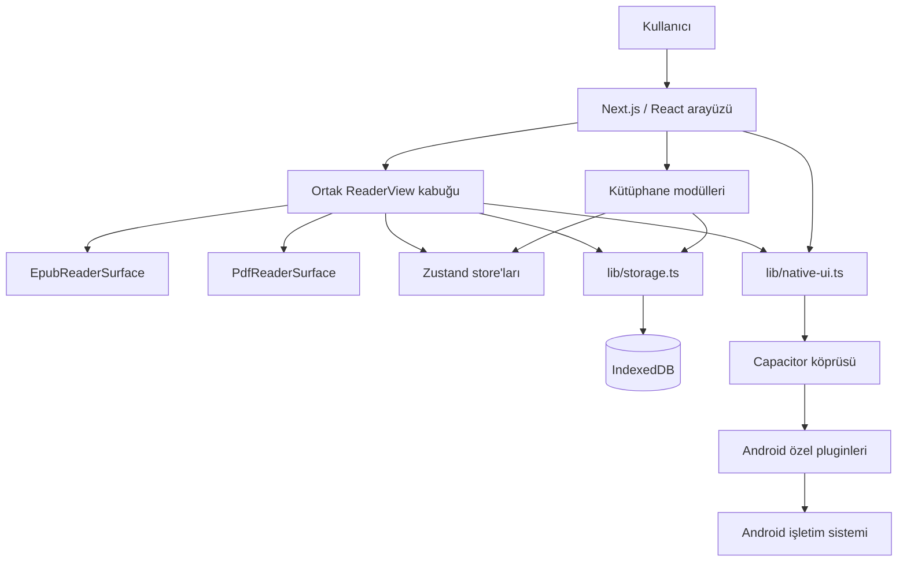

### 6.1 Katmanların sorumlulukları

#### Sayfa ve uygulama kabuğu

- `app/page.tsx`: Kütüphane giriş noktası.
- `app/reader/page.tsx`: URL'deki kitap kimliğiyle okuyucu giriş noktası.
- `app/layout.tsx`: Global fontlar, toast ve Android/global handler'lar.
- `app/globals.css`: Tema tokenları, safe-area ve global davranışlar.

#### Kütüphane katmanı

- `LibraryView`: Arama, sıralama, filtre, görünüm ve panel state'lerinin
  orkestrasyonu.
- `UploadDropzone`: Dosya kabulü ve içe aktarma.
- `BookCard`, `BookListRow`, `ShelfView`: Üç farklı sunum.
- `BookActionsMenu`: Yeniden adlandırma, bilgi ve silme işlemleri.
- `CategoryDialog`: Basit kategori atama.
- `BackupMenu`: Yedekleme, geri yükleme ve dil seçimi.
- `ReadingStatsPanel`: Günlük hedef, seri ve son yedi gün.

#### Okuyucu katmanı

- `ReaderView`: Biçimden bağımsız toolbar, paneller, state, süre takibi,
  kısayollar ve native entegrasyon.
- `ReaderSurfaceHandle`: EPUB ve PDF yüzeylerinin uyması gereken ortak komut
  sözleşmesi.
- `EpubReaderSurface`: EPUB motoru, CFI, tema, TOC ve kalıcı vurgu.
- `PdfReaderSurface`: PDF motoru, sayfa, zoom, continuous scroll ve metin katmanı.
- `ReaderSettingsPanel`: Okuma görünümü tercihleri.
- `NotesPanel`: Vurgu, not, yer imi ve dışa aktarma.
- `SearchPanel`: Ortak arama sonuç görünümü.
- `TocPanel`: EPUB içindekiler görünümü.
- `SelectionBar`: Seçili metinden vurgu/not oluşturma.
- `BreakSuggestion`: Baskısız mola önerisi.

#### Veri ve servis katmanı

- `lib/storage.ts`: IndexedDB şeması ve tüm kalıcı kitap verileri.
- `lib/import-book.ts`: Dosya biçimi tespiti ve import orkestrasyonu.
- `lib/epub-loader.ts`, `lib/pdf-loader.ts`: Biçime özgü metadata/kapak çıkarma.
- `lib/backup.ts`: Tam kitaplık ZIP yedeği.
- `lib/export-notes.ts`: Word/PDF not çıktısı.
- `lib/native-ui.ts`: Platform kontrolünü çağıranlardan saklayan native wrapper'lar.
- `lib/reader-theme.ts`: Gece modu ve renk çözümleme.
- `lib/i18n/*`: Türkçe/İngilizce çeviri sistemi.

---

## 7. Dizin rehberi

| Yol | Sorumluluk |
|---|---|
| `app/` | Next.js route'ları, root layout ve global CSS |
| `components/library/` | Kütüphane ekranı ve kitap yönetimi |
| `components/reader/` | Ortak okuyucu ve biçime özgü yüzeyler |
| `components/ui/` | Yeniden kullanılabilir temel UI bileşenleri |
| `components/*.tsx` | Uygulama çapındaki Android/global handler'lar |
| `lib/` | Veri, dosya, tema, i18n, backup ve native servisleri |
| `store/` | Zustand state ve kalıcı tercihler |
| `android/` | Capacitor Android projesi ve özel native pluginler |
| `assets/` | Kaynak uygulama ikonu |
| `public/` | Statik web varlıkları ve PDF worker |
| `.github/workflows/` | CI derleme iş akışları |
| `graphify-out/` | Yerel kod grafiği; git tarafından izlenmez |

---

## 8. State ve kalıcılık modeli

Paperlike iki farklı kalıcılık mekanizması kullanır:

1. Kitap ve okuma verileri için IndexedDB.
2. Hafif kullanıcı tercihleri için Zustand `persist` üzerinden localStorage.

### 8.1 Zustand store'ları

| Store | Kalıcı mı? | Sorumluluk |
|---|---:|---|
| `useLibraryStore` | Hayır | IndexedDB'den yüklenen kitap listesinin UI kopyası |
| `useSettingsStore` | Evet | Tema, font, düzen, animasyon ve okuyucu tercihleri |
| `useLibraryViewStore` | Evet | Grid/list/shelf görünümü |
| `useReadingGoalStore` | Evet | Günlük hedef ve mola ayarları |
| `useLocaleStore` | Evet | `tr`/`en` dil tercihi |
| `useOnboardingStore` | Evet | Okuyucu tanıtımının görülüp görülmediği |
| `useAuthStore` | Hayır | Kısmi Firebase auth kullanıcı/başlatılma state'i ve auth komutları |
| `useToastStore` | Hayır | Geçici toast kuyruğu |
| `useBackHandlerStore` | Hayır | Android geri tuşu handler yığını |
| `useSecurityStore` | Evet fakat pasif | Devre dışı biyometrik deneyin kalan state'i |

### 8.2 IndexedDB şeması

Veritabanı adı `epub-reader`, güncel şema sürümü `3` değeridir.

| Object store | Anahtar | İçerik | İndeks |
|---|---|---|---|
| `books` | `id` | Kitap metadata'sı | `by-addedAt` |
| `files` | `bookId` | EPUB/PDF `Blob` | — |
| `covers` | `bookId` | Kapak `Blob` | — |
| `progress` | `bookId` | Konum, yüzde ve zaman | — |
| `highlights` | `id` | Alıntı, renk, önem ve not | `by-book` |
| `bookmarks` | `id` | Konum ve etiket | `by-book` |
| `readingStats` | `date` | Yerel gün ve dakika | — |

### 8.3 Ana veri tipleri

#### Book

- `id`: Uygulama tarafından üretilen benzersiz kimlik.
- `title`, `author`: Metadata veya fallback dosya adı.
- `format`: `epub` ya da `pdf`.
- `addedAt`: Unix timestamp.
- `fileSize`: Bayt.
- `category`: Opsiyonel tek kategori.

#### ReadingProgress

- `bookId`
- `location`: EPUB CFI veya PDF sayfasını temsil eden string.
- `percentage`: `0–100`.
- `updatedAt`

#### Highlight

- Kitap kimliği.
- EPUB CFI aralığı veya `page:<n>` konumu.
- Seçilen metin.
- Renk.
- `0–3` önem derecesi.
- Opsiyonel not.
- Oluşturulma zamanı.

#### Bookmark

- Kitap kimliği.
- EPUB CFI veya `page:<n>`.
- Oluşturma anındaki bölüm/sayfa etiketi.
- Oluşturulma zamanı.

### 8.4 Veri değişmezleri

Yeni kod aşağıdaki kuralları bozmamalıdır:

- Bir kitap kaydı kullanılabilir sayılabilmek için `books` ve `files` kayıtlarının
  ikisine de sahip olmalıdır.
- `progress` store'unda kitap başına en fazla bir güncel kayıt vardır.
- EPUB konumları CFI, PDF konumları `page:<n>` veya ilerleme katmanında sayfa
  string'i olarak ele alınır; dönüştürme noktaları açık tutulmalıdır.
- Kitap silindiğinde dosya, kapak, ilerleme, vurgu ve yer imleri de silinmelidir.
- Günlük istatistik anahtarı cihazın yerel saat diliminde `YYYY-MM-DD` biçimidir.
- Kullanıcı tercihleri kitap yedeğinin parçası değildir. Mevcut ZIP yedeği kitap,
  içerik, kapak, ilerleme, vurgu, yer imi ve istatistikleri kapsar.
- Yedek format sürümü geriye dönük okunabilir olmalı; daha yeni bir format eski
  uygulamaya sessizce aktarılmamalıdır.

### 8.5 IndexedDB ve backup migration rehberi

#### Şema değişikliği öncesi

1. Değişen veri tipi `lib/types.ts` içinde tanımlanır.
2. Mevcut `DB_VERSION` ve bütün önceki upgrade blokları incelenir.
3. Yeni sürüm numarası yalnızca gerçek şema değişikliği varsa artırılır.
4. Eski veriden yeni veriye dönüşüm ve eksik alan fallback'i yazılır.
5. Kitap silme cascade'i, backup ve restore etkileri çıkarılır.
6. En az bir önceki production/dağıtılmış şemadan migration fixture'ı hazırlanır.

#### IndexedDB migration kuralları

- Eski upgrade blokları silinmemelidir; sıfırdan kurulum bütün sürümleri sırayla
  geçebilmelidir.
- Aynı transaction içinde uzun CPU/ZIP işleri yapılmamalıdır.
- Yeni zorunlu alan için eski kayıtlara deterministik varsayılan verilmelidir.
- Migration yarıda kalırsa veritabanı sessizce temizlenmemelidir.
- Kullanıcı verisini silmek “kolay düzeltme” olarak kabul edilmez.
- Büyük veri dönüşümü gerekiyorsa şema upgrade'i ile içerik backfill'i ayrı,
  yeniden başlatılabilir aşamalar olmalıdır.

#### Backup formatı kuralları

- IndexedDB sürümü ile backup `formatVersion` aynı kavram değildir.
- ZIP içeriğinin yapısı veya anlamı değişirse `BACKUP_FORMAT_VERSION` artırılır.
- Yeni uygulama mümkünse eski backup'ı okuyabilmelidir.
- Eski uygulama daha yeni backup'ı açık hata ile reddetmelidir.
- Import sırasında doğrulama tamamlanmadan mevcut veriler geri döndürülemez
  biçimde değiştirilmemelidir.
- V1 restore, ZIP CRC kontrolünü, manifest şemasını, benzersiz/güvenli kitap
  kimliklerini ve bütün zorunlu kitap dosyalarını ilk IndexedDB yazımından önce
  doğrular.
- EPUB/PDF girdileri zaten sıkıştırılmış oldukları için backup içinde `STORE`
  kullanır; manifest `DEFLATE` edilebilir.
- Tarayıcı export'u kitap Blob'unu eager ArrayBuffer kopyasına çevirmeden JSZip'e
  verir; JSZip'in nihai ZIP Blob'u yine işlem belleğinde üretilir.
- Koleksiyon/senkron gibi yeni veri alanları eklenirken eski `category` ve
  metadata kayıtları için dönüşüm yazılmalıdır.

#### Önerilen test matrisi

| Kaynak | Hedef | Beklenti |
|---|---|---|
| Boş DB | Güncel DB | Bütün store/index'ler oluşur |
| DB v1 | Güncel DB | Kitap/dosya/kapak/ilerleme korunur |
| DB v2 | Güncel DB | Vurgu ve yer imleri korunur |
| DB v3 | Sonraki sürüm | İstatistikler ve yeni alanlar korunur |
| Backup v1 | Güncel uygulama | Eksiksiz round trip |
| Daha yeni backup | Eski uygulama | Açık ve çevrilmiş hata, veri değişikliği yok |
| Bozuk ZIP/manifest | Güncel uygulama | Kontrollü hata, mevcut kitaplık korunur |

#### Rollback yaklaşımı

IndexedDB migration'ı production'a çıktıktan sonra uygulama binary'sini geri
almak her zaman güvenli değildir; eski binary yeni şemayı anlamayabilir. Bu
nedenle:

- Migration ileri uyumlu tasarlanmalıdır.
- Destructive store/alan kaldırma en az bir geçiş sürümü beklemelidir.
- Rollback planı, uygulama sürümü ile veri şeması uyumluluk tablosunu içermelidir.
- Kritik migration öncesinde kullanıcıya manuel ZIP yedeği önerilebilir.

---

## 9. Temel süreç modelleri

### 9.1 Kitap içe aktarma

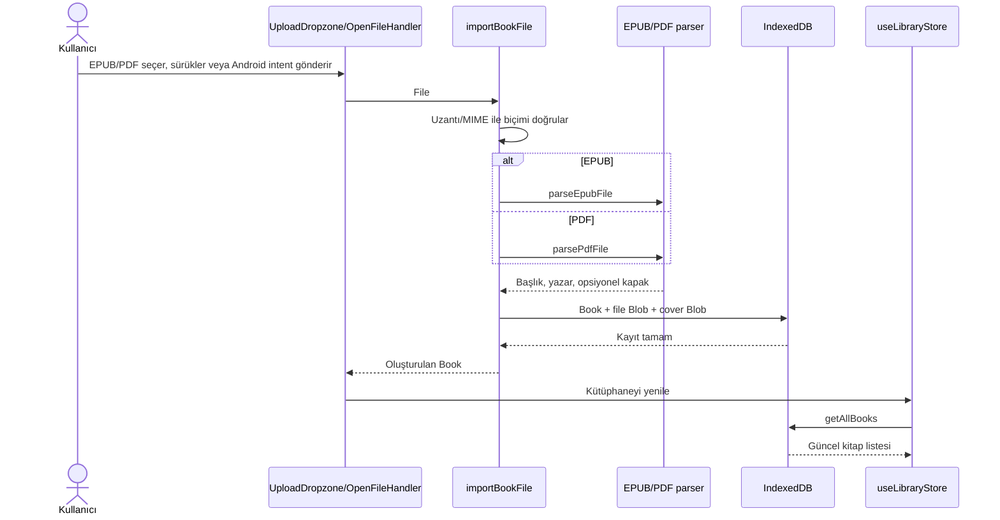

Hata durumları:

- Desteklenmeyen biçim kullanıcıya çevrilmiş hata verir.
- EPUB açma/ayrıştırma zaman aşımına uğrayabilir.
- Eksik metadata dosya adı ve “bilinmeyen yazar” fallback'ine düşer.
- Android `content://` verisi Java katmanından web katmanına güvenli biçimde
  aktarılmalıdır.

### 9.2 Kitap açma ve okuyucu seçimi

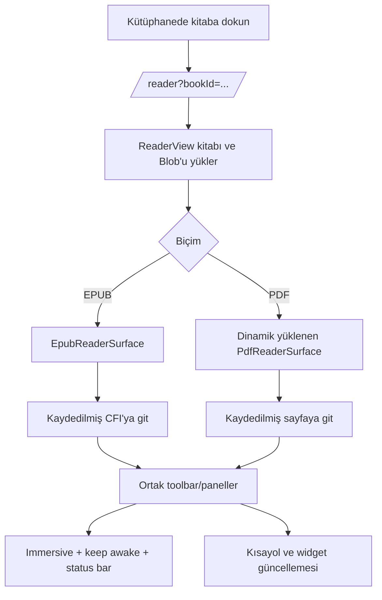

### 9.3 İlerleme ve okuma süresi

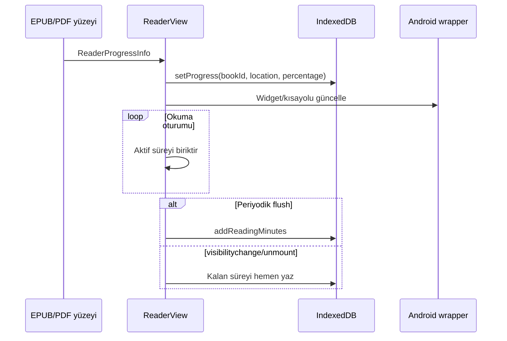

### 9.4 Vurgu, not ve yer imi

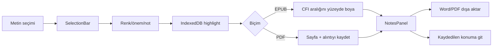

### 9.5 Tam kitaplık yedekleme

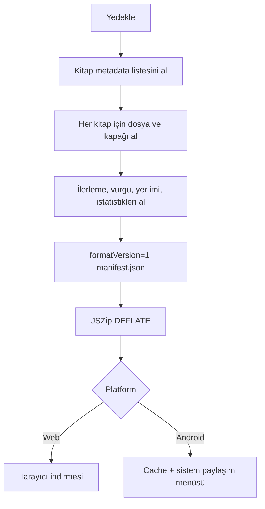

Geri yükleme:

1. ZIP okunur.
2. `manifest.json` varlığı ve format sürümü doğrulanır.
3. Dosyası bulunmayan kitap kaydı atlanır.
4. Aynı kimliğe sahip mevcut kitaplar üzerine yazılır.
5. Metadata store'ları import edilir.
6. Kütüphane state'i yenilenir.

> Yedek şifreli değildir. Kullanıcıya yedek dosyasının kitap içeriği ve kişisel
> notlar barındırdığı açıkça anlatılmalıdır.

### 9.6 Android “Birlikte aç/Paylaş” akışı

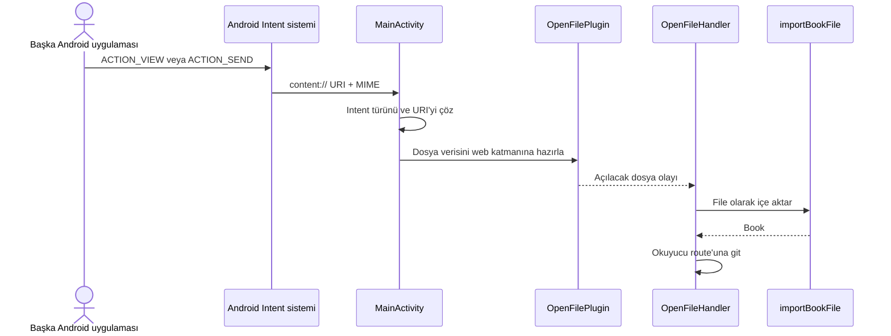

### 9.7 Widget ve kısayol akışı

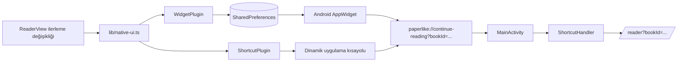

### 9.8 Web/Android build akışı

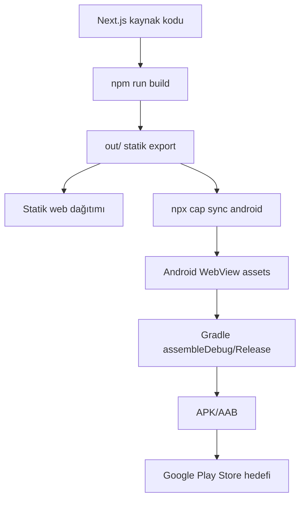

### 9.9 Reader yaşam döngüsü state machine

Bu model `ReaderView` içindeki güncel davranışı açıklar. Veri yükleme, intro,
onboarding, okuma, panel, arka plan, hata ve cleanup yan etkilerini tek yerde
görünür kılar.

#### Ana durumlar

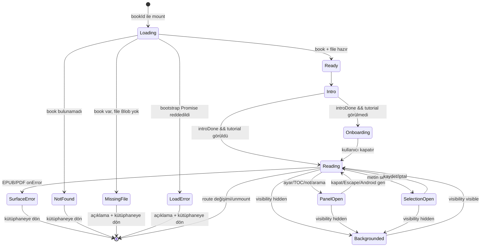

`ReaderView` bootstrap sonucu `loading`, `ready`, `notFound`, `missingFile` ve
`loadError` durumlarıyla açıkça temsil edilir. `bookId` değiştiğinde önceki kitap,
Blob, konum, vurgu ve yer imi state'i temizlenir; geç tamamlanan eski istek
`cancelled` guard ile arayüzü değiştiremez. Eksik Blob ve storage rejection
durumları sonsuz spinner yerine açıklayıcı, yerelleştirilmiş hata ve güvenli
kütüphaneye dönüş sunar.

#### UI alt durumları

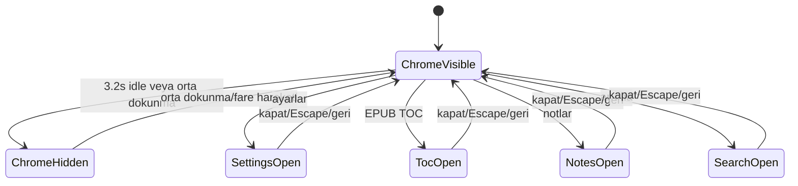

Kod birden fazla boolean panel state'i taşır; kullanıcı akışında aynı anda tek
üst panel açık olması beklenir. Escape ve Android geri önceliği:

1. Ayarlar.
2. İçindekiler.
3. Notlar.
4. Arama.
5. Bekleyen metin seçimi.
6. Hiçbiri yoksa kütüphaneye dönme fallback'i.

#### TTS alt durumu

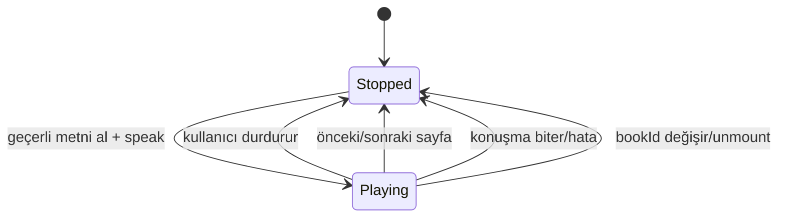

#### Durum yan etkileri ve cleanup

| Olay/durum | Başlatılan yan etki | Zorunlu cleanup/sonuç |
|---|---|---|
| `bookId` mount/değişim | Eski reader verisini temizle; kitap, Blob, progress, vurgu ve yer imini paralel yükle | Sonucu beş yükleme durumundan birine geçir; eski async sonucu `cancelled` guard ile yoksay |
| Reader mount | Immersive ve keep-awake aç | Unmount'ta ikisini kapat |
| Görünür okuma | Süreyi biriktir | 30 saniye, visibilitychange ve unmount'ta flush |
| Mola hatırlatıcı aktif | JS timer + native notification | Unmount/ayar değişiminde timer ve notification iptal |
| Mola önerisi görünür | Native bildirimi iptal et | 12 saniye sonra veya kullanıcıyla kapat |
| Volume-key ayarı aktif | Native listener kaydet | Ayar kapanınca/unmount'ta listener ve yakalama kapat |
| Progress olayı | UI state + IndexedDB progress yaz | Konum boşsa kalıcı yazma yapma |
| Progress/kitap değişimi | Widget ve shortcut güncelle | En son kitap/yüzde kazanır |
| Tema değişimi | Status bar rengini eşleştir | Sonraki ekran kendi rengini uygulamalı |
| Surface error | Genel reader hata görünümü | Kullanıcı kütüphaneye dönebilir |
| Sayfa değişimi | Haptic + surface next/prev | Çalışan TTS durur |

#### Reader değişmezleri

- İlerleme yalnız `location` doluysa kalıcı yazılır.
- EPUB CFI ve PDF `page:<n>` sözleşmesi yüzey sınırında korunur.
- Okuma süresine yalnız belge görünürken geçen süre eklenir.
- Native listener/flag'ler reader dışına sızmamalıdır.
- TTS kitap veya sayfa değişiminden sonra eski metni okumaya devam etmemelidir.
- Panel açıkken sayfa klavye kısayolları input/panel etkileşimini çalmamalıdır.
- Surface error kitaplık verisini silmemelidir.
- Intro ve onboarding gerçek reader verisinin yüklenmesini engellememelidir.
- Spinner yalnız `loading` durumunda görünmeli; bütün başarı ve hata yolları
  `loading` durumundan çıkmalıdır.
- `ready` durumunda hem kitap metadata'sı hem dosya Blob'u bulunmalıdır.

#### Modelin ortaya çıkardığı takip işi

- `ISS-016` / `RM-A-11` uygulama düzeyinde çözüldü: eksik file Blob ve reader
  bootstrap reddi ayrı `missingFile`/`loadError` durumlarına geçer.
- `IT-READER-LOAD-001`: Kitap + dosya, kitap yok, dosya yok, storage rejection,
  yükleme bekleme ve stale request senaryolarını kapsayan 6 otomatik test
  eklendi ve yerelde geçti.
- `E2E-W-READER-ERROR-001`: Kullanıcı sonsuz spinner yerine açıklayıcı hata ve
  kütüphaneye dönüş görmelidir; otomatik test hâlâ takip işidir.

---

## 10. Native plugin kataloğu

| Plugin/sınıf | Web wrapper/kullanıcı | Sorumluluk |
|---|---|---|
| `ImmersivePlugin` | `setImmersive`, `setKeepAwake` | Sistem barlarını yönetme ve ekranı açık tutma |
| `VolumeKeyPlugin` | `enableVolumeKeyPageTurn` | Ses tuşu olaylarını sayfa komutuna çevirme |
| `OpenFilePlugin` | `OpenFileHandler` | Dış intent ile gelen dosyayı web katmanına aktarma |
| `ShortcutPlugin` | `setContinueReadingShortcut` | Dinamik “okumaya devam et” kısayolu |
| `WidgetPlugin` | `updateContinueReadingWidget` | SharedPreferences ve widget güncellemesi |
| `ContinueReadingWidgetProvider` | Android OS | AppWidget rendering ve tıklama |
| `CrashReportingPlugin` | `recordException` | JS hatasını Firebase Crashlytics'e iletme |
| `MainActivity` | Tüm intent handler'ları | Plugin kaydı, cold/warm intent yönlendirmesi |

### 10.1 Native wrapper kuralı

React bileşenleri mümkün olduğunca doğrudan `registerPlugin` çağırmamalıdır.
Platform ayrımı `lib/native-ui.ts` içindeki küçük fonksiyonlarda tutulmalıdır.
Böylece web çağrıları güvenli no-op veya anlamlı fallback olarak kalır.

### 10.2 Capacitor proxy tuzağı

Capacitor plugin proxy'leri `.then` erişimine de cevap verdiği için yanlışlıkla
Promise tarafından “thenable” kabul edilebilir. `ImmersivePlugin` başlatma kodunda
plugin nesnesi doğrudan `return` veya `await` edilmemeli; yalnızca plugin
metotlarının gerçek Promise'leri beklenmelidir.

---

## 11. Okuyucu yüzeyi sözleşmesi

`ReaderSurfaceHandle`, ortak `ReaderView` ile EPUB/PDF motorları arasındaki ana
soyutlamadır. Yeni bir biçim eklenirse aşağıdaki işlemler uygulanmalıdır:

- Sonraki/önceki konuma gitme.
- Başa/sona gitme.
- TOC hedefi; desteklenmiyorsa güvenli no-op.
- Kalıcı konuma gitme.
- Vurgu uygulama/kaldırma; desteklenmiyorsa güvenli no-op.
- Tam metin arama.
- Geçerli görünüm metnini TTS için döndürme.

Yüzeyler `ReaderProgressInfo` üretirken şu alanları sağlamalıdır:

- İnsan tarafından okunabilir bölüm/sayfa etiketi.
- `0–100` yüzde.
- Kalıcı biçime özgü konum.
- Varsa sayfa ve toplam sayfa.

Bu sözleşme sayesinde toolbar, not paneli, arama, TTS ve ilerleme kaydı biçimden
bağımsız kalır.

---

## 12. Tasarım sistemi ve etkileşim dili

### 12.1 Görsel yön

- Sakin nötr tonlar.
- Krem ve sepya gibi kâğıt çağrışımlı arka planlar.
- Okuma yüzeyinde içeriği geri plana itmeyen kontroller.
- Küçük, ölçülü ve kapatılabilir animasyonlar.
- Gerçek kitap hissini destekleyen kapak açılışı, sayfa kıvrımı ve sayfa kalınlığı.

### 12.2 Hareket ilkeleri

- Animasyon okuma komutunun sonucunu geciktirmemelidir.
- Kullanıcı animasyonu tamamen kapatabilmelidir.
- Sayfa yönü ileri/geri hareketine uygun olmalıdır.
- Sürekli kaydırma modunda sayfa kıvrımı gibi sayfalanmış metaforlar
  uygulanmamalıdır.
- Haptic feedback hafif ve seyrek olmalıdır.

### 12.3 Dil ve ton

- Hedefler “zorunluluk” olarak sunulmamalıdır.
- Okumadığı gün için kullanıcı suçlanmamalıdır.
- Mola bildirimi tek seferlik, kolay kapatılır ve nazik olmalıdır.
- Hata metni ne olduğunu ve mümkünse kullanıcının ne yapabileceğini açıklamalıdır.
- Yeni kullanıcıya görünen tüm metinler hem Türkçe hem İngilizce sözlükte
  bulunmalıdır.

### 12.4 Animasyon mimarisi ve araştırma kaydı

Raf görünümü, kitap açılışı ve sayfa kıvrımı Paperlike'ın “kitap hissi” iddiasının
ana parçalarıdır. Bu efektlerde tek amaç görsel gerçekçilik değildir; EPUB/PDF
tutarlılığı, metin seçilebilirliği, performans ve bakım maliyeti birlikte
değerlendirilir.

#### Temel kısıtlar

- EPUB içeriği `epub.js` tarafından yönetilen bir iframe içindedir. Her geçişte
  iframe'i `html2canvas` benzeri bir araçla görüntüye çevirip kıvırmak pahalı ve
  içerik karmaşıklığına bağlı olarak kararsızdır.
- PDF sayfası canvas olduğu için piksel warping teorik olarak mümkündür; ancak
  EPUB için DOM/CSS, PDF için WebGL/canvas olmak üzere iki ayrı motor bakım
  maliyetini ikiye katlar.
- Bu nedenle her iki biçimde de içerik yüzeyini değiştirmeyen DOM/CSS overlay ve
  3D transform yaklaşımı seçilmiştir.

#### Değerlendirilip reddedilen kütüphaneler

- `turn.js`: jQuery bağımlılığı, ticari kullanımı sınırlayan lisans yapısı ve
  bakımsız proje durumu nedeniyle uygun değildir.
- `react-pageflip`/StPageFlip: MIT lisanslı ve daha güncel olsa da sabit, ayrı
  sayfa elemanları bekler. `epub.js` reflowable pagination modeliyle doğrudan
  uyumlu değildir; kullanmak EPUB sayfalamasını yeniden yazmayı gerektirir.
- Canvas/WebGL pixel warping: Görsel olarak güçlü fakat biçimler arası ortak
  mimariyi ve metin etkileşimini gereksiz yere karmaşıklaştırır.

Karar: Harici page-flip motoru yerine küçük, proje içinde kontrol edilen
Framer Motion + CSS 3D çözümü kullanılır. `@react-three/fiber` veya GSAP eklenmesi
planlanmamaktadır.

#### Raf görünümü

`ShelfView` içindeki her kitap iki yüzlü 3D bir kutudur:

- Cilt genişliği `34px`, satır yüksekliği `184px`, raf kalınlığı `10px`.
- Dinlenmede cilt görünür; kapak `rotateY(90deg)` ile katlıdır.
- Hover hareketi iki aşamalıdır: kitap önce öne gelir, ardından yaklaşık
  `-102deg` döner.
- Geçiş yaklaşık `0.55s`, zaman noktaları `[0, 0.38, 1]` ve easing
  `[0.33, 1, 0.4, 1]` kullanır.
- Diğer kitaplar JS state yerine CSS `:has()` ile bulanıklaştırılır.
- İmleç kutu hareket ederken yüzeyi kaybetmesin diye hover çıkışında yaklaşık
  `150ms` gecikme vardır.
- Bilgi kartı dönen 3D kutunun çocuğu değil kardeşidir; böylece yazı
  `preserve-3d` dönüşünden etkilenmez.
- Kapak varsa kapak kenarından renk çıkarılır; yoksa kitap kimliğinden
  deterministik cilt rengi üretilir.

#### Kitap açılış animasyonu

`BookOpenTransition` yaklaşık `850ms` tutma ve `0.85s` açılma ritmi kullanır:

- Dönüş keyframe'leri `[0, 0, -128, -122]` ile overshoot ve yerleşme hissi verir.
- Ölçek keyframe'leri `[1, 1.05, 0.96, 0.96]` ile kitabın önce ele alınması
  metaforunu oluşturur.
- Menteşe yönünden yayılan gradient gölge vardır.
- Düz arka yüz rengi `#f9f6ee` değeridir.

Bilinen tek eksik görsel araştırma maddesi “sayfa yığını fanı”dır. Mevcut
animasyonda tek düz arka sayfa bloğu vardır. İleride uygulanırsa:

- Üç ince sayfa katmanı kullanılmalı.
- Tonlar açık renkten `#efe9da` ve `#e5ddc9` benzeri daha koyu tonlara gitmeli.
- Katmanlar `2–4px` yatay, `1–2px` dikey kaydırılmalı.
- Aynı timeline üzerinde `5–8deg` veya küçük gecikmelerle birbirini takip etmeli.
- Bu iş görsel cila olarak değerlendirilmelidir; çekirdek özellik değildir.

#### Çok şeritli sayfa kıvrımı

`PageCurlOverlay` gerçek içeriği kopyalamadan geçici on şeritli bir görsel kılıf
oluşturur:

- `STRIP_COUNT = 10`
- Şerit başına gecikme `0.02s`
- Şerit süresi `0.38s`
- Toplam perspektif `1400`
- Dönüş ileri yönde yaklaşık `-150deg`, geri yönde `150deg`
- Easing `[0.45, 0, 0.2, 1]`

İleri ve geri geçişlerde transform origin ve dalga sırası ters çevrilir. EPUB'da
animasyon `relocated` event'inden değil imperative `next`/`prev` komutundan
tetiklenir; çünkü `relocated` tek gezinmede birden fazla kez ateşlenip çift
animasyon oluşturabilir.

Animasyon seviyesi davranışı:

- Seviye `0`: Kapalı.
- Seviye `1`: Yaklaşık `320ms` süren hafif CSS/Framer Motion rotate/slide.
- Seviye `2`: Çok şeritli kıvrım overlay'i; alttaki içeriğe ek rotate uygulanmaz.

Sürekli kaydırma modunda bu sayfalanmış geçiş metaforları devre dışı kalmalıdır.

---

## 13. Gizlilik, güvenlik ve veri sahipliği

### 13.1 Mevcut model

- Kitaplar ve okuma verileri varsayılan olarak cihazdaki IndexedDB'de saklanır.
- Uygulamanın temel okuma akışı için kullanıcı hesabı yoktur.
- Uygulama kitap içeriğini bir Paperlike sunucusuna yüklemez.
- Kullanıcı tam kitaplık yedeğini kendisi dışa aktarabilir.
- Android Auto Backup, WebView verisini cihaz transferi/bulut yedeği kapsamında
  taşıyabilir.
- Native çökmeler ve köprüden iletilen JavaScript hataları Firebase Crashlytics'e
  gönderilebilir.

### 13.2 Kullanıcıya açıkça bildirilmesi gerekenler

- Crashlytics çevrimdışı/yalnızca yerel veri vaadinin istisnasıdır.
- ZIP yedeği şifreli değildir.
- Android Auto Backup etkin olduğu için yerel uygulama verisi kullanıcının Google
  yedekleme hesabına taşınabilir.
- EPUB iframe'ine eklenen Google Fonts stylesheet'i ağ isteği oluşturabilir.
  Tam çevrimdışı PWA hedefinde fontların yerel paketlenmesi değerlendirilmelidir.

### 13.3 Yayından önce güvenlik işleri

- Gizlilik politikası.
- Google Play Data Safety formuyla gerçek veri davranışının eşleştirilmesi.
- Crashlytics veri toplama/açıklama politikası.
- Production manifestte `usesCleartextTraffic="true"` gereksinimini kaldırma veya
  yalnızca dev konfigürasyonuna sınırlama.
- Yedek formatı için opsiyonel şifreleme kararı.
- Bulut senkronizasyonu eklenirse kimlik doğrulama, uçtan uca şifreleme,
  silme/ihracat ve çatışma politikaları.
- Firebase yapılandırma ve release signing sürecinin güvenli secret yönetimi.

### 13.4 Biyometrik kilit kararı

Biyometrik kilit uygulanmış, cihaz güvenliği fallback'i ve başarısız denemelerden
sonra kaçış yolu eklenmiş; buna rağmen gerçek cihazda kullanıcıyı uygulamadan
kilitleme riski devam etmiştir.

Güncel karar:

- Özellik arayüzden kaldırılmıştır.
- `BiometricLockGate` root layout'ta render edilmez.
- `useSecurityStore` ve ilgili kod kalıntıları pasiftir.
- Güvenilirlik gerekçesiyle özellik tekrar denenmeyecektir.
- Gelecekte kod temizliği yapılırken pasif dosyalar kontrollü biçimde
  kaldırılabilir.

Bu karar, kullanıcı verisine erişimi tamamen engelleyebilecek bir güvenlik
özelliğinin “çalışıyor gibi” sunulmaması ilkesinin örneğidir.

---

## 14. Hata yönetimi ve gözlemlenebilirlik

### 14.1 Mevcut mekanizmalar

- İçe aktarma ve kullanıcı işlemleri için toast geri bildirimi.
- EPUB açılışı için zaman aşımı ve fallback ekranı.
- Global `error` ve `unhandledrejection` yakalama.
- Native Android çökmeleri için Firebase Crashlytics.
- JavaScript hatalarını özel native plugin ile Crashlytics'e iletme.

### 14.2 Eksikler

- React error boundary kapsamı açıkça standartlaştırılmamış.
- Web dağıtımı için merkezi hata izleme yok.
- Yapısal log seviyesi ve olay isimlendirme standardı yok.
- Performans ölçümleri ve gerçek kullanıcı metrikleri yok.
- Kullanıcı gizliliğini koruyan tanılama paketi/destek dışa aktarma akışı yok.

Hata raporlarına kitap metni, not içeriği veya dosya yolu gibi hassas veriler
eklenmemelidir.

---

## 15. Performans modeli

### 15.1 Mevcut güçlü yönler

- Statik export sunucu runtime ihtiyacını azaltır.
- Ağır kütüphaneler ihtiyaç anında yüklenir.
- PDF yüzeyi kütüphane açılış paketinden ayrılır.
- Sürekli PDF modunda bütün sayfaların canvas/text layer'ları aynı anda
  oluşturulmaz; IntersectionObserver ile ekrana yakın sayfalar lazy render edilir.
- PDF araması ve geçerli sayfa metin erişimi, React-PDF'in açık
  `PDFDocumentProxy` nesnesini yeniden kullanır.
- EPUB konum üretimi ilk sayfa etkileşimli olduktan 500 ms sonraya ertelenir ve
  sıkıştırılmış dosya boyutuna göre uyarlanan bir konum aralığı kullanır.
- Android release kaynakları küçültülür.
- Görünüm state'i ve veri erişimi basit tutulmuştur.

### 15.2 Büyük kitap riski

Yol haritasındaki “büyük dosyalarda performans” hedefi aşağıdaki ayrı sorunları
kapsar:

- Büyük EPUB ZIP'inin açılma süresi ve bellek kullanımı.
- Çok bölümlü EPUB tam metin aramasının maliyeti.
- Çok sayfalı PDF'te sayfa wrapper sayısı toplam sayfayla büyümeye devam eder;
  pahalı canvas/text katmanları lazy olsa da tam DOM windowing henüz yoktur.
- PDF metin çıkarma ve arama maliyeti.
- Büyük Blob'ların IndexedDB, backup ve restore sırasında çoğaltılması.
- Tam kitaplık ZIP üretirken tepe bellek kullanımı.
- Düşük bellekli Android cihazlarda WebView process ölümü.
- Çok sayıda kitap kapağının kütüphane görünümünde decode edilmesi.

### 15.3 Uygulanan performans politikaları

1. `shouldRenderPdfPage`, gözlenen sayfalarla geçerli sayfanın ±1 güvenlik
   penceresini render eder.
2. Tek bir IntersectionObserver yaklaşık 1,5 viewport önceden PDF sayfasını
   hazırlar ve uzaktaki canvas/text layer'ını kaldırır.
3. Scroll konumu hesabı bütün sayfaları taramak yerine yalnız gözlenen yakın
   sayfaların geometri bilgisini, `requestAnimationFrame` ile en fazla frame
   başına bir kez okur.
4. `getEpubLocationBreak`, normal kitaplarda `1600` karakter aralığını korur;
   büyük dosyalarda tahmini en fazla 4.000 konum hedefiyle aralığı büyütür.
5. `E2E-W-PERF-001`, production Chromium çıktısında 120 sayfalık sentetik PDF
   için 120 page slot'a karşı en fazla 10 aktif React-PDF sayfasını ve uzak
   100. sayfadaki metnin tam kitap aramasından bulunmasını doğrular.
6. Arama paneli 250 ms debounce uygular; yeni sorgu ve panel kapanışı aktif
   `AbortController` sinyalini iptal eder.
7. EPUB/PDF motorları her bölüm/sayfadan sonra ilerleme bildirir, en fazla 50
   sonuç üretir ve dört tarama biriminde bir ana iş parçacığına kontrol verir.
8. EPUB araması iptal veya hata sırasında yüklenmiş bölümü `finally` ile unload
   eder; PDF araması açık `PDFDocumentProxy` nesnesini yeniden kullanır.
9. Backup export'u büyük EPUB/PDF ve kapak girdilerini `STORE` ile ekler;
   tarayıcıda Blob girdisini eager ArrayBuffer kopyasına dönüştürmez.
10. Backup/restore `collecting`, `compressing`, `validating`, `restoring` ve
    `metadata` aşamalarını yüzdeyle bildirir ve kullanıcı iptalini kabul eder.
11. Restore CRC, manifest ve bütün zorunlu dosyaları ilk IndexedDB mutasyonundan
    önce doğrular; eksik dosyalı arşiv kısmi restore başlatmaz.
12. `IT-BACKUP-LARGE-001`, altı adet 512 KiB ikili kitapla 3 MiB çok-kitaplı
    round-trip ve aşama sırasını doğrular.
13. Kapaklar IntersectionObserver ile viewport'a 300 px yaklaşınca yüklenir;
    uzaklaştığında aktif cache lease'i bırakılır.
14. `CoverCache`, eşzamanlı IndexedDB isteklerini ve object URL üretimini tek
    promise/kayıtta birleştirir; 96 kayıt ve 32 MiB ile sınırlı LRU uygular.
15. Aktif URL cache invalidation sırasında hemen revoke edilmez; son lease
    bırakıldığında temizlenerek ekrandaki görselin kırılması önlenir.
16. Büyük kaynak kapaklar bir kez en fazla 384×576 WebP thumbnail'e çevrilir;
    bitmap/canvas desteği yoksa kaynak Blob güvenli fallback olarak kullanılır.
17. Raf cilt rengi aynı cached thumbnail Blob'undan bir kez çıkarılır; raf
    görünümü artık kapak görselinden ayrı ikinci IndexedDB okuması yapmaz.
18. Kitap silme tekil cache invalidation, restore ise toplu cache clear uygular.
19. 200 kitaplık fixture cache'in 24 kayıtlık test bütçesini aşmadığını ve
    tahliye edilen bütün object URL'lerin revoke edildiğini doğrular.

### 15.4 Kalan yaklaşım

1. Temsilî küçük, orta ve büyük EPUB/PDF fixture'ları belirlenmelidir.
2. Import süresi, reader first paint, sayfa geçişi, arama ve backup için ölçüm
   bütçeleri tanımlanmalıdır.
3. Gerçek Android cihazlarda p50/p95, tepe bellek ve uzun frame ölçülmelidir.
4. Kalıcı/tembel arama indeksleri değerlendirilmelidir.
5. Import gibi kalan uzun işlemler ilerleme ve iptal desteği vermelidir.
6. JSZip'in nihai arşivi bellekte üretme sınırı için streaming veya worker
   seçenekleri araştırılmalıdır.
7. Thumbnail üretiminin gerçek Android cihazdaki decode süresi ve tepe belleği
   ölçülmeli; gerekirse Web Worker/OffscreenCanvas değerlendirilmelidir.

---

## 16. Geliştirme, build ve CI

### 16.1 Gereksinimler

- Node.js 20 veya uyumlu sürüm.
- npm.
- Android geliştirme için Android Studio, uygun SDK ve Java 21.
- Native Crashlytics build'i için geçerli Firebase yapılandırması.

### 16.2 Komutlar

| Komut | Amaç |
|---|---|
| `npm ci` | Kilit dosyasına göre temiz bağımlılık kurulumu |
| `npm run dev` | Web geliştirme sunucusu |
| `npm run build` | Statik Next.js üretim çıktısı |
| `npm run lint` | ESLint |
| `npm run type-check` | Emit üretmeden TypeScript kontrolü |
| `npm test` | Vitest testlerini tek sefer çalıştırma |
| `npm run test:watch` | Vitest'i geliştirme sırasında izleme modunda çalıştırma |
| `npm run test:e2e` | Production build + Playwright Chromium E2E |
| `npm run test:e2e:ui` | Playwright görsel test arayüzü |
| `npm run check` | Lint + type-check + bütün otomatik testler |
| `npm run cap:sync` | Web build + Android Capacitor sync |
| `npm run android:open` | Android Studio'da projeyi açma |
| `npm run android:dev` | LAN üzerinden Android WebView geliştirme |
| `npm run android:dev:sync` | Dev server konfigürasyonuyla Capacitor sync |

### 16.3 Web geliştirme

```text
npm ci
npm run dev
```

Web sürümü temel işlevlerin hızlı geliştirme ve test ortamıdır. Native-only
özelliklerin web'de no-op veya fallback olması beklenir.

### 16.4 Android geliştirme

Statik paket:

```text
npm run cap:sync
npm run android:open
```

Canlı geliştirme:

```text
npm run android:dev
npm run android:dev:sync
```

`CAP_DEV_IP` verilmezse Capacitor yapılandırması ilk uygun yerel IPv4 adresini
bulmaya çalışır. Geliştirme cihazı ve bilgisayar aynı ağda olmalıdır.

### 16.5 CI

`.github/workflows/android-build.yml`:

- `main` dalına push ve manuel tetikleme ile çalışır.
- Node 20 kurar.
- `npm ci` çalıştırır.
- Statik export üretip Android projesini sync eder.
- Java 21 kurar.
- Debug APK üretir.
- APK'yı workflow artifact'i olarak yükler.

`.github/workflows/web-quality.yml`:

- Pull request, `main` push ve manuel tetikleme ile çalışır.
- Node 20 ve `npm ci` kullanır.
- `npm run check` ile lint, type-check ve Vitest testlerini kapı yapar.
- Ardından statik production build üretir.
- Chromium'u kurar, Playwright web/PWA E2E testlerini çalıştırır.
- Playwright HTML raporunu başarı veya hata halinde artifact olarak yükler.
- Aynı ref için eski çalışmayı iptal eden concurrency ayarı ve salt-okunur
  `contents` izni kullanır.

### 16.6 CI kapsam boşlukları

- Reader surface çeşitliliği, arama/not ve geniş PWA güncelleme matrisi eksik.
- Android cihaz/emülatör test adımı yok.
- Yeni web workflow'u remote GitHub Actions üzerinde ilk push/PR sonrasında
  ayrıca doğrulanmalıdır.
- CI henüz production bağımlılık audit'ini kapı yapmıyor; `ISS-017`
  değerlendirilmeden otomatik `audit fix --force` uygulanmamalıdır.
- Release AAB ve imzalama yok.
- Play Store internal testing dağıtımı yok.
- Web/PWA production deploy işi yok.
- Dependency/security taraması yok.

### 16.7 Ortam değişkenleri ve secret yönetimi

#### Bugün kullanılan yapılandırmalar

| Ad/dosya | Gizli mi? | Kullanım | Durum |
|---|---:|---|---|
| `CAP_DEV` | Hayır | Capacitor'ı yerel dev server'a yönlendirir | Mevcut |
| `CAP_DEV_IP` | Hayır | Dev server IP'si ve Next allowed origin | Opsiyonel; otomatik IP fallback'i var |
| `android/app/google-services.json` | Tek başına secret sayılmaz, ortam özeldir | Firebase Android/Crashlytics yapılandırması | Mevcut |
| Release keystore | Evet/kritik | Play Store imzası | Henüz oluşturulmadı |
| Keystore parolaları | Evet/kritik | Release signing | Henüz tanımlanmadı |
| `NEXT_PUBLIC_FIREBASE_*` | İstemci config'i; güvenlik kuralı yerine geçmez | Lazy Firebase/Firestore init | Kod desteği mevcut, gerçek ortam değeri dışarıdan sağlanır |
| Google OAuth client ID'leri | Ortam config'i | Google Sign-In ve Drive consent | Henüz yok |

`.env*`, `*.keystore` ve `*.jks` git tarafından ignore edilir. Bununla birlikte
“ignore ediliyor” güvenli saklama anlamına gelmez.

#### Önerilen gelecek değişken adları

Bu isimler sözleşme önerisidir; kod uygulanırken tek bir örnek `.env.example`
dosyasında kesinleştirilmelidir.

| Değişken | İstemciye açık mı? | Ortam |
|---|---:|---|
| `NEXT_PUBLIC_FIREBASE_API_KEY` | Evet | Web/Android WebView |
| `NEXT_PUBLIC_FIREBASE_AUTH_DOMAIN` | Evet | Web |
| `NEXT_PUBLIC_FIREBASE_PROJECT_ID` | Evet | Tümü |
| `NEXT_PUBLIC_FIREBASE_STORAGE_BUCKET` | Evet | Firebase proje tanımı |
| `NEXT_PUBLIC_FIREBASE_MESSAGING_SENDER_ID` | Evet | Firebase proje tanımı |
| `NEXT_PUBLIC_FIREBASE_APP_ID` | Evet | Tümü |
| `NEXT_PUBLIC_GOOGLE_WEB_CLIENT_ID` | Evet | Web OAuth |
| `NEXT_PUBLIC_GOOGLE_DRIVE_SCOPE` | Evet | `drive.file` |
| `PAPERLIKE_KEYSTORE_PATH` | Hayır | CI/release |
| `PAPERLIKE_KEYSTORE_PASSWORD` | Hayır | CI/release |
| `PAPERLIKE_KEY_ALIAS` | Hayır | CI/release |
| `PAPERLIKE_KEY_PASSWORD` | Hayır | CI/release |

Firebase Web config değerlerinin görünür olması tek başına güvenlik açığı değildir;
asıl yetkilendirme Firestore güvenlik kuralları, OAuth redirect sınırları ve API
kısıtlarıyla sağlanır. Buna rağmen ortamlar karıştırılmamalı ve yetkisiz domainler
izin listesine alınmamalıdır.

#### Saklama politikası

- Yerel geliştirme: Git dışındaki `.env.local` ve geliştiricinin güvenli parola
  yöneticisi.
- GitHub Actions: GitHub Encrypted Secrets/Environment Secrets.
- Vercel: Project Environment Variables; preview ve production ayrılmalı.
- Release keystore: En az iki güvenli, erişimi kontrollü yedek; repoya veya
  artifact'e düz metin koyulmamalı.
- Secret rotation: Sorumlu, tarih ve etkilenen ortam kaydedilmeli.
- Log: Değerler hiçbir build çıktısında veya hata mesajında basılmamalı.
- Dokümantasyon: Yalnızca değişken adı ve edinme prosedürü yazılmalı; gerçek
  değer yazılmamalı.

#### Yeni geliştirici kurulum kontrolü

1. `.env.example` dosyasını kopyala; yalnızca gerekli yerel değerleri gir.
2. Firebase/Google Console erişimini proje sahibinden al.
3. Android debug için doğru `google-services.json` dosyasını kullan.
4. Release keystore erişimi olmadan release imzalama deneme.
5. `git status` ile config/secret dosyasının yanlışlıkla stage edilmediğini kontrol
   et.

### 16.8 Sürümleme ve branch politikası

#### Önerilen tek sürüm kaynağı

- Ürün sürümünün insan tarafından okunan ana kaynağı `package.json` içindeki
  SemVer değeri olmalıdır.
- Android `versionName` bu değerle aynı olmalıdır.
- Android `versionCode` Play Store için her upload'da monoton artan pozitif
  tamsayı olmalıdır; geri alınmamalı ve tekrar kullanılmamalıdır.
- PWA cache sürümü ve backup format sürümü ürün sürümünden bağımsızdır.
- IndexedDB `DB_VERSION` yalnızca şema değişikliğinde artar.

#### Aşama anlamları

| Kanal | Sürüm örneği | Anlam |
|---|---|---|
| Prototip | `0.x.y` | Hızlı değişim, migration/release garantisi sınırlı |
| Alpha | `0.x.y-alpha.n` | İç test, veri kaybı/özellik değişimi riski açık |
| Beta | `0.x.y-beta.n` | Temel akışlar donmuş, geniş cihaz testi |
| Stable | `1.x.y` ve sonrası | Yayın kapıları geçmiş, migration ve rollback planlı |

#### SemVer artırma

- Patch: Kullanıcı sözleşmesini değiştirmeyen hata düzeltmesi.
- Minor: Geriye uyumlu özellik veya genişletme.
- Major: Veri/ürün sözleşmesinde geriye uyumsuz değişim.
- Pre-release etiketi: Alpha/beta dağıtımı.

#### Git yaklaşımı

- `main`: Her zaman build edilebilir ana dal.
- Kısa ömürlü feature/fix branch'leri.
- Conventional Commits benzeri `feat:`, `fix:`, `docs:`, `refactor:`, `test:`
  önekleri.
- Stable/release adayı için `vX.Y.Z` annotated tag.
- Commitlenmemiş kullanıcı değişiklikleri ajanlar tarafından ezilmez.

#### Release akışı

1. Sürüm kapsamını ve ilgili `PR/NFR` kimliklerini dondur.
2. `package.json`, Android `versionName` ve monoton `versionCode` değerini
   güncelle.
3. Migration ve backup uyumluluk testlerini çalıştır.
4. Lint, type-check, unit, integration, web E2E ve Android smoke kapılarını geç.
5. İmzalı AAB üret ve checksum/provenance kaydet.
6. Internal testing → closed/open testing → staged production sırasını kullan.
7. Crash/ANR ve kritik kullanıcı geri bildirimini izle.
8. Changelog ve bu belgenin doğrulanan commit bilgisini güncelle.

#### Rollback

- Aynı `versionCode` ile eski AAB tekrar yüklenemez; düzeltme daha yüksek
  `versionCode` ile yayınlanır.
- Veri migration'ı geri alınamıyorsa eski uygulamaya dönmek güvenli olmayabilir.
- Remote config/feature flag yoksa riskli özellikler küçük staged rollout ile
  sınırlandırılmalıdır.
- Web rollback'i önceki doğrulanmış statik artifact'e dönmelidir.
- Rollback sonrasında veri şeması, service worker cache'i ve senkron protokolü
  uyumluluğu kontrol edilmelidir.

---

## 17. Test stratejisi

### 17.1 Güncel durum

Vitest/jsdom/fake-indexeddb katmanı reader bootstrap, IndexedDB CRUD, backup
round-trip, import yönlendirme, EPUB ayrıştırma, i18n, PWA manifesti, büyük
kitap render politikaları ve iptal edilebilir aramayı kapsar.
Playwright katmanı production statik export üzerinde kütüphane → reader →
ilerleme, offline PWA app-shell ve 120 sayfalık PDF lazy-render akışlarını gerçek
Chromium'da doğrular.
Android klasöründeki örnek JUnit/Espresso dosyaları hâlâ gerçek ürün
senaryolarını temsil etmez.

#### Test sonuç panosu

| Test/kapı | Kanıt | Son sonuç | Ortam | Baz | Tarih |
|---|---|---|---|---|---|
| Vitest toplamı | 15 test dosyası | **Geçti — 43/43** | Windows, Node `24.15.0`, jsdom/node/fake-indexeddb | `05cda45` + çalışma ağacı | 2026-07-30 |
| `IT-READER-LOAD-001` | `components/reader/useReaderBootstrap.test.ts` | **Geçti — 6/6** | Windows, jsdom | `05cda45` + çalışma ağacı | 2026-07-30 |
| `IT-STORAGE-001` | `lib/storage.test.ts` | **Geçti — 1/1** | Windows, fake-indexeddb | `05cda45` + çalışma ağacı | 2026-07-30 |
| `IT-BACKUP-*` | `lib/backup.test.ts` | **Geçti — 7/7** | Windows, fake-indexeddb + 3 MiB binary fixture | `05cda45` + çalışma ağacı | 2026-07-30 |
| `IT-BACKUP-UI-001` | `components/library/BackupMenu.test.tsx` | **Geçti — 1/1** | Windows, jsdom | `05cda45` + çalışma ağacı | 2026-07-30 |
| `IT-COVER-CACHE-001` | `lib/cover-cache.test.ts` | **Geçti — 7/7** | Windows, Node; 200 kitaplık LRU fixture | `05cda45` + çalışma ağacı | 2026-07-30 |
| `IT-COVER-VIEWPORT-001` | `components/library/BookCover.test.tsx` | **Geçti — 1/1** | Windows, jsdom + IntersectionObserver | `05cda45` + çalışma ağacı | 2026-07-30 |
| `IT-IMPORT-001` | `lib/import-book.test.ts` | **Geçti — 4/4** | Windows, jsdom | `05cda45` + çalışma ağacı | 2026-07-30 |
| `IT-EPUB-PARSE-001` | `lib/epub-loader.test.ts` | **Geçti — 1/1** | Windows, jsdom | `05cda45` + çalışma ağacı | 2026-07-30 |
| `UT-I18N-KEYS-001` | `lib/i18n/dictionaries.test.ts` | **Geçti — 1/1** | Windows, jsdom | `05cda45` + çalışma ağacı | 2026-07-30 |
| `UT-PWA-MANIFEST-001` | `app/manifest.test.ts` | **Geçti — 1/1** | Windows, jsdom | `05cda45` + çalışma ağacı | 2026-07-30 |
| `UT-PERF-POLICY-001` | `lib/reader-performance.test.ts` | **Geçti — 3/3** | Windows, Node | `05cda45` + çalışma ağacı | 2026-07-30 |
| `IT-PDF-VIRTUAL-001` | `components/reader/PdfReaderSurface.test.tsx` | **Geçti — 3/3** | Windows, jsdom | `05cda45` + çalışma ağacı | 2026-07-30 |
| `UT-SEARCH-CONTROL-001` | `lib/search-control.test.ts` | **Geçti — 3/3** | Windows, Node | `05cda45` + çalışma ağacı | 2026-07-30 |
| `IT-EPUB-SEARCH-001` | `lib/epub-search.test.ts` | **Geçti — 2/2** | Windows, jsdom | `05cda45` + çalışma ağacı | 2026-07-30 |
| `IT-SEARCH-PANEL-001` | `components/reader/SearchPanel.test.tsx` | **Geçti — 2/2** | Windows, jsdom | `05cda45` + çalışma ağacı | 2026-07-30 |
| `E2E-W-READER-001` | `e2e/library-reader-progress.spec.ts` | **Geçti — 1/1** | Chromium, production statik export | `05cda45` + çalışma ağacı | 2026-07-30 |
| `E2E-W-PWA-001` | `e2e/pwa-offline.spec.ts` | **Geçti — 1/1** | Chromium offline, production statik export | `05cda45` + çalışma ağacı | 2026-07-30 |
| `E2E-W-PERF-001` | `e2e/large-pdf-performance.spec.ts` | **Geçti — 1/1; 120 slot, ≤10 aktif sayfa, uzak sayfa araması** | Chromium, production statik export | `05cda45` + çalışma ağacı | 2026-07-30 |
| Type-check | `npm run type-check` | **Geçti** | Windows, TypeScript 5 | `05cda45` + çalışma ağacı | 2026-07-30 |
| ESLint | `npm run lint` | **Geçti — 0 hata, 2 Firebase uyarısı** | Windows, ESLint 9 | `05cda45` + çalışma ağacı | 2026-07-30 |
| Production build | `npm run build` | **Geçti — 4 statik route** | Windows, Next.js 16.2.11 | `05cda45` + çalışma ağacı | 2026-07-30 |
| Production audit | `npm audit --omit=dev` | **2 açık — 1 high PostCSS, 1 moderate Next** | npm dependency tree | `05cda45` + çalışma ağacı | 2026-07-30 |
| Web Quality CI | `.github/workflows/web-quality.yml` | Workflow eklendi; ilk remote çalışma bekleniyor | GitHub Actions, Node 20 | Çalışma ağacı | 2026-07-30 |

Bu pano yalnız doğrulanmış sonuçları gösterir. Yerel sonuç, GitHub Actions
sonucu yerine geçmez; workflow ilk kez çalıştığında run bağlantısı ve commit
değeriyle güncellenmelidir.

### 17.2 Mevcut manuel test alanları

- Widget.
- Bildirim izin akışı.
- Cold start.
- EPUB/PDF sayfa geçişi.
- Android geri tuşu.
- Immersive mod.
- Ses tuşları.
- Shortcut.
- Birlikte aç/paylaş intent'i.
- Dil geçişi.
- Tema ve status bar.
- Tablet iki sütun.
- Landscape, foldable, metin seçimi ve büyük sistem fontu.

Eski manuel test listesindeki biyometrik maddeler, güncel iptal kararı nedeniyle
birleştirilmiş katalogdan çıkarılmıştır.

### 17.3 Önerilen otomasyon piramidi

#### Unit test

- `reader-theme` saat ve tema çözümleme.
- `computeStreak`.
- Tarih anahtarı ve sıfır doldurulan istatistik.
- Dosya biçimi tespiti.
- Yedek manifest sürüm doğrulama.
- Kitap rengi ve yardımcı fonksiyonlar.

#### Integration test

- Fake IndexedDB ile kitap ekleme/silme.
- Silmede ilişkili kayıtların temizlenmesi.
- Backup → temiz veritabanı → restore round trip.
- EPUB/PDF progress formatı.
- Store persistence ve migration.
- i18n anahtar eşitliği.

#### Web E2E

- Kitap import.
- Kütüphane arama/filtre/görünüm.
- EPUB/PDF açma ve ilerleme.
- Ayarların kalıcılığı.
- Vurgu/not/yer imi.
- Backup/restore.
- PWA app-shell ağsız açılışı (`E2E-W-PWA-001` geçti).

#### Android cihaz testi

- Intent.
- Widget.
- Shortcut.
- Bildirim.
- TTS.
- Ses tuşları.
- Geri gesture.
- Activity lifecycle ve process death.
- Düşük bellek/büyük dosya.

### 17.4 Definition of Done

Bir özellik tamamlandı sayılmadan önce:

- Android ve web etkisi değerlendirilmiş olmalıdır.
- Uygun unit/integration testi veya gerekçeli manuel test maddesi bulunmalıdır.
- Türkçe ve İngilizce metinler eklenmelidir.
- Erişilebilir adlar ve klavye davranışı kontrol edilmelidir.
- Yerel veri şeması değişiyorsa migration eklenmelidir.
- Backup uyumluluğu değerlendirilmelidir.
- Hata ve boş durumları tasarlanmalıdır.
- Bu belge ve ilgili checklist güncellenmelidir.
- Graphify grafiği güncel olmalıdır.

### 17.5 Birleştirilmiş manuel test kataloğu

Bu liste eski ayrı manuel test ve mobil UX belgelerinin güncel, tekilleştirilmiş
karşılığıdır.

#### Kurulum ve smoke test

- [ ] `npm ci`, lint ve production build tamamlanıyor.
- [ ] Android'e web çıktısı sync ediliyor.
- [ ] Güncel APK gerçek cihaza kuruluyor.
- [ ] Cold start sonunda kütüphane açılıyor ve belirgin donma yaşanmıyor.
- [ ] İlk kez EPUB/PDF import edildiğinde ağır modüller yüklenirken uygulama
  çökmüyor.

#### Kitap içe aktarma ve kütüphane

- [ ] Dosya seçiciden EPUB ekleniyor; metadata ve kapak çıkarılıyor.
- [ ] Dosya seçiciden PDF ekleniyor.
- [ ] Sürükle-bırak web'de çalışıyor.
- [ ] Desteklenmeyen dosya anlaşılır toast veriyor.
- [ ] Arama, sıralama ve biçim filtresi birlikte çalışıyor.
- [ ] Grid, list ve shelf görünümü değişiyor; tercih yeniden açılışta korunuyor.
- [ ] Kategori ekleme/değiştirme raf gruplamasına yansıyor.
- [ ] Yeniden adlandırma başlık/yazarı güncelliyor.
- [ ] Kitap bilgi görünümü biçim, boyut ve tarihi doğru gösteriyor.
- [ ] Silme onayı sonrasında kitap, dosya, kapak, ilerleme, not ve yer imleri
  temizleniyor.

#### EPUB

- [ ] İlk açılış tanıtımı yalnızca bir kez görünüyor.
- [ ] Kaydırma ve sol/sağ dokunma bölgeleri sayfa çeviriyor.
- [ ] Orta dokunma okuyucu kontrollerini açıp kapatıyor.
- [ ] Ekran kenarından başlayan Android geri hareketi sayfa çevirmiyor.
- [ ] İçindekiler bölümleri doğru konuma götürüyor.
- [ ] Tam metin arama sonucu doğru CFI konumuna götürüyor.
- [ ] Metin seçimi, renkli vurgu, önem ve not oluşturuyor.
- [ ] EPUB vurgusu yeniden açılışta yüzeyde görünüyor.
- [ ] Yer imi oluşturulup geri açılabiliyor.
- [ ] CFI ilerlemesi yeniden açılışta korunuyor.
- [ ] Sürekli kaydırma ve sayfalanmış mod arasında geçiş çalışıyor.
- [ ] Bozuk EPUB/time-out kullanıcıyı çalışmayan sonsuz yüklemede bırakmıyor.

#### PDF

- [ ] Sayfa ileri/geri, sayfa sayacı ve yüzde doğru.
- [ ] Yakınlaştırma düğmeleri ve yüzde göstergesi çalışıyor.
- [ ] İki parmakla zoom sırasında swipe/tap yanlışlıkla tetiklenmiyor.
- [ ] Sayfa modu ve continuous scroll arasında geçiş çalışıyor.
- [ ] Metin seçimi ve kopyalama mümkün.
- [ ] Arama sonuçları doğru sayfaya götürüyor.
- [ ] Alıntı/not sayfa numarasıyla kaydediliyor.
- [ ] PDF notunun görsel overlay göstermediği davranış açık ve kararlı.
- [ ] Çok sayfalı belgede lazy/continuous render bellek sorunu oluşturmuyor.

#### Okuyucu ayarları ve animasyon

- [ ] Tüm temalar okunabilir kontrasta sahip.
- [ ] Özel arka plan/yazı rengi uygulanıyor.
- [ ] Font, boyut, satır yüksekliği ve margin EPUB'a uygulanıyor.
- [ ] Otomatik gece modu uygun saatte devreye giriyor.
- [ ] 900px ve üzeri genişlikte otomatik iki sütun çalışıyor.
- [ ] Kullanıcı sütunu elle seçtikten sonra otomatik yönetim bırakılıyor.
- [ ] Seviye 0, 1 ve 2 sayfa animasyonları EPUB/PDF'te doğru ayrışıyor.
- [ ] İleri ve geri kıvrım yönleri doğru.
- [ ] Animasyon sırasında çift geçiş veya input kilitlenmesi oluşmuyor.
- [ ] Raf hover davranışı klavye/dokunmatik kullanımı bozmuyor.

#### Notlar, dışa aktarma ve yedek

- [ ] Not düzenleme ve silme çalışıyor.
- [ ] Word dışa aktarma doğru kitap ve sıralı notları içeriyor.
- [ ] PDF dışa aktarma Türkçe/İngilizce metni taşıyor.
- [ ] Web dışa aktarmada dosya indiriliyor.
- [ ] Android dışa aktarmada sistem paylaşım menüsü açılıyor.
- [ ] Tam ZIP yedeği oluşturuluyor.
- [ ] Temiz kurulum/veritabanına geri yükleme kitap, kapak, ilerleme, vurgu, yer
  imi ve istatistikleri geri getiriyor.
- [ ] Daha yeni backup formatı açık hata veriyor.
- [ ] Bozuk/eksik manifest güvenli hata veriyor.

#### İstatistik, hedef ve bildirim

- [ ] Okuma süresi bugünün yerel tarihine ekleniyor.
- [ ] Uygulama arka plana geçince birikmiş süre kaybolmuyor.
- [ ] Son yedi gün eksik günleri sıfırla gösteriyor.
- [ ] Streak doğru hesaplanıyor.
- [ ] Günlük hedef artırılıp azaltılabiliyor.
- [ ] Bildirim özelliğini ilk açışta Android 13+ izni isteniyor.
- [ ] İzin reddedilirse switch kapalı kalıyor ve toast görünüyor.
- [ ] İzin verilirse mola bildirimi uygulama arka planda/kapalıyken gelebiliyor.
- [ ] Mola önerisi aynı oturumda rahatsız edici biçimde tekrarlanmıyor.

#### Android yaşam döngüsü ve sistem entegrasyonu

- [ ] Panel açıkken geri tuşu önce paneli kapatıyor.
- [ ] Okuyucuda geri tuşu kütüphaneye dönüyor.
- [ ] Kütüphanede geri tuşu uygulamadan çıkıyor.
- [ ] Okuma sırasında navigation bar gizleniyor; sistem gesture ile geçici geliyor.
- [ ] Okuyucu kapanınca sistem barları normal duruma dönüyor.
- [ ] Okuma sırasında ekran açık kalıyor; okuyucudan çıkınca flag temizleniyor.
- [ ] Haptic feedback sayfa ve bilinçli aksiyonlarda uygun şiddette.
- [ ] Ses tuşu ayarı açıkken sayfa çeviriyor; kapalıyken medya sesini kontrol ediyor.
- [ ] Reader unmount sonrasında ses tuşları uygulama genelinde yutulmuyor.
- [ ] Native TTS başlatma/durdurma ve sayfa değişiminde cleanup çalışıyor.
- [ ] Başka uygulamadan “Birlikte aç” ile EPUB/PDF import edilip doğrudan açılıyor.
- [ ] “Paylaş” hedefi üzerinden gelen dosya aynı akışı kullanıyor.
- [ ] Cold start ve çalışan uygulamaya gelen yeni intent ayrı ayrı çalışıyor.
- [ ] Uygulama ikonu uzun basma kısayolu son okunan kitabı açıyor.

#### Ana ekran widget'ı

- [ ] Widget eklenebiliyor.
- [ ] Hiç kitap okunmamışsa “Henüz açık bir kitap yok” durumu görünüyor.
- [ ] Kitap açıp ilerleyince başlık ve yüzde güncelleniyor.
- [ ] İkinci kitap açıldığında widget eski kitapta kalmıyor.
- [ ] Widget'a dokunmak doğru kitabı doğru ilerlemeyle açıyor.
- [ ] Widget farklı boyutlara getirildiğinde bozulmuyor.

#### Dil, erişilebilirlik ve cihaz çeşitliliği

- [ ] Türkçe/İngilizce geçişinde kullanıcıya görünen bütün metinler değişiyor.
- [ ] TalkBack kontrolleri anlamlı adlarla okuyor.
- [ ] Klavye Space/Shift+Space, Home/End ve Escape davranışları çalışıyor.
- [ ] Sistem font boyutu büyüdüğünde menü ve paneller taşmıyor.
- [ ] Status bar açık/koyu temayla senkron.
- [ ] Safe-area içerikleri notch/navigation alanından koruyor.
- [ ] Portre/yatay geçişte okuyucu layout'u kırılmıyor.
- [ ] Varsa katlanabilir cihaz açılıp kapanınca layout toparlanıyor.
- [ ] Tablet/geniş web ekranında iki sütun ve paneller kullanılabilir.
- [ ] Native metin seçimi/büyüteç uzun basmada normal çalışıyor.

#### Hata ve gözlemlenebilirlik

- [ ] Yakalanmayan JavaScript hatası native build'de Crashlytics'e ulaşıyor.
- [ ] Native test çökmesi okunabilir stack trace/mapping ile raporlanıyor.
- [ ] Kullanıcı hatalarında hassas kitap/not metni loglanmıyor.
- [ ] Ağ gerektiren opsiyonel servis başarısızken yerel okuma devam ediyor.

### 17.6 Gereksinim-test izlenebilirlik matrisi

Test kimliği sınıfları:

- `UT`: Saf fonksiyon/unit.
- `IT`: Veri veya modül entegrasyonu.
- `E2E-W`: Web uçtan uca.
- `E2E-A`: Android cihaz/emülatör uçtan uca.
- `PERF`: Benchmark/performance.
- `SEC`: Güvenlik/gizlilik.
- `MAN`: Birleştirilmiş manuel katalog.

| Gereksinim | Ana test kanıtı | İkincil kanıt | Güncel durum |
|---|---|---|---|
| PR-001 Import | `IT-IMPORT-001`, `E2E-W-IMPORT-001` | `E2E-A-INTENT-001`, `MAN-IMPORT` | Planlı + manuel |
| PR-002 Devam et | `IT-PROGRESS-001`, `IT-READER-LOAD-001` | `E2E-W-READER-001`, `MAN-EPUB/PDF` | Reader yükleme otomatik; progress planlı + manuel |
| PR-003 Ayarlar | `UT-THEME-001`, `IT-SETTINGS-001` | `E2E-W-SETTINGS-001` | Planlı |
| PR-004 Arama | `IT-SEARCH-EPUB-001`, `IT-SEARCH-PDF-001` | `MAN-EPUB/PDF` | Planlı + manuel |
| PR-005 Vurgu/not | `IT-HIGHLIGHT-001` | `E2E-W-NOTES-001`, `MAN-NOTES` | Planlı + manuel |
| PR-006 Yer imi | `IT-BOOKMARK-001` | `E2E-W-NOTES-001` | Planlı |
| PR-007 Dışa aktarma | `IT-EXPORT-001` | `MAN-EXPORT` | Planlı + manuel |
| PR-008 Backup | `IT-BACKUP-ROUNDTRIP-001`, `IT-BACKUP-VALIDATION-001`, `IT-BACKUP-CONTROL-001`, `IT-BACKUP-LARGE-001`, `IT-BACKUP-UI-001` | Gerçek cihaz tepe bellek ve process-death testi | Round-trip, eksik arşiv, iptal, ilerleme ve 3 MiB fixture geçti |
| PR-009 Kütüphane | `IT-STORAGE-001` | `E2E-W-READER-001` | Otomatik temel geçti |
| PR-010 İstatistik | `UT-STREAK-001`, `IT-STATS-001` | `MAN-STATS` | Planlı + manuel |
| PR-011 Offline | `E2E-W-PWA-001` | `E2E-A-OFFLINE-001` | Web app-shell offline testi geçti |
| PR-012 Android intent | `E2E-A-INTENT-001` | `MAN-ANDROID-INTENT` | Manuel |
| PR-013 Widget/kısayol | `E2E-A-WIDGET-001` | `MAN-WIDGET` | Manuel |
| PR-014 i18n | `UT-I18N-KEYS-001` | `E2E-W-I18N-001`, `MAN-A11Y-I18N` | Type + runtime anahtar testi geçti |
| PR-015 PWA | `UT-PWA-MANIFEST-001`, `E2E-W-PWA-001` | Geniş offline/update matrisi | Manifest ve offline app-shell testleri geçti |
| PR-016 Koleksiyon | `IT-COLLECTION-MIGRATION-001` | `E2E-W-COLLECTION-001` | Planlı |
| PR-017 Senkron | `IT-SYNC-CONFLICT-001` | `E2E-W-SYNC-001`, `E2E-A-SYNC-001` | Planlı |
| PR-018 Hesap silme | `SEC-ACCOUNT-DELETE-001` | `E2E-W-ACCOUNT-001` | Planlı |
| PR-019 Büyük kitap | `UT-PERF-POLICY-001`, `IT-PDF-VIRTUAL-001`, `UT-SEARCH-CONTROL-001`, `IT-EPUB-SEARCH-001`, `IT-SEARCH-PANEL-001` | `E2E-W-PERF-001`, gerçek cihaz baseline'ı, `PERF-BACKUP-001` | Web PDF ve iptal edilebilir arama temeli geçti; gerçek cihaz ölçümü planlı |
| PR-020 Güncelleme | `E2E-A-UPDATE-001` | `MAN-PLAY-ROLLOUT` | Planlı |

NFR izlenebilirliği:

| NFR | Ölçüm/test | Yayın kanıtı |
|---|---|---|
| NFR-001–005 | `PERF-STARTUP-001`, `PERF-READER-001`, frame profiling | Cihaz/build/fixture içeren benchmark raporu |
| NFR-006 | `E2E-A-LIFECYCLE-001` | Background/process death sonucu |
| NFR-007 | `IT-BACKUP-ROUNDTRIP-001`, `IT-BACKUP-LARGE-001` | Alan alan ve çok-kitaplı fixture karşılaştırması |
| NFR-008 | Crashlytics release metriği | Kanal ve sürüm bazlı crash-free session |
| NFR-009 | `E2E-W-OFFLINE-001`, `E2E-A-OFFLINE-001` | Ağ kapalı test sonucu |
| NFR-010 | `E2E-W-A11Y-001`, `MAN-A11Y-I18N` | Klavye/screen reader raporu |
| NFR-011 | `SEC-LOG-PRIVACY-001` | Log/crash payload denetimi |
| NFR-012 | `E2E-SYNC-LATENCY-001` | p50/p95 senkron gecikmesi |

Bir test gerçekten eklenmeden “geçti” sayılmaz. Gelecekte test dosyası oluştuğunda
bu tabloda test kimliği dosya yoluna bağlanmalıdır.

---

## 18. Bilinen sınırlamalar ve teknik borç

### 18.1 Ürün sınırlamaları

- PDF vurgu overlay'i yoktur.
- Kullanıcıya açık bulut senkronizasyonu yoktur; yalnız Firebase/Firestore ve
  auth store temeli çalışma ağacında kısmen bulunmaktadır.
- Hesap sistemi yoktur.
- PWA manifest ve service worker vardır; kullanıcıya açık install prompt,
  storage quota/persistence ve cache-update bildirimi henüz yoktur.
- iOS projesi yoktur.
- Koleksiyon/çoklu etiket sistemi yoktur.
- Play Store in-app update yoktur.
- Büyük dosyalar için doğrulanmış performans bütçeleri yoktur.
- Landscape ve foldable davranışı kapsamlı doğrulanmamıştır.
- Web uygulaması işletim sisteminin gerçek ekran parlaklığını değiştiremez;
  yalnızca kendi içeriğine CSS filtre uygular.
- Web uygulaması cihazın diğer bildirimlerini susturamaz veya sistem odak modunu
  yönetemez.
- Basılı kitabı kamerayla tarama/OCR mevcut değildir; kamera izni ve ayrı OCR
  motoru gerektiren bağımsız bir modüldür.
- Titreşim web tarayıcısına göre değişir; güncel uygulama web'de haptic wrapper'ı
  no-op bırakır.

### 18.2 Teknik borç

- Kök `README.md` hâlâ varsayılan create-next-app metnidir.
- Pasif biyometrik dosyalar kod tabanında durur.
- `html lang="en"` sabittir; seçili locale ile senkron değildir.
- Web `0.1.0` ve Android `1.0` sürümleri tutarsızdır.
- Üretim manifestinde cleartext traffic açıktır.
- Otomatik test kapsamı reader bootstrap ile başlamıştır; storage, backup,
  import, reader yüzeyleri ve E2E kapsamı hâlâ eksiktir.
- Web hata izleme katmanı yoktur.
- Android ve web release süreçleri birlikte sürümlenmemektedir.
- Backup nihai ZIP Blob'unu JSZip nedeniyle bellekte üretmeye devam eder; eager
  kitap ArrayBuffer kopyası ve EPUB/PDF yeniden sıkıştırması kaldırılmıştır.
- Kullanıcı tercihleri backup'a dahil değildir; bunun ürün kararı mı eksik mi olduğu
  netleştirilmelidir.

### 18.3 Dış bağımlılık riskleri

- EPUB içeriği iframe içinde yaşar; uygulama CSS'i doğrudan erişemez.
- `epub.js` ve PDF.js sürüm yükseltmeleri rendering davranışını değiştirebilir.
- Capacitor major sürümleri native plugin API'lerini etkileyebilir.
- Firebase/Google Play gereksinimleri zaman içinde değişir.
- `next/font` ve statik export davranışı Next.js sürümüne bağlıdır.

> Projedeki Next.js sürümü eğitim verilerindeki klasik Next.js davranışıyla aynı
> kabul edilmemelidir. Kod değişikliğinden önce
> `node_modules/next/dist/docs/` içindeki ilgili sürüm dokümanı okunmalıdır.

---

### 18.4 Bilinen sorun kayıt defteri

Önem seviyeleri:

- **Kritik:** Veri kaybı, kullanıcı kilitlenmesi, güvenlik veya yayın engeli.
- **Yüksek:** Temel akışı/yayın güvenini ciddi etkiler.
- **Orta:** Kısıtlı işlev, platform farkı veya sürdürülebilirlik sorunu.
- **Düşük:** Cila, temizlik veya düşük etkili borç.

| ID | Sorun | Etki | Önem | Geçici çözüm | Durum/sahip | Hedef |
|---|---|---|---|---|---|---|
| ISS-001 | Gerçek otomatik ürün testleri yoktu | Regresyon ve veri kaybı geç fark edilirdi | Kritik | 43 Vitest + 3 Playwright senaryosu ve CI kapısı eklendi | Temel çözüldü / maintainer; kapsam sürekli genişletilmeli | Faz A |
| ISS-002 | Web `0.1.0`, Android `1.0` | Yayın ve migration takibi belirsiz | Yüksek | Sürümleri elle karşılaştır | Açık / maintainer | Faz A |
| ISS-003 | Production manifest cleartext trafiğe izin veriyor | Güvenlik yüzeyi genişler | Yüksek | Yalnız güvenilir ağ/dev kullanım | Açık / Android | Faz A |
| ISS-004 | PDF görsel vurgu overlay'i yok | Kullanıcı alıntıyı sayfada renkli göremez | Orta | NotesPanel'den sayfaya git | Kabul edilmiş / reader | Gelecek değerlendirme |
| ISS-005 | Biyometrik pasif kod/bağımlılık kalıntıları | Bakım ve yanlış etkinleştirme riski | Orta | Root render kapalı | Açık / cleanup | Faz A |
| ISS-006 | `<html lang>` aktif locale ile senkron değil | Screen reader/SEO dili yanlış olabilir | Orta | Uygulama içi metin yine çevrilir | Açık / web | Faz A |
| ISS-007 | PWA manifest/service worker yok | Web kurulumu ve offline app shell yok | Yüksek | Manifest, sürümlü service worker ve app-shell eklendi | Çözüldü / web; `E2E-W-PWA-001` geçti | Faz C |
| ISS-008 | Büyük dosya bütçeleri gerçek cihazda ölçülmedi | OOM, uzun bekleme, process death riski | Yüksek | PDF canvas lazy rendering, belge yeniden kullanımı, EPUB yoğunluk politikası, kontrollü arama, bounded kapak LRU/thumbnail ve 120 sayfalık web regresyonu | Kısmi / performance; Android baseline'ı açık | Faz B |
| ISS-009 | Kullanıcı tercihleri ZIP backup'a dahil değil | Cihaz geçişinde ayarlar kaybolur | Orta | Tercihleri yeniden ayarla | Karar gerekli / data | Faz A |
| ISS-010 | Web için merkezi hata izleme yok | Web production sorunları görünmez | Orta | Tarayıcı console ve kullanıcı raporu | Açık / web | Faz A/C |
| ISS-011 | Landscape/foldable matrisi eksik | Bazı cihazlarda layout kırılabilir | Orta | Portre kullanım | Açık / QA | Faz A |
| ISS-012 | EPUB iframe Google Fonts isteği yapabilir | Tam offline font deneyimi garanti değil | Orta | Sistem/fallback font | Açık / PWA | Faz C |
| ISS-013 | Release keystore/AAB hattı yok | Play Store production yayını yapılamaz | Kritik | Debug/internal artifact | Açık / release | Faz D |
| ISS-014 | Backup nihai ZIP üretimi JSZip ile bellekte çalışır | Büyük kitaplıkta OOM/uzun bloklama | Yüksek | Blob girdisi, EPUB/PDF `STORE`, aşama ilerlemesi/iptal, CRC ve eksik arşiv ön doğrulaması eklendi | Kısmi / performance; gerçek streaming/worker ve cihaz baseline'ı açık | Faz B |
| ISS-015 | Tarayıcı destek matrisi otomatik değil | Web regresyonu geç fark edilir | Orta | Manuel Chrome kontrolü | Açık / QA | Faz A/C |
| ISS-016 | Kitap metadata'sı var fakat file Blob yoksa veya bootstrap reddedilirse reader sonsuz spinner'da kalabilir | Kullanıcı kitabı açamaz ve nedenini göremez | Yüksek | `ReaderView` artık ayrı hata gösterip kütüphaneye dönüş sunuyor | Çözüldü / reader; `IT-READER-LOAD-001` geçti | Faz A |
| ISS-017 | Production audit başlangıçta `epubjs`/`xmldom` ve Next.js PostCSS/Sharp zincirlerinde 5 bulgu veriyordu | Kötü amaçlı belge veya build girdisi güvenlik/DoS riski oluşturabilir | Yüksek | `xmldom 0.8.13` ve `sharp 0.35.3` override; gerçek EPUB/build testleri; untrusted CSS build'e alınmıyor | Kısmi azaltıldı / production 2 bulgu; Next PostCSS upstream bekliyor, dev araç zinciri ayrı izleniyor | Faz A |

Yeni sorun eklerken kimlik, önem, kullanıcı etkisi, geçici çözüm, sahip ve hedef faz
boş bırakılmamalıdır. “Sahip” kişi adı yerine sorumlu alan olabilir.

### 18.5 Uygulama gelişim özeti

Bu özet eski faz belgelerindeki tamamlanma tarihçesini korur:

- **Temel:** IndexedDB kitaplığı, Zustand state'i, EPUB/PDF ortak okuyucu kabuğu,
  tema/font/düzen ayarları, ilerleme ve hata fallback'leri.
- **Faz 0 — Temel tamamlama:** TOC, PDF zoom/text layer/continuous scroll,
  klavye kısayolları, toast ve kitap işlemleri tamamlandı.
- **Faz 1 — Kişiselleştirme:** Vurgu/not/önem, Word/PDF dışa aktarma, yer imi,
  tam metin arama, otomatik gece ve özel tema tamamlandı.
- **Faz 2 — Cila:** Grid/list, arama/sıralama/filtre, onboarding ve giriş
  animasyonları tamamlandı. Başlangıçta kapsam dışı bırakılan kategori daha sonra
  basit tek alan olarak eklendi.
- **Faz 3 — Kitap hissi:** Kitap açılışı, kitap fontları, krem/kahve/OLED temalar,
  sayfa kıvrımı, sayfa kalınlığı, raf görünümü, TTS, istatistik, hedef ve mola
  sistemi tamamlandı.
- **Mobil sağlamlaştırma:** Geri gesture, immersive mod, wake lock, haptic,
  ses tuşu, native TTS, lifecycle flush, backup, shortcut, native bildirim,
  Crashlytics, widget, safe-area, çoklu dil ve cold-start lazy import çalışmaları
  eklendi.
- **Güncel aşama:** Özellikli fakat yayın altyapısı tamamlanmamış prototip.

---

## 19. Yol haritası

Yol haritası kesin takvim değil, bağımlılık sırasına göre önerilen ürün planıdır.

### Yol haritası yönetim biçimi

Yeni veya aktif bir iş şu alanları taşımalıdır:

| Alan | Açıklama |
|---|---|
| Kimlik | `RM-<faz>-<sıra>` biçiminde kararlı yol haritası kimliği |
| Sahip | Kişi yerine sorumlu alan da olabilir: QA, data, reader, release vb. |
| Efor | `XS` birkaç saat, `S` 1–2 gün, `M` 3–5 gün, `L` 1–2 hafta, `XL` bölünmesi gereken iş |
| Bağımlılık | Önce tamamlanması gereken karar veya iş |
| Kanıt | Test, benchmark, ekran görüntüsü, ADR veya yayın kaydı |
| Durum | Planlı, hazır, devam ediyor, bloklu, tamamlandı, iptal |

Yeni önerilerin roadmap dağılımı:

| Kimlik | İş | Faz | Sahip | İlk efor | Durum |
|---|---|---|---|---:|---|
| RM-A-01 | Test sonuç panosu | A | QA/CI | M | Tamamlandı |
| RM-A-02 | Olasılık × etki risk kayıt defteri | A | Maintainer | S | Planlı |
| RM-A-03 | Yerel uygulama güvenlik tehdit modeli | A | Security/data | M | Planlı |
| RM-A-04 | Veri yaşam döngüsü matrisi | A | Data/privacy | S | Planlı |
| RM-A-05 | Reader state machine | A | Reader | S | Tamamlandı |
| RM-A-06 | Ekran ve navigasyon haritası | A | Product/UI | S | Planlı |
| RM-A-07 | Ekran görüntüsü/wireframe referans seti | A | Product/UI | M | Planlı |
| RM-A-08 | Erişilebilirlik uyumluluk matrisi | A | Accessibility/QA | M | Planlı |
| RM-A-09 | Bağımlılık, lisans ve güncelleme politikası | A | Maintainer/security | M | Planlı |
| RM-A-10 | Yerel veri RPO/RTO hedefleri | A | Data/operations | S | Planlı |
| RM-A-11 | Reader eksik dosya/bootstrap hata durumunu sonlandırma | A | Reader/QA | S | Tamamlandı |
| RM-B-01 | Gerçek performans baseline raporu | B | Performance | L | Planlı |
| RM-F-01 | Senkronizasyon state machine | F | Sync/data | M | Planlı |
| RM-F-02 | Firestore ve Drive veri sözleşmesi | F | Sync/security | L | Planlı |
| RM-F-03 | Firebase/Drive maliyet ve kota modeli | F | Product/operations | M | Planlı |
| RM-F-04 | Bulut tehdit modeli ve uzak veri yaşam döngüsü | F | Security/privacy | L | Planlı |
| RM-F-05 | Senkron RPO/RTO ve kurtarma hedefleri | F | Sync/operations | M | Planlı |

### Faz A — Prototip sağlamlaştırma

Amaç: Mevcut özellikleri güvenilir ve belgelenmiş bir tabana oturtmak.

- [x] README'yi gerçek ürün giriş sayfasına dönüştürmek.
- [ ] Sürümleme politikasını birleştirmek.
- [x] Lint, type-check ve ilk reader regresyon testlerini CI kapısı yapmak.
- [x] IndexedDB ve backup round-trip integration testleri.
- [x] Web E2E temel akışı.
- [ ] Biyometrik kalıntıları ve eski test maddelerini temizlemek.
- [ ] `html lang` değerini aktif locale ile uyumlu yapmak.
- [ ] Production cleartext ayarını kapatmak.
- [ ] Gizlilik politikası ve veri envanteri hazırlamak.
- [ ] Landscape/foldable/tablet regresyon testleri.
- [x] **RM-A-01:** Test sonuç panosu test kimliği, kanıt dosyası, sonuç, commit,
  platform ve tarihle oluşturuldu; her yeni test/CI run ile güncel tutulmalı.
- [ ] **RM-A-02:** Teknik issue listesinden ayrı; olasılık, etki, azaltma,
  tetikleyici ve sahip içeren risk kayıt defteri hazırlamak.
- [ ] **RM-A-03:** Kötü amaçlı EPUB/PDF, ZIP bomb, log sızıntısı, intent girdisi,
  yerel veri ve backup risklerini kapsayan tehdit modeli hazırlamak.
- [ ] **RM-A-04:** Kitap, kapak, ilerleme, not, ayar, istatistik, crash verisi ve
  yedek için saklama yeri, retention, export, backup ve silme davranışını gösteren
  veri yaşam döngüsü matrisi oluşturmak.
- [x] **RM-A-05:** `loading → ready → reading → panelOpen → backgrounded → error
  → closed` durumlarını ve geçiş yan etkilerini tanımlayan reader state machine
  hazırlamak.
- [ ] **RM-A-06:** Kütüphane, okuyucu, ayarlar, notlar, istatistikler, backup ve
  gelecek hesap ekranlarını kapsayan navigasyon/information architecture
  diyagramı hazırlamak.
- [ ] **RM-A-07:** Kritik ekranlar, boş/hata durumları, telefon/tablet/web ve
  açık/koyu tema için sürümlü ekran görüntüsü veya wireframe referans seti
  oluşturmak.
- [ ] **RM-A-08:** Ekran bazında klavye, TalkBack, focus, kontrast, font
  ölçekleme, reflow ve azaltılmış hareket desteğini izleyen erişilebilirlik matrisi
  hazırlamak.
- [ ] **RM-A-09:** Her ana bağımlılığın amacı, sahibi, lisansı, alternatifi,
  güncelleme sıklığı, major upgrade testi ve güvenlik müdahale süresini tanımlamak.
- [ ] **RM-A-10:** Yerel ilerleme/not/backup için kabul edilebilir veri kaybı
  (RPO) ve kurtarma süresi (RTO) hedeflerini ölçüp onaylamak.
- [x] **RM-A-11:** `ISS-016` için reader bootstrap sonucunu `ready`, `notFound`,
  `missingFile` ve `loadError` olarak ayırmak; sonsuz spinner yerine açıklayıcı
  hata ve kütüphaneye dönüş sağlamak.
- [ ] Bütün aktif roadmap işlerine sahip, efor, bağımlılık, kabul kanıtı ve hedef
  sürüm atamak.

### Faz B — Büyük kitap performansı

Amaç: Düşük ve orta seviye cihazlarda büyük EPUB/PDF dosyalarını güvenilir açmak.

- [ ] Temsilî performans fixture seti.
- [ ] Import ve first-render ölçümleri.
- [x] PDF sayfa canvas/text layer virtualization/lazy rendering.
- [x] PDF açık belge nesnesini arama ve metin erişiminde yeniden kullanma.
- [x] EPUB konum üretimini erteleme ve dosya boyutuna uyarlama.
- [x] 120 sayfalık sentetik PDF için Chromium lazy-render regresyon testi.
- [x] İptal edilebilir, debounce ve ilerleme gösteren EPUB/PDF araması.
- [ ] Worker/streaming tabanlı ağır işlemler.
- [x] Backup/restore Blob kopyası, yeniden sıkıştırma, doğrulama, ilerleme ve iptal optimizasyonu.
- [ ] Nihai ZIP üretimi için gerçek streaming/worker alternatifi.
- [x] Kapak lazy loading, thumbnail, bounded LRU, URL yaşam döngüsü ve invalidation optimizasyonu.
- [ ] WebView process death sonrası güvenli geri dönüş.
- [ ] **RM-B-01:** Küçük/orta/büyük fixture sınıflarında cold/warm start, import,
  EPUB/PDF first page, arama, backup, p50/p95, tepe bellek ve frame sürelerini
  ölçen gerçek baseline raporu yayınlamak.
- [ ] Benchmark sonuçlarını test panosuna commit, cihaz, OS ve release build
  bilgisiyle bağlamak.
- [ ] Ölçüm sonucuna göre NFR hedeflerini kabul etmek veya gerekçeli biçimde
  revize etmek.

### Faz C — PWA ve çevrimdışı web

Amaç: Web sürümünü kurulabilir ve gerçek anlamda ağsız kullanılabilir yapmak.

- [x] Web app manifest.
- [x] Service worker ve kontrollü cache stratejisi.
- [x] App shell offline açılışı production Chromium E2E ile doğrulandı.
- [x] PDF worker ve Next/font statik parçalarının offline cache kapsamı.
- [ ] Cache sürümleme ve güncelleme ekranı.
- [ ] Storage quota ve kalıcı depolama izni UX'i.
- [ ] PWA install deneyimi.
- [x] Temel offline/online Chromium E2E senaryosu eklendi; tarayıcı matrisi genişletilmeli.
- [ ] Service worker/cache lifecycle durumlarını ve hata/rollback geçişlerini
  state machine olarak modellemek.
- [ ] Web ekran referans setini kurulu PWA, offline ve güncelleme durumlarıyla
  genişletmek.

### Faz D — Google Play Store ve uygulama içi güncelleme

Amaç: Android prototipini sürdürülebilir mağaza dağıtımına taşımak.

- [ ] Release signing ve güvenli keystore yönetimi.
- [ ] AAB üretimi.
- [ ] Sürüm kodu otomasyonu.
- [ ] Play Console internal testing hattı.
- [ ] Store listing, ekran görüntüleri ve içerik derecelendirmesi.
- [ ] Data Safety ve gizlilik politikası.
- [ ] Play In-App Updates API entegrasyonu.
- [ ] Flexible/immediate update stratejisi ve kullanıcı deneyimi.
- [ ] Crash-free ve ANR yayın eşikleri.
- [ ] Staged rollout ve rollback planı.
- [ ] Her release adayı için test sonuç panosu ve operasyon kanıt şablonunu
  doldurmak.
- [ ] Store listing ekran görüntülerini sürümlü görsel referans setiyle
  ilişkilendirmek.

### Faz E — Koleksiyonlar ve etiketler

Amaç: Tek kategori alanını esnek kitap düzenleme sistemine dönüştürmek.

- [ ] `Collection` ve `Tag` veri modeli.
- [ ] Bir kitabın birden çok koleksiyon/etikete ait olabilmesi.
- [ ] IndexedDB şema migration'ı.
- [ ] Arama ve filtre entegrasyonu.
- [ ] Sıralama, renk ve isteğe bağlı hiyerarşi.
- [ ] Backup format sürümü yükseltmesi.
- [ ] Eski `category` verisini yeni modele taşıma.
- [ ] Büyük kitaplıklarda kullanılabilir yönetim UX'i.

### Faz F — Bulut senkronizasyonu

Amaç: Yerel öncelikli modeli bozmadan cihazlar arası isteğe bağlı senkronizasyon.

Bu hedef için kabul edilmiş temel mimari:

- Kimlik: Firebase Authentication; Google Sign-In ve e-posta/şifre.
- Küçük senkron verisi: Firestore.
- EPUB/PDF dosyaları: Kullanıcının kendi Google Drive alanında, uygulamaya özel
  klasör.
- Drive yetkisi: Yalnızca uygulamanın oluşturduğu/açtığı dosyaları kapsayan
  `drive.file` scope.
- İstemci: Android WebView ve gerçek web sitesinde ortak Firebase Web SDK.
- Yerel katman: IndexedDB ana çalışma/cache katmanı olmaya devam eder.
- Misafir modu: Hesap açmadan bugünkü yerel kullanım eksiksiz devam eder.
- Manuel ZIP yedeği: Hesaplı ve hesapsız kullanıcılar için korunur.
- Çatışma başlangıç politikası: `updatedAt` üzerinden son yazan kazanır.

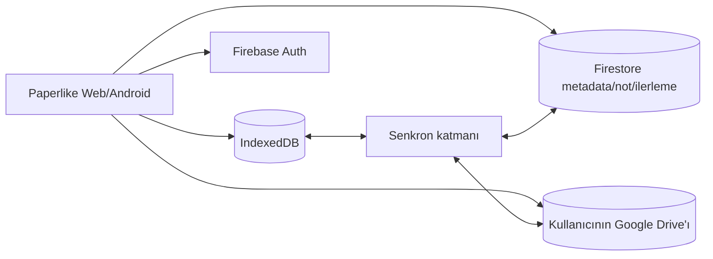

Plan:

- [x] Firebase Console'da Google ve e-posta/şifre Authentication sağlayıcıları.
- [x] Firebase Web SDK ve Capacitor Firebase Authentication bağımlılıklarını ekleme.
- [x] Ortam değişkeni yokken güvenli çalışan lazy Firebase/Firestore temelini
  oluşturma.
- [x] Google/e-posta auth komutları ve auth-state listener içeren `useAuthStore`
  temelini oluşturma.
- [x] Auth listener cleanup'ını yöneten `AuthHandler` bileşenini oluşturma.
- [x] `AuthHandler` bileşenini root layout'a bağlama.
- [x] Firestore'u başlangıçtan itibaren production mode ile açma (`europe-west3`,
  Standard edition); herkese açık test kuralları kullanılmadı.
- [x] Firestore güvenlik kuralı **yazıldı** (`firestore.rules` — kullanıcı
  yalnızca kendi `users/{uid}` ağacını okuyup yazabiliyor), ama henüz
  **deploy edilmedi**: repodaki dosya, Firebase Console'un "Rules" sekmesine
  elle yapıştırılmadan ya da `firebase deploy --only firestore:rules` ile
  gönderilmeden veritabanı hâlâ tamamen kapalı kalır (`if false`).
- [ ] OAuth consent screen'in `drive.file` izni için tamamlanması ve gizlilik
  politikası (public-facing proje adı ve destek e-postası ayarlandı, Drive
  scope'u Faz F'in Drive adımına ertelendi).
- [x] Ortak giriş/kayıt/parola sıfırlama ekranı, hata durumları ve misafir
  devam akışı (`AccountDialog`/`AccountButton`) — telefonda uçtan uca test
  edilmedi.
- [x] Misafir modundan opsiyonel hesaba geçiş (kütüphane başlığındaki hesap
  butonu, zorunlu login duvarı yok).
- [ ] Play Store gereksinimine uygun hesap silme; Firestore kullanıcı verisi ve
  Drive uygulama klasörünü birlikte silme.
- [x] Firestore şeması ve **tek yönlü (cihaz → bulut) push** uygulandı ve
  **uçtan uca doğrulandı**: `lib/cloud-sync.ts` → `pushLibrarySnapshot(uid)`,
  `users/{uid}/books/{bookId}` (metadata + progress birleşik),
  `.../books/{bookId}/highlights/{id}`, `.../books/{bookId}/bookmarks/{id}`,
  `users/{uid}/settings/reader`. `firestore.rules` yayınlandı (Console →
  Rules). Google hesabıyla gerçek cihazda giriş yapılıp Firestore Data
  sekmesinde veri geldiği doğrulandı.
  - Yol boyunca iki ayrı kök neden bulunup düzeltildi: (1)
    `@capacitor-firebase/authentication` Android'de kullanıcıyı yalnızca
    **native** tarafta oturum açıyor — Firestore'un kullandığı JS SDK'nın
    Auth'u bundan habersiz kalıyordu (`request.auth` boş → kurallar
    reddediyordu). Çözüm: native girişten sonra JS SDK'yı da aynı kimlik
    bilgisiyle (`signInWithCredential`, Google için idToken/e-posta-şifre
    için `EmailAuthProvider.credential`) senkron imzalamak
    (`lib/firebase.ts#getFirebaseAuth`, native'de `indexedDBLocalPersistence`
    ile). (2) İlk push denemesi `authStateChange` listener'ından
    tetikleniyordu — bu, native oturum açılır açılmaz ateşlenip JS köprüleme
    bitmeden Firestore'a yazmaya çalışıyordu (yarış durumu). Çözüm: push'u
    listener'dan kaldırıp doğrudan `signInWithGoogle`/`signInWithEmail`/
    `createAccountWithEmail` içine, JS köprüleme kesin bittikten *sonra*
    taşımak.
- [ ] Bunun **karşı yönü** (Firestore → cihaz **pull** + `updatedAt` bazlı
  çakışma çözümü) henüz yok — ikinci bir cihazda giriş yapmak bugün boş bir
  kütüphaneyle karşılaşmak demektir. Bilinçli olarak sonraya bırakıldı (bkz.
  “Faz 2 kapsam kararı”: önce push tek başına doğrulanacak).
- [x] **Her mutasyon noktasına bağlandı**: `lib/storage.ts`'teki
  `addBook`/`updateBook`/`deleteBook`/`setProgress`/`addHighlight`/
  `updateHighlight`/`deleteHighlight`/`addBookmark`/`deleteBookmark`
  fonksiyonlarının hepsi, yerel IndexedDB yazması bittikten sonra
  `lib/cloud-sync.ts`'teki ilgili `push*`/`delete*Remote` fonksiyonunu arka
  planda (`void import("./cloud-sync").then(...).catch(console.error)`)
  çağırıyor — dairesel import'tan kaçınmak için dinamik import kullanıldı.
  Ayarlar için `AuthHandler.tsx`, `useSettingsStore`'u 800ms debounce ile
  dinleyip `pushSettingsSnapshot()` çağırıyor (slider sürüklerken her tik'te
  yazma olmasın diye). Hepsi `currentUid()` üzerinden signed-out durumda
  sessizce no-op oluyor — misafir modu ve offline kullanım hiç etkilenmiyor.
  **Henüz telefonda uçtan uca test edilmedi** (yalnızca `tsc`/`build`/`cap
  sync` ile doğrulandı).
- [ ] Firestore offline persistence ile yerel yazma kuyruğunun birlikte çalışma
  modelini doğrulama.
- [ ] Drive uygulama klasörü oluşturma ve dosya yükleme.
- [ ] Hesaplı kullanıcı kitap eklediğinde upload'ı arka planda yapma; misafir
  akışına dokunmama.
- [ ] Firestore kitap kaydında Drive dosya kimliğini saklama.
- [ ] Yerelde olmayan kitabı ihtiyaç anında Drive'dan indirme/cache'leme.
- [ ] Kota, izin iptali, eksik dosya ve yarım upload hata akışları.
- [ ] Kısmi/başarısız upload resume.
- [ ] Statik export mimarisinin Firebase/Drive istemci SDK'larıyla web üzerinde
  küçük bir PoC ile doğrulanması.
- [ ] Vercel veya eşdeğer statik hosting ve özel domain.
- [ ] Masaüstü ekran/mouse davranışları için web UX doğrulaması.
- [ ] Web, Android ve gelecekte iOS uyumu.
- [ ] **RM-F-01:** `local-only → queued → uploading → synced → conflict → retry
  → failed` durumlarını; idempotency, backoff ve kullanıcı mesajlarını içeren
  senkronizasyon state machine hazırlamak.
- [ ] **RM-F-02:** Firestore collection/document alan tipleri, timestamp,
  tombstone, conflict, security rule beklentisi, Drive klasör/dosya adı ve dosya
  kimliği sözleşmesini sürümlemek.
- [ ] **RM-F-03:** Kullanıcı/kitap/değişiklik senaryolarına göre Firestore
  read-write, OAuth, Drive API kota ve beklenen operasyon maliyet modelini
  oluşturmak.
- [ ] **RM-F-04:** Token sızıntısı, hatalı Firestore rule, yetki iptali, hesaplar
  arası veri sızıntısı ve uzak silmeyi kapsayan bulut tehdit modeli hazırlamak;
  veri yaşam döngüsü matrisini Firestore/Drive ile genişletmek.
- [ ] **RM-F-05:** Senkron kuyruk kaybı, servis kesintisi, çatışma ve cihaz kaybı
  için RPO/RTO ve kurtarma kanıtlarını tanımlamak.

> **Açık kimlik sorusu:** E-posta/şifreyle giriş yapan kullanıcının Drive'a erişimi
> için ayrıca bir Google hesabı bağlama ve OAuth onayı gerekir. Hesap kimliği ile
> dosya deposu kimliğinin ayrıştığı bu senaryo, Drive fazının ana UX kararıdır.

Önceki ayrı bulut senkron yol haritasının bütün karar ve fazları bu bölüme
birleştirilmiştir.

### Faz G — iOS

Amaç: Ortak web kodunu koruyarak gerçek iOS uygulaması sunmak.

- [ ] Capacitor iOS projesi.
- [ ] Dosya import ve share extension/UTType davranışı.
- [ ] Safe-area ve gesture testleri.
- [ ] iOS TTS ve haptic uyarlaması.
- [ ] Bildirim izinleri ve background sınırlamaları.
- [ ] Android widget/shortcut özelliklerinin iOS karşılığı veya kontrollü farkı.
- [ ] App Store privacy manifest ve dağıtım süreci.
- [ ] iPhone/iPad test matrisi.

### Yol haritası bağımlılıkları

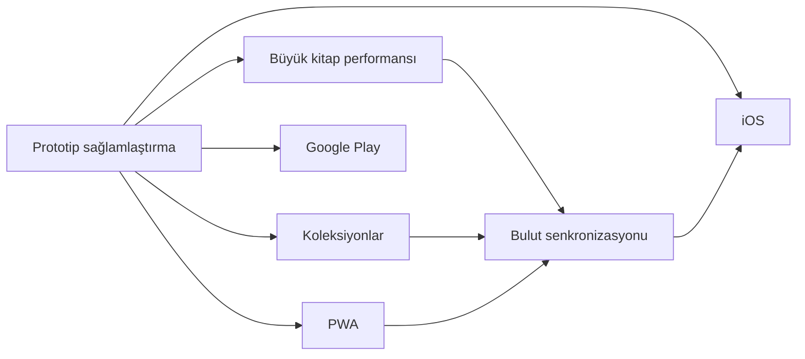

Bulut senkronizasyonundan önce veri modeli ve migration yaklaşımı
sağlamlaştırılmalıdır. Aksi hâlde sunucu modeli hızla yerel modelden ayrışır.

---

## 20. Yayın kapıları

Paperlike “Google Play'e hazır” sayılmadan önce en az:

- Sürümleme ve release signing çözülmüş olmalı.
- Gerçek release AAB CI üzerinden üretilebilmeli.
- Gizlilik politikası ve Data Safety beyanı tamamlanmalı.
- Kritik import/read/progress/backup akışları otomatik test edilmeli.
- Büyük dosya ve düşük bellek senaryoları için kabul kriterleri karşılanmalı.
- Biyometrik test/arayüz kalıntıları kullanıcıya görünmemeli.
- Cleartext production trafiği kapatılmalı.
- Crashlytics release build'inde doğrulanmalı.
- Manuel cihaz matrisi tamamlanmalı.
- Backup/restore gerçek cihazda doğrulanmalı.
- Store update/rollback süreci yazılı olmalı.

Web/PWA “yayına hazır” sayılmadan önce:

- Kurulabilir manifest ve service worker olmalı.
- Ağ kesildiğinde app shell ve daha önce eklenmiş kitaplar açılmalı.
- Cache migration güvenli olmalı.
- Storage quota hatası kullanıcıya açıklanmalı.
- Web hata gözlemlenebilirliği olmalı.
- En az bir Chromium, Firefox ve Safari uyumluluk matrisi bulunmalı.

### 20.1 Operasyonel olay sınıfları

| Seviye | Örnek | İlk hedef |
|---|---|---|
| SEV-1 | Yaygın veri kaybı, kullanıcıların kitaplığa erişememesi, kritik güvenlik açığı | Dağıtımı durdur, kapsamı belirle, güvenli sürüm/özellik kapatma |
| SEV-2 | Çökme artışı, import/reader'ın önemli cihazlarda çalışmaması | Staged rollout'u durdur, tanıla, hotfix kararı |
| SEV-3 | Kısmi platform/özellik hatası, geçici servis kesintisi | Workaround yayınla, normal düzeltme planla |
| SEV-4 | Cila, düşük etkili UI veya dokümantasyon problemi | Backlog |

Her olayda zaman, sürüm, platform, dosya/cihaz sınıfı, yeniden üretme adımları ve
kullanıcı verisi riski kaydedilmelidir.

### 20.2 Hatalı Android sürümü runbook'u

1. Play Console rollout yüzdesini artırmayı durdur.
2. Crashlytics'te hatayı sürüm, Android API ve cihaz modeline göre ayır.
3. Veri migration'ı çalıştı mı ve geri uyumluluk var mı kontrol et.
4. Güvenli önceki binary'ye dönüş mümkün değilse daha yüksek `versionCode` ile
   hotfix hazırla.
5. Minimum kritik smoke: import, reader, progress, backup restore, cold/warm
   intent.
6. Internal/closed track üzerinde doğrula.
7. Küçük staged rollout ile yeniden başlat.
8. Olay ve alınan kararı changelog/issue kaydına ekle.

### 20.3 Hatalı web/PWA sürümü runbook'u

1. Yeni deploy'u durdur veya önceki doğrulanmış artifact'i yeniden production yap.
2. Service worker varsa eski/yeni cache uyumluluğunu incele.
3. IndexedDB migration'ın geri döndürülemez etkisini kontrol et.
4. Gerekirse yeni bir cache sürümüyle düzeltici deploy yap; kullanıcının yerel
   kitaplığını temizlemeyi varsayılan çözüm yapma.
5. Chromium, Firefox ve Safari smoke koş.
6. Offline app shell ve mevcut kitap açılışını ağ kapalı doğrula.

### 20.4 Crashlytics triage runbook'u

1. Crash-free session değişimini sürüm bazında kontrol et.
2. En sık stack trace'i cihaz/API/uygulama durumu ile grupla.
3. JS köprüsü hatası mı native crash mi ayır.
4. Mapping dosyasının yüklenmiş ve stack'in okunabilir olduğunu doğrula.
5. Raporda kitap metni/not gibi hassas payload olup olmadığını kontrol et.
6. Yeniden üretilebiliyorsa issue kimliği ve test fixture'ı oluştur.
7. Kritikse rollout'u durdur; değilse hedef sürüm ata.

### 20.5 Bozuk veri veya yedek runbook'u

1. Kullanıcıya mevcut uygulama verisini silmemesini söyle.
2. Orijinal ZIP'i değiştirmeden kopyasını al; mümkünse checksum kaydet.
3. Manifest varlığı, JSON geçerliliği, `formatVersion`, kitap dosyaları ve metadata
   ilişkilerini salt-okunur incele.
4. Import'u temiz test profili/veritabanında yeniden üret.
5. Kısmi kurtarma gerekiyorsa yeni bir araç/işlemle çıktı üret; orijinali
   overwrite etme.
6. Sorunun export mu import mu migration mı olduğunu ayır.
7. Hassas içerikli yedeği issue tracker veya log sistemine yükleme.
8. Düzeltmeden sonra alan alan round-trip karşılaştırması yap.

### 20.6 Firebase/Drive kesintisi runbook'u

Bu akış senkronizasyon özelliği uygulanınca geçerli olacaktır:

1. Yerel IndexedDB okuma/yazmayı açık tut.
2. Kullanıcıya kitaplarının yerelde güvende olduğunu ve senkronun beklediğini
   bildir.
3. Başarısız işlemleri idempotent kuyruğa al; sonsuz hızlı retry yapma.
4. Auth, Firestore ve Drive durumlarını ayrı teşhis et.
5. OAuth izni iptal edilmişse genel ağ hatası yerine yeniden bağlama akışı sun.
6. Çatışma çözmeden önce iki kopyayı da koru.
7. Servis döndüğünde backlog, gecikme ve başarısız kalıcı işlemleri ölç.

### 20.7 Keystore güvenliği ve kayıp runbook'u

- Keystore oluşturulduğunda dosya, alias, oluşturma tarihi ve erişim sahipleri
  ayrı güvenli kayıtta tutulmalıdır.
- En az iki şifreli yedek farklı güvenli konumda olmalıdır.
- Parolalar keystore dosyasıyla aynı yerde düz metin saklanmamalıdır.
- CI erişimi minimum yetkiyle ve production environment approval ile
  sınırlandırılmalıdır.
- Şüpheli erişimde Play App Signing/anahtar yükseltme seçenekleri değerlendirilir.
- Keystore kaybı veya parola kaybında rastgele yeni anahtarla production güncelleme
  denenmemelidir; önce Play Console anahtar kurtarma/yükseltme süreci izlenmelidir.

### 20.8 Hesap ve veri silme runbook'u

Bu akış hesap sistemi uygulanınca:

1. Aktif kullanıcının kimliğini yeniden doğrula.
2. Bekleyen senkron işlemlerini durdur.
3. Firestore'daki kullanıcı ağacını kontrollü ve tekrar çalıştırılabilir biçimde
   sil.
4. Google Drive uygulama klasörü/dosyalarını kullanıcı onayındaki kapsama göre sil.
5. Auth hesabını en son sil.
6. Yerel IndexedDB'nin silinip silinmeyeceğini kullanıcıya ayrı seçenek olarak
   açıkla.
7. Başarı/başarısızlık ve kalan veri kapsamını kullanıcıya göster.
8. Yasal/operasyonel saklama kaydı gerekiyorsa kitap/not içeriği olmadan tut.

### 20.9 Operasyon kanıtı şablonu

Her olay veya yayın doğrulamasında:

```text
Olay/Yayın ID:
Tarih-saat ve saat dilimi:
Uygulama sürümü / versionCode:
Commit:
Platform / OS / cihaz:
Dosya ve kitaplık sınıfı:
Etkilenen PR/NFR/ISS kimlikleri:
Yeniden üretme:
Kullanıcı verisi etkisi:
Alınan aksiyon:
Doğrulanan testler:
Sonuç ve takip işi:
```

---

## 21. AI ajanları ve yeni geliştiriciler için çalışma protokolü

### 21.1 İşe başlamadan önce

1. Kök `AGENTS.md` dosyasını oku.
2. Bu belgeyi oku.
3. Görevle ilgili mevcut checklist ve yol haritasını kontrol et.
4. `git status --short` ile kullanıcıya ait devam eden değişiklikleri belirle.
5. Next.js kodu değişecekse bu projede kurulu sürümün
   `node_modules/next/dist/docs/` dokümanını oku.
6. Graphify grafiğinin güncelliğini kontrol et:

```text
graphify check-update .
```

7. Tüm repoyu okumak yerine önce Graphify ile ilgili alt grafiği sorgula:

```text
graphify query "<soru>" --budget 2000
graphify explain "<sembol>"
graphify path "<kaynak>" "<hedef>"
```

Graphify sorgusu Windows konsol encoding sorunu verirse UTF-8 Python çıktısı
etkinleştirilmelidir.

### 21.2 Graphify güncelliği

Depoda şu hook'lar kuruludur:

- `post-commit`
- `post-checkout`

Manuel güncelleme:

```text
graphify update .
```

Grafik 5.000 node sınırını geçtiği için `graph.html` üretilmeyebilir. Kaynak
gerçekliği `graphify-out/graph.json`, `GRAPH_REPORT.md` ve `manifest.json`
üzerinden değerlendirilmelidir. `graphify-out/` git tarafından izlenmez.

### 21.3 Kaynak gerçekliği sırası

Çelişki halinde:

1. Çalışan kod ve test.
2. Güncel kullanıcı kararı.
3. Bu belge.
4. `README.md`, `AGENTS.md` ve alanı yöneten güncel yapılandırma.
5. Eski Git geçmişi veya güncelliği doğrulanmamış kod yorumları.

Belge-kod çelişkisi bulunduğunda sessizce varsayım yapılmamalı; karar önemliyse
kullanıcıya sorulmalı, kesin teknik durumsa belge düzeltilmelidir.

### 21.4 Değişiklik yaparken korunacak sınırlar

- Kullanıcıya ait dirty worktree değişiklikleri korunmalıdır.
- EPUB ve PDF davranışı ortak `ReaderSurfaceHandle` sözleşmesi üzerinden
  geliştirilmelidir.
- Native-only davranış için web fallback/no-op tanımlanmalıdır.
- Kullanıcı metni iki i18n sözlüğüne de eklenmelidir.
- IndexedDB şema değişikliği migration olmadan yapılmamalıdır.
- Veri modeli değişirse backup formatı değerlendirilmelidir.
- Kitap silme cascade davranışı korunmalıdır.
- Hassas kitap/not içeriği loglanmamalıdır.
- Ağ gerektiren bir özellik offline-first varsayımını sessizce bozmamalıdır.
- Mobil dokunma davranışı klavye ve erişilebilirlik davranışını bozmamalıdır.

### 21.5 Görev sonrası kontrol

- Lint/type-check/build riskle orantılı çalıştırıldı mı?
- Web ve Android farkları değerlendirildi mi?
- Yeni kullanıcı metinleri çevrildi mi?
- Manuel test listesine madde gerekiyor mu?
- Veri migration'ı ve backup uyumu kontrol edildi mi?
- Bu belge/yol haritası güncellenmeli mi?
- Graphify grafiği güncellendi mi?
- Kullanıcıya hangi dosyaların değiştiği ve neyin doğrulandığı açıklandı mı?

---

## 22. Dokümantasyon yönetimi

### 22.1 Ana belgeler

| Belge | Amaç | Güncellik durumu |
|---|---|---|
| `PROJECT_DOCUMENTATION.md` | Ana ürün ve teknik kaynak | Ana kaynak |
| `README.md` | Kısa proje vitrini ve ana belgeye yönlendirme | Güncel |
| `AGENTS.md` | Ajan çalışma kuralları | Bağlayıcı |
| `CLAUDE.md` | Claude araçlarının `AGENTS.md` kurallarını yüklemesi | Bağlayıcı yönlendirme |

Önceden ayrı tutulan `TODO`, mobil UX, manuel test, animasyon ve bulut
senkronizasyonu belgeleri bu dosyaya birleştirilmiş ve yinelenen kaynak
oluşturmamaları için kaldırılmıştır. Tarihsel tracked sürümleri Git geçmişinden
incelenebilir.

### 22.2 Güncelleme kuralı

Şu değişikliklerde bu belge güncellenmelidir:

- Yeni kullanıcı özelliği.
- Yeni route, store, IndexedDB store veya native plugin.
- Platform desteği değişikliği.
- Veri saklama veya gizlilik davranışı değişikliği.
- Backup format sürümü değişikliği.
- Bir roadmap maddesinin başlaması/tamamlanması/iptali.
- Build, test veya dağıtım süreci değişikliği.
- Bilinen sınırlamanın giderilmesi veya yeni sınırlama.

### 22.3 Durum dili

- **Mevcut:** Kodda ve mümkünse testte var.
- **Kısmi:** Bazı platform/biçimlerde var.
- **Deneysel:** Çalışıyor fakat güvenilirlik taahhüdü yok.
- **Planlı:** Onaylı yol haritasında.
- **Değerlendirilecek:** Karar verilmemiş.
- **İptal:** Bilinçli olarak yapılmayacak veya geri alındı.

Planlı bir özellik mevcutmuş gibi yazılmamalıdır.

### 22.4 Sahiplik ve gözden geçirme sıklığı

- Ana sorumlu: Proje sahibi veya açıkça atanmış aktif maintainer.
- AI ajanları belgeyi değiştirebilir fakat ürün kararını kendi başına “kabul
  edildi” durumuna getiremez.
- Her feature/fix sonunda etkilenen bölüm kontrol edilir.
- Her release adayında belgenin tamamı branch/commit ve yayın kapıları açısından
  gözden geçirilir.
- En az ayda bir aktif geliştirme döneminde issue register, yol haritası ve hazır
  olma tahminleri yeniden değerlendirilmelidir.
- Üç ay geliştirme yapılmadıysa tarih otomatik olarak “güncel” anlamına gelmez;
  bir sonraki çalışmada yeniden doğrulama gerekir.

### 22.5 Kimlik ve izlenebilirlik kuralları

| Kimlik | Amaç | Örnek |
|---|---|---|
| `PR-xxx` | Kullanıcı/ürün gereksinimi | `PR-008` backup |
| `NFR-xxx` | Ölçülebilir kalite gereksinimi | `NFR-007` backup doğruluğu |
| `ISS-xxx` | Bilinen sorun/teknik borç | `ISS-014` backup belleği |
| `ADR-xxx` | Mimari karar | `ADR-001` local-first |
| `UT/IT/E2E/PERF/SEC/MAN-*` | Test kanıtı | `IT-BACKUP-ROUNDTRIP-001` |

- Kimlikler yeniden kullanılmaz.
- Kaldırılan kayıt silinmez; `İptal`, `Çözüldü` veya `Yerine geçti` yapılır.
- Commit/PR açıklaması mümkünse ilgili kimlikleri taşır.
- Bir issue çözüldüğünde test kanıtı ve çözüm sürümü eklenir.
- Aynı karar farklı tablolarda tekrarlanıyorsa ana kimliğe referans verilir.

---

## 23. Önemli mimari karar kayıtları

### 23.1 ADR dizini

Buradaki tarih, kararın bu ana belgede kayıt altına alındığı tarihtir; özgün
kararın daha eski olabileceği durumlarda Git geçmişi ayrıca incelenmelidir.

| ADR | Durum | Kayıt tarihi | Yerine geçtiği karar | Yeniden değerlendirme tetikleyicisi |
|---|---|---|---|---|
| ADR-001 | Kabul edildi | 2026-07-30 | İlk yerel veri yaklaşımı | Senkron veya farklı storage motoru |
| ADR-002 | Kabul edildi | 2026-07-30 | Biçime özel bağımsız okuyucu ihtimali | Yeni kitap biçimi/reader motoru |
| ADR-003 | Kabul edildi | 2026-07-30 | Server runtime yaklaşımı yok | SSR/server özelliği zorunluluğu |
| ADR-004 | Kabul edildi | 2026-07-30 | Dağınık native çağrılar | iOS veya plugin mimarisi değişimi |
| ADR-005 | Kabul edildi — özellik iptal | 2026-07-30 | Aktif biyometrik kilit deneyi | Yeniden açılmayacak; yalnız kod temizliği |
| ADR-006 | Kabul edildi | 2026-07-30 | Android-first varsayımı | Ürün platform stratejisi değişirse |
| ADR-007 | Kabul edildi — temel kısmi | 2026-07-30 | Backend kararsızlığı | Senkron PoC/güvenlik incelemesi |

Durum değerleri: `Önerildi`, `Kabul edildi`, `Kabul edildi — uygulanmadı`,
`Yerine geçti`, `İptal`.

### 23.2 ADR kayıtları

#### ADR-001 — Yerel öncelikli veri

**Durum:** Kabul edildi.

**Kayıt tarihi:** 30 Temmuz 2026.

**Yerine geçtiği karar:** Yok; ilk kalıcılık kararı.

**Karar:** Kitap ve okuma verileri IndexedDB'de tutulur.

**Gerekçe:** Hesapsız kullanım, çevrimdışı okuma, gizlilik ve basit prototip
mimarisi.

**Sonuç:** Cihazlar arası senkronizasyon daha sonra ayrıca tasarlanmalıdır.

#### ADR-002 — Ortak okuyucu, ayrı yüzeyler

**Durum:** Kabul edildi.

**Kayıt tarihi:** 30 Temmuz 2026.

**Yerine geçtiği karar:** Biçimlerin tamamen bağımsız ekranlarda yönetilmesi
yaklaşımı kullanılmadı.

**Karar:** `ReaderView` ortak kabuk; EPUB ve PDF ayrı yüzeylerdir.

**Gerekçe:** Ortak toolbar/panel deneyimi korunurken biçime özgü motor
karmaşıklığı ayrıştırılır.

**Sonuç:** Yeni özellikler mümkün olduğunca `ReaderSurfaceHandle` üzerinden
eklenmelidir.

#### ADR-003 — Statik Next.js export + Capacitor

**Durum:** Kabul edildi.

**Kayıt tarihi:** 30 Temmuz 2026.

**Yerine geçtiği karar:** Çalışma zamanında zorunlu Next.js sunucusu yoktur.

**Karar:** Next.js sunucu runtime'ı yerine statik `out/` çıktısı Android'e
paketlenir.

**Gerekçe:** Tek web kod tabanı ve yerel veri modeli.

**Sonuç:** Server Actions ve çalışma zamanında Node sunucusu gerektiren özellikler
doğrudan kullanılamaz; backend ayrı servis olmalıdır.

#### ADR-004 — Native farkları ince wrapper'larda toplama

**Durum:** Kabul edildi.

**Kayıt tarihi:** 30 Temmuz 2026.

**Yerine geçtiği karar:** Bileşenlere dağılmış doğrudan plugin çağrıları tercih
edilmez.

**Karar:** Native çağrılar `lib/native-ui.ts` üzerinden yapılır.

**Gerekçe:** Web'in güvenli çalışmasını ve React katmanının sade kalmasını
sağlamak.

#### ADR-005 — Biyometrik kilidi iptal etme

**Durum:** Kabul edildi; özellik iptal.

**Kayıt tarihi:** 30 Temmuz 2026.

**Yerine geçtiği karar:** Aktif biyometrik kilit ve kaçış yolu deneyi.

**Karar:** Güvenilir olmayan biyometrik kapı kullanıcı arayüzünden kaldırıldı.

**Gerekçe:** Kullanıcıyı kendi kitaplığına erişemeyecek şekilde kilitleme riski.

**Sonuç:** Özellik yeniden planlanmamıştır.

#### ADR-006 — Android ve web eşit ürün önceliği

**Durum:** Kabul edildi.

**Kayıt tarihi:** 30 Temmuz 2026.

**Yerine geçtiği karar:** Web'in yalnız Android geliştirme kabuğu olduğu varsayımı.

**Karar:** Yeni özellikler iki platformda birlikte değerlendirilir.

**Gerekçe:** Web yalnızca Android geliştirme kabuğu değildir; bağımsız ürün
hedefidir.

**Sonuç:** Native'e özgü özelliklerin web karşılığı, fallback'i veya açık
platform farkı belgelenmelidir.

#### ADR-007 — Opsiyonel Firebase + Google Drive senkronu

**Durum:** Kabul edildi; Firebase/Firestore ve auth store temeli kısmi,
kullanıcıya açık senkron henüz uygulanmadı.

**Kayıt tarihi:** 30 Temmuz 2026.

**Yerine geçtiği karar:** Belirsiz backend ve uygulama tarafından barındırılan
kitap dosyası seçenekleri.

**Karar:** Hesap ve küçük veriler Firebase Auth/Firestore, kullanıcıya ait kitap
dosyaları kullanıcının Google Drive alanı üzerinden senkronlanacaktır.

**Gerekçe:** Ortak web istemcisini korumak, uygulamanın dosya depolama maliyetini
ve telif riskini azaltmak, kitapların kullanıcı kontrolündeki depoda kalmasını
sağlamak.

**Sonuç:** Misafir modu ve IndexedDB yerel katmanı korunur. E-posta/şifre
kullanıcısı Drive için ayrıca Google hesabı bağlamak zorunda kalabilir. Güvenlik
kuralları, OAuth izinleri, hesap silme ve çatışma çözümü ürünün temel parçaları
olur.

### 23.3 Yeni ADR oluşturma ve değiştirme

- Yeni mimari karar bir sonraki monoton `ADR-xxx` kimliğini alır.
- Karar, gerekçe, sonuç, durum, kayıt tarihi, alternatifler ve yeniden
  değerlendirme tetikleyicisi yazılır.
- Kabul edilmiş ADR sessizce yeniden yazılmaz. Karar değişirse yeni ADR eskisini
  “Yerine geçti” durumuna getirir.
- Uygulanmamış karar ile çalışan mimari açıkça ayrılır.
- İptal kararları geçmiş bağlam kaybolmasın diye silinmez.

---

## 24. Terimler

| Terim | Açıklama |
|---|---|
| CFI | EPUB içindeki kararlı konumu temsil eden Canonical Fragment Identifier |
| Reader surface | EPUB/PDF rendering motorunu ortak okuyucuya bağlayan bileşen |
| App shell | İçerikten bağımsız temel web uygulaması arayüzü |
| Static export | Next.js çıktısının sunucusuz statik dosyalar olarak üretilmesi |
| Capacitor | Web uygulamasını native kabuk ve pluginlerle paketleyen köprü |
| IndexedDB | Tarayıcı/WebView içinde Blob ve yapısal veri saklayabilen yerel DB |
| PWA | Kurulabilir, service worker destekli web uygulaması |
| Lazy import | Ağır kodu yalnızca ihtiyaç anında yükleme |
| Intent | Android uygulamaları arası eylem/veri iletişimi |
| AppWidget | Android ana ekran widget altyapısı |
| Streak | Ardışık okuma günlerinin sayısı |
| Local-first | Ana verinin önce cihazda çalıştığı ürün yaklaşımı |

---

## 25. Hızlı yönlendirme

Bir geliştirici veya ajan:

- Kütüphane davranışı için `components/library/LibraryView.tsx` ile başlamalıdır.
- Okuyucu orkestrasyonu için `components/reader/ReaderView.tsx` okumalıdır.
- EPUB/PDF farkları için ilgili `*ReaderSurface.tsx` dosyasına gitmelidir.
- Veri için önce `lib/types.ts`, sonra `lib/storage.ts` okumalıdır.
- Import için `lib/import-book.ts` ve biçim loader'larını izlemelidir.
- Native davranış için önce `lib/native-ui.ts`, sonra eşleşen Java pluginini
  okumalıdır.
- Persist edilen tercih için ilgili `store/` dosyasını bulmalıdır.
- Çeviri için `lib/i18n/tr.ts` ve `en.ts` dosyalarını birlikte değiştirmelidir.
- Yayın riski için bu belgenin “Yayın kapıları” bölümünü kontrol etmelidir.

Bu belgenin amacı bütün kodun yerine geçmek değil; doğru kod alanına hızlı ve
güvenli biçimde ulaşmayı sağlamaktır.

---

## 26. Belge değişiklik geçmişi

| Belge sürümü | Tarih | Baz commit/çalışma ağacı | Değişiklik |
|---|---|---|---|
| `1.0` | 2026-07-30 | `2a8a188` + çalışma ağacı | Ürün, mimari, veri, süreç, yol haritası ve eski Markdown belgeleri tek ana kaynakta birleştirildi; README sadeleştirildi. |
| `1.1` | 2026-07-30 | `2a8a188` + çalışma ağacı | İçindekiler, durum paneli, doğrulama metadata'sı, PR/NFR katalogları, destek/kapasite matrisi, issue register, env-secret politikası, sürümleme, migration, test izlenebilirliği, operasyon runbook'ları ve ADR metadata'sı eklendi; çalışma ağacındaki kısmi Firebase/auth temeli kaydedildi. |
| `1.2` | 2026-07-30 | `2a8a188` + çalışma ağacı | Benchmark sonuçları, test panosu, risk/threat/data-lifecycle kayıtları, reader/sync state machine'leri, Firestore/Drive sözleşmesi, ekran haritası, görsel referanslar, erişilebilirlik, bağımlılık politikası, maliyet/kota ve RPO/RTO işleri sahip/efor bilgileriyle roadmap fazlarına eklendi. |
| `1.3` | 2026-07-30 | `2a8a188` + çalışma ağacı | README ana belgeye göre genişletildi; RM-A-05 reader yaşam döngüsü, UI/TTS alt durumları, yan etkiler ve değişmezlerle modellendi; sonsuz loading boşluğu ISS-016/RM-A-11 olarak kaydedildi. |
| `1.4` | 2026-07-30 | `2a8a188` + çalışma ağacı | RM-A-11 tamamlandı: reader bootstrap beş açık duruma ayrıldı; eksik dosya ve storage hataları için yerelleştirilmiş sonlu hata ekranları eklendi; ISS-016 çözüldü olarak güncellendi. |
| `1.5` | 2026-07-30 | `05cda45` + çalışma ağacı | Vitest/jsdom test altyapısı, 6 senaryolu IT-READER-LOAD-001, `npm run check`, Web Quality CI ve ilk doğrulanmış test sonuç panosu eklendi; RM-A-01 devam ediyor durumuna alındı; production audit bulguları ISS-017 olarak kaydedildi. |
| `1.6` | 2026-07-30 | `05cda45` + çalışma ağacı | IndexedDB, backup, import, EPUB ve i18n testleri; Playwright reader E2E; PWA manifest/service worker/offline testi; Web Quality E2E kapısı ve bağımlılık güvenlik azaltımları eklendi. RM-A-01 tamamlandı, ISS-007 uygulandı, ISS-017 kısmen azaltıldı. |
| `1.7` | 2026-07-30 | `05cda45` + çalışma ağacı | Büyük kitap performansı ilk dilimi tamamlandı: sürekli PDF canvas/text layer lazy rendering, yakın sayfalarla sınırlı scroll ölçümü, açık PDF belgesini yeniden kullanma, EPUB konum üretimini erteleme/seyrekleştirme ve 120 sayfalık Chromium regresyonu eklendi. Test panosu 21 Vitest + 3 Playwright olarak güncellendi; gerçek cihaz benchmark'ı açık bırakıldı. |
| `1.8` | 2026-07-30 | `05cda45` + çalışma ağacı | Büyük kitap araması 250 ms debounce, yeni sorgu/panel kapanışında iptal, bölüm/sayfa ilerlemesi, dört birimde bir event-loop yield ve 50 sonuç sınırıyla yenilendi. EPUB unload ve PDF belge yeniden kullanımı regresyonları ile 120 sayfalık gerçek Chromium araması doğrulandı; pano 29 Vitest + 3 Playwright oldu. |
| `1.9` | 2026-07-30 | `05cda45` + çalışma ağacı | Backup/restore performans ve güvenlik dilimi tamamlandı: tarayıcı Blob girdisi, EPUB/PDF `STORE`, streamFiles, aşama ilerlemesi, UI iptali, CRC/manifest/metadata/zorunlu dosya ön doğrulaması ve kısmi arşiv koruması eklendi. 3 MiB çok-kitaplı round-trip dahil pano 35 Vitest + 3 Playwright oldu; JSZip nihai çıktı belleği ve gerçek cihaz baseline'ı açık bırakıldı. |
| `1.10` | 2026-07-30 | `05cda45` + çalışma ağacı | Kapak performans dilimi tamamlandı: 300 px viewport lazy loading, 384×576 thumbnail, 96 kayıt/32 MiB bounded LRU, eşzamanlı IndexedDB/URL dedupe, lease tabanlı revoke, raf rengi reuse ve silme/restore invalidation eklendi. 200 kitaplık fixture ve viewport testiyle pano 43 Vitest + 3 Playwright oldu. |

### Changelog kuralı

- Yalnız yazım düzeltmesi olmayan her anlamlı belge değişikliği kayıt alır.
- Tarih ISO `YYYY-MM-DD` biçiminde yazılır.
- Commitlenmemiş çalışma ağacı kullanıldıysa açıkça belirtilir.
- Ürün kararının değişmesi ilgili `PR`, `NFR`, `ISS` veya `ADR` kimliğiyle
  ilişkilendirilir.
- Belge sürümü ürün sürümünden bağımsızdır.
- Eski kayıtlar yeniden yazılmaz; düzeltme yeni satır olarak eklenir.

Yeni kayıt şablonu:

```text
| `x.y` | YYYY-MM-DD | commit + çalışma ağacı durumu | Değişiklik özeti ve ilişkili kimlikler |
```
